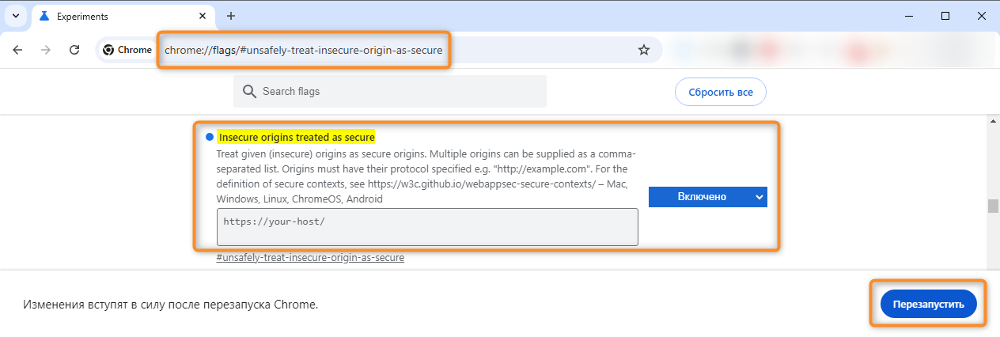

!!! tip "Включение буфера обмена в браузере"

    В зависимости от конфигурации сервера **{{ productName }}** для использования буфера обмена в конструкторе диаграмм может потребоваться разрешить браузеру доступ к буферу обмена.
    
    При подключении по протоколу `https://` буфер обмена работает после предоставления разрешения в браузере. При нажатии сочетания клавиш для копирования, вырезания или вставки браузер может отобразить меню с запросом на разрешение операции.

    При подключении по протоколу `http://` можно включить в браузере специальный флаг. Это обходной вариант, который может привести к нестабильной и небезопасной работе браузера. Не рекомендуем использовать его в продуктивной среде. Применяйте этот способ только на свой страх и риск.

    Чтобы включить флаг разрешения небезопасных источников, выполните следующие действия (в браузерах Yandex, Edge, Chrome):

    1. Введите в адресную строку: 
        
        ``` html
        chrome://flags/#unsafely-treat-insecure-origin-as-secure
        ```
    
    2. Включите функцию «**Insecure origins treated as secure**» (Разрешить небезопасные источники).
    3. Добавьте в список источников адрес сервера **{{ productName }}**, например:

        ``` html
        http://your-host/
        ```

    4. Нажмите кнопку «**Перезапустить**».

    __
