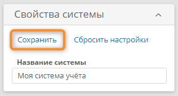

# Темы. Настройка, применение, предпросмотр {:#themes}

<div class="admonition question" markdown="block">

## Определения {: .admonition-title #definitions}

**Тема** — это набор визуальных элементов, которые определяют внешний вид **{{ productName }}**.

По умолчанию используется стандартная тема под названием «**{{ companyName }}**», которую нельзя изменить.

Чтобы настроить внешний вид графического интерфейса, создайте новую тему или клонируйте имеющуюся.

Для тонкой настройки темы можно использовать собственные стили CSS. 

Cм. _«[Пользовательские стили](#themes_custom_css)»_.

</div>

## Использование конструктора тем {: #themes_builder }

1. На странице «**[Администрирование][administration]**» в разделе «**Внешний вид**» выберите пункт «**Темы**» <i class="fa-light fa-palette"></i>.
2. Отобразится конструктор тем.
3. Настройте тему с помощью следующих разделов:

      * [Доступные темы](#themes_operations)
      * [Свойства системы](#themes_system_properties)
      * [Шрифты](#themes_fonts)
      * [Цветовая палитра](#themes_color_palette)
      * [Пользовательские стили](#themes_custom_css)
      * [Предварительный просмотр](#themes_preview)

4. [Сохраните изменения](#themes_save_reset) темы.

## Операции с темами {: #themes_operations }

В разделе «**Доступные темы**» отображаются эскизы имеющихся тем и кнопки для выполнения операций с темами:

- [**Создать**](#themes_create)
- [**Клонировать**](#themes_clone)
- [**Удалить**](#themes_delete)
- [**Применить**](#themes_apply)

### Выбор темы для настройки {: #themes_select }

1. В разделе «**Доступные темы**» нажмите эскиз темы.
2. Выбранная в будет отмечена флажком на ее эскизе.
3. Теперь все внесённые изменения будут применяться для выбранной темы.

__

### Применение темы {: #themes_apply }

1. В разделе «**Доступные темы**» нажмите эскиз темы, которую требуется применить.
2. Нажмите кнопку «**Применить**» для применения выбранной темы.
3. Отобразится запрос на обновление страницы.
4. Подтвердите обновление страницы, чтобы изменения вступили в силу.
5. Теперь графический интерфейс будет отображаться с использованием применённой темы.

### Создание новой темы {: #themes_create }

1. В разделе «**Доступные темы**» нажмите кнопку «**Создать**».
2. Отобразится окно «**Создание новой темы**».
3. Введите **название новой темы**.
4. Нажмите кнопку «**Создать**».
5. Будет создана, выбрана и применена тема со стандартной конфигурацией.
6. Теперь все внесённые изменения будут применяться для новой темы.

### Клонирование темы {: #themes_clone .pageBreakBefore }

1. Нажмите эскиз темы, которую требуется дублировать.
2. Нажмите кнопку «**Клонировать**».
3. Отобразится окно «**Клонирование темы**».
4. Укажите **название новой темы**.
5. Нажмите кнопку «**Клонировать**».
6. Будет создан дубликат выбранной темы.
7. Новая тема будет выбрана и применена.
8. Теперь все внесённые изменения будут применяться для новой темы.

### Удаление темы {: #themes_delete }

!!! note "Примечание"

    Тему, которая применена в настоящий момент, удалить нельзя (кнопка «**Удалить**» не будет отображаться).

    Для удаления применённой темы сначала примените другую тему.

1. Нажмите эскиз темы, которую требуется удалить.
2. Нажмите кнопку «**Удалить**».
3. Подтвердите удаление в отобразившемся окне.

## Сохранение и сброс настроек {: #themes_save_reset .pageBreakBefore }

В разделах, в которых имеется возможность настройки параметров темы, предусмотрены следующие кнопки:

- **Сохранить** — сохранение настроенных параметров раздела;
- **Сбросить настройки** — восстановление ранее сохраненных параметров раздела.

Прежде чем сохранять настройки в разделах темы, ознакомьтесь с [предварительным просмотром](#themes_preview), чтобы убедиться в правильности конфигурации темы.

Если редактируемая тема применена, после нажатия кнопки «**Сохранить**» отобразится запрос на обновление страницы. Чтобы изменения вступили в силу, подтвердите обновление страницы.

__

## Свойства системы {: #themes_system_properties }

Данный раздел отображается только для особых тем и не отображается для стандартной темы под названием «**{{ companyName }}**».

Вы можете задать «**Название системы**», которое будет отображаться в верхней информационной панели:

__

## Фирменные изображения {: #themes_branded_images .pageBreakBefore }

Для темы можно назначить собственные изображения:

- **Значок сайта** — это изображение будет отображаться во вкладках браузера;
- **Логотип** — это изображение по умолчанию используется в качестве логотипа **[страниц входа и регистрации][login_and_registration_page_design]**;
- **Фон страниц** — это изображение по умолчанию используется в качестве фона **страниц входа и регистрации**.

__

Нажмите крайнюю правую часть панели с именем файла, чтобы вызвать меню операций с фирменными изображениями:

- **История** — просмотр журнала изменений загруженного изображения;
- **Скачать** — скачивание изображения на компьютер;
- **Удалить** — удаление изображения из темы.

__

## Шрифты {: #themes_fonts .pageBreakBefore }

Здесь можно настроить **шрифт заголовков** и **шрифт обычного текста**:

- **Шрифт** — выберите гарнитуру шрифта из предложенного списка;
- **Начертание** — выберите вариант шрифта из предложенного списка:
    - Regular (Обычный), Italic (Курсив), Bold (Полужирный), Light (Тонкий), Medium (Средний);
- **Базовый размер** — выберите из предложенного списка размер шрифта, относительного которого будут определяться размеры заголовков и текстов соответственно.

__

## Цветовая палитра {: #themes_color_palette .pageBreakBefore }

Здесь можно задать собственные цвета для большинства элементов графического интерфейса.

### Цвета основных элементов {: #themes_base_colors}

Здесь можно настроить:

- основной **фирменный цвет** — цвет большинства графических элементов: верхней информационной панели, фона заголовков разделов и столбцов, флажков, названия выбранной вкладки, гиперссылок;
- цвета **окон и меню**:
    - **фона страниц**;
    - **фона меню**;
    - **основного фона**;
- **цветовые акценты**:
    - **ошибки** — цвет фона всплывающих сообщений об ошибках;
    - **успех** — цвет фона всплывающих сообщений о выполненных действиях;
    - **предупреждения** — цвет фона всплывающих предупреждениях;
- цвет **текста** — заголовков полей, текста в полях ввода, дат, подписей флажков, названий невыбранных вкладок;
- цвет **выделения** — цвет выделения строк и столбцов в таблицах при их выборе;
- цвета **стандартных кнопок**:
    - **обычной кнопки**;
    - **кнопки отмены**.

__

### Цвета приоритетов {: #themes_priority_colors .pageBreakBefore }

Здесь можно настроить цвета, которые можно будет назначать различным кнопкам при конструировании бизнес-решений.

__

### Цвета дополнительных элементов {: #themes_additional_colors .pageBreakBefore }

Здесь можно настроить цветовое оформление дополнительных элементов графического интерфейса:

- **Тени** — выберите **цвет**, **прозрачность** и **размытие** для различных теней:
    - **теней меню**;
    - **теней раскрывающегося меню**;
    - **теней всплывающего окна**;
    - **теней конструктора**;
- **Рамки** — выберите цвет рамок для различных элементов:
    - **основных рамок**
    - **рамок таблиц**
    - **рамок элементов меню**

__

### Цвета графиков и диаграмм {: #themes_graphic_diagram_color .pageBreakBefore }

Здесь можно задать цвета, которые будут использоваться для линий, столбцов и сегментов графиков и диаграмм.

__

### Пользовательские стили {: #themes_custom_css }

Здесь можно указать дополнительные стили CSS для тонкой настройки внешнего вида графического интерфейса.

!!! warning "Внимание!"

    Используйте собственные стили CSS с осторожностью и тщательно тестируйте их поведение, так как они могут непредсказуемо влиять на отображение графического интерфейса и могут оказаться несовместимы с будущими версиями **{{ productName }}**.

__

#### Примеры стилизации интерфейса

С помощью пользовательских стилей CSS можно значительно изменить внешний вид **{{ productName }}**:

- адаптируйте интерфейс под корпоративный стиль;
- улучшите пользовательский опыт;
- создайте ощущение «своего» продукта;
- снизьте барьер входа для новых пользователей.

Рассмотрим некоторые примеры стилизации интерфейса с помощью CSS:

!!! tip "Переменные CSS из темы"

    В CSS для **{{ productName }}** можно использовать переменные темы, которые автоматически подставляют цвета, настроенные в разделе «[Цветовая палитра](#themes_color_palette)». Например:
    
    **[Цвета основных элементов](#themes_base_colors):**
    
    - `var(--theme-colors__btn)` — цвет обычной кнопки;
    - `var(--theme-colors__btn-txt)` — цвет текста кнопки;
    - `var(--theme-colors__primary)` — основной цвет бренда для ключевых действий и акцентов;
    - `var(--theme-colors__primary-txt)` — цвет текста, контрастирующий с основным цветом.
    
    **[Цвета приоритетов](#themes_priority_colors):**
    
    - `var(--theme-colors__severity-none)` — цвет кнопок без приоритета;
    - `var(--theme-colors__severity-none-txt)` — цвет текста для кнопок без приоритета;
    - `var(--theme-colors__severity-none_strong)` — более тёмный оттенок цвета без приоритета для состояний наведения.
    
    **[Цвета статусов](#themes_status_colors):**
    
    - `var(--theme-colors__success)` — цвет успешных действий (обычно зелёный);
    - `var(--theme-colors__warning)` — цвет предупреждений для привлечения внимания.
    
    Это обеспечивает согласованность стилей с выбранной темой и позволяет легко изменять цвета через конструктор тем.

##### Перенос панели навигации в правую часть экрана {: #themes_css_layout_changes }

Этот CSS перемещает навигационную панель в правую часть экрана, что может быть полезно для оптимизации экранного пространства в зависимости от ваших потребностей.

``` css
/* Переносим панель вправо */
.main-content-wrapper {
  flex-direction: row-reverse;
}

/* Переворачиваем кнопку свёртывания панели,
чтобы стрелка была направлена вправо */
.js-toggle-navigation-icon i {
  transform: rotate(180deg);
}
```

##### Скругление областей и полей формы {: #themes_css_rounded_elements }

Этот CSS скругляет углы элементов интерфейса, придавая им более мягкий и приятный вид без ощущения строгости корпоративных систем.

``` css
/* Скругление областей */
.layout-group-wrp {
  border-radius: 20px;
}

.layout-group__content {
  border-radius: 0px 0px 20px 20px;
}

.layout-group__head {
  border-radius: 20px 20px 0px 0px;
}

.group-collapsed .layout-group__head {
  border-radius: 20px;
}

/* Скругление полей формы */
.input,
.textarea,
.tr-search,
.datetimepicker tbody td,
.datetimepicker thead th,
.datetimepicker thead th:hover,
.datetimepicker tfoot th,
.datetimepicker-months tbody td span,
.datetimepicker-years tbody td span,
.core-ui__global-popup-region > .dropdown__wrp_down,
.core-ui__global-popup-region > .dropdown__wrp_up,
.form-group .dev-expression-editor-field-inline,
.dev-code-button-edit,
.tr-search_compact.open .tr-search__input,
.editor_uri,
.bubbles,
.cke_reset,
.dev-html-editor-field-compact .cke_inner,
.dev-html-editor-field .cke,
.cke_reset,
.cke_focus .cke_reset,
.layout__tab-layout__panel-region > .dev-expression-editor-field-inline,
.form-group .dev-expression-editor-field-inlin,
.dmn-editor,
.compact-code-editor,
.dev-collection .grid-table-wrapper-war,
.left-menu-search .tr-search__input,
.editor_document .editor__drop-zone,
.editor_date-time {
  border-radius: 10px;
}
```

##### Окрашивание и скругление кнопок {: #themes_css_button_colors }

Этот CSS окрашивает кнопки в корпоративные цвета для привлечения внимания пользователей и соблюдения брендбука, а также скругляет их края.

``` css
.toolbar-buttons_adjust .toolbar-btn.toolbar-btn_none {
  background-color: var(--theme-colors__severity-none);
  color: var(--theme-colors__severity-none-txt);
  border-radius: 10px;
  margin-right: 5px;
}

.toolbar-buttons_adjust .toolbar-btn.open,
.toolbar-buttons_adjust .toolbar-btn:hover {
  background-color: var(--theme-colors__severity-none_strong);
  color: var(--theme-colors__severity-none-txt);
}

.toolbar-buttons_adjust .toolbar-btn:not(:hover):not(.open) .toolbar-btn__text,
.toolbar-buttons_adjust
  .toolbar-btn:not(:hover):not(.open)
  .toolbar__icons_arrow {
  color: inherit;
}
```

##### Эффект стекла и кастомизация странице входа {: #themes_css_login_customization }

Этот CSS создаёт современный эффект стекла, делая интерфейс более современным. Кроме того, CSS увеличивает логотип и применяет цвета темы к кнопке входа, обеспечивая согласованность с корпоративным брендом.

``` css
/* Эффект стекла на странице входа */
.start-page-fileds {
  background-color: rgba(255, 255, 255, 0.6) !important;
  color: rgba(255, 255, 255, 0.4) !important;
  border-radius: 20px !important;
  border: 1px solid #fff !important;
}

/* Увеличенный логотип */
.login_logo {
  min-width: 230px !important;
}

/* Корпоративные цвета кнопки входа */
.login-submit {
  color: var(--theme-colors__btn-txt) !important;
  background: var(--theme-colors__btn) !important;
  border: none !important;
}
```

##### Эффект стекла для панели навигации {: #themes_css_glass_theme }

Этот CSS создаёт для панели навигации популярный эффект стекла, придающий интерфейсу ощущение глубины.

``` css
.left-menu__list {
    background-color: rgba(255, 255, 255, 0.6);
    color: rgba(255, 255, 255, 0.4);
    border: 1px solid #fff !important;
}

.layout-group__head { 
    border: 1px solid #fff !important;
    background-color: rgba(255, 255, 255, 0.6);
}
```

##### Анимация с тенями кнопок {: #themes_css_special_effects }

Этот CSS создаёт плавную анимацию при наведении указателя на кнопки, придавая им объемный вид.

``` css
/* Плавные переходы для кнопок */
.toolbar-btn {
  transition: all 0.2s cubic-bezier(0.4, 0, 0.2, 1);
}

/* Анимация при наведении */
.toolbar-btn:hover {
  transform: translateY(-1px) scale(1.02);
  box-shadow: 
    0 4px 8px rgba(0, 0, 0, 0.12),
    0 2px 4px rgba(0, 0, 0, 0.08);
}
```

##### Изменение фона в мобильном браузере {: #themes_css_mobile_background }

Этот CSS заменяет стандартный серый фон мобильной версии интерфейса на изображение фона из темы, чтобы придать ему брендированный вид. См. _«[Фирменные изображения](#themes_branded_images)»_.

``` css
/* Мобильный фон */
.r-13awgt0 div div div div[style*="background-color: rgb(245, 245, 245); height: 100%;"] {    
  background: url(/resources/images/backgroundImage.jpg) !important;
}
```

## Предварительный просмотр {: #themes_preview .pageBreakBefore }

Здесь можно ознакомиться с тем, как графический интерфейс будет выглядеть с заданными настройками. Прежде чем сохранять настройки в разделах темы, ознакомьтесь с предварительным просмотром, чтобы убедиться в правильности конфигурации темы.

__



__

__

<div class="relatedTopics" markdown="block">

--8<-- "related_topics_heading.md"

- _[Дизайн страниц входа и регистрации][login_and_registration_page_design]_

</div>


