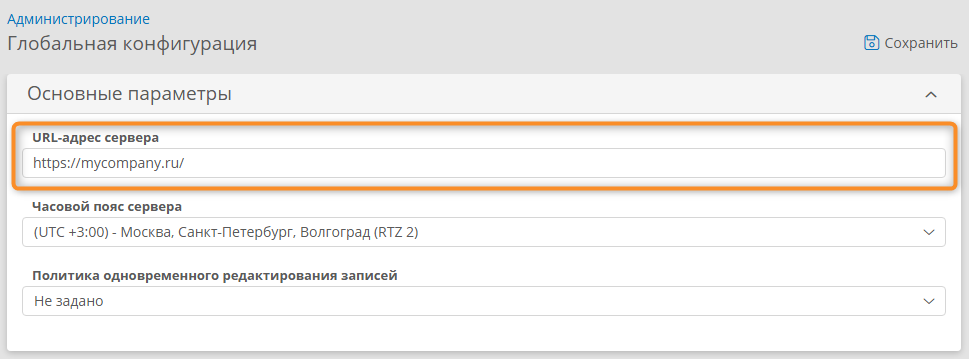
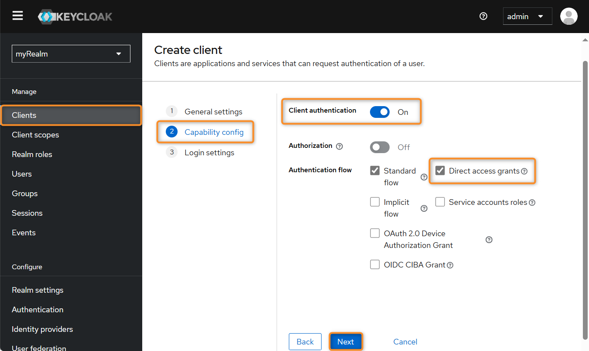
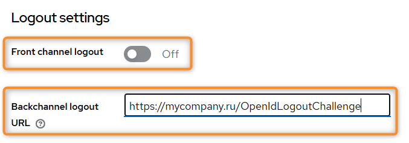
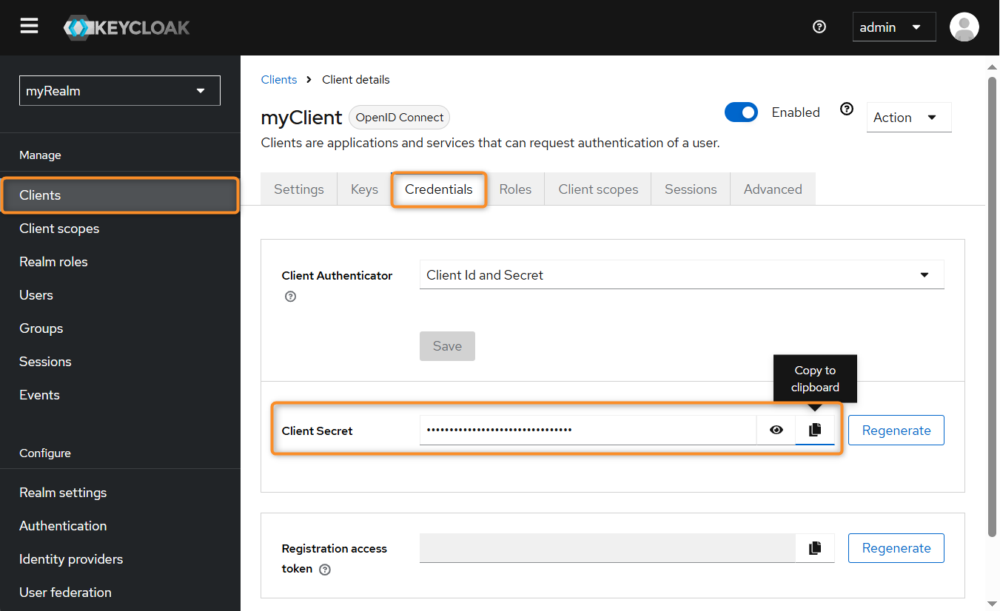
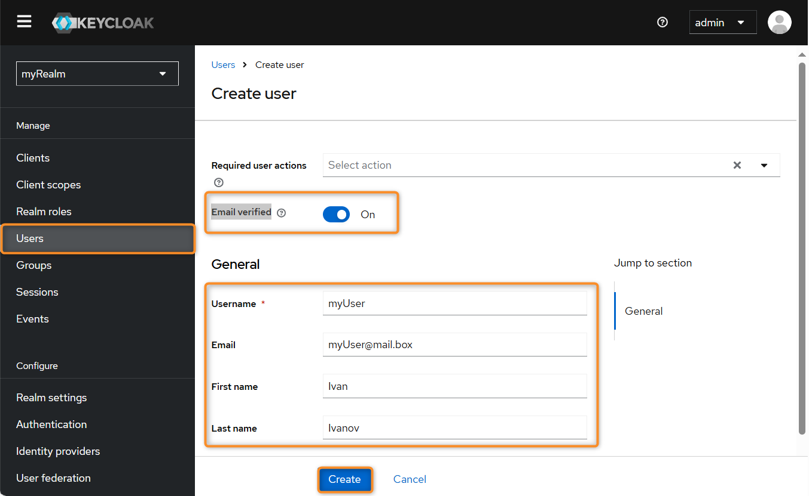

# Аутентификация через Keycloak и OpenID Connect. Настройка подключения и служб {: #openid_connection }

## Введение {: #openid_connection_intro }

Здесь представлены краткие инструкции по настройке аутентификации в **{{ productName }}** посредством Keycloak и OpenID Connect для ОС Linux.

## Порядок настройки {: #openid_connection_sequence }

1. Подготовьте следующие сведения, необходимые на последующих шагах настройки аутентификации через Keycloak:

    - `<yourHost>` — адрес сервера из [глобальной конфигурации](#openid_connection_server_address) **{{ productName }}**;
    - `<instanceName>.yml` — путь к файлу конфигурации экземпляра **{{ productName }}** (cм. _«[Пути и содержимое папок экземпляра ПО][paths]»_);
    - `https://<myKeycloakHost>` — адрес сервера Keycloak;
    - `<myKeycloak>` — наглядное название службы Keycloak;
    - `<myKeycloakRealm>` — имя области (realm) Keycloak;
    - `<myKeycloakClientId>` — ID клиента Keycloak.

2. [Проверьте использование протокола HTTPS](#openid_connection_server_address) для доступа к **{{ productName }}**.
3. [Настройте службу Keycloak](#openid_connection_keycloak_configure).
4. [Настройте ОС Linux](#openid_connection_linux_configure) с экземпляром **{{ productName }}**.
5. [Инициализируйте **{{ productName }}**](#openid_connection_initialize) для входа через Keycloak.
6. При необходимости [настройте время жизни JWT-токенов](#openid_connection_session_lifetime) в соответствии с правилами безопасности и бизнес-требованиями.

## Проверка подключения сервера {{ productName }} по протоколу HTTPS {: #openid_connection_server_address }

1. Откройте страницу [«**Администрирование**» — «**Глобальная конфигурация**»][global_configuration].
2. Удостоверьтесь, что **URL-адрес сервера** начинается с `https://`.

    __

## Настройка Keycloak {: #openid_connection_keycloak_configure .pageBreakBefore }

1. Откройте консоль администратора Keycloak.
2. В левом меню выберите область (realm) **master** или другую существующую область.

    __

3. Если требуемая область (realm) отсутствует, нажмите кнопку **Create realm** (Создать область), введите имя области, например `<myKeycloakRealm>`, и нажмите кнопку **Create** (Создать).

    __

4. В левом меню выберите пункт **Clients** (Клиенты).
5. Нажмите кнопку **Create client** (Создать клиент).
6. На шаге **General settings**:

    - Выберите «**Client type**» (Тип клиента) **OpenID Connect**.
    - Введите «**Client ID**» (ID клиента), например `<myKeycloakClient>`.

    __

7. Нажмите кнопку **Next** (Далее).
8. На шаге **Capability config** (Конфигурация функций) включите функции **Client authentication** (Аутентификация клиента) и **Direct access grants** (Прямое предоставление прав).

    __

9. Нажмите кнопку **Next** (Далее).
10. На шаге **Login settings** (Параметры входа) укажите:

    - **Root URL** (Корневой URL), например `https://<yourHost>/`;
    - **Home URL**  (URL начальной страницы), например `https://<yourHost>/`;
    - **Valid redirect URIs** (Допустимые URI переадресаций), например `https://<yourHost>/*`;
    - **Web origins** (Исходные URI), например `https://<yourHost>/`.

    __

11. Нажмите кнопку «**Save**» (Сохранить).
12. На отобразившейся странице:

    - отключите функцию **Front channel logout** (Выход через фронтенд);
    - введите **Backchannel logout URL** (URL выхода через бэкенд), например `https://<yourHost>/OpenIdLogoutChallenge`.

    __

13. Откройте вкладку **Credentials** (Учётные данные).
14. Сохраните **Client Secret** (Секрет клиента). Его потребуется указать в директиве `auth.openId.clientSecret` в [файле конфигурации {{ productnName }}](#openid_connection_instance_configure).

    __

15. В левом меню выберите пункт ***Users** (Пользователи).
16. Создайте нового пользователя, нажав кнопку **Create new user** (Создать пользователя), или добавьте имеющегося пользователя, нажав кнопку **Add user** (Добавить пользователя).
17. Настройте свойства пользователя:

    - Включите функцию **Email verified** (Адрес эл.&nbsp;почты подтверждён).
    - Заполните поля **Username** (Логин), **Email** (Адрес эл.&nbsp;почты), **First name** (Имя), **Last name** (Фамилия).
    - Нажмите кнопку **Create** (Создать) или **Save** (Сохранить).

    __

18. На вкладке **Credentials** (Учётные данные) нажмите кнопку **Set password** (Установить пароль).

    - Задайте временный пароль для пользователя.
    - Включите функцию **Temporary** (Временный пароль).
    - Нажмите кнопку **Save** (Сохранить).

    __

## Настройка конфигурации {{ productName }} {: #openid_connection_instance_configure .pageBreakBefore }

1. В файле конфигурации экземпляра **{{ productName }}** (`<instanceName>.yml`) настройте директивы по следующему образцу:

    ``` yaml
    #### Настройки OpenID-аутентификации #####
    # Имя сервиса OpenID, используемого для входа
    auth.openId.displayName: <myKeycloak>
    # Вкл./выкл. функции
    auth.openId.enabled: true
    # Адрес сервера OpenId Connect
    auth.openId.server: https://<myKeycloakHost>
    # Пространство имен или контекст, 
    # в котором происходит аутентификация пользователей.
    # Используется для управления идентификацией
    # и доступом в системе OpenID Connect
    auth.openId.realm: <myKeycloakRealm>
    # Уникальный идентификатор клиентского приложения,
    # используемый для аутентификации и авторизации запросов
    # в рамках протокола OpenID Connect
    auth.openId.clientId: <myKeycloakClient>
    # Секретный ключ OpenId Connect
    # Это сохранённый ранее секрет клиента
    auth.openId.clientSecret: <keyCloakClientSecret>
    # Список идентификаторов целевой аудитории,
    # для которой предназначены токены, 
    # используемые в процессе аутентификации и авторизации в OpenID Connect.
    auth.openId.audience: myAudience
    ```

## Настройка ОС Linux с {{ productName }} {: #openid_connection_linux_configure .pageBreakBefore }

1. Перейдите в режим суперпользователя `root`:

    --8<-- "linux_sudo.md"

2. Добавьте в файл `/etc/hosts` строку:

    ```
    "xxx.xxx.xxx.xxx" "<yourHost>"
    ```

    Здесь `xxx.xxx.xxx.xxx` — IP-адрес, `<yourHost>` адрес сервера **{{ productName }}**, указанный в [_глобальной конфигурации {{ productName }}_](#openid_connection_server_address) (без указания протокола `HTTP` или `HTTPS`).

3. Сформируйте SSL-сертификат на сервере NGINX. Например, согласно инструкциям в статье _«[Генерация SSL сертификата для NGINX (openssl)](https://webguard.pro/web-services/nginx/generacziya-ssl-sertifikata-dlya-nginx-openssl.html)»_.
4. Откройте для редактирования файл конфигурации NGINX:

    ```
    vim /etc/nginx/sites-available/comindware<instanceName>
    ```

    

5. Настройте конфигурацию SSL-сертификата аналогично следующему примеру:

    ``` cs
    server {
        listen 80 default;
        listen 443 ssl;

        root /var/www/<instanceName>;
        server_name <yourHost>;

        ssl_certificate /etc/nginx/ssl/nginx.crt;
        ssl_certificate_key /etc/nginx/ssl/nginx.key;

        client_max_body_size 300m;
        fastcgi_read_timeout 10000;
        location / {
            proxy_read_timeout 10000;
                        proxy_connect_timeout 10000;
                        proxy_send_timeout 10000;
                        root          /var/www/<instanceName>/;
                        fastcgi_pass  unix:/var/www/<instanceName>/App_Data/comindware.socket;
                        include       /etc/nginx/fastcgi.conf
                        }
    }
    ```
    

7. Проверьте конфигурацию NGINX:

    ```
    nginx -t
    ```

8. Перезапустите **{{ productName }}**:

    ```
    systemctl restart elasticsearch nginx comindware<instanceName>
    ```

## Инициализация {{ productName }} для входа через Keycloak {: #openid_connection_initialize .pageBreakBefore }

1. Откройте веб-сайт экземпляра **{{ productName }}**, например [https://<yourHost>](https://<yourHost>/)
2. Нажмите кнопку «**Войти как администратор**».
3. Введите учётные данные администратора и нажмите кнопку «**Войти**».
4. Выйдите из системы.
5. Отобразится страница входа с кнопкой «**Войти с помощью myKeycloak**».
6. На этом настройка входа через OpenID Connect завершена. Теперь пользователи смогут входить в **{{ productName }}** с использованием своих аккаунтов через Keycloak.

## Настройка времени жизни сеансов посредством JWT-токенов для SSO {: #openid_connection_session_lifetime .pageBreakBefore }

Настройка времени жизни сеансов (сроков действия токенов) имеет важное значение для управления безопасностью аутентификации и авторизации.

При использовании механизма JWT (JSON Web Tokens) можно настроить время жизни таких токенов, как токен доступа (access token) и токен обновления (refresh token).

### Токен доступа {: #openid_connection_access_token }

Токен доступа (access token) используется для доступа к защищённым ресурсам **{{ productName }}** и имеет перечисленные ниже особенности.

- Срок действия: от 5 минут до 1 часа.
- Обновление: автоматическое через токен обновления по окончании срока действия.
- Отзыв: при выходе пользователя из системы или изменении учётных данных.
- Безопасность: короткий срок действия минимизирует риски при компрометации токена.

### Токен обновления {: #openid_connection_refresh_token }

Токен обновления (refresh token) позволяет обновлять токен доступа без повторной аутентификации. Благодаря этому пользователь может оставаться аутентифицированным без повторного ввода учётных данных.

- Срок действия: от нескольких дней до нескольких месяцев.
- Хранение: например, в cookie типа HttpOnly. Может храниться в базе данных с указанием срока действия и статуса (активный/отозванный).
- Отзыв: при выходе пользователя из системы или изменении учётных данных.
- Безопасность: требует особого внимания и надёжного хранения из-за длительного срока действия.

### Структура JWT-токена {: #openid_connection_jwt_structure .pageBreakBefore }

JWT-токен содержит следующие поля для управления его временем жизни:

``` json
{
  "sub": "user123",  // Идентификатор пользователя
  "iat": 1610000000, // Время создания токена
  "exp": 1610003600  // Время истечения срока действия (1 час)
}
```

### Рекомендации по оптимизации времени жизни сеансов {: #openid_connection_recommendations }

Чтобы сбалансировать удобство использования и безопасность системы, воспользуйтесь приведёнными ниже рекомендациями.

- Для высокозащищённых приложений:
   - Установите время жизни токена доступа 5–15 минут.
   - Установите время жизни токена обновления не более 24 часов.
   - Включите обязательное подтверждение при обновлении токенов.
- Для стандартных приложений:
   - Установите время жизни токена доступа 30—60 минут.
   - Установите время жизни токена обновления 7—30 дней.
- Общие рекомендации:
    - Настройте уведомления о скором завершении сеанса с возможностью его продления.
   - Регулярно проверяйте и обновляйте настройки безопасности и времени жизни сеансов в зависимости от изменений в политике безопасности или требований бизнеса.
   - Используйте механизмы отзыва токенов при выходе пользователей из системы, смене учётных данных и подозрительной активности.
   - Настройте журналирование событий аутентификации.
   - Обеспечьте безопасное хранение токенов обновления.
   - Реализуйте механизмы уведомления пользователей о предстоящем истечении срока действия сеанса.

<div class="relatedTopics" markdown="block">

--8<-- "related_topics_heading.md"

- [Глобальная конфигурация][global_configuration]
- [Пути и содержимое папок экземпляра ПО][paths]

</div>


