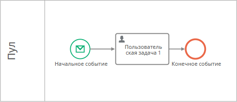
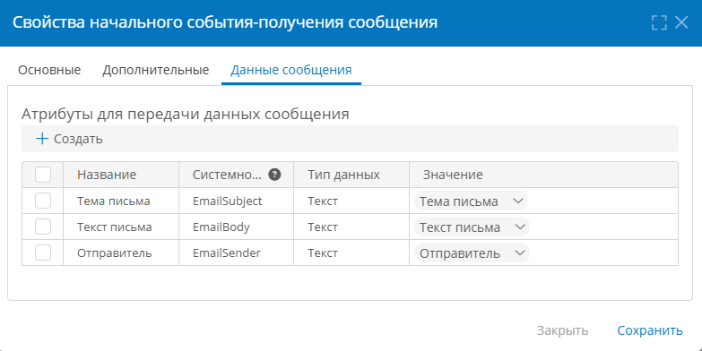

# Получение эл.&nbsp;почты и веб-запросов в процессе {: #process_receiving_connection}

## Введение

Здесь представлены инструкции по настройке подключения и пути передачи передачи данных из эл. писем и веб-запросов в бизнес-процессе.

Кроме того, потребуется настроить **[начальное][process_diagram_elements_receive_message_start_event]** или **[промежуточное][process_diagram_elements_receive_message_intermediate_event] событие-получение сообщения** на диаграмме процесса.

Подробный пример настройки приложения для обмена данными посредством эл.&nbsp;почты см. в статье _«[Пример: согласование заявлений по эл.&nbsp;почте. Настройка подключений, путей передачи данных и диаграммы процесса][process_email_configure]»_.

## Порядок настройки получения эл. писем и HTTP-запросов

1. [Настройте подключение](#настройка-подключения) типа «**Получение эл.&nbsp;почты в процессе**» или «**Получение HTTP-запросов**».
2. [Настройте путь передачи данных](#настройка-пути-передачи-данных) типа «**Получение эл.&nbsp;почты в процессе**».
3. Настройте [начальное или промежуточное событие-получение сообщения](#настройка-события-получения-сообщения) на диаграмме процесса:

    - укажите настроенный **путь передачи данных**;
    - настройте сопоставление **данных сообщения**.

## Настройка подключения



1. На странице **Администрирование**» выберите пункт «**Инфраструктура**» — «[**Подключения**][connections]» <i class="fal fa-exchange-alt"></i>.
2. Откройте или создайте **подключение к электронной почте** типа «**Получение эл.&nbsp;почты в процессе**» или **подключение REST и OData** типа «**Получение веб-запросов**».
3. Настройте подключение:

    - **Для получения эл.&nbsp;почты в процессе**
        - **Отключить** — установите этот флажок, если требуется временно деактивировать данное подключение.
        - **Название** — укажите наименование подключения.
        - **Протокол** — выберите почтовый протокол:
            - **IMAP**;
            - **Microsoft Exchange**.
        - **Адрес почтового сервера** — укажите URL почтового сервера.

            !!! note "Примечание"

                - Для **SMTP не** указывайте протокол (`SMTP`, `HTTPS`, `HTTP`).
                - Для **Exchange укажите** протокол (`HTTPS`, `HTTP`).

        - **Порт** — укажите порт для подключения к почтовому серверу.
        - **Имя пользователя** — укажите учётную запись для подключения к почтовому серверу.
        - **Пароль** — введите пароль к учётной записи для подключения к почтовому серверу.
        - **Интервал опроса** — укажите интервал, с которым **{{ productName }}** будет проверять наличие новых писем.
        - **Защита данных** — выберите протокол шифрования:
            - **Нет**;
            - **SSL**;
            - **TLS**.
        - **Проверить соединение** — нажмите эту кнопку, чтобы проверить соединение с почтовым сервером.

    - **Для получения веб-запросов**
        - **Отключить** — установите этот флажок, если требуется временно деактивировать данное подключение.
        - **Название** — укажите наименование подключения.
        - **URL для получения внешних запросов** — укажите суффикс для получения веб-запросов, например `getMessages`.
        - **Данные для страницы ответа** — настройте страницу, которая будет отображаться при открытии в браузере **URL для получения внешних запросов**:
            - **Заголовок страницы** — название страницы;
            - **Тело страницы** — текст под заголовком.

4. Нажмите кнопку «**Создать**».

## Настройка пути передачи данных {: .pageBreakBefore }

Путь передачи данных типа «**Получение эл.&nbsp;почты в процессе**» служит для преобразования и передачи данных из эл. письма или HTTP-запроса в **{{ productName }}**.

1. Откройте страницу «**Администрирование**» — «**Архитектура**» или страницу «**Администрирование**» приложения.
2. Выберите пункт «[**Пути передачи данных**][communication_routes]» <i class="fa-light fa-route " aria-hidden="true"></i>.
3. Откройте или создайте путь передачи данных типа «**Подключения к электронной почте**» – «**Получение эл.&nbsp;почты в процессе**».
4. Настройте свойства пути передачи данных на следующих вкладках:

    - [**Основные свойства**](#основные-свойства)
    - [**Атрибуты сообщения**](#атрибуты-сообщения)

5. Сохраните путь передачи данных.

### Основные свойства {: .pageBreakBefore }

На вкладке «**Основные свойства**» настройте базовые параметры пути передачи данных:

- **Отключить** — установите этот флажок, чтобы временно деактивировать путь передачи данных.
- **Название** — введите наглядное наименование пути передачи данных.
- **Подключение** — выберите подключение типа «**Получение эл.&nbsp;почты в процессе**».
- **Имя сообщения** — введите _уникальный_ идентификатор сообщения, проходящего по данному пути передачи данных.
- **Приложение** — выберите бизнес-приложение, в котором будет использоваться путь передачи данных.
- **Процесс** — выберите процесс из приложения, в котором будет использоваться путь передачи данных.
- **Назначение**:
    - **Новый экземпляр процесса** — полученное сообщение будет создавать новый экземпляр указанного процесса;
    - **Существующий экземпляр процесса** — полученное сообщение будет отправлено в определенный экземпляр указанного процесса.
- **Ключевое поле** — атрибут для поиска существующего экземпляра процесса. Доступно при указании «**Существующий экземпляр процесса**» в «**Назначении**».
- Для подключения типа «**Получение веб-запросов**»:
    - **Метод парсинга ответа** — выберите метод анализа данных:
        - **Не преобразовывать**;
        - **XML**;
        - **JSON**;
        - **Строка запроса**.

__

### Атрибуты сообщения {: .pageBreakBefore }

Чтобы извлечь данные из эл. письма или HTTP-запроса и передать их в **{{ productName }}**, сопоставьте набор **атрибутов сообщения** с полями письма или HTTP-запроса:

1. Добавьте атрибут сообщения, нажав кнопку «**Создать**».
2. Заполните свойства атрибута:
    - **Название** — наглядное название атрибута.
    - **Системное имя** — уникальное имя атрибута (для эл. писем может быть произвольным).
    - **Тип данных**:
        - **Текст**
        - **Число**
        - **Длительность**
        - **Дата и время**
        - **Логический**
        - **Документ**
        - **Аккаунт**
    - Для **получения эл. писем** выберите **поле сообщения**, значение которого требуется присвоить атрибуту сообщения:
        - **Адрес отправителя**
        - **Имя отправителя**
        - **Адрес получателя**
        - **Имя получателя**
        - **Тема**
        - **Сообщение**
        - **Адрес для отправки копии**
        - **Имя для отправки копии**
        - **Адрес для отправки скрытой копии**
        - **Имя для отправки скрытой копии**
        - **Прикреплённые файлы**
        - **ID сообщения**
        - **Дата получения сообщения**
    - Для **получения HTTP-запросов** задайте поле запроса, значение которого требуется присвоить атрибуту сообщения, в зависимости от **метода парсинга ответа**, выбранного на вкладке «**Основные свойства**»:
        - **Поле сообщения** — установите флажок, чтобы передать значение из поля запроса **без преобразования**, **системное имя атрибута сообщения** должно совпадать с именем соответствующего поля запроса;
        - **Выражение JPath** — введите путь к полю запроса в формате **JSON**;
        - **Выражение XPath** — введите путь к полю запроса в формате **XML**;
        - **Строка запроса** — введите имя поля запроса.

3. Настройте передачу значений атрибутов сообщения в атрибуты записи с помощью вкладки «**Данные сообщения**» в свойствах [**события-получения сообщения**][process_diagram_elements_receive_message_start_event], использующего этот путь передачи данных.

!!! example "Извлечение текста эл. письма"

    Настройте **атрибут сообщения** следующим образом:
    
    - **Название:** _Текст письма_
    - **Системное имя:** _EmailBody_
    - **Тип данных: текст**
    - **Поле сообщения: сообщение**

!!! example "Извлечение поля _Date_ из HTTP-запроса по JSONPath"

    Настройте **атрибут сообщения** следующим образом:

    - **Название:** _Дата_
    - **Системное имя:** _Date_
    - **Тип данных: дата и время**
    - **Выражение JPath:** `$.Date`

    Подробные сведения об использовании JSONPath см. в статье _«[HTTP-запросы. Получение и обработка данных с помощью JSONPath][http_receive_jpath]»_.
        

__

## Настройка события-получения сообщения

1. Поместите на диаграмму процесса [начальное][process_diagram_elements_receive_message_start_event] или [промежуточное][process_diagram_elements_receive_message_intermediate_event] событие-получение сообщения.

    __

2. В меню элемента события нажмите кнопку «**Свойства**» <i class="fa-light fa-gear">‌</i>.
3. На вкладке «**Основные**» настройте [общие свойства элемента][process_diagram_element_common_properties].
4. На вкладке «**Дополнительные**» выберите ранее созданный [путь передачи данных](#настройка-пути-передачи-данных).
5. На вкладке «**Данные сообщения**» сопоставьте **[атрибуты сообщения](#атрибуты-сообщения)** с атрибутами **[шаблона записи][record_templates]**, связанного с шаблоном процесса:

    - Укажите название, системное имя и тип данных **атрибутов сообщения** так же, как они указаны в таблице «**Атрибуты для передачи данных сообщения**» в [свойствах пути передачи данных](#атрибуты-сообщения).
    - В столбце «**Значение**» укажите атрибут **шаблона записи** такого же типа, как **атрибут сообщения**.
    - Значения указанных **атрибутов сообщения**  будут присвоены атрибутам **шаблона записи**.

    __

6. Опубликуйте процесс.

--8<-- "related_topics_heading.md"

- _[Начальное событие-получение сообщения][process_diagram_elements_receive_message_start_event]_
- _[Промежуточное событие-получение сообщения][process_diagram_elements_receive_message_intermediate_event]_
- _[Отправка, получение и обработка эл.&nbsp;почты в процессе. Пример: настройка подключений, путей передачи данных, диаграммы процесса и сценария][process_email_configure]_
- _[Отправка эл.&nbsp;почты из процесса. Настройка подключения, пути передачи данных и события на диаграмме процесса][process_sending_connection]_
- _[Получение эл.&nbsp;почты с помощью сценария через Exchange и IMAP. Настройка подключения, пути передачи данных и сценария][scenario_receive_email]_
- _[Отправка эл.&nbsp;почты из сценариев через SMTP и Exchange. Настройка подключения, пути передачи данных и сценария][scenario_send_email]_


