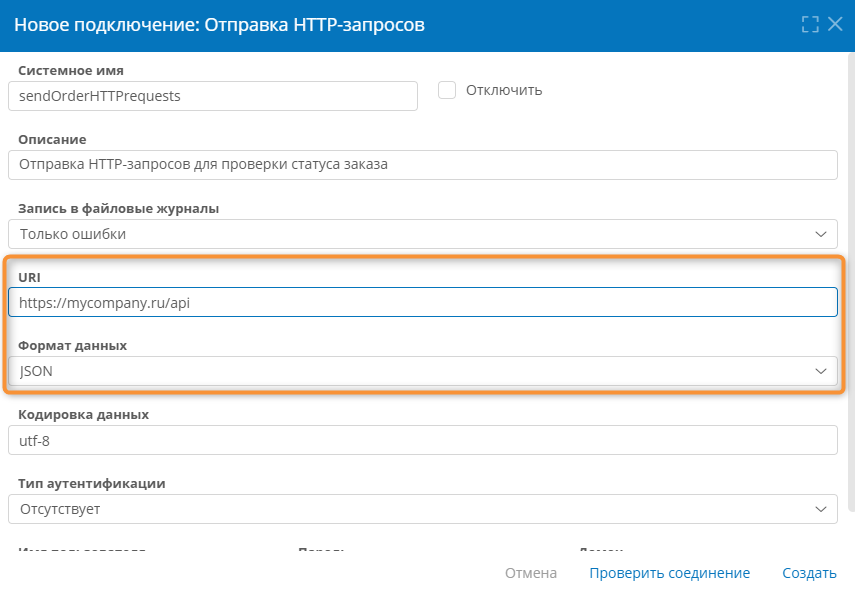
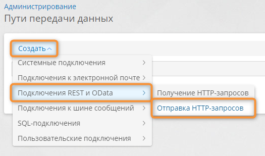
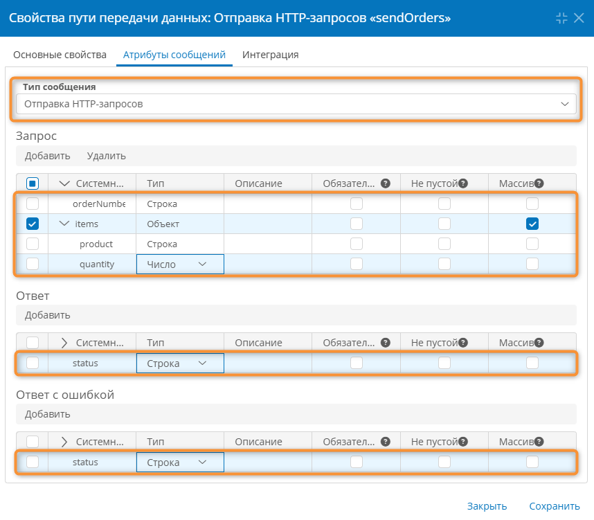
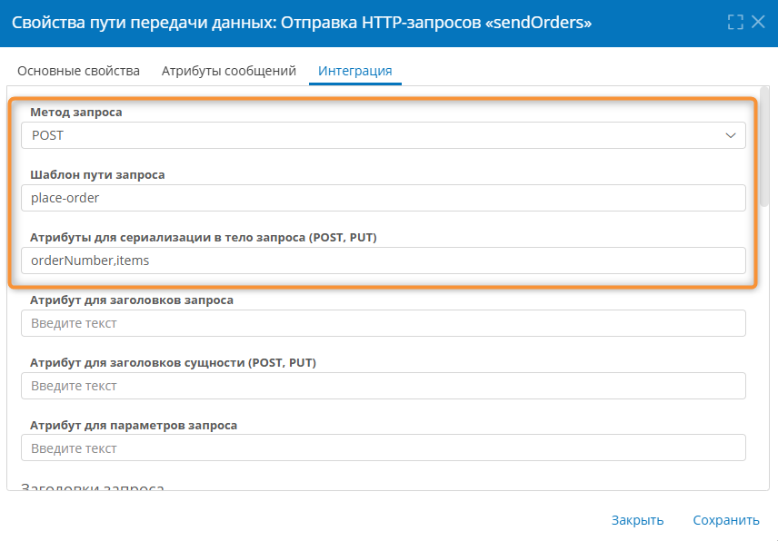
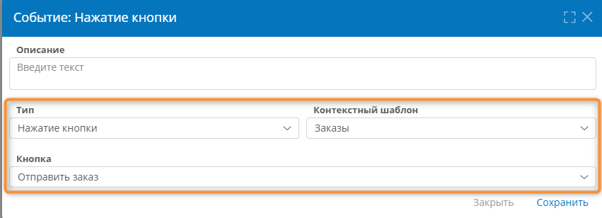

# HTTP-запросы POST. Отправка запроса и обработка ответа в формате JSON с помощью C# {: #http_send_example_csharp }

## Введение {: #http_send_example_csharp_introduction }

**{{ productName }}** позволяет отправлять HTTP-запросы типов `GET`, `POST`, `PUT`, `DELETE` для взаимодействия с внешними системами.

Здесь представлен пример настройки подключения, пути передачи данных и [сценария][scenarios] для отправки HTTP-запросов `POST` с использованием C#-скриптов и записи данных из ответа сервера в формате JSON в атрибуты шаблона записи.

Настройка для обработки данных в формате XML и простого текста будет аналогичной.

!!! warning "Внимание!"

    Модель данных классов в C#-скриптах должна совпадать с моделью данных в путях передачи данных, в противном случае данные не будут сопоставлены и не будут передаваться.

## Прикладная задача {: #http_send_example_csharp_task .pageBreakBefore }

Требуется отправить позиции заказа и получить ответ: заказ принят или отклонён.

Рассмотрим настройку отправки запросов на сервер _http://<hostname>_ и получение от него ответов.

Во всех примерах подставьте реальный адрес своего сервера вместо `http://<hostname>/api`

- Базовый URL для HTTP-запросов: `http://<hostname>/api`
- Путь для отправки позиций: `http://<hostname>/api/items`
- [Сценарий](#http_send_example_csharp_scenario) формирует данные с помощью C#-скриптов, отправляет HTTP-запрос на сервер и обрабатывает полученный ответ.
- Запрос содержит данные позиций в формате JSON.
- В ответ на запрос сервер возвращает JSON-ответ следующего вида:

``` js
{
    "error": false,
    "status": "ok",
    "statusCode": 200,
    "items": [
        {
         "itemId": "POS-001",
         "itemName": "Позиция 1",
         "status": "Accepted"
        },
        {
         "itemId": "POS-002",
         "itemName": "Позиция 2",
         "status": "Rejected"
        },
     ]
}
```

## Настройка подключения {: #http_send_example_csharp_connection .pageBreakBefore }

1. Откройте раздел «**Администрирование**» — «**Подключения**».
2. В меню «**Создать**» выберите пункт «**Подключения REST и OData**» — «**Отправка HTTP-запросов**».

    __

3. Настройте подключение для отправки HTTP-запросов со следующими параметрами:

    - **URI** — http://<hostname>/api. Символ `/` в конце URI не требуется.
    - **Формат данных** — **JSON**. Также поддерживаются **XML** и **простой текст**, но здесь рассматривается обработка данных в формате JSON.

4. Остальные параметры подключения настройте в соответствии с конфигурацией используемого сервера. См. «_[Отправка HTTP-запросов. Настройка подключения][http_send_connection]_».

__

## Настройка пути передачи данных {: #http_send_example_csharp_route .pageBreakBefore }

1. Откройте раздел «**Администрирование**» — «**Пути передачи данных**».
2. В меню «**Создать**» выберите пункт «**Подключения REST и OData**» — «**Отправка HTTP-запросов**».

    __

3. Настройте путь передачи данных для отправки HTTP-запросов на вкладках «**Основные свойства**», «**Атрибуты сообщений**», «**Интеграция**».

### Основные свойства {: #http_send_example_csharp_route_main }

- **Подключение** — выберите ранее созданное [подключение для отправки HTTP-запросов](#http_send_example_csharp_connection).
- **Системное имя** — введите системное имя пути передачи данных латинскими буквами.
- **Отключить** — установите этот флажок, если требуется деактивировать путь передачи данных.
- **Описание** — введите наглядное описание назначения пути передачи данных.

__

### Атрибуты сообщений {: #http_send_example_csharp_route_attributes .pageBreakBefore }

- **Тип сообщения** — выберите пункт «**Отправка HTTP-запросов**».
- **Запрос** — добавьте следующие атрибуты:
    - `items` (системное имя должно совпадать с именем соответствующего поля на внешнем сервере) типа «**Объект**».
        - Установите флажок «**Массив**».
        - Установите флажок у атрибута `items` и добавьте его дочерние атрибуты:
            - `product` (совпадает с именем параметра на внешнем сервере) типа «**Строка**» — этот атрибут будет содержать название товара.
            - `number` (совпадает с именем параметра на внешнем сервере) типа «**Число**» — этот атрибут будет содержать количество товара.

        В эти атрибуты будут передаваться данные позиций для отправки на внешний сервер.

- **Ответ** — добавьте атрибут `status` типа «**Строка**» — этот атрибут будет содержать статус с ответом от сервера.
- **Ответ с ошибкой** — добавьте атрибут `status` типа «**Строка**» — этот атрибут будет содержать статус с ошибкой от сервера.

__

### Интеграция {: #http_send_example_csharp_route_integration .pageBreakBefore }

- **Метод запроса** — выберите пункт «**POST**».
- **Шаблон пути запроса** — введите `items` (фактический путь к HTTP-запросу на сервере), этот суффикс будет добавлен к **URI**, указанному в [свойствах подключения для отправки HTTP-запросов][http_send_connection]. Например, для **URI** `http://<hostname>/api` результирующий путь запроса будет `http://<hostname>/api/items`.
- **Атрибут для сериализации в тело запроса** — введите через запятую системные имена атрибутов из таблицы «**Запрос**» на вкладке «**Атрибуты сообщений**», например `items`.
- **Атрибут для параметров запроса** — это поле используется для методов `GET`, здесь оно не используется.

    __
    

- **Атрибуты для десериализации ответа без ошибки** и  **Атрибуты для десериализации ответа с ошибкой**
    - Создайте одну строку в каждой таблице и введите символ `$` в столбцы «**Путь к атрибуту**» и «**Выражение на языке запросов**».

        __
        

## Настройка сценария отправки HTTP-запроса {: #http_send_example_csharp_scenario .pageBreakBefore }

В сценарии используется два C#-скрипта (запроса) и три переменные:

- `Body` — переменная для хранения данных сообщения перед отправкой
- `good` — переменная для хранения успешного ответа от сервера
- `err` — переменная для хранения ответа с ошибкой от сервера

Между ними, до и после может быть написан C#-код для дополнительной обработки данных.

!!! warning "Важно"

    Запрос отправляется только на блоке отправки сообщения.

1. Создайте [сценарий][scenarios], например, выполняющийся по нажатию кнопки.

    __

2. В свойствах автоматически созданного действия «**Сменить контекст**» укажите **целевой шаблон записи**, содержащий атрибуты для HTTP-запроса и ответа.

    __
    

3. Добавьте и настройте первое действие «**Проверить результат скрипта**» для проверки данных перед отправкой.

    Это действие использует C#-скрипт для проверки и валидации данных перед формированием HTTP-запроса. Если скрипт вернёт `false`, сценарий будет остановлен.

    - **Сообщение об ошибке** — введите текст сообщения, которое будет отображено, если скрипт вернёт `false` (например, `"Ошибка"`).
    - **Выражение** — задайте C#-скрипт для проверки данных.

    **Образец скрипта для проверки данных:**

    ``` cs
    using System;
    using System.Collections.Generic;
    using System.Linq;
    using Comindware.Data.Entity;
    using Comindware.Tea;

    class Script
    {
        public static bool Main()
        {
            // Проверка данных перед отправкой
            // Вернуть true, если данные валидны
            // Вернуть false, если данные невалидны
            var result = true; // или false
            // Добавьте код, который будет
            // менять возвращаемое значение.
            return result;
        }
    }
    ```

    !!! note "Примечание"

        Классы и структуры данных в C# должны совпадать с путями передачи данных по модели данных, в противном случае данные не смогут смапиться и не будут приняты и отправлены.

    

4. Добавьте и настройте действие «**Изменить значения переменных**».

    - **Операция со значениями переменных** — **Добавить.**
    - **Набор переменных** — `Body` (системное имя переменной для сообщения), из этого массива последующее действие «**Отправить сообщение**» передаст данные в HTTP-запрос.
    - В таблице атрибутов создайте атрибут `items` (это системное имя массива атрибутов **запроса**, указанное на вкладке «[**Атрибуты сообщений**](#http_send_example_csharp_route_attributes)» в свойствах пути передачи данных) типа «**Объект**» с установленным флажком «**Массив**».
    - Установите флажок у атрибута `items` и добавьте его дочерние атрибуты:
        - `product` — введите **формулу** или выберите **атрибут** с названием продукта.
        - `number` — введите **формулу** или выберите **атрибут** с количеством.

            !!! note "Примечание"

                Чтобы передать в HTTP-запрос несколько позиций, создайте необходимое количество атрибутов с одинаковым системным именем `items` и настройте их дочерние атрибуты.

            __

        

5. Добавьте и настройте действие «**Отправить сообщение**».

    - **Подключение** — выберите [подключение для отправки HTTP-запросов][http_send_connection].
    - **Путь передачи данных** — выберите ранее настроенный [путь для передачи данных](#http_send_example_csharp_route) HTTP-запроса.
    - **Переменная с сообщением** — введите системное имя **набора переменных**, указанное в предшествующем действии «**Изменить значения переменных**» (например, `Body`).
    - **Переменная для успешного ответа** — введите системное имя переменной, в которую будет помещён ответ сервера на HTTP-запрос (например, `good`).
    - **Переменная для ответа с ошибкой** — введите системное имя переменной, в которую будет помещён ответ сервера в случае ошибки (например, `err`).

        __

6. Добавьте и настройте второе действие «**Проверить результат скрипта**» для проверки ответа после отправки.

    Это действие использует C#-скрипт для проверки и обработки ответа от сервера. Если скрипт вернёт `false`, сценарий будет остановлен.

    - **Сообщение об ошибке** — введите текст сообщения, которое будет отображено, если скрипт вернёт `false` (например, `"ошибка"`).
    - **Выражение** — задайте C#-скрипт для проверки ответа.

    **Образец скрипта для проверки ответа:**

    ``` cs
    using System;
    using System.Collections.Generic;
    using System.Linq;
    using Comindware.Data.Entity;
    using Comindware.Tea;

    class Script
    {
        public static bool Main()
        {
            // Проверка ответа от сервера
            // Доступ к переменным сценария через контекст
            // Вернуть true, если ответ валиден
            // Вернуть false, если ответ невалиден
            var result = true; // или false
            // Добавьте код, который будет
            // менять возвращаемое значение.
            return result;
        }
    }
    ```

    

7. Результирующий сценарий должен выглядеть, как показано на следующей иллюстрации.

    __

8. Проверьте работу приложения: сценарий должен отправлять HTTP-запрос, проверять данные перед отправкой и проверять ответ после получения.

<div class="relatedTopics" markdown="block">

--8<-- "related_topics_heading.md"

- _[Отправка HTTP-запросов. Настройка подключения][http_send_connection]_
- _[Событие и действия сценария. Определения, типы, свойства, настройка][scenario_elements]_

</div>


