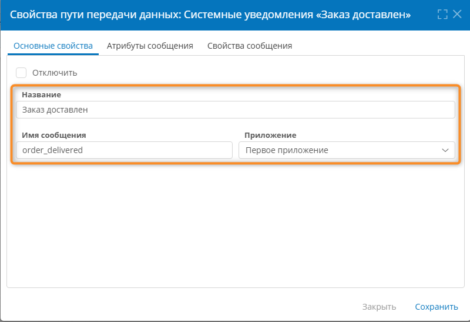
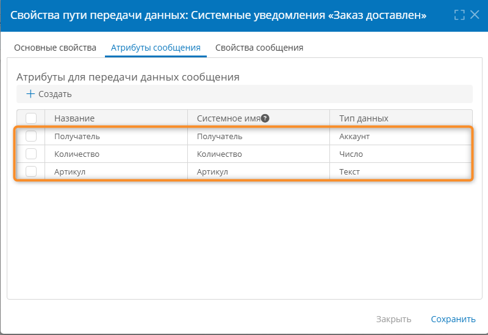

# Системные уведомления. Настройка {: #system_notifications }

## Введение {: #system_notifications_intro }

**{{ productName }}** позволяет настраивать **системные уведомления**, которые формируются в **[сценариях][scenarios]** и отображаются в **информационной панели и в push-сообщениях**.

Системные уведомления служат для передачи **конкретным пользователям** информации **в ходе выполнения сценариев**. Они позволяют выводить:

- любые бизнес-данные;
- сведения о событиях, происходящих в сценариях;

Здесь представлены инструкции по настройке **пути передачи данных** типа «**Системные уведомления**» для отправки сообщений из сценариев.

__

## Способы вывода системных уведомлений {: #system_notifications_display_methods }

Системные уведомления отображаются следующими способами:

- в информационной панели при нажатии значка «**Уведомления**» <i class="fa-light fa-bell ">‌</i>;
- в push-сообщениях.

!!! warning "Адресаты системных уведомлений"

    Системные уведомления отображаются **только для пользователей определённых аккаунтов**, указанных в [пути передачи данных](#system_notifications_communication_route).

!!! note "Вывод push-сообщений"

    **Push-сообщения формируются для всех сообщений, отображаемых в информационной панели,** а не только для сообщений из пути передачи данных «**Системные уведомления**».

    Если настроен путь передачи данных «**Системные уведомления**», то дополнительно выводятся сообщения из него.

## Порядок настройки системных уведомлений {: #system_notifications_sequence .pageBreakBefore }

Настройка системных уведомлений выполняется аналогично настройке путей передачи данных для электронной почты и сообщений других типов:

1. [Настройте **путь передачи данных**](#system_notifications_communication_route) типа «**Системные уведомления**».
2. В сценарии [настройте действие «**Отправить сообщение**»][scenario_actions_send_message] с использованием созданного пути передачи данных.
3. Протестируйте работу уведомления.

## Настройка пути передачи данных {: #system_notifications_communication_route .pageBreakBefore }

Для создания пути передачи данных для системных уведомлений требуются следующие действия:

1. Откройте страницу «**Администрирование**» — «**Архитектура**» или страницу «**Администрирование**» приложения.
2. Выберите пункт «**Пути передачи данных**» <i class="fa-light fa-route">‌</i>.
3. Отобразится список путей передачи данных.
4. Создайте или откройте путь передачи данных типа «**Системные подключения**» — «**Системные уведомления**».
5. Настройте свойства пути передачи данных:

    - **[Основные свойства](#system_notifications_communication_route_general_properties)**
    - **[Атрибуты сообщения](#system_notifications_communication_route_message_attributes)**
    - **[Свойства сообщения](#system_notifications_communication_route_message_properties)**

6. Сохраните путь передачи данных.

### Основные свойства {: #system_notifications_communication_route_general_properties }

Вкладка «**Основные свойства**» содержит основные параметры пути передачи данных:

- **Отключить** — установите этот флажок, чтобы временно деактивировать путь передачи данных.
- **Название** — введите наглядное наименование пути передачи данных.
- **Имя сообщения** — введите _уникальный_ идентификатор сообщения, проходящего по данному пути передачи данных.
- **Приложение** — выберите бизнес-приложение, в котором будет использоваться путь передачи данных.

__

### Атрибуты сообщения {: #system_notifications_communication_route_message_attributes .pageBreakBefore }

!!! question "Подстановка значений атрибутов сообщения в уведомление"

    Путь передачи данных для отправки системных уведомлений позволяет передавать данные из сценариев в уведомление.

    1. На вкладке «**Атрибуты сообщения**» пути передачи данных создайте набор атрибутов, значения которых требуется получить из сценария и подставить в уведомление.
    2. На вкладке «**[Свойства сообщения](#system_notifications_communication_route_message_properties)**» подставьте значения атрибутов сообщения в любое поле, указав их системные имена в фигурных скобках `{}`.

        - Например, подставьте в тему уведомления артикул товара:
            - **Тема:** _Доставлен заказ: `{Артикул}`_

    3. Задайте значения атрибутов сообщения в **переменной с сообщением** действия «**Отправить сообщение**» в сценарии, использующем этот путь передачи данных.

Чтобы создать атрибут сообщения и сопоставить его с полем уведомления, нажмите кнопку «**Создать**» и заполните свойства атрибута в таблице «**Атрибуты для передачи данных сообщения**»:

- **Название** — введите наглядное название атрибута.
- **Системное имя** — введите уникальное имя атрибута.
- **Тип данных** — выберите тип данных:
    - **Текст**
    - **Число**
    - **Длительность**
    - **Дата и время**
    - **Логический**
    - **Документ**
    - **Аккаунт**

__

### Свойства сообщения {: #system_notifications_communication_route_message_properties .pageBreakBefore }

На вкладке «**Свойства сообщения**» настройте шаблон системного уведомления с использованием атрибутов с вкладки «**Атрибуты сообщения**»:

- **Список атрибутов, которые можно использовать при написании уведомления** — содержит настроенные **атрибуты сообщения**. Копируйте их (вместе с фигурными скобками) и вставляйте в поля уведомления.
- **Тема** — введите произвольный текст темы уведомления и имена атрибутов в фигурных скобках для подстановки их значений.
- **Получатель** — выберите атрибут сообщения типа «**Аккаунт**», содержащий ID одного или нескольких аккаунтов, для которых будет отображаться уведомление.
- **Сообщение** — введите произвольный текст уведомления и имена атрибутов в фигурных скобках для подстановки их значений.

__

--8<-- "related_topics_heading.md"

- [Типы уведомлений][notification_types]
- [Общие уведомления. Настройка][common_notifications]
- [Уведомления о задачах. Настройка текста и отправки эл.&nbsp;почтой][task_notifications]
- [Пути передачи данных][communication_routes]
- [Сценарии][scenarios]
- [Сценарии. Действие «Отправить сообщение»][scenario_actions_send_message]
- [Push-уведомления в браузере. Включение][browser_push_permissions]
- [Мобильное приложение. Использование][mobile_app_use]


