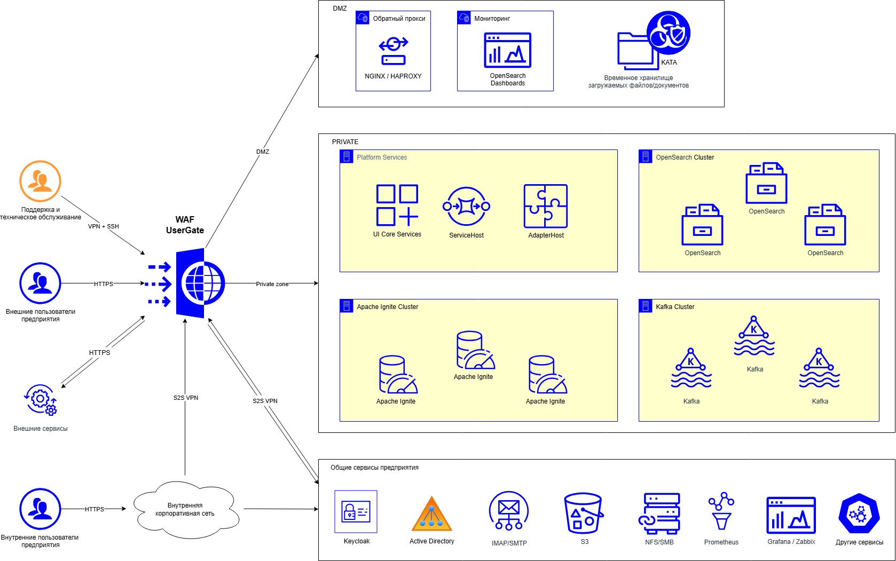
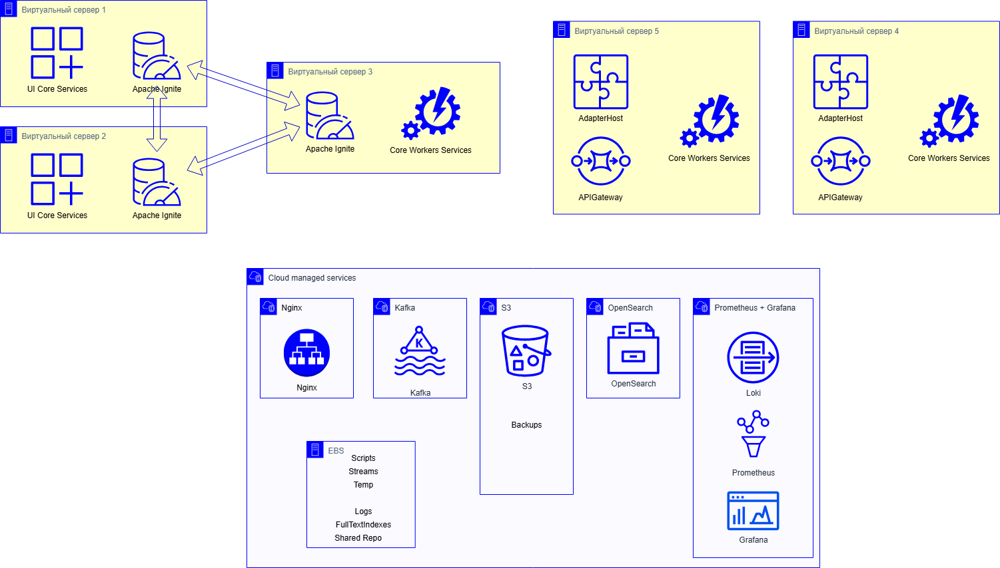
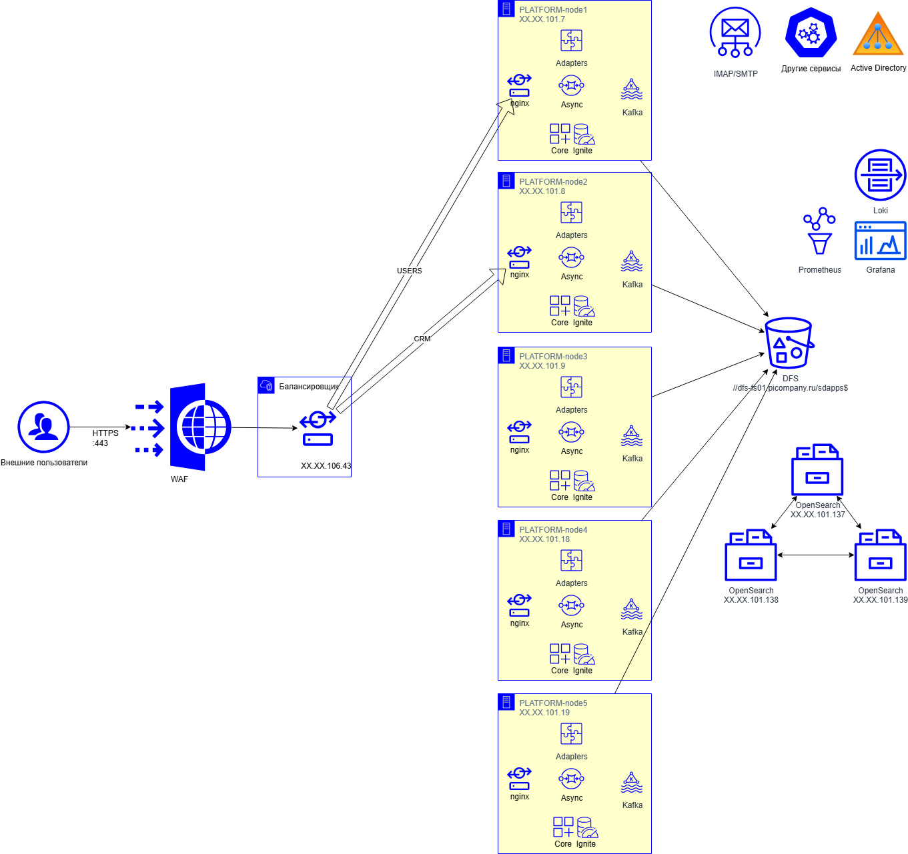

# Кластерные конфигурации. Обновление ПО и восстановление после аварий {: #cluster_upgrade_recover }



## Введение {: #cluster_upgrade_recover_introduction }

**{{ productName }}** поддерживает кластерные конфигурации, которые обеспечивают высокую доступность, отказоустойчивость и бесперебойное функционирование.

Здесь представлены рекомендации и советы по обновлению ПО и восстановлению работы после аварий в кластерных конфигурациях **{{ productName }}**.

### Основные принципы обновления ПО кластера {: #cluster_upgrade_recover_principles }

При обновлении ПО кластера следуйте следующим рекомендациям:

1. **Обновляйте по одному узлу**: обновляйте один узел, пока остальные продолжают работать
2. **Перенаправляйте пользователей и функционал**: перед началом работ перенаправьте пользователей и функционал (например, интеграции) с обновляемого узла на резервный.

### Типовой кластерный ландшафт {: #cluster_upgrade_recover_landscape }

Конфигурация развёртывания **{{ productName }}** должна обеспечивать минимальное время простоя и непрерывность бизнес-процессов даже в случае отказа отдельных компонентов системы.

Обычно кластерный ландшафт **{{ productName }}** включает следующие компоненты:

- **кластер приложений** (PLATFORM-node1-N) с балансировкой нагрузки;
- **кластер {{ apacheIgniteVariants }}** для распределённого хранения данных;
- **кластер {{ openSearchVariants }}** для поиска и журналирования транзакций;
- **кластер {{ kafkaVariants }}** для обмена сообщениями;
- **распределённая файловая система** (DFS) для хранения файлов;
- **система мониторинга** (Prometheus, Grafana, Loki).

__

__

## Архитектура кластера {: #cluster_upgrade_recover_architecture .pageBreakBefore }

### Кластер приложений Platform {: #cluster_upgrade_recover_platform_cluster }

**{{ productName }}** развёртывается в виде кластера из пяти узлов приложений:

- **PLATFORM-node1** (XX.XX.101.7) — основной узел интеграции
- **PLATFORM-node2** (XX.XX.101.8) — узел мониторинга и поиска
- **PLATFORM-node3** (XX.XX.101.9) — узел поиска и обработки
- **PLATFORM-node4** (XX.XX.101.18) — узел обработки
- **PLATFORM-node5** (XX.XX.101.19) — узел обработки

__

__

### Компоненты узлов Platform {: #cluster_upgrade_recover_platform_components }

Каждый узел содержит следующие компоненты:

- **{{ ngingxVariants }}** — обратный прокси-сервер, который обрабатывает HTTP-запросы
- **Adapters** — компоненты, которые интегрируются с внешними системами
- **Async** — асинхронные обработчики, которые выполняют фоновые задачи
- **{{ kafkaVariants }}** — очереди сообщений, которые обеспечивают межсервисное взаимодействие
- **Core Ignite** — распределённая сеть данных, которая кэширует и хранит данные

### Распределение нагрузки {: #cluster_upgrade_recover_load_balancing }

**Балансировщик нагрузки** (XX.XX.106.43) распределяет трафик следующим образом:

- **Пользовательский трафик**: PLATFORM-node1 (40%), PLATFORM-node2 (30%), PLATFORM-node3 (20%)
- **Трафик CRM-системы**: распределяется между PLATFORM-node1, PLATFORM-node2, PLATFORM-node3
- **Остальные узлы**: PLATFORM-node4 и PLATFORM-node5 обрабатывают дополнительную нагрузку

**Контроль исправности узлов:**
- Все узлы предоставляют эндпоинт `api/health`
- Статус 200 означает, что узел **{{ productName }}** работает исправно
- Балансировщик автоматически исключает нездоровые узлы из обработки трафика

### Инфраструктура данных {: #cluster_upgrade_recover_data_infrastructure }

**Распределённая файловая система:**
- **DFS** (`//dfs-01/picompany.ru/sdapps$`) — общее хранилище для всех узлов
- Все пять узлов подключаются к DFS в двунаправленном режиме

**Кластер поиска:**
- **{{ openSearchVariants }} Cluster** (XX.XX.101.137-139) — кластер поиска для узлов 2-5
- Обеспечивает индексирование и поиск по данным платформы

**Распределённое хранилище данных:**
- **{{ apacheIgniteVariants }} Cluster** — распределённое хранилище, которое реплицирует данные между узлами
- Обеспечивает высокую доступность и производительность данных

### Сетевая архитектура {: #cluster_upgrade_recover_network_architecture }

**Внешний доступ:**
- **WAF (Web Application Firewall)** — защищает от внешних угроз
- **HTTPS (порт 443)** — обеспечивает безопасное соединение для пользователей

**Внутренние сервисы:**
- **IMAP/SMTP** — интегрируется с почтовыми системами
- **Active Directory** — аутентифицирует и авторизует пользователей
- **Другие сервисы** — интегрируется с корпоративными системами

**Мониторинг и логирование:**
- **Loki** — агрегирует логи
- **Prometheus** — собирает метрики
- **Grafana** — визуализирует данные мониторинга

## Обновление кластера Platform {: #cluster_upgrade_recover_upgrade .pageBreakBefore }

### Стратегия обновления без простоя {: #cluster_upgrade_recover_zero_downtime_strategy }

**Кластерная архитектура {{ productName }}** позволяет выполнять обновления без простоя благодаря следующим возможностям:

- **Проверяем здоровье узлов**: все узлы предоставляют эндпоинт `api/health` для мониторинга состояния
- **Автоматически перераспределяем трафик**: балансировщик нагрузки автоматически исключает нездоровые узлы
- **Используем кластерную осведомлённость**: {{ apacheIgniteVariants }} и {{ kafkaVariants }} обеспечивают избыточность во время обновлений
- **Применяем распределённое хранилище**: DFS обеспечивает общий доступ к данным для всех узлов

### Пример конфигурации {: #cluster_upgrade_recover_pik_example }

**Роли узлов Platform:**

- **PLATFORM-node1** (XX.XX.XX.1) — пользовательский узел
- **PLATFORM-node2** (XX.XX.XX.2) — интеграционный узел  
- **PLATFORM-node3** (XX.XX.XX.3) — узел резервного копирования (основной)

**Специализация узлов:**
- **Пользовательский узел**: обрабатывает запросы от пользователей веб-интерфейса
- **Интеграционный узел**: обрабатывает интеграции с внешними системами
- **Узел резервного копирования**: выполняет резервное копирование и восстанавливает данные

### Детальная последовательность обновления кластера {: #cluster_upgrade_recover_detailed_sequence }

**Этапы обновления для конфигурации:**

#### Этап 1: Перенаправляем пользователей с PLATFORM-node1 на PLATFORM-node2 {: #cluster_upgrade_recover_step1 }

**Цель**: Вывести пользовательский трафик с узла, который будет обновляться

**Действия:**
- Изменяем конфигурацию балансировщика нагрузки (nginx)
- Перенаправляем пользовательский трафик на PLATFORM-node2
- Проверяем корректность перенаправления через мониторинг

**Контрольные точки:**
- Убеждаемся, что все пользовательские запросы обрабатываются PLATFORM-node2
- Проверяем, что PLATFORM-node1 не получает новый пользовательский трафик
- Мониторим производительность PLATFORM-node2 под увеличенной нагрузкой

#### Этап 2: Обновляем PLATFORM-node1 {: #cluster_upgrade_recover_step2 }

**Цель**: Обновить пользовательский узел без влияния на работу системы

**Действия:**
- Останавливаем сервисы на PLATFORM-node1
- Выполняем обновление программного обеспечения
- Запускаем сервисы после обновления
- Проверяем работоспособность после обновления

**Контрольные точки:**
- Мониторим эндпоинт `api/health` на PLATFORM-node1
- Проверяем подключение к кластеру Apache Ignite
- Анализируем логи на предмет ошибок
- Проверяем синхронизацию данных с другими узлами

#### Этап 3: Перенаправляем пользователей с PLATFORM-node2 на PLATFORM-node1 {: #cluster_upgrade_recover_step3 }

**Цель**: Восстановить пользовательский трафик на обновлённый узел

**Действия:**
- Восстанавливаем пользовательский трафик на обновлённый PLATFORM-node1
- Проверяем корректность работы пользовательских функций
- Мониторим производительность системы

**Контрольные точки:**
- Убеждаемся, что пользовательские функции работают корректно
- Проверяем время отклика системы
- Мониторим ошибки в пользовательских операциях

#### Этап 4: Перенаправляем интеграции с PLATFORM-node2 на PLATFORM-node1 {: #cluster_upgrade_recover_step4 }

**Цель**: Вывести интеграционный трафик с узла, который будет обновляться

**Действия:**
- Изменяем конфигурацию для интеграционного трафика
- Перенаправляем интеграционные запросы на PLATFORM-node1
- Проверяем работу интеграций

**Контрольные точки:**
- Убеждаемся, что все интеграции работают через PLATFORM-node1
- Проверяем обработку входящих и исходящих интеграционных запросов
- Мониторим производительность интеграций

#### Этап 5: Обновляем PLATFORM-node2 {: #cluster_upgrade_recover_step5 }

**Цель**: Обновить интеграционный узел без влияния на работу системы

**Действия:**
- Останавливаем сервисы на PLATFORM-node2
- Выполняем обновление программного обеспечения
- Запускаем сервисы после обновления
- Проверяем работоспособность после обновления

**Контрольные точки:**
- Мониторим эндпоинт `api/health` на PLATFORM-node2
- Проверяем подключение к кластеру Apache Ignite
- Анализируем логи на предмет ошибок
- Проверяем работу интеграционных компонентов

#### Этап 6: Перенаправляем интеграции с PLATFORM-node1 на PLATFORM-node2 {: #cluster_upgrade_recover_step6 }

**Цель**: Восстановить интеграционный трафик на обновлённый узел

**Действия:**
- Восстанавливаем интеграционный трафик на обновлённый PLATFORM-node2
- Проверяем корректность работы интеграций
- Мониторим производительность системы

**Контрольные точки:**
- Убеждаемся, что все интеграции работают корректно
- Проверяем обработку входящих и исходящих интеграционных запросов
- Мониторим производительность интеграций

#### Этап 7: Обновляем PLATFORM-node3 {: #cluster_upgrade_recover_step7 }

**Цель**: Обновить узел резервного копирования

**Действия:**
- Останавливаем сервисы на PLATFORM-node3
- Выполняем обновление программного обеспечения
- Запускаем сервисы после обновления
- Проверяем работоспособность после обновления

**Контрольные точки:**
- Мониторим эндпоинт `api/health` на PLATFORM-node3
- Проверяем работу резервного копирования
- Анализируем логи на предмет ошибок
- Проверяем подключение к кластеру Apache Ignite

### Ключевые принципы обновления {: #cluster_upgrade_recover_key_principles }

**Подготавливаемся к обновлению:**
- Создаём резервную копию через встроенные средства **{{ productName }}**
- Проверяем состояние кластера Apache Ignite
- Анализируем логи на предмет ошибок или предупреждений
- Проверяем доступность внешних сервисов (OpenSearch, Kafka)

**Мониторим во время обновления:**
- Постоянно контролируем эндпоинт `api/health` на всех узлах
- Анализируем логи состояния экземпляра (`heartbeat_*.log`)
- Мониторим логи Apache Ignite (`igniteClient_*.log`)
- Проверяем синхронизацию данных между узлами

**Проверяем после обновления:**
- Ожидаем сообщения об окончании ребалансировки кластера
- Ищем в логах сообщение: `INFO Skipping rebalancing (nothing scheduled)`
- Удаляем файл блокировки `hold.lock` из директории базы данных
- Проверяем топологию Apache Ignite через инструменты управления

## Восстановление после аварий {: #cluster_upgrade_recover_disaster_recovery .pageBreakBefore }

### Архитектура восстановления {: #cluster_upgrade_recover_recovery_architecture }

**Кластерная архитектура {{ productName }}** обеспечивает многоуровневую систему восстановления:

- **Автоматически перераспределяем трафик** при отказе узлов
- **Реплицируем данные** в кластере {{ apacheIgniteVariants }}
- **Синхронизируем индексы** в кластере {{ openSearchVariants }}
- **Создаём резервные копии** в распределённой файловой системе

### Сценарии восстановления {: #cluster_upgrade_recover_recovery_scenarios }

#### Отказ одного узла приложений {: #cluster_upgrade_recover_single_node_failure }

**Автоматическое восстановление:**
- Балансировщик нагрузки автоматически исключает нездоровый узел
- Трафик перераспределяется на оставшиеся узлы
- Кластер {{ apacheIgniteVariants }} продолжает работать с оставшимися узлами

**Ручное восстановление:**
- Диагностируем причину отказа узла
- Восстанавливаем узел или заменяем на новый
- Проверяем подключение к кластерам
- Возвращаем узел в пул балансировщика

#### Отказ кластера {{ apacheIgniteVariants }} {: #cluster_upgrade_recover_ignite_failure }

**Немедленные действия:**
- Проверяем состояние всех узлов кластера
- Идентифицируем отказавшие узлы
- Проверяем целостность данных

**Восстанавливаем кластер:**
- Перезапускаем отказавшие узлы
- Проверяем синхронизацию данных
- Восстанавливаем из резервных копий при необходимости

**Проверяем работоспособность:**
- Тестируем операции чтения/записи
- Проверяем производительность кластера
- Мониторим стабильность работы

#### Отказ кластера {{ openSearchVariants }} {: #cluster_upgrade_recover_opensearch_failure }

**Диагностируем:**
- Проверяем состояние узлов кластера
- Анализируем логи для выявления причины
- Проверяем доступность индексов

**Восстанавливаем:**
- Перезапускаем отказавшие узлы
- Проверяем целостность индексов
- Восстанавливаем индексы из резервных копий

**Проверяем поиск:**
- Тестируем поисковые запросы
- Проверяем производительность индексирования
- Мониторим работу кластера

#### Полный отказ кластера {: #cluster_upgrade_recover_complete_failure }

**Активируем резервное копирование:**
- Восстанавливаем данные из последней резервной копии
- Восстанавливаем конфигурацию системы
- Восстанавливаем файлы из DFS

**Поэтапно восстанавливаем:**
- Восстанавливаем кластер {{ apacheIgniteVariants }}
- Восстанавливаем кластер {{ openSearchVariants }}
- Восстанавливаем узлы приложений
- Настраиваем балансировщик нагрузки

**Проверяем систему:**
- Полностью тестируем функциональность
- Проверяем производительность
- Мониторим стабильность работы

## Мониторинг и контроль кластера {: #cluster_upgrade_recover_monitoring .pageBreakBefore }

### Ключевые эндпоинты для мониторинга {: #cluster_upgrade_recover_monitoring_endpoints }

**Эндпоинт здоровья узлов:**
- **`api/health`**: проверяем состояние узлов приложений
  - Статус 200 OK — узел работает корректно
  - Время отклика не должно превышать 5 секунд
  - Регулярно проверяем каждые 30 секунд

**Кластер Apache Ignite:**
- Проверяем топологию кластера через инструменты управления
- Мониторим состояние репликации данных
- Контролируем производительность операций чтения/записи

**Кластер OpenSearch:**
- Используем эндпоинт `/_cluster/health` для проверки состояния
- Проверяем состояние индексов и их репликации
- Мониторим производительность поисковых запросов

**Кластер Kafka:**
- Контролируем состояние топиков и партиций
- Мониторим задержку обработки сообщений
- Проверяем размер очередей сообщений

### Факторы для рассмотрения при мониторинге {: #cluster_upgrade_recover_monitoring_factors }

**Производительность:**
- Измеряем время отклика каждого узла
- Контролируем использование ресурсов (CPU, память, дисковое пространство)
- Мониторим сетевую активность между узлами кластера

**Надёжность:**
- Анализируем критические ошибки и предупреждения в логах
- Проверяем равномерность распределения запросов
- Контролируем стабильность работы кластерных компонентов

### Системы оповещения {: #cluster_upgrade_recover_alerting_systems }

**Инструменты мониторинга:**
- **Prometheus + Grafana**: мониторим метрики и визуализируем данные
- **Loki**: агрегируем и анализируем логи
- **Zabbix**: комплексно мониторим инфраструктуру

**Критические события для оповещения:**
- Отказ узла приложения (статус `api/health` != 200)
- Превышение пороговых значений производительности
- Ошибки в кластерах Apache Ignite или OpenSearch
- Проблемы с балансировкой нагрузки
- Критические ошибки в системных логах

## Способы повышения доступности и отказоустойчивости {: #cluster_upgrade_recover_availability .pageBreakBefore }

**Резервируем компоненты:**
- Дублируем критически важные компоненты (серверы приложений, базы данных, журналирование)
- Это позволяет системе продолжать работать в случае отказа одного из компонентов

**Балансируем нагрузку:**
- Используем балансировщик нагрузки ({{ ngingxVariants }}) для распределения запросов
- Это повышает производительность системы и её устойчивость к отказам

**Масштабируем горизонтально:**
- Добавляем новые узлы для увеличения производительности и отказоустойчивости
- Это позволяет системе выдерживать растущую нагрузку

**Мониторим и оповещаем:**
- Внедряем системы мониторинга для отслеживания состояния всех компонентов
- Своевременно оповещаем администраторов о возможных проблемах

**Создаём резервные копии и восстанавливаем:**
- Регулярно создаём резервные копии данных и конфигурации системы
- Храним резервные копии в отдельном внешнем хранилище
- См. _«[Резервное копирование. Настройка и запуск, просмотр журнала сеансов][backup_configure]»_

## Определяем уровень критичности проектируемой системы {: #cluster_upgrade_recover_criticality .pageBreakBefore }

Прежде чем приступать к проектированию архитектуры системы, определяем уровень её критичности.

При выборе уровня критичности информационной системы учитываем следующие факторы:

- **Характер задач**: оцениваем, насколько система критична для выполнения основных бизнес-процессов и соблюдения обязательств перед клиентами.
- **Последствия простоя**: определяем возможные финансовые, имиджевые и операционные потери.
- **Требуемое время восстановления (RTO)** и **допустимые потери данных (RPO)**: чем короче RTO и RPO, тем выше требования к резервированию и инфраструктуре.

### Классифицируем информационные системы по уровням критичности {: #cluster_upgrade_recover_criticality_classification }

Информационные системы классифицируем по их значимости для функционирования организации и возможным последствиям простоя. Уровень критичности определяем на основе роли системы в бизнес-процессах и возможных последствий её простоя. Используем перечисленные ниже уровни.

- **Уровень 1 — Жизненно важные системы (Mission Critical)**
Системы с режимом работы 24х7х365, даже кратковременный отказ которых делает невозможным выполнение ключевых функций организации и приводит к невосполнимым потерям или штрафным санкциям.
    **Рекомендации**:
    - Время восстановления — менее 10 минут.
    - Полное многократное резервирование всех компонентов.
    - Использование специализированных серверов.
    - Применение кластеризации и балансировки нагрузки.
    - Использование инфраструктурных решений с удалёнными и распределёнными ЦОД
- **Уровень 2 — Критически важные системы (Business Critical)**
Системы с режимом работы 24х7х365, для которых допустим краткосрочный простой, но длительный вызывает значительные финансовые или имиджевые потери.
    **Рекомендации**:
    - Время восстановления — до 2 часов.
    - Применение кластерных решений.
    - Частичное резервирование компонентов.
- **Уровень 3 — Системы операционной деятельности (Business Operational)**
Системы с режимом работы 8х5, которые поддерживают внутренние бизнес-процессы организации, простой которых в течение нескольких часов создаёт неудобства, но не оказывает существенного влияния на обслуживание клиентов или ключевые операции.
    **Рекомендации**:
    - Время восстановления — 4–6 часов.
    - Полное резервирование хранения данных.
    - Частичное резервирование компонентов.
- **Уровень 4 — Системы общего назначения (Office Productivity)**
Системы, используемые для повседневной офисной работы, простой которых даже в течение нескольких дней не оказывает существенного влияния на уровень обслуживания других систем.
    **Рекомендации**:
    - Время восстановления — 1–2 рабочих дня.
    - Использование типовых мер резервного копирования данных.
    - Частичное резервирование компонентов.

## Проектируем архитектуру системы {: #cluster_upgrade_recover_architecture_design .pageBreakBefore }

Фактическую продуктивную архитектуру системы определяем в рамках разработки ТЗ с учётом всех технических и бизнес-факторов.

Прежде чем приступать к развёртыванию программного и технического обеспечения:

- Определяем, какие показатели наиболее важны для бизнеса, а также их приоритетность:
    - производительность;
    - устойчивость;
    - горизонтальное масштабирование;
    - географическая распределённость;
    - RTO (Recovery Time Objective) — время восстановления после сбоя;
    - RPO (Recovery Point Objective) — допустимый объём потерянных данных после сбоя.
- Определяем техническую и экономическую целесообразность достижения и поддержания целевых показателей.
- Определяем стоимость реализации — чем выше требуемый уровень надёжности и доступности системы, тем выше расходы на его достижение.
- Выбираем архитектуру системы в зависимости от выявленных целевых показателей и бизнес-задач. Используем один из следующих подходов или их сочетание:
    - **Обеспечение отказоустойчивости**
        - Имеется два или более узлов, из которых один является рабочим, а остальные резервными. Также предусмотрены сервер хранения данных и балансировщик нагрузки. ПО работает бесперебойно, пока сохраняют работоспособность один узел и сервер данных. Показатели RTO/RPO можно свести к минимуму. Так как на сервере данных хранятся актуальные данные, их достаточно для восстановления работоспособности узлов после сбоя.
    - **Распределение нагрузки**
        - Имеется два или более узлов, сервер хранения данных и балансировщик нагрузки. Нагрузка равномерно распределяется между узлами, что сокращает время отклика. На сервере данных хранятся наиболее актуальные данные. ПО работает бесперебойно, пока сохраняют работоспособность все узлы кластера и сервер данных. При равномерной нагрузке время отклика можно рассчитать по формуле: `Y/N+ε`, где `Y` — время отклика при нагрузке только на один узел, `N` — количество узлов, `ε` — погрешность. Так как на сервере данных хранятся актуальные данные, их достаточно для восстановления работоспособности узлов после сбоя.
    - **Обеспечение высокой доступности**
        - Имеется два или более узлов, сервер хранения данных и балансировщик нагрузки. ПО работает бесперебойно, пока сохраняет работоспособность хотя бы один узел и сервер данных. Даже при наличии постоянной нагрузки на балансировщике возможно выполнить поочерёдное обновление каждого из узлов до новой версии ПО. Так как на сервере данных хранятся актуальные данные, их достаточно для восстановления работоспособности узлов после сбоя.
- Определяем способ реализации выбранных подходов к обеспечению доступности и отказоустойчивости, например, с использованием кластеризации, контейнеризации и оркестрации или иных методов и инструментов. При выборе учитываем определённые ранее показатели, потребности, цели и возможности.

## Рекомендации по эксплуатации кластера {: #cluster_upgrade_recover_operations .pageBreakBefore }

### Планируем обновления {: #cluster_upgrade_recover_planning }

1. **Планируем окно обслуживания**:
   - Выполняем обновления в периоды минимальной нагрузки
   - Уведомляем пользователей о плановых работах
   - Подготавливаем план отката на случай проблем

2. **Тестируем в изолированной среде**:
   - Создаём тестовую копию кластера
   - Тестируем процедуры обновления
   - Проверяем совместимость с существующими данными

3. **Мониторим во время обновлений**:
   - Отслеживаем состояние всех компонентов
   - Контролируем производительность системы
   - Готовимся к немедленному откату при необходимости

### Оптимизируем производительность {: #cluster_upgrade_recover_performance }

1. **Настраиваем балансировку нагрузки**:
   - Регулярно анализируем распределение трафика
   - Настраиваем веса узлов в зависимости от их производительности
   - Мониторим время отклика каждого узла

2. **Управляем ресурсами кластера**:
   - Контролируем использование памяти в {{ apacheIgniteVariants }}
   - Мониторим размер индексов в {{ openSearchVariants }}
   - Оптимизируем настройки {{ kafkaVariants }} для вашей нагрузки

3. **Масштабируем кластер**:
   - Добавляем узлы при росте нагрузки
   - Удаляем неиспользуемые узлы для экономии ресурсов
   - Планируем горизонтальное масштабирование заранее

### Обеспечиваем безопасность кластера {: #cluster_upgrade_recover_security }

1. **Настраиваем сетевую безопасность**:
   - Используем WAF для защиты от атак
   - Настраиваем межсетевые экраны между зонами
   - Шифруем трафик между узлами кластера

2. **Контролируем доступ**:
   - Настраиваем аутентификацию для всех компонентов
   - Используем принцип минимальных привилегий
   - Регулярно обновляем пароли и сертификаты

3. **Мониторим безопасность**:
   - Отслеживаем подозрительную активность
   - Анализируем логи на предмет атак
   - Настраиваем автоматические уведомления о нарушениях

## Практики, которых следует избегать {: #cluster_upgrade_recover_anti_patterns .pageBreakBefore }

Для обеспечения оптимальной производительности, минимизации рисков простоев и повышения надёжности, доступности и отказоустойчивости **{{ productName }}** избегаем следующих подходов:

- **Игнорируем мониторинг и оповещения**: отсутствие постоянного мониторинга состояния системы может привести к пропуску критических инцидентов и увеличению времени простоя.
- **Недостаточно реплицируем данные**: хранение данных только на одном узле повышает риск их утраты в случае сбоя.
- **Не создаём резервные копии**: нерегулярное или неправильное резервное копирование данных может осложнить восстановление системы после сбоя.
- **Пренебрегаем тестированием отказоустойчивости**: отсутствие регулярного тестирования сценариев отказа системы приводит к неготовности к устранению неполадок в критических ситуациях.
- **Неоптимально настраиваем конфигурацию**: использование дефолтных или неподходящих настроек ПО может привести к увеличению задержек и снижению производительности.
- **Развёртываем все узлы в одной зоне**: отсутствие географического распределения узлов повышает уязвимость системы к локальным сбоям или катастрофам.
- **Недооцениваем нагрузку**: неправильная оценка будущих нагрузок может привести к сбоям системы при увеличении объёмов данных, количества транзакций или пользователей.
- **Обновляем все узлы одновременно**: одновременное обновление всех узлов кластера может привести к полной недоступности системы.
- **Игнорируем проверки здоровья**: отключение или неправильная настройка проверок `api/health` может привести к неправильной работе балансировщика нагрузки.
- **Недостаточно тестируем восстановление**: отсутствие регулярного тестирования процедур восстановления может привести к неготовности к реальным авариям.

--8<-- "related_topics_heading.md"

- [Развёртывание {{ productName }}. Архитектура, ландшафт, программное и техническое обеспечение][architecture_landscape]
- [Установка, запуск, инициализация и остановка ПО][deploy_guide_linux]
- [Системные требования {{ productName }}][system_requirements]
- [Резервное копирование и восстановление. Рекомендации по организации и оптимизации][backup_configure]
- [Резервное копирование. Настройка и запуск, просмотр журнала сеансов][backup_configure]


