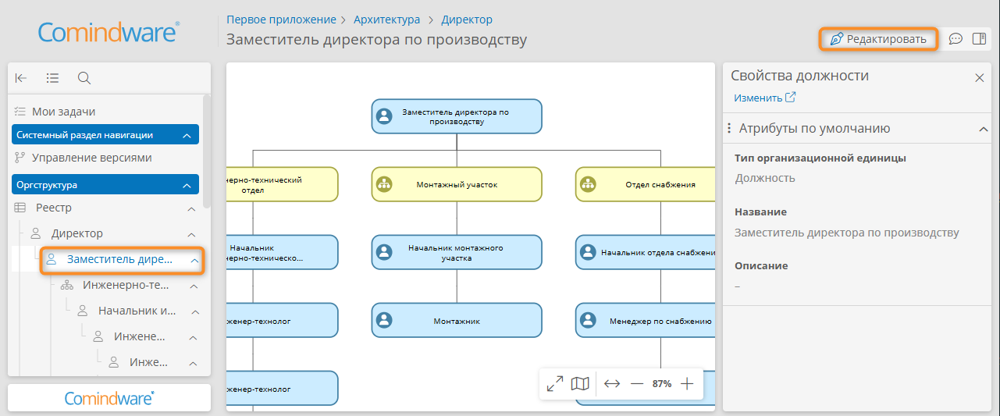
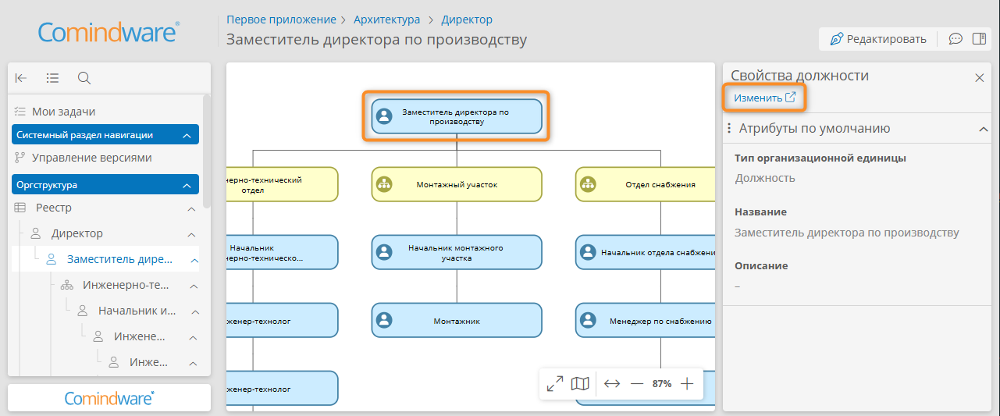

# Построение организационной структуры {: #architect_organizational_structure_design }

## Введение

Для построения организационно-штатной структуры (ОШС) в **{{ productNameEnterprise }}** предусмотрены следующие инструменты:

- иерархический иерархический [реестр организационных единиц](#architect_organizational_structure_design_registry_view);
- [конструктор диаграммы ОШС][architect_organizational_structure_diagram_edit].

Предусмотрены оргединицы следующих типов:

- **Подразделение**
- **Должность**

Каждая оргединица представляет собой запись в [шаблоне оргединицы][organizational_unit_templates].

Оргединицы можно использовать в качестве ресурсов и исполнителей в [процессной архитектуре][architect_process_architecture_design] организации.

Атрибуты и форму свойств оргединицы можно [изменить][architect_organizational_structure_design_unit_configure_form_and_attributes].

## Редактирование оргструктуры {: #architect_organizational_structure_edit .pageBreakBefore }

Чтобы отредактировать оргструктуру предприятия, откройте [реестр организационных единиц](#architect_organizational_structure_design_registry_view).

- Редактировать оргструктуру можно следующими способами:
    - с помощью конструктора диаграммы ОШС;
    - с помощью реестра оргединиц;
    - с помощью панели навигации.
- Предусмотрены следующие операции с оргединицами:
    - [создание](#architect_organizational_structure_design_unit_create);
    - [переименование](#architect_organizational_structure_design_unit_rename);
    - [изменение типа](#architect_organizational_structure_design_unit_type_change);
    - [изменение свойств](#architect_organizational_structure_design_unit_configure);
    - [редактирование формы и атрибутов](#architect_organizational_structure_design_unit_configure_form_and_attributes);
    - [перемещение в иерархии](#architect_organizational_structure_design_hierarchy_change);
    - [изменение цвета и размера на диаграмме ОШС](#architect_organizational_structure_design_unit_color_change_resize);
    - [удаление](#architect_organizational_structure_design_unit_delete).

## Просмотр реестра оргединиц {: #architect_organizational_structure_design_registry_view .pageBreakBefore }

1. В [панели навигации][navigation_panel] выберите пункт «**Оргструктура**» — «**Реестр**» для просмотра всей иерархии оргструктуры.
2. Отобразится страница «**Оргструктура**» со следующими сведениями:

    - **Название** — наименование организационной единицы;
    - **Процессы** — гиперссылки на процессы, в которых задействована оргединица.

3. Чтобы [открыть диаграмму ОШС][architect_organizational_structure_diagram_edit], дважды нажмите требуемую оргединицу в реестре или выберите её на панели навигации.

__

## Создание оргединицы {: #architect_organizational_structure_design_unit_create .pageBreakBefore }

### Создание оргединицы с помощью диаграммы ОШС

1. В [конструкторе диаграммы ОШС][architect_organizational_structure_diagram_edit] выберите оргединицу, для которой требуется создать дочернюю оргединицу.
2. Выберите пункт «**Должность**» <i class="fa-solid fa-user"></i> или «**Подразделение**» <i class="fa-solid fa-sitemap"></i> в разделе «**Быстрое создание**» [меню элемента][architect_organizational_structure_diagram_edit_element_menu].
3. Новая оргединица появится на диаграмме и будет связана с родительской оргединицей.
4. Настройте свойства оргединицы с помощью панели свойств <i class="fa-light fa-sidebar-flip"></i> справа от диаграммы.

### Создание комментария или надписи на диаграмме ОШС

1. Перетащите на диаграмму комментарий или надпись из [палитры элементов][architect_organizational_structure_diagram_edit].
2. Новый элемент появится на диаграмме.
3. При необходимости соедините элемент с другим с помощью стрелки из раздела «**Быстрое создание**» [меню элемента][architect_organizational_structure_diagram_edit_element_menu].
4. Настройте элемент с помощью панели свойств справа от диаграммы.

__

### Создание оргединицы на верхнем уровне иерархии с помощью реестра {: .pageBreakBefore }

1. В [реестре оргединиц][architect_organizational_structure_design] нажмите кнопку «**Создать**».
2. В раскрывающемся меню выберите пункт «**Подразделение**» или «**Должность**».

    __

3. Будет создана оргединица на верхнем уровне иерархии.
--8<-- "organizational_structure_name_unit.md"

### Создание дочерней оргединицы с помощью реестра

1. В [реестре оргединиц][architect_organizational_structure_design] установите флажок выбора в строке оргединицы или щёлкните её правой кнопкой мыши.
2. Нажмите кнопку «**Создать**» над реестром или в контекстном меню.
3. Выберите пункт «**Подразделение**» или «**Должность**».

    __

4. Будет создана дочерняя оргединица внутри оргединицы, выбранной на шаге 1.
--8<-- "organizational_structure_name_unit.md"

### Создание оргединицы с помощью панели навигации

1. В разделе «**Оргструктура**» [панели навигации][navigation_panel] нажмите кнопку «**Действия**» <i class="fa-light fa-ellipsis-vertical"></i> у оргединицы или у пункта «**Реестр**».
2. В раскрывающемся меню выберите пункт «**Создать подразделение**» или «**Создать должность**».

    __

4. Будет создана оргединица внутри оргединицы, выбранной на шаге 1, либо на верхнем уровне иерархии.
5. Присвойте оргединице наглядное название сразу после её создания.

    __

## Переименование оргединицы {: #architect_organizational_structure_design_unit_rename .pageBreakBefore }

### Переименование с помощью подписи на диаграмме

1. Дважды нажмите оргединицу в [конструкторе диаграммы ОШС][architect_organizational_structure_diagram_edit].
2. Введите новое название в отобразившееся текстовое поле.
3. Нажмите пустое место диаграммы, чтобы применить изменения.

__

### Переименование с помощью панели свойств на диаграмме

1. Выберите оргединицу в [конструкторе диаграммы ОШС][architect_organizational_structure_diagram_edit].
2. Откройте панель свойств, нажав кнопку «**Свойства**» <i class="fa-light fa-sidebar-flip"></i>.
3. Введите новое название оргединицы в поле «**Название**».
4. Откройте панель свойств, нажав кнопку <i class="fa-light  fa-sidebar-flip"></i>.
5. В отобразившейся области введите требуемое название в поле «**Название**».
6. Нажмите любое место вне элемента, чтобы применить изменения.

__

__

### Переименование с помощью панели навигации {: .pageBreakBefore }

1. Нажмите кнопку «**Действия**» <i class="fa-light fa-ellipsis-vertical"></i> у оргединицы.
2. В раскрывающемся меню выберите пункт «**Переименовать**».

    __

3. Введите новое название оргединицы.

    __

## Изменение типа оргединицы {: #architect_organizational_structure_design_unit_type_change .pageBreakBefore }

1. Выберите оргединицу в [конструкторе диаграммы ОШС][architect_organizational_structure_diagram_edit].
2. Откройте панель свойств, нажав кнопку «**Свойства**» <i class="fa-light fa-sidebar-flip"></i>.
3. Укажите новый тип в поле «**Тип организационной единицы**».
4. Нажмите пустое место диаграммы, чтобы применить изменения.

## Изменение свойств оргединицы {: #architect_organizational_structure_design_unit_configure }

У каждого элемента оргструктуры предусмотрены настраиваемые свойства ([атрибуты][architect_organizational_structure_design_unit_configure_form_and_attributes]).

Свойства элемента оргструктуры (значения его атрибутов) можно изменить с помощью панели свойств в конструкторе диаграммы.

1. Выберите организационную единицу в [конструкторе диаграммы ОШС][architect_organizational_structure_diagram_edit].
2. Откройте панель свойств, нажав кнопку «**Свойства**» <i class="fa-light fa-sidebar-flip"></i>.
3. Настройте свойства оргединицы с помощью панели свойств.
4. Нажмите пустое место диаграммы, чтобы применить изменения.
5. При необходимости [отредактируйте форму и атрибуты оргединицы][architect_organizational_structure_design_unit_configure_form_and_attributes].
6. При необходимости выберите на диаграмме дочерние оргединицы и настройте их свойства аналогичным образом.

__

## Редактирование формы и атрибутов оргединицы {: #architect_organizational_structure_design_unit_configure_form_and_attributes .pageBreakBefore }

У каждой оргединицы предусмотрены системные атрибуты и форма, которая отображается в панели свойств.

На форму оргединицы по умолчанию вынесены следующие системные атрибуты:

- **Тип организационной единицы** — **должность** или **подразделение**;
- **Название** — наименование должности или подразделения в организации;
- **Описание** — комментарий относительно назначения оргединицы.

Для оргединицы можно создать дополнительные атрибуты и вынести их на форму вместе с необходимыми визуальными элементами.

Атрибуты и формы оргединицы хранятся в [шаблоне оргединицы][organizational_unit_templates].

Чтобы отредактировать форму и атрибуты оргединицы, выполните следующие действия:

1. Выберите оргединицу в [конструкторе диаграммы ОШС][architect_organizational_structure_diagram_edit].
2. Откройте панель свойств, нажав кнопку «**Свойства**» <i class="fa-light fa-sidebar-flip"></i>.
3. Нажмите кнопку «**Изменить**» <i class="fa-l fa-arrow-up-right-from-square"></i>.

    __

4. Отобразится конструктор формы.
5. Создайте или отредактируйте атрибуты оргединицы. См. _«[Операции на панели элементов конструктора форм][form_designer_elements_operations]»_.
6. Перетащите на форму новые атрибуты и визуальные элементы или удалите ненужные. См. _«[Редактирование формы][form_designer]»_.
7. Сохраните форму.

__

## Изменение цвета и размера оргединицы на диаграмме ОШС {: #architect_organizational_structure_design_unit_color_change_resize .pageBreakBefore }

1. Выберите оргединицу в [конструкторе диаграммы ОШС][architect_organizational_structure_diagram_edit].
2. Выберите цвет в разделе «**Изменить цвет**» [меню элемента][architect_organizational_structure_diagram_edit_element_menu].
3. Наведите указатель мыши на границу оргединицы.
4. Чтобы изменить размер оргединицы, перетащите границу.

## Изменение иерархии оргединиц {: #architect_organizational_structure_design_hierarchy_change .pageBreakBefore }

### Перемещение оргединицы с помощью диаграммы

1. Выберите оргединицу в [конструкторе диаграммы ОШС][architect_organizational_structure_diagram_edit].
2. Перетащите её на требуемую родительскую оргединицу.
3. Оргединица будет перемещена на новый уровень иерархии вместе со своими дочерними оргединицами.
4. Диаграмма ОШС будет перестроена.

### Перемещение оргединицы с помощью реестра

1. В [реестре оргединиц][architect_organizational_structure_design] наведите указатель мыши на первую ячейку в строке оргединицы, которую требуется переместить на другой уровень иерархии.
2. Отобразится значок с вертикальными троеточиями <i class="fa-light fa-grip-dots-vertical"></i>.
3. Удерживая значок <i class="fa-light fa-grip-dots-vertical"></i>, перетащите оргединицу на строку её новой родительской оргединицы.

    __

4. Чтобы переместить оргединицу на верхний уровень иерархии, перетащите её в позицию между первой строкой и заголовками столбцов, как показано на иллюстрации.

    __

### Перемещение оргединицы с помощью панели навигации

В [панели навигации][navigation_panel] нажмите и перетащите оргединицу на её новую родительскую оргединицу или между оргединицами.

__

## Удаление оргединиц {: #architect_organizational_structure_design_unit_delete .pageBreakBefore .pageBreakBefore }

!!! Warning "Внимание!"

    Оргединицы удаляются безвозвратно вместе со всеми дочерними оргединицами.

### Удаление с помощью диаграммы ОШС

1. Выберите оргединицу или несколько оргединиц в [конструкторе диаграммы ОШС][architect_organizational_structure_diagram_edit].
2. Выберите пункт «**Удалить**» в меню элемента или нажмите клавишу ++delete++.
3. Подтвердите удаление выбранных оргединиц.

### Удаление с помощью реестра

1. Установите для подлежащих удалению оргединиц флажки в первом столбце [реестра][architect_organizational_structure_design] или щелкните правой кнопкой мыши подлежащую удалению оргединицу.
2. Нажмите кнопку «**Удалить**» над реестром оргединиц или в контекстом меню.
3. Подтвердите удаление выбранных оргединиц.

__

### Удаление с помощью панели навигации

1. Нажмите кнопку «**Действия**» <i class="fa-light fa-ellipsis-vertical"></i> у оргединицы, подлежащей удалению.
2. В раскрывающемся меню выберите пункт «**Удалить**».
3. Подтвердите удаление оргединицы.

__

--8<-- "related_topics_heading.md"

- _[Редактирование диаграммы ОШС][architect_organizational_structure_diagram_edit]_
- _[Построение процессной архитектуры][architect_process_architecture_design]_
- _[Шаблон организационной единицы][organizational_unit_templates]_
- _[Панель навигации. Использование][navigation_panel]_


