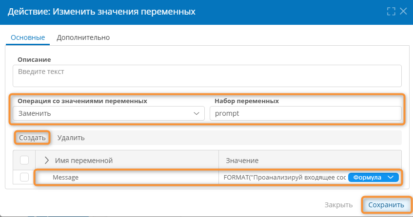

# Работа с ИИ. Настройка адаптера, low-code-агентов и тестирование {: #ai_feature_guide }

## Введение {: #ai_feature_guide_intro }

**{{ productName }}** поддерживает взаимодействие с LLM и создание чат-ботов, выполняющих команды пользователя на естественном языке.

!!! question "Определения"

    - **LLM** — большая языковая модель (БЯМ, от англ. large language model). Это алгоритм, построенный на основе нейронных сетей и моделирующий общение на естественном языке. LLM предсказывает наиболее вероятный ответ на входной запрос (промпт), основываясь на данных, заложенных в неё на этапе обучения.
    - **Промпт** — запрос к LLM, составленный на естественном языке.
    - **Чат-бот** — это диалоговый агент, взаимодействующий с пользователем через чат на естественном языке, а с LLM и **{{ productName }}** —— посредством **[сценария][scenarios]**.
    - **Чаты с ИИ** — располагаются в панели навигации:
        - **Системный чат с ИИ-ассистентом** — это чат, который взаимодействует со сценариями. Он позволяет выстроить взаимодействие между пользователем и **{{ productName }}** в форме диалога.
        - **Чаты, создаваемые пользователями,** — это чаты, которые не взаимодействуют со сценариями и не обмениваются данными с **{{ productName }}**. В них можно обсуждать произвольные темы, как в обычном чате с ИИ. Их можно перемещать, удалять и переименовывать аналогично обычным разделам навигации. См. _«[Использование панели навигации][navigation_panel]»_.
    - **Операции:**
        - Помимо текста в чатах используются **операции** — это действия, формируемые сценарием при взаимодействии с чатом. 
        - Сценарий отправляет одну или несколько операций в чат вместе с ответом на запрос пользователя.
        - В чате операции отображаются в виде кнопок.
        - Нажав кнопку в чате, пользователь выполнит назначенную ей операцию в **{{ productName }}**, например откроет запись или таблицу.
        - Первая операция, отправленная сценарием в чат, выполняется автоматически, даже если пользователь не нажал соответствующую кнопку.

!!! warning "Логика взаимодействия с LLM"

    Взаимодействие между пользователем, чатом, большой языковой моделью в **{{ productName }}** происходит следующим образом:

    - Запускается сценарий по любому событию:
        - пользователь отправил сообщение в чат;
        - поступило электронное письмо;
        - нажата кнопка;
        - поступил HTTP-запрос;
        - токен вошёл или вышел из элемента диаграммы процесса и т.&nbsp;п.
    - Сценарий получает сообщение из чата или иные данные в зависимости от запустившего его события.
    - Сценарий анализирует входные данные.
    - Сценарий формирует и отправляет запрос в LLM (промпт), при включив в него необходимые бизнес-данные для обработки с помощью LLM.
    - LLM анализирует запрос и выдаёт ответ согласно промпту в требуемом формате. Например, LLM классифицирует заявку и выдаёт её категорию.
    - Сценарий получает и обрабатывает ответ от LLM.
    - На основе ответа LLM сценарий выполняет действия согласно бизнес-логике.
    - При необходимости сценарий возвращает в чат ответ. Ответ в чате может содержать как текст, так кнопки для взаимодействия с **{{ productName }}**.

Здесь представлены инструкции по настройке и использованию функций LLM в **{{ productName }}**:

- [Подготовка к работе](#ai_feature_guide_sequence) — компиляция адаптера, настройка подключения, получение ключа API для языковой модели (LLM), настройка пути передачи данных.
- [Построение ИИ-агента](#ai_feature_guide_agents) — настройка сценария для взаимодействия с LLM.
- [Отладка операций](#ai_feature_guide_debug_testing) — проверка работы операций в чате без взаимодействия с LLM.
- [Примеры JSON для операций](#ai_feature_guide_json_examples) — справочник с готовыми JSON-схемами операций, которые можно выполнять в чате, для решения различных бизнес-задач.

## Порядок настройки взаимодействия с LLM {: #ai_feature_guide_sequence }

Для работы с языковыми моделями в **{{ productName }}** необходимо подготовить систему:

1. [Скомпилировать адаптер для LLM](#ai_feature_guide_adapter_compile).
2. [Настроить подключение к LLM](#ai_feature_guide_connection_configure).
3. [Получить ключ API LLM](#ai_feature_guide_adapter_api_key)
4. [Настроить путь передачи данных в LLM](#ai_feature_guide_route_configure).
5. [Настроить сценарий для работы с LLM](#ai_feature_guide_agents).

__

## Компиляция адаптера для LLM {: #ai_feature_guide_adapter_compile .pageBreakBefore }

Получите у **{{ companyName }}** файл с исходным кодом адаптера (например, `AIAdapter.zip`).

1. На странице «**Администрирование**» выберите пункт «**Инфраструктура**» — «**Адаптеры**» <i class="fa-light fa-puzzle-piece-simple">‌</i>.
2. В списке адаптеров создайте адаптер.
3. Откроется окно свойств адаптера.
4. Введите уникальное **системное имя**, например `AIAdapter`.
5. Загрузите файл `AIAdapter.zip` в поле «**Исходный код адаптера**».
6. **Сохраните** адаптер.
7. Нажмите кнопку «**Опубликовать**», чтобы скомпилировать адаптер.
8. Удостоверьтесь, что адаптер успешно скомпилирован и опубликован.
9. [Настройте подключение к LLM](#ai_feature_guide_connection_configure).

См. также _«[Адаптеры. Определения, настройка, удаление][adapters]»_.

## Настройка подключения к LLM {: #ai_feature_guide_connection_configure .pageBreakBefore }

Для взаимодействия с LLM необходимо создать подключение на основе скомпилированного адаптера для LLM.

1. На странице «**Администрирование**» выберите пункт «**Инфраструктура**» — «**Подключения**» <i class="fa-light fa-exchange-alt">‌</i>.
2. Создайте **пользовательское подключение** типа «**AI agent adapter**».
3. Введите уникальное **системное имя** (например, `LLMConnection`) и наглядное **описание** подключения.
4. Сохраните подключение.
5. [Получите ключ к API](#ai_feature_guide_adapter_api_key).

## Получение ключа API для работы с LLM {: #ai_feature_guide_adapter_api_key .pageBreakBefore }

Для подключения LLM необходимо получить ключ API.

Поддерживаются провайдеры GigaChat и OpenRouter.

Ниже даны инструкции для GigaChat.

1. Перейдите на сайт [https://developers.sber.ru][gigachat_developer_portal].
2. Войдите в личный кабинет через SberID: [https://developers.sber.ru/studio/login][gigachat_studio_login].
3. Откройте проект GigaChat API в личном кабинете Studio.
4. В левой панели выберите раздел «**Настройки API**».
5. Нажмите кнопку «**Получить ключ**».
6. Сохраните ключ в надёжном месте и используйте его при настройке пути передачи данных для LLM.
6. [Настройте путь передачи данных](#ai_feature_guide_route_configure).

См. также _[документацию по API GigaChat][gigachat_api_reference]_.

## Настройка пути передачи данных для LLM {: #ai_feature_guide_route_configure }

Для преобразования данных между **{{ productName }}** и LLM необходимо настроить путь передачи данных.

1. На странице «**Администрирование**» выберите пункт «**Архитектура**» — «**Пути передачи данных**» <i class="fa-light fa-route">‌</i>.
2. Создайте путь передачи данных типа «**Пользовательские подключения**» — «**AI agent adapter**».
3. На вкладке «**Основные свойства**»:

    - введите уникальное **системное имя** (например, `LLMCommunicationRoute`)
    - введите наглядное **описание** пути передачи данных;
    - выберите созданное ранее **подключение** `LLMConnection`.

4. На вкладке «**Атрибуты сообщений**» выберите **Тип сообщения GigaChat**.
5. Настройте параметры на вкладке «**Интеграции**»:

    - **Модель (Llm Model)** — имя языковой модели точно в том виде, в котором его предоставляет провайдер, например `GigaChat-2`.
    - **Ключ API (Llm API Key)** — полученный ранее ключ для доступа к API языковой модели.
    - **Эндпоинт авторизации (Llm OAuth Endpoint)** — URL-адрес для аутентификации и авторизации при работе с API. Для GigaChat обычно используется <https://ngw.devices.sberbank.ru:9443/api/v2/oauth>.
    - **Зона авторизации (Llm OAuth Scope)** — набор разрешений при аутентификации через OAuth. Для GigaChat обычно используется `GIGACHAT_API_PERS`.
    - **Эндпоинт инференса (Llm Endpoint)** — URL-адрес для взаимодействия c LLM. Для Для GigaChat обычно используется <https://gigachat.devices.sberbank.ru/api/v1/chat/completions>.

6. Не устанавливайте флажок «**Использовать режим отладки**» (**ResponseWithMocks**) и не заполняйте поля «**Готовые операции**» (**MockNavigation**) и «**Готовые ответы**» (**MessageToNavigation**).

    Эти поля используются для тестирования взаимодействия сценариев с чатом.

    Подробные инструкции см. в параграфе _«[Использование режима отладки](#ai_feature_guide_debug_enable)_.

## Построение ИИ-агента {: #ai_feature_guide_agents .pageBreakBefore }

### Логика работы ИИ-агента {: #ai_feature_guide_agents_logic }

ИИ-агент в **{{ productName }}** строится на основе **сценария** и работает следующим образом:

1. Пользователь отправляет сообщение в чат с ИИ или нажимает кнопку, назначенную сценарию агента.
2. Срабатывает сценарий по событию «**Получение сообщения из чата**» или «**Нажата кнопка**».
3. Если сценарий запущен по сообщению из чата, сообщение помещается в переменную в сценарии.
4. Сценарий формирует промпт для LLM посредством действия «**Изменить значения переменных**».

    !!! tip "Формирование промпта для LLM"

        Промпт представляет собой текст с инструкциями и данными для LLM.

        - Промпт может содержать следующие элементы:
            - подробные и наглядные инструкции для LLM на естественном языке:
                - правила обработки и интерпретации входных данных;
                - правила форматирования ответа LLM для последующей обработки в сценарии;
            - входные данные:
                - сообщение из чата;
                - данные из **{{ platformName }}**.

        - Для формирования промпта можно использовать **формулы** и выражения на **N3**.

5. Сценарий отправляет сформированный промпт в LLM посредством действия «**Отправить сообщение**».
6. Сценарий обрабатывает и классифицирует ответ LLM посредством действия «**Выполнить по условиям**».
7. Сценарий выполняет требуемые действия в соответствии с требуемой бизнес-логикой.
8. Если требуется отправить ответ в чат:

    1. Сценарий формирует ответ и набор операций для отправки в чат.
    2. Сценарий отправляет в чат пользователю сообщение с ответом и операциями посредством действия «**Отправить сообщение в чат**».
    3. Первая операция выполняется автоматически, например заполняется текущая форма.
    4. Пользователь может выполнить остальные полученные операции, нажав соответствующие кнопки в чате.

!!! question "Операции в чате"

    С помощью действия «**Отправить сообщение в чат**» из сценария можно отправить в чат набор операций в дополнение к текстовому сообщению.

    **Операции** в чате отображаются в виде кнопок, которые пользователь может нажимать, чтобы выполнить соответствующие действия в **{{ productName }}**.

    Первая операция выполняется автоматически от имени пользователя.

!!! warning "Сценарии и системный чат"

    Сценарии работают только с сообщениями в **системном чате**.

    Остальные чаты служат для прямого общения с LLM и не влияют на **{{ productName }}**.

__

### Предварительные условия {: #ai_feature_guide_agents_prerequisites }

Для взаимодействия сценариев с LLM необходимо соблюсти следующие условия:

- настроить адаптер для LLM;
- настроить подключение к LLM;
- настроить путь передачи данных в LLM согласно требованиям провайдера (например, GigaChat).

### Порядок настройки сценария для работы с чатом {: #ai_feature_guide_agents_scenario_actions }

1. Создайте сценарий в приложении, где требуется взаимодействие с чатом.
2. Настройте автоматически созданное событие «**Нажата кнопка**» на получение сообщения из чата.

    !!! warning "Логика обработки сообщения из чата"

        Вы можете создавать персонализированные диалоговые сценарии с учётом контекста пользователя.

        При получении сообщения из чата выполняется следующая последовательность действий:
        
        1. Срабатывает сценарий по событию «**Получение сообщения из чата**».
        2. Сообщение и ID аккаунта пользователя сохраняются в локальной переменной (например `userMessage`).
        4. Далее эта переменная используется при формировании промпта для LLM и обработки ответа LLM.

    - Настройте событие:

        - **Тип: Получение сообщения из чата**.
        - **Контекстный шаблон:** любой (не влияет на обработку события и работу сценария).
        - **Имя переменной** — введите наглядное имя локальной переменной (например `userMessage`), в которую будут помещены полученное сообщение и ID аккаунта пользователя.

    !!! question "Структура переменной с сообщением из чата"

        ``` json
        {
        "Title": "Сообщение, введённое пользователем (не заголовок)",
        "Creator": "ID аккаунта пользователя, отправившего сообщение"
        }
        ```

3. Добавьте и настройте действие «**Изменить значения переменных**», чтобы сформировать сообщение для LLM.

    !!! warning "Логика формирования промпта для LLM"

        Промпт позволяет LLM точно понимать задачу и возвращать структурированный ответ для дальнейшей обработки.

        Промпт для LLM формируется следующим образом:
        
        1. Действие «**Изменить значения переменных**» создаёт локальную переменную.
        2. Функция `FORMAT()` динамически формирует текст промпта, включая:

           - инструкции для LLM по анализу и классификации намерений пользователя;
           - правила обработки различных типов запросов (Клиент, Сделка, Не определено);
           - формат ответа (например, одно слово: Клиент/Сделка или True/False);
           - исходное сообщение пользователя (из переменной  `$$chat_message->Title`);
           - любые дополнительные данные из **{{ productName }}** для контекста.
        
        3. Готовый промпт сохраняется в переменной `Message` для передачи в LLM.

    - Настройте действие:
        - Введите наглядное имя **набора переменных**, например `prompt`.
        - Создайте переменную с промптом для LLM:

            - **Имя переменной:** `Message`. Это зарезервированное системное имя. Оно должно совпадать с именами атрибутов сообщений в таблицах «**Запрос**» и «**Ответ**» пути передачи данных. См. «[Настройка пути передачи данных для LLM](#ai_feature_guide_route_configure).
            - **Значение: формула**, динамически формирующая промпт (инструкции) для LLM, например:

        ``` sql
        # Пример промпта для классификации намерения: Клиент / Сделка / Не определено

        FORMAT
        ("
            Проанализируй входящее сообщение пользователя и определи его намерение: хочет ли он создать Клиента или Сделку.

            Учитывай только явные или косвенные указания на создание одной из этих сущностей. Игнорируй все прочие действия (редактирование, просмотр, удаление, уточнение и т.п.), а также любые дополнительные детали, не относящиеся к выбору между «Клиент» и «Сделка».
            
            Если в сообщении содержится запрос на создание клиента (например: «создай клиента», «добавь нового клиента», «хочу завести клиента» и т.п.) — ответь строго: Клиент.
            
            Если в сообщении содержится запрос на создание сделки (например: «создай сделку», «новая сделка», «заведи сделку по клиенту» и т.п.) — ответь строго: Сделка.
            
            Если намерение неясно или отсутствует — ответь: Не определено.
            
            Формат ответа: одно слово — Клиент, Сделка или Не определено. Никаких пояснений, преамбул или дополнительных символов.
            
            Запрос пользователя:
            
            {0}
        ",
        LIST($$chat_message->Title)
        )
        ```

        Здесь:

        - `LIST($$userMessage->Title)` — преобразует сообщение из чата в список для подстановки в функцию `FORMAT()`;
        - `FORMAT()` — формирует инструкции (промпт) для LLM и добавляет в него исходное сообщение из чата.

    __

4. Добавьте и настройте действие «**Отправить сообщение**», чтобы передать сформированный промпт в LLM:

    - **Подключение** — выберите созданное ранее подключение через адаптер AI, например `LLMConnection`.
    - **Путь передачи данных** — настроенный ранее путь, например `LLMCommunicationRoute`.
    - Переменная сообщения будет промптом для LLM.
    - Переменная для успешного ответа хранит ответ от LLM в виде, например: `"response": { "Message": "Ответ LLM" }` (в виде простого текста).

    __

5. Добавьте и настройте действие «**Выполнить по условиям**» для обработки ответа LLM.

    !!! warning "Логика обработки ответа LLM"

        Вы можете создавать интеллектуальные диалоговые сценарии, где LLM анализирует запрос пользователя и направляет его по требуемому потоку действия (создание клиента, сделки и т.&nbsp;д.).

        В действии «**Выполнить по условиям**» происходит анализ ответа от LLM и принятие решения о дальнейших действиях:
        
        1. LLM возвращает ответ в переменной `$$response->Message`.
        2. Каждое условие проверяет соответствие ответа ожидаемому значению.
        3. При выполнении условия выполняется соответствующий блок действий.
        4. Внутри условного блока формируются ответ и операции для отправки в чат.

    - Создайте два условия:

    | Название условия | Выражение (формула)               |
    | ---------------- | --------------------------------- |
    | Создать клиента  | `$$response->Message == "Клиент"` |
    | Создать сделку   | `$$response->Message == "Сделка"` |

    __

6. Внутри действия «**Выполнить по условиям**» в блоке каждого условия добавьте и настройте действие «**Изменить значения переменных**», чтобы сформировать операции для отправки в чат.

    !!! warning "Логика формирования операций для чата"

        Вместе с текстовым сообщением в чат можно передать одну или несколько **операций**.

        - Операция представляет собой структурированное описание действия, которое требуется выполнить в **{{ productName }}**.
        - Операции отображаются в чате в виде кнопок.
        - Кнопки операций исчезают из чата после обновления страницы.
        - Операция формируется в виде JSON-структуры, описывающей необходимое действие и сущности для обработки.
        - Операции передаются в чат в **массиве** (**наборе переменных**) .
        - Сформируйте требуемый массив операций, используя в их JSON различные идентификаторы записей, форм, шаблонов и других сущностей согласно вашей бизнес-логике.

        **Порядок операций в массиве важен: **
        
        - первая операция всегда выполняется автоматически;
        - последующие операции пользователь должен выполнять сам, нажимая соответствующие кнопки в чате;
        
    !!! danger "Важно! Данные должен сохранять сам пользователь"

        Даже если операция автоматически создала запись и открыла форму с ней, пользователь должен сам сохранить созданную запись, нажав соответствующую кнопку на форме.

        Аналогично, если операция откроет пользовательскую задачу, завершить задачу должен сам пользователь.

        Операции в чате не сохраняют данные в **{{ productName }}**.

    Настройте действие массив операций:

    - Введите наглядное имя **набора переменных**, например `actions1`. Набор переменных будет содержать массив операций.
    - Создайте одну или несколько переменных `operation` — это зарезервированное системное имя переменной с JSON-структурой операции.
    - Для каждой операции в столбце «**Значение**» задайте JSON-структуру, например, с помощью **формулы**:

    ``` json title="Пример JSON-структуры для операции создания новой записи и навигации на её форму"
    '{
    "$type": "Comindware.Conversation.Entities.NavigateOperation, Comindware.Conversation.Entities",
    "type": "Navigate",
    "name": "Создать компанию",
    "payload": {
        "$type": "Comindware.Conversation.Entities.FormNavigationPayload, Comindware.Conversation.Entities",
        "type": "Form",
        "objectId": "cmw.temp.1",
        "template": "oa.1",
        "form": "form.143"
        }
    }'
    ```

    Здесь:

    - `$type` — классы операции;
    - `type` — тип операции;
    - `name` — название кнопки, под которым она будет отображаться в чате;
    - `payload` — данные операции:
        - `$type` — классы сущности, с которой выполняется операция;
        - `type` — тип сущности операции
        - `objectId` — ID записи, к которой требуется перейти, или ID несуществующей записи для создания новой записи (например, `cmw.temp.1`);
        - `template` — ID шаблона записи;
        - `form` — ID формы, в которой требуется открыть запись.

    !!! danger "Динамическая подстановка данных в операции"

        Чтобы подставить в JSON-структуру операции вычисляемые ID сущностей, можно использовать функцию `FORMAT()`.

        
        При этом необходимо экранировать фигурные скобки JSON двойными символами `{{` и `}}`, например:

        ``` sql
        FORMAT(
        '{{ 
            "$type": "Comindware.Conversation.Entities.NavigateOperation, Comindware.Conversation.Entities",
            "type": "Navigate", "name": "Карточка звонка", 
            "payload": {{ 
                "$type": "Comindware.Conversation.Entities.FormNavigationPayload, Comindware.Conversation.Entities",
                "type": "Form", "objectId": {0}, "template": "oa.13", "form": "form.216" 
            }} 
        }}',
        LIST($$Call->id)
        )
        ```
        

        Здесь: `LIST($$Call->id)` вычисляет ID записи, к которой операция выполнит переход, а `FORMAT(...)` подставляет этот ID в заменитель `{0}`.

        - Экранирование фигурных скобок в функции `FORMAT()` требуется, потому что заменители для подстановки данных заключаются в фигурные скобки, например: `{0}`.
        - Если фигурные скобки JSON в функции `FORMAT()` не заэкранировать, операция в чате не будет работать.
        - Экранирование фигурных скобок JSON требуется только при формировании операции для чата с динамическими данными с помощью функции `FORMAT()`.
        - Экранирование не требуется в следующих случаях (используйте одинарные `{` и `}`):
            - в полях **MockNavigation**, **MessageToNavigation** пути передачи данных;
            - при формировании JSON операции в виде строкового литерала без подстановки динамических данных и без использования функции `FORMAT()`.

    !!! tip "Формирование операций по системным именам с помощью N3"

        С помощью языка **N3** можно сформировать операцию, преобразовав системные имена сущностей в их ID.

        Это может быть полезно, так как системные имена не меняются при переносе приложений на новые экземпляры **{{ productName }}**.

    __

7. Внутри действия «**Выполнить по условиям**» в блоке каждого условия добавьте и настройте действие «**Оправить сообщение в чат**», чтобы сформировать ответ пользователю:

    - **Тело сообщения** — текст, который получит пользователь в чат; можно передать любые текстовые данные, в том числе ответ LLM с предыдущих шагов. Используйте простой текст без форматирования или простейшую разметку Markdown.

        !!! tip "Поддерживаемая разметка Markdown"

            В **теле сообщения** можно использовать следующие элементы форматирования Markdown:

            - `**полужирный шрифт**`
            - `_курсивный шрифт_`
            - `||спойлер||`
            - `__подчёркнутый текст__`
            - `~~перечёркнутый текст~~`
            - `[гиперссылка](https://address.ru)`

    - **Получатели** — один или несколько ID аккаунтов, пользователи которых получат сообщение в свой системный чат. Другим пользователям сообщение не будет видно.
    - **Имя набора переменных действий чата** — укажите имя набора переменных с операциями (например, `actions1`).

    __

## Отладка операций без подключения к LLM {: #ai_feature_guide_debug_testing .pageBreakBefore }

В пути передачи данных для LLM предусмотрен инструмент для тестирования операций без обращения к LLM.

См. _«[Настройка пути передачи данных для LLM](#ai_feature_guide_route_configure)»_.

!!! warning "Логика работы режима отладки"

    Режим отладки позволяет имитировать работу с LLM и работает следующим образом:

    - Взаимодействие с LLM во всех чатах (включая системный) отключается.
    - Все чаты (кроме системного) ожидают ввода определённого ключевого слова, заданного в поле **MessageToNavigation**.
    - При вводе в чат ключевой фразы, в чат передаётся соответствующий готовый ответ со следующими компонентами:
        - массив операций, настроенных в поле **MockNavigation**;
        - ответ из поля **MessageToNavigation**.
    - После отправки ответа в чат, автоматически выполняется первая операция, содержавшаяся в ответе.

### Включение режима отладки {: #ai_feature_guide_debug_enable }

1. Откройте путь передачи данных для LLM.
2. На вкладке «**Интеграция**»  установите флажок «**Использовать готовые ответы**» (**ResponseWithMocks**).
3. Настройте поля **MockNavigation** (Отладочные операции) и **MessageToNavigation** (Отладочный ответ).

## Примеры JSON-структур операций для отладки и использования в сценариях {: #ai_feature_guide_json_examples .pageBreakBefore }

Ниже даны примеры JSON типовых операций для взаимодействия с чатами и LLM.

Чтобы понять принцип работы чатов с LLM, используйте эти примеры в режиме отладки для настройки полей **MockNavigation** и **MessageToNavigation**.

После отладки аналогичные JSON-структуры можно использовать для настройки продуктивных сценариев взаимодействия с LLM.

!!! warning "Используйте фактические идентификаторы"

    Значения идентификаторов в примерах (`event.*`, `oa.*`, `form.*`, `lst.*`, `ds.*`, `fw.*`, `dwc.*` и т.&nbsp;д.) приведены для наглядности.

    Не используйте их напрямую в своих сценариях.

    Замените идентификаторы на конкретные значения для вашего экземпляра **{{ productName }}**. 
    
    Получить идентификаторы можно с помощью DevTools в браузере: нажмите клавишу ++f12++, на вкладке **Network** выберите пункты **Query**/**Execute**/**Get**, а затем — **Payload** или **Response**.

### Открыть конкретную запись в определённой форме {: #ai_feature_guide_json_examples_open_instance .pageBreakBefore }

**Задача:** открыть имеющуюся запись, автоматически выбрав необходимую форму.

**Предусловия:** в требуемом шаблоне настроена целевая форма. Известны или вычислены ID шаблона и формы.

- **MockNavigation:**

    ``` json
    [
        {
            "$type": "Comindware.Conversation.Entities.NavigateOperation, Comindware.Conversation.Entities",
            "type": "Navigate",
            "name": "Открыть сделку",
            "payload": {
                "$type": "Comindware.Conversation.Entities.FormNavigationPayload, Comindware.Conversation.Entities",
                "type": "Form",
                "objectId": "cmw.temp.1",
                "template": "oa.1",
                "form": "form.143"
            }
        }
    ]
    ```

    Здесь:

    - `$type` — классы операции.
        - `"type": "Navigate"` — тип операции: переход к объекту.
        - `name` — имя операции и название кнопки в чате. Это ключевое свойство операции, его необходимо указать в массиве `operations` в поле **MessageToNavigation**.
        - `payload` — данные операции:
            - `$type` — классы сущности, с которой выполняется операция;
            - `"type": "Form"` — тип сущности: форма;
            - `objectId` — ID записи, к которой требуется перейти, или ID несуществующей записи для создания новой записи (например, `cmw.temp.1`);
            - `template` — ID шаблона записи;
            - `form` — ID формы, в которой требуется открыть запись.


- **MessageToNavigation:**
  
    ``` json
    { 
        "Открой сделку": {
            "operations": ["Открыть сделку"],
            "responseText": "Открыл для вас компанию"
        }
    }
    ```

    Здесь:

    - **Открой сделку** — ключевая фраза, по которой сработает отладка. Введя эту фразу в чате, пользователь получит в чате настроенный ответ с кнопкой операции. При этом автоматически откроется запись, настроенная в операции.
    - `operations` — массив имён операций, которые требуется передать в чат.
    - `responseText` — ответ, который требуется передать в чат.

    !!! tip "Передача нескольких операций в чат"

        Можно объединить несколько операций в одном ответе.

        Для этого перечислите их в массиве `operations`.
        
        Например объедините операции "Открыть сделку" и "Актуализировать информацию":

        ``` json
        {
            "Актуализируй данные сделки": {
                "operations": ["Открыть сделку", "Актуализировать информацию"],
                "responseText": "Открыл вам карточку шз1"
            }
        }
        ```

### Нажать кнопку за пользователя {: #ai_feature_guide_json_examples_open_instance .pageBreakBefore }

**Задача:** автоматически выполнить операцию, назначенную кнопке в шаблоне.

Важно: не путайте с операциями в чате. См. _«[Кнопки. Настройка][button_configure]»_.

**Предусловия:** в требуемом шаблоне настроена кнопка, запускающая, например, сценарий. Известны или вычислены ID кнопки и записи, с которой должна работать кнопка.

- **MockNavigation:**

    ``` json
    [
        {
            "$type": "Comindware.Conversation.Entities.UserCommandPageOperation, Comindware.Conversation.Entities",
            "type": "UserCommand",
            "name": "Проанализировать звонок",
            "payload": {
                "$type": "Comindware.Conversation.Entities.UserCommandPayload, Comindware.Conversation.Entities",
                "Kind": "UserEvent",
                "UserCommandId": "event.910",
                "ObjectId": "629"
            }
        }
    ]
    ```

    Здесь:

    - `$type` — классы операции.
        - `"type": "UserCommand"` — тип операции: нажатие кнопки.
        - `name` — имя операции и название кнопки в чате. Это ключевое свойство операции, его необходимо указать в массиве `operations` в поле **MessageToNavigation**.
        - `payload` — данные операции:
            - `$type` — классы сущности, с которой выполняется операция;
            - `"Kind": "UserEvent"` — тип сущности: кнопка;
            - `UserCommandId` — ID кнопки, которую следует нажать за пользователя;
            - `objectId` — ID записи, с которой требуется выполнить операцию, назначенную кнопке.


- **MessageToNavigation:**
  
    ``` json
    { 
        "Проанализируй звонок": {
            "operations": ["Проанализировать звонок"],
            "responseText": "Звонок проанализирован"
        }
    }
    ```

    Здесь:

    - **Проанализируй звонок** — ключевая фраза, по которой сработает отладка. Введя эту фразу в чате, пользователь получит в чате настроенный ответ с кнопкой операции. При этом будет автоматически выполнена операция, назначенная кнопке в шаблоне (не путать с операцией и кнопкой в чате).
    - `operations` — массив имён операций, которые требуется передать в чат;
    - `responseText` — ответ, который требуется передать в чат.

### Открыть и отфильтровать определённую таблицу {: #ai_feature_guide_json_examples_open_list .pageBreakBefore }

**Задача:** открыть список записей с заданными столбцами, фильтрами и сортировкой.

**Предусловия:** настроена таблица с требуемыми столбцами, двумя фильтрами и одним условием сортировки. Известны или вычислены ID шаблона и таблицы.

С помощью DevTools в браузере получите модель данных таблицы:

1. Откройте DevTools в браузере, нажав клавишу ++f12++.
2. Откройте настроенную таблицу.
3. В DevTools на вкладке **Network** выберите пункт **Query**, а затем — **Payload**.
4. Запишите следующие данные:

    - `datasetId` — ID таблицы;
    - `columns` — массив ID столбцов;
    - `filter` — параметры фильтрации.
    - `sorting` — параметры сортировки:
        - `datasourceId` — столбец для сортировки;
        - `direction` — направление сортировки;
    - `paging` — параметры разбивки таблицы на страницы.

5. Используйте полученные данные для формирования объекта `query` в JSON-структуре операции для чата.

- **MockNavigation**

    ``` json
    [
    {
        "$type": "Comindware.Conversation.Entities.NavigateOperation, Comindware.Conversation.Entities",
        "type": "Navigate",
        "name": "Показать все сделки",
        "payload": {
        "$type": "Comindware.Conversation.Entities.DatasetNavigationPayload, Comindware.Conversation.Entities",
        "type": "RecordTemplateList",
        "template": "oa.13",
    
    ```
    

    ``` json title="MockNavigation — продолжение"
    
        "query": {
            "$type": "Comindware.Conversation.Entities.DatasetQuery, Comindware.Conversation.Entities",
            "datasetId": "lst.262",
            "columns": ["ds.2288", "ds.2289", "ds.2290", "ds.2291", "ds.2292", "ds.2293", "ds.2294", "ds.2295", "ds.2296"],
            "isPersonal": true,
            "filter": {
            "$type": "Comindware.Conversation.Entities.FilterTree, Comindware.Conversation.Entities",
            "type": "FilterTree",
            "groupOperator": "and",
            "children": [
                {
                "$type": "Comindware.Conversation.Entities.FilterLeaf, Comindware.Conversation.Entities",
                "type": "FilterLeaf",
                "datasourceId": "ds.2294",
                "operator": "gt",
                "value": 1
                },
                {
                "$type": "Comindware.Conversation.Entities.FilterLeaf, Comindware.Conversation.Entities",
                "type": "FilterLeaf",
                "datasourceId": "ds.2295",
                "operator": "eq",
                "value": "account.12"
                }
            ]
            },
            "grouping": [],
            "sorting": [
            {
                "$type": "Comindware.Conversation.Entities.SortingConfiguration, Comindware.Conversation.Entities",
                "datasourceId": "ds.2296",
                "direction": "Desc",
                "nullValuesOnTop": false
            }
            ],
            "paging": {
            "$type": "Comindware.Conversation.Entities.PagingConfiguration, Comindware.Conversation.Entities",
            "page": 0,
            "size": 50
            },
            "stickedColumnsCount": 0,
            "excludeValues": []
        }
        }
    }
    ]
    ```
    

    Здесь:

    - `$type` — классы операции:;
        - `"type": "Navigate"` — тип операции: переход к объекту.
        - `name` — имя операции и название кнопки в чате. Это ключевое свойство операции, его необходимо указать в массиве `operations` в поле **MessageToNavigation**.
        - `payload` — данные операции:
            - `$type` — классы сущности, с которой выполняется операция;
            - `"type": "RecordTemplateList"` — тип сущности: таблица в шаблоне записи;
            - `template` — ID шаблона записи;
            - `query` — объект запроса для выборки данных в таблице:
                - `datasetId` — ID таблицы;
                - `columns` — массив ID столбцов;
                - `filter` — параметры фильтрации.
                - `sorting` — параметры сортировки:
                    - `datasourceId` — столбец для сортировки;
                    - `direction` — направление сортировки;
                - `paging` — параметры разбивки таблицы на страницы.

- **MessageToNavigation**:

    ``` json
    {
        "Покажи сделки": {
            "operations": ["Показать все сделки"],
            "responseText": "Открыл для вас список сделок"
        }
    }
    ```

    Здесь:

    - **Покажи сделки** — ключевая фраза, по которой сработает отладка. Введя эту фразу в чате, пользователь получит в чате настроенный ответ с кнопкой операции. При этом автоматически откроется таблица, настроенная в операции.
    - `operations` — массив имён операций, которые требуется передать в чат.
    - `responseText` — ответ, который требуется передать в чат.

### Актуализация данных с помощью нажатия кнопки в шаблоне {: #ai_feature_guide_json_examples_actualize .pageBreakBefore }

**Задача:** выполнить операцию, назначенную кнопке в шаблоне записи, например обновление данных по ОГРН, ИНН, адресу.

**Предусловия:** в шаблоне записи есть текстовые атрибуты (например, ОГРН, ИНН, адрес).

- **MockNavigation** (один элемент `UserCommandPageOperation`):

    ``` json
    [
    {
        "$type": "Comindware.Conversation.Entities.UserCommandPageOperation, Comindware.Conversation.Entities",
        "type": "UserCommand",
        "name": "Актуализировать информацию",
        "payload": {
            "$type": "Comindware.Conversation.Entities.UserCommandPayload, Comindware.Conversation.Entities",
            "UserCommandId": "event.1333",
            "ObjectId": "469",
            "Kind": "UserEvent"
        }
    }
    ]
    ```

    Здесь:

    - `$type` — классы операции.
        - `"type": "UserCommand"` — тип операции: нажатие кнопки.
        - `name` — имя операции и название кнопки в чате. Это ключевое свойство операции, его необходимо указать в массиве `operations` в поле **MessageToNavigation**.
        - `payload` — данные операции:
            - `$type` — классы сущности, с которой выполняется операция;
            - `"Kind": "UserEvent"` — тип сущности: кнопка;
            - `UserCommandId` — ID кнопки, которую следует нажать за пользователя;
            - `objectId` — ID записи, с которой требуется выполнить операцию, назначенную кнопке.


- **MessageToNavigation**:

    ``` json
    {
        "Актуализируй данные сделки": {
            "operations": ["Актуализировать информацию"],
            "responseText": "Обновил данные в сделке"
        }
    }
    ```

    Здесь:

    - **Актуализируй данные сделки** — ключевая фраза, по которой сработает отладка. Введя эту фразу в чате, пользователь получит в чате настроенный ответ с кнопкой операции. При этом будет автоматически выполнена операция, назначенная кнопке в шаблоне (не путать с операцией и кнопкой в чате).
    - `operations` — массив имён операций, которые требуется передать в чат;
    - `responseText` — ответ, который требуется передать в чат.

### Создание записи {: #ai_feature_guide_json_examples_create_record .pageBreakBefore }

**Задача:** создать запись, заполнить поля, открыть запись в необходимой форме.

Обратите внимание, что созданная запись не будет сохранена, пользователь должен будет сохранить её сам.

**Предусловия:** настроена форма записи. Известны или вычислены ID шаблона и формы.

С помощью DevTools в браузере получите модель данных при создании записи:

1. Откройте DevTools в браузере, нажав клавишу ++f12++.
2. Вручную создайте запись и заполните данные формы.
3. Нажмите кнопку **Сохранить**
4. В DevTools на вкладке **Network** выберите пункт **Execute**, а затем — **Response**.
5. Запишите следующие данные:

    - `tempId` — образец идентификатора записи;
    - `changes` (`fw.***`, `literal`, `time`) — данные полей;
    - `"commandKind": "Create"` — тип операции;
    - `typeId` — ID шаблона записи.

6. Используйте полученные данные для формирования объекта `dataformChanges.widgetChanges` в JSON-структуре операции для чата.


- **MockNavigation:**

    ``` json
    [
    {
        "$type": "Comindware.Conversation.Entities.NavigateOperation, Comindware.Conversation.Entities",
        "type": "Navigate",
        "name": "Создать сделку",
        "payload": {
            "$type": "Comindware.Conversation.Entities.FormNavigationPayload, Comindware.Conversation.Entities",
            "type": "Form",
            "objectId": "cmw.temp.1",
            "template": "oa.13",
            "form": "form.287",
            "dataformChanges": {
                "widgetChanges": [
                {
                    "objId": null,
                    "tempId": "cmw.temp.1",
                    "changes": {
                    "fw.1879": { "origin": "Store", "literal": 123.0, "time": 1763542700000 },
                    "fw.1881": { "origin": "Store", "literal": "account.2", "time": 1763542700001 },
                    "fw.1885": { "origin": "Store", "literal": "http://10.9.0.185:8081/", "time": 1763542700002 },
                    "fw.1884": { "origin": "Store", "literal": "2222222222", "time": 1763542700003 },
                    "fw.1880": { "origin": "Store", "literal": "125009, г. Москва, ул. Тверская, д. 7", "time": 1763542700004 }
                    },
                    "commandKind": "Create",
                    "typeId": "oa.13"
                }
                ]
            }
        }
    }
    ]
    ```

    Здесь:

    - `$type` — классы операции.
        - `"type": "Navigate"` — тип операции: переход к объекту.
        - `name` — имя операции и название кнопки в чате. Это ключевое свойство операции, его необходимо указать в массиве `operations` в поле **MessageToNavigation**.
        - `payload` — данные операции:
            - `$type` — классы сущности, с которой выполняется операция;
            - `"type": "Form"` — тип сущности: форма;
            - `objectId` — ID несуществующей записи;
            - `template` — ID шаблона записи;
            - `form` — ID формы, в которой требуется открыть запись.
            - `dataformChanges` — объект с данными для заполнения формы.

- **MessageToNavigation** :

    ``` json
    {
        "Создай сделку": {
            "operations": ["Создать сделку"],
            "responseText": "Создал сделку и заполнил вашими данными"
        }
    }
    ```

    Здесь:

    - **Создай сделку** — ключевая фраза, по которой сработает отладка. Введя эту фразу в чате, пользователь получит в чате настроенный ответ с кнопкой операции. При этом будет автоматически создана запись и заполнена её форма. Но запись сохранена не будет. Пользователь должен сохранить её сам.
    - `operations` — массив имён операций, которые требуется передать в чат.
    - `responseText` — ответ, который требуется передать в чат.

### Переход к пользовательской задаче {: #ai_feature_guide_json_examples_open_task .pageBreakBefore }

**Задача:** открыть определённую задачу пользователя.

**Предусловия:** известен ID задачи, к которой требуется перейти. Например, его можно вычислить в контексте записи, связанной с задачей.

- **MockNavigation**.

    ``` json
    [
    {
        "$type": "Comindware.Conversation.Entities.NavigateOperation, Comindware.Conversation.Entities",
        "type": "Navigate",
        "name": "Открыть задачу",
        "payload": {
            "$type": "Comindware.Conversation.Entities.TaskNavigationPayload, Comindware.Conversation.Entities",
            "type": "Task",
            "taskId": "474",
            "widget": null,
            "selected": [],
            "dataformChanges": {
                "widgetChanges": []
            }
        }
    }
    ]
    ```

    Здесь:

    - `$type` — классы операции.
        - `"type": "Navigate"` — тип операции: переход к объекту.
        - `name` — имя операции и название кнопки в чате. Это ключевое свойство операции, его необходимо указать в массиве `operations` в поле **MessageToNavigation**.
        - `payload` — данные операции:
            - `$type` — классы сущности, с которой выполняется операция;
            - `"type": "Task"` — тип сущности: задача;
            - `taskId` — ID задачи, к которой требуется перейти.


- **MessageToNavigation:**

    ``` json
    {
        "Открой мою задачу": {
            "operations": ["Открыть задачу"],
            "responseText": "Открыл вашу задачу"
        }
    }
    ```

    Здесь:

    - **Открой мою задачу** — ключевая фраза, по которой сработает отладка. Введя эту фразу в чате, пользователь получит в чате настроенный ответ с кнопкой операции. При этом будет автоматически открыта задача, настроенная в операции.
    - `operations` — массив имён операций, которые требуется передать в чат.
    - `responseText` — ответ, который требуется передать в чат.

### Поиск записей {: #ai_feature_guide_full_json_search .pageBreakBefore }

**Задача:** выполнить глобальный поиск записей с определённым текстом.

**Предусловия:** отсутствуют.

- **MockNavigation:**

    ``` json
    [
    {
        "$type": "Comindware.Conversation.Entities.NavigateOperation, Comindware.Conversation.Entities",
        "type": "Navigate",
        "name": "Записи по Ромашке",
        "payload": {
            "$type": "Comindware.Conversation.Entities.GlobalSearchNavigationPayload, Comindware.Conversation.Entities",
            "type": "GlobalSearch",
            "SearchText": "ООО «Ромашка»"
            }
    }
    ]
    ```

    Здесь:

    - `$type` — классы операции.
        - `"type": "Navigate"` — тип операции: переход к объекту.
        - `name` — имя операции и название кнопки в чате. Это ключевое свойство операции, его необходимо указать в массиве `operations` в поле **MessageToNavigation**.
        - `payload` — данные операции:
            - `$type` — классы сущности, с которой выполняется операция;
            - `"type": "GlobalSearch"` — тип сущности: поиск по всем записям;
            - `SearchText` — искомый текст.


- **MessageToNavigation:**

    ``` json
    {
        "Найди мне все записи ООО Ромашка": {
            "operations": ["Записи по Ромашке"],
            "responseText": "Нашёл записи, где упоминается ООО «Ромашка»"
        }
    }
    ```

    Здесь:

    - **Найди мне все записи ООО Ромашка** — ключевая фраза, по которой сработает отладка. Введя эту фразу в чате, пользователь получит в чате настроенный ответ с кнопкой операции. При этом будет открыт список записей, содержащих искомое слово, настроенное в операции.
    - `operations` — массив имён операций, которые требуется передать в чат;
    - `responseText` — ответ, который требуется передать в чат.

### Переход к детализации диаграммы на дашборде {: #ai_feature_guide_json_examples_dashboard .pageBreakBefore }

**Задача:** открыть детализацию диаграммы на дашборде.

**Предусловия:** настроена информационная страница с диаграммой (дашборд). Известны или вычислены ID страницы и диаграммы.

С помощью DevTools в браузере получите модель данных при детализации диаграммы с фильтром по столбцу:

1. Откройте DevTools в браузере, нажав клавишу ++f12++.
2. Откройте настроенный дашборд и примените фильтр по столбцу в детализации к диаграмме.
3. В DevTools на вкладке **Network** выберите пункт **Get**, а затем — **Payload**.
4. Запишите следующие данные:

    - `widgetId` — идентификатор дашборда (страницы);
    - `ChartQuery` — тело запроса:
        - `widgetConfigId` - идентификатор диаграммы;
        - `datasetId` — ID детализации;
        - `columns` — столбцы детализации;
        - `filter`

5. Используйте полученные данные для формирования объекта `query` в JSON-структуре операции для чата.


- **MockNavigation:**

    ``` json
    [
    {
        "$type": "Comindware.Conversation.Entities.NavigateOperation, Comindware.Conversation.Entities",
        "type": "Navigate",
        "name": "Дашборд",
        "payload": {
            "$type": "Comindware.Conversation.Entities.ChartNavigationPayload, Comindware.Conversation.Entities",
            "type": "Chart",
            "widgetId": "dwc.14",
            "query": {
                "$type": "Comindware.Conversation.Entities.ChartQuery, Comindware.Conversation.Entities",
                "widgetConfigId": "dwc.14",
                "dataPointIndex": 0,
                "dateFilterType": "Undefined",
                "datasetId": "dwc.14",
                "columns": ["ds.2332", "ds.2333", "ds.2334"],
                "isPersonal": true,
                "filter": {
                "$type": "Comindware.Conversation.Entities.FilterTree, Comindware.Conversation.Entities",
                "type": "FilterTree",
                "groupOperator": "and",
                "children": [
                    {
                    "$type": "Comindware.Conversation.Entities.FilterLeaf, Comindware.Conversation.Entities",
                    "type": "FilterLeaf",
                    "datasourceId": "ds.2334",
                    "operator": "gt",
                    "value": 1
                    }
                ]
                },
                "grouping": [],
                "excludeValues": [],
                "withRows": true
            }
        }
    }
    ]
    ```

    - `$type` — классы операции.
        - `"type": "Navigate"` — тип операции: переход к объекту.
        - `name` — имя операции и название кнопки в чате. Это ключевое свойство операции, его необходимо указать в массиве `operations` в поле **MessageToNavigation**.
        - `payload` — данные операции:
            - `$type` — классы сущности, с которой выполняется операция;
            - `"type": "Chart"` — тип сущности: диаграмма;
            - `widgetId` — идентификатор диаграммы;
            - `query` — тело запроса;
            - `widgetConfigId` — идентификатор диаграммы;
            - `datasetId` — ID детализации.

- **MessageToNavigation:**

    ``` json
    {
        "Открой дашборд": {
            "operations": ["Дашборд"],
            "responseText": "Открыл для вас дашборд"
        }
    }
    ```

    Здесь:

    - **Открой дашборд** — ключевая фраза, по которой сработает отладка. Введя эту фразу в чате, пользователь получит в чате настроенный ответ с кнопкой операции. При этом откроется детализация диаграммы согласно, настроенная в операции.
    - `operations` — массив имён операций, которые требуется передать в чат.
    - `responseText` — ответ, который требуется передать в чат.

## Открытие формы и переход к определённому полю {: #ai_feature_guide_full_json_navigate_widget .pageBreakBefore }

**Задача:** по ключевой фразе открыть форму записи с фокусом на конкретном поле.

**Предусловия:** настроена форма с полем требуемого типа. Известны или вычислены ID шаблона, формы, записи и поля.

- **MockNavigation:**:

    ``` json
    [
    {
        "$type": "Comindware.Conversation.Entities.NavigateOperation, Comindware.Conversation.Entities",
        "type": "Navigate",
        "name": "Навигация на поле ОГРН",
        "payload": {
            "$type": "Comindware.Conversation.Entities.FormNavigationPayload, Comindware.Conversation.Entities",
            "type": "Form",
            "objectId": "469",
            "widget": "fw.1880",
            "template": "oa.13",
            "form": "form.287",
            "dataformChanges": {
                "widgetChanges": []
            }
        }
    }
    ]
    ```

    Здесь:

    - `$type` — классы операции.
        - `"type": "Navigate"` — тип операции: переход к объекту.
        - `name` — имя операции и название кнопки в чате. Это ключевое свойство операции, его необходимо указать в массиве `operations` в поле **MessageToNavigation**.
        - `payload` — данные операции:
            - `$type` — классы сущности, с которой выполняется операция;
            - `"type": "Form"` — тип сущности: форма;
            - `objectId` — ID записи, к которой требуется перейти;
            - `widget` — ID поля на форме.
            - `template` — ID шаблона записи;
            - `form` — ID формы, в которой требуется открыть запись.


- **MessageToNavigation:**

    ``` json
    {
        "Перейди к полю ОГРН": {
            "operations": ["Навигация на поле ОГРН"],
            "responseText": "Перешёл на поле ОГРН"
        }
    }
    ```

    - **Перейди к полю ОГРН** — ключевая фраза, по которой сработает отладка. Введя эту фразу в чате, пользователь получит в чате настроенный ответ с кнопкой операции. При этом автоматически откроется запись, настроенная в операции, и фокус ввода будет установлен на целевое поле.
    - `operations` — массив имён операций, которые требуется передать в чат.
    - `responseText` — ответ, который требуется передать в чат.

## Ограничения и планы развития {: #ai_feature_guide_limits_and_roadmap .pageBreakBefore }

Здесь представлена только реализованная на текущий момент функциональность.

Ограничения и запланированные улучшения:

- **Обработка сообщений:** с помощью сценариев обрабатываются сообщения только из системного чата. Выбор источника сообщений (системный чат или произвольный чат) в текущей версии не предусмотрен.
- **Планы:** планируется реализация привязки сценариев к определённым чатам.

<div class="relatedTopics" markdown="block">

--8<-- "related_topics_heading.md"

- [Адаптеры. Настройка][adapters]
- [Подключения. Настройка][connections]
- [Пути передачи данных. Настройка][communication_routes]
- [Сценарии. Настройка][scenarios]
- [Портал разработчиков Сбера][gigachat_developer_portal]
- [Личный кабинет Сбер Studio][gigachat_studio_login]
- [Документация по API GigaChat][gigachat_api_reference]
- [Панель навигации. Использование][navigation_panel]
- [Кнопки. Настройка][button_configure]

</div>


