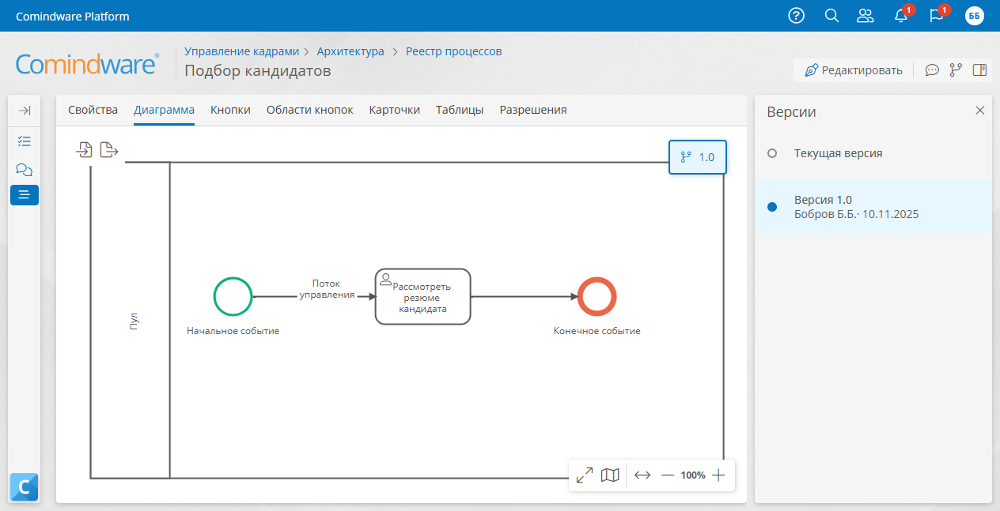
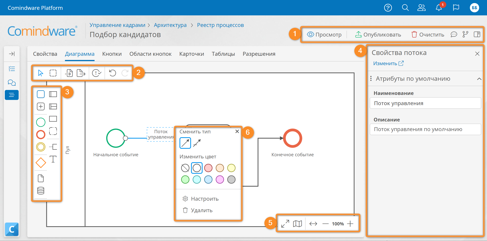

# Диаграмма процесса. Определения, просмотр, редактирование, публикация {: #process_diagram}

## Определения {: .admonition-title #definitions}

- **Диаграмма процесса** служит для моделирования и исполнения бизнес-процесса. Она обладает следующими характеристиками:
    - привязана к [шаблону процесса][process_templates];
    - создаётся при создании шаблона процесса;
    - строится в нотации BPMN 2.0;
    - задаёт последовательность выполнения задач и действий в рамках бизнес-процесса;
    - позволяет моделировать и исполнять бизнес-процесс с назначением задач исполнителям, выполнением сценариев, отправкой внутренних и внешних сообщений, просмотром журнала действий.
--8<-- "process_diagram_token_definition.md"

## Просмотр диаграммы процесса {: #process_diagram_view .pageBreakBefore }

1. Откройте [шаблон процесса][process_templates].
2. Перейдите на вкладку «**Диаграмма**».
3. Отобразится диаграмма процесса в режиме просмотра со следующими кнопками:

    **(1)** Операций с диаграммой

    - **Редактировать** <i class="fa-light fa-pen-nib"></i> — переход к [конструктору диаграммы процесса](#process_diagram_designer).
    - **Свойства** <i class="fa-light fa-sidebar-flip"></i> — отображение панели свойств диаграммы и элементов.
    - **Обсуждение** <i class="fa-light fa-comment-dots"></i> — отображение панели с обсуждением диаграммы.
    - **Версия** <i class="fa-light fa-code-branch"></i> — [управление опубликованными версиями][process_diagram_version_control] диаграммы процесса.

    **(2)** Импорт и экспорт диаграммы

    

    **(3)** Масштабирование диаграммы

    --8<-- "process_diagram_scale_buttons.md"

__

## Редактирование диаграммы процесса {: #process_diagram_designer .pageBreakBefore }

1. Откройте вкладку «**[Диаграммы][process_diagram_view]**» шаблона процесса.
2. При необходимости [выберите версию диаграммы][process_diagram_version_control].
3. Нажмите кнопку «**Редактировать**» <i class="fa-light fa-pen-nib"></i>.
4. Отобразится [конструктор диаграммы процесса](#process_diagram_designer_use).
5. Отредактируйте диаграмму процесса:

    - Перетащите элементы из панели элементов на диаграмму.
    - Настройте элементы:
        - нажмите элемент на диаграмме правкой кнопкой мыши;
        - отобразится меню элемента;
        - настройте и сохраните элемент.
    - Присвойте элементам наглядные названия:
        - дважды нажмите название элемента на диаграмме, нажмите кнопку «**Настроить**» <i class="fa-light fa-gear">‌</i> в меню элемента, или выберите поле «**Наименование**» в панели свойств элемента;
        - введите новое название элемента.
    - Расположите элементы согласно бизнес-логике:
        - чтобы выбрать несколько элементов, обведите их, удерживая нажатой клавишу ++shift++;
        - перетащите выбранные элементы в требуемую позицию на диаграмме.
    - Задайте размеры элементов:
        - наведите указатель мыши на границу элемента;
        - если размер элемента можно изменить, отобразится курсор перетаскивания <i class="fa-light fa-up-down">‌&nbsp;</i>;
        - перетащите границу элемента, чтобы изменить его размер.
    - Удалите ненужные элементы:
        - выберите один или несколько элементов;
        - в меню элемента нажмите кнопку «**Удалить**» <i class="fa-light fa-trash-can">‌</i> или нажмите клавишу ++del++;
        - подтвердите удаление элементов.

6. [Опубликуйте](#process_diagram_publish) диаграмму процесса.

__

### Использование конструктора диаграммы процесса {: #process_diagram_designer_use .pageBreakBefore }

Конструктор диаграммы процесса позволяет редактировать диаграмму путем перетаскивания необходимых элементов и настроить логику исполнения процесса.

В конструкторе диаграммы процесса предусмотрены следующие области.

**(1) Кнопки операций с диаграммой**

- **Просмотр** — переход в режим просмотра диаграммы.
- **Опубликовать** — [публикация](#process_diagram_publish) текущей диаграммы бизнес-процесса.
- **Очистить** — удаление всех элементов с диаграммы процесса. При нажатии этой кнопки отобразится запрос подтверждения.
- **Обсуждение** <i class="fa-light fa-comment-dots"></i> — отображение панели с обсуждением диаграммы.
- **Версия** <i class="fa-light fa-code-branch"></i> — [управление опубликованными версиями][process_diagram_version_control] диаграммы процесса.
- **Свойства** <i class="fa-light fa-sidebar-flip"></i> — отображение панели свойств диаграммы и элементов.

**(2) Панель инструментов**

- **Указатель** <i class="fa-light fa-arrow-pointer"></i> — выбор отдельных элементов.
- **Лассо** <i class="fa-light fa-square-dashed"></i> — выбор нескольких элементов.



- **Проверить** <i class=" fa-light fa-circle-exclamation-check"></i> - [проверка](#process_diagram_verify) диаграммы процесса на ошибки, не позволяющие опубликовать её.
- **Отменить** — отмена последнего действия.
- **Повторить** — возвращение последнего действия.

**(3) Панель элементов** — содержит [элементы][process_diagram_elements], которые можно перетащить на диаграмму процесса.

**(4) Панель свойств элемента** — отображается, когда выбран элемент диаграммы и содержит стандартные свойства элемента.

**(5) Кнопки масштабирования**

--8<-- "process_diagram_scale_buttons.md"

{: #process_diagram_call_element_menu }
**(6) Меню элемента** — содержит команды для работы с выбранным элементом. Отображается при нажатии элемента диаграммы. Набор команд в этом меню зависит от [типа элемента][process_diagram_elements].

__

## Публикация диаграммы процесса {: #process_diagram_publish .pageBreakBefore }

1. Откройте [конструктор диаграммы][process_diagram_designer].
2. Нажмите кнопку «**Опубликовать**».
3. Будет выполнена [проверка диаграммы](#process_diagram_verify).
4. Если проверка прошла успешно, отобразится запрос выбора способа публикации. Если будут обнаружены ошибки, исправьте их, прежде чем публиковать диаграмму.
<!-- This was supported in v4.2 and below. TODO: double-check if this is supported in v4.7 and above
5. Выберите способ публикации диаграммы:

    - **Заменить опубликованную версию** — все экземпляры процесса данной версии будут обновлены (включая завершенные). Например, при публикации диаграммы версии **3.1** она заменит версию **3.0** и будет применена для всех экземпляров процесса версии **3.0**.
    - **Создать новую версию** — по ней будут выполняться новые экземпляры процесса. Например, если уже имеется **10** версий диаграммы, при публикации диаграммы версии **3.1** будет создана версия **11**, которая будет использоваться для новых экземпляров процесса.
    {: .pageBreakBefore }
-->

## Проверка диаграммы процесса и типичные ошибки {: #process_diagram_verify}

Перед публикацией диаграммы автоматически выполняется её проверка.

Для проверки диаграммы вручную, нажмите кнопку «**Проверить**» <i class=" fa-light fa-circle-exclamation-check"></i>.

- После проверки элементы с ошибками выделяются красной рамкой с восклицательным знаком <i class="fa-light fa-triangle-exclamation">‌</i> и под диаграммой отобразится панель ошибок и предупреждений с указанием их количества.
- Для просмотра сообщения об ошибке для элемента нажмите восклицательный знак <i class="fa-light fa-triangle-exclamation">‌</i> рядом с ним.

!!! note "Примечание"

    Опубликовать диаграмму с ошибками невозможно, поэтому после проверки все ошибки необходимо устранить.

__

### Типичные ошибки диаграммы процесса {: #process_diagram_error_messages .pageBreakBefore }

Проверка диаграммы процесса может выявить ошибки, которые не позволяют опубликовать диаграмму. Ниже представлены некоторые типичные ошибки с описанием причин их возникновения и способами устранения.

#### Диаграмма {: #process_diagram_errors }

- **_Диаграмма пуста_**
    - **Причина**: диаграмма не содержит ни одного элемента.
    - **Способ устранения**: добавьте на диаграмму элементы: как минимум начальное и конечное события.

- **_Диаграмма должна содержать хотя бы одно начальное событие_**
    - **Причина**: на диаграмме отсутствует начальное событие.
    - **Способ устранения**: добавьте на диаграмму начальное событие.

#### Начальное событие {: #process_diagram_errors_event_start }

- **_У этого элемента должен быть один исходящий поток управления_**
    - **Причина**: у начального события отсутствует исходящий поток или несколько исходящих потоков.
    - **Способ устранения**: подсоедините только один исходящий поток к начальному событию.

#### Простое начальное событие {: #process_diagram_errors_event_start_none }

- **_На диаграмме не может быть более одного простого (нетипизированного) начального события_**
    - **Причина**: на диаграмме имеется несколько простых начальных событий.
    - **Способ устранения**: удалите все простые начальные события кроме одного либо измените типы начальных событий.

#### Конечное событие {: #process_diagram_errors_event_end }

- **_Необходим хотя бы один входящий поток управления_**
    - **Причина**: у конечного события отсутствует входящий поток.
    - **Способ устранения**: подсоедините входящий поток к конечному событию.

#### Пользовательская задача {: #process_diagram_errors_user_task }

- **_Необходим хотя бы один входящий поток управления_**
    - **Причина**: у пользовательской задачи отсутствует входящий поток.
    - **Способ устранения**: подсоедините входящий поток к пользовательской задаче.

- **_У этого элемента должен быть один исходящий поток управления_**
    - **Причина**: у пользовательской задачи отсутствует исходящий поток или несколько исходящих потоков.
    - **Способ устранения**: подсоедините только один исходящий поток к пользовательской задаче.

- **_У этого элемента нет потоков управления или к нему невозможно перейти из начального события_**
    - **Причина**: у пользовательской задачи отсутствует входящий поток или ни один входящий поток не соединён с начальным событием.
    - **Способ устранения**: подсоедините к пользовательской задаче входящий поток, соединённый с начальным событием напрямую или через другие элементы.

- **_Пользовательская задача должна иметь минимум одного ответственного_**
    - **Причина**: в свойствах пользовательской задачи не указан исполнитель данной задачи.
    - **Способ устранения**: в свойствах пользовательской задачи выберите исполнителей на вкладке «Дополнительные».

#### Развилка «или/или» {: #process_diagram_errors_gateway_exclusive .pageBreakBefore }

- **_Необходимо указать исходящий поток управления «иначе»_**
    - **Причина**: в свойствах развилки «или/или» не указан поток «иначе».
    - **Способ устранения**: в свойствах развилки укажите один поток «иначе» на вкладке «Дополнительные» в соответствии с логикой процесса.

- **_У этого элемента нет потоков управления или к нему невозможно перейти из начального события_**
    - **Причина**: у развилки «или/или» отсутствует входящий поток или ни один входящий поток не соединён с начальным событием.
    - **Способ устранения**: подсоедините к развилке «или/или» входящий поток, соединённый с начальным событием напрямую или через другие элементы.

- **_Необходим хотя бы один входящий поток_**
    - **Причина**: у развилки «или/или» отсутствует входящий поток.
    - **Способ устранения**: подсоедините входящий поток к развилке «или/или».

- **_Недопустимое определение потока управления_**
    - **Причина**: у развилки «или/или» несколько исходящих потоков, но не указан поток «иначе» или не задано условие для одного из исходящих потоков.
    - **Способ устранения**: в свойствах развилки «или/или» на вкладке «Дополнительные» укажите поток «иначе» и настройте условия для всех остальных потоков.

#### Промежуточное событие-таймер {: #process_diagram_errors_event_intermediate_timer .pageBreakBefore }

- **_В событии-таймере не настроен таймер_**
    - **Причина**: в свойствах промежуточного события-таймера не задан интервал.
    - **Способ устранения**: в свойствах промежуточного события-таймера настройте интервал таймера на вкладке «Дополнительные».

#### Промежуточное событие {: #process_diagram_errors_event_intermediate }

- **_Необходим хотя бы один входящий поток управления_**
    - **Причина**: у промежуточного события отсутствует входящий поток.
    - **Способ устранения**: добавьте входящий поток промежуточному событию.

- **_У этого элемента должен быть один исходящий поток управления_**
    - **Причина**: у промежуточного события отсутствует исходящий поток или несколько исходящих потоков.
    - **Способ устранения**: добавьте исходящий поток промежуточному событию.

#### Начальное событие-таймер {: #process_diagram_errors_event_start_timer }

- **_В начальном событии не настроен таймер_**
    - **Причина**: в свойствах начального события-таймера не настроен таймер.
    - **Способ устранения**: в свойствах начального события-таймера настройте таймер на вкладке «Дополнительные».

#### Поток управления {: #process_diagram_errors_sequence_flow .pageBreakBefore }

- **_Поток управления не соединен с конечной точкой_**
    - **Причина**: поток управления не соединен с целевым элементом.
    - **Способ устранения**: соедините поток управления с целевым элементом диаграммы.

--8<-- "related_topics_heading.md"

- [Элементы диаграммы процесса][process_diagram_elements]
- [Стартовая форма и форма пользовательской задачи][process_diagram_forms]
- [Использование диаграммы экземпляра процесса][process_diagram_view_instance]
- [Управление версиями диаграммы процесса][process_diagram_version_control]
- [Диаграммы в приложении][diagrams]
- [Шаблон процесса][process_templates]
- [Импорт и экспорт диаграмм и регламентов][architect_import_export]


