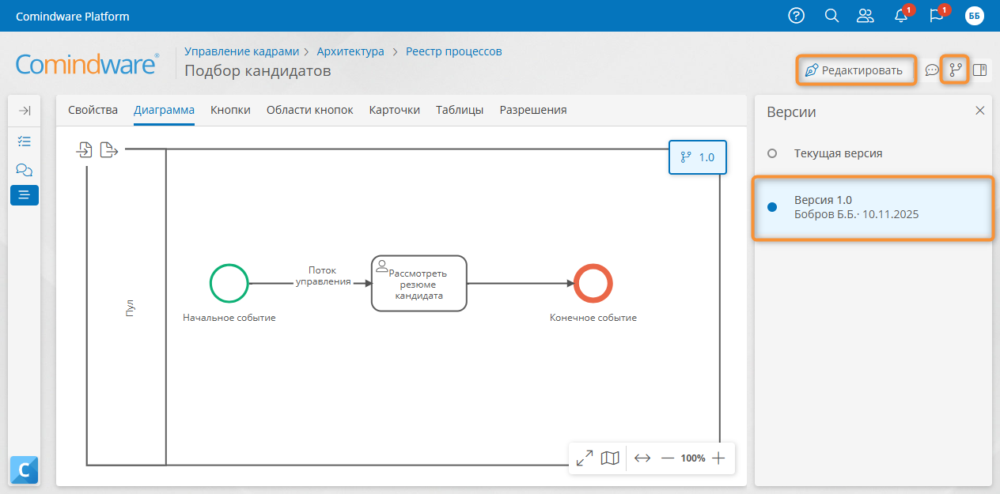
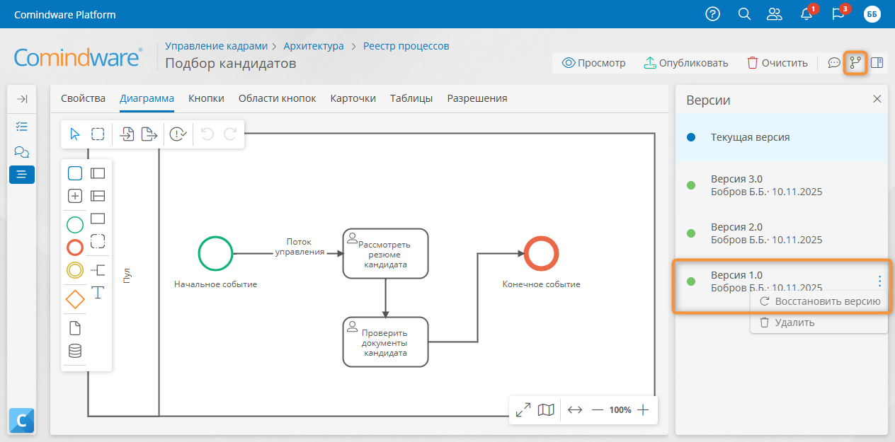

# Управление версиями диаграммы процесса {: #process_diagram_version_control}

## Введение

**{{ productName }}** позволяет создавать, редактировать, публиковать и удалять версии диаграммы процесса.

Каждый экземпляр процесса выполняется по определённой версии диаграммы процесса, поэтому разные экземпляры могут выполняться по разным версиям диаграммы с различающейся логикой.

Здесь представлена информация о том, как посмотреть список версий диаграммы и экземпляров процесса, запущенных по ним, как выбрать версию для просмотра и редактирования, как восстановить и удалить версию диаграммы.

- Любую версию диаграммы можно просмотреть, отредактировать и опубликовать как новую.
- При редактировании диаграммы создаётся её черновая версия до момента публикации.
- После публикации новой версии диаграммы процесса:
    - вновь созданные экземпляры процесса выполняются по последней опубликованной версии;
    - ранее опубликованные версии диаграммы сохраняются вместе с запущенными по ним экземплярами процесса.

## Просмотр списка версий диаграммы  {: #diagram_version_list_view .pageBreakBefore }

Просмотреть список версий диаграммы процесса можно двумя способами:

- В **[списке диаграмм][diagram_list]** нажмите кнопку «**Показать все версии**» в столбце «**Версии**» рядом с количеством версий. Отобразится список версий диаграммы со следующими сведениями:

  - номер версии диаграммы;
  - дата публикации версии;
  - общее количество экземпляров процесса, запущенных по данной версии диаграммы;
  - количество экземпляров процесса в статусе «**Активен**».

    __

- На **[странице «**Диаграмма**»][process_diagram_view]** шаблона процесса или в [конструкторе диаграммы][process_diagram_designer] нажмите кнопку «**Версия**» <i class="fa-light fa-code-branch"></i>. Отобразится список версий диаграммы со следующими сведениями:
{: #process_diagram_version_list }

    - номер версии диаграммы;
    - создатель диаграммы;
    - дата публикации версии.

    __

## Выбор версии диаграммы для просмотра и редактирования {: .pageBreakBefore }

1. Откройте вкладку «**Диаграмма**» шаблона процесса.
2. Откройте [список версий](#process_diagram_version_list) диаграммы.
3. Выберите требуемую версию.
4. Выбранная версия будет открыта для просмотра.
5. При необходимости нажмите кнопку «**Редактировать**» <i class="fa-light fa-pen-nib"></i>, чтобы [изменить][process_diagram_designer] и опубликовать новую версию диаграммы на основе выбранной.

!!! note "Примечание"

    - При [редактировании][process_diagram_designer] выбранной версии будет создан её черновик с названием «**Текущая версия**».
    - До тех пор, пока **текущая версия** диаграммы не будет [опубликована][process_diagram_publish], она будет открываться для редактирования независимо от того, какая версия выбрана в списке.

__

## Восстановление версии диаграммы процесса

1. Откройте диаграмму процесса для редактирования.
2. Откройте список версий диаграммы.
3. Нажмите кнопку с «**Действия**» <i class="fa-solid fa-ellipsis-vertical"></i> рядом с названием версии, которую требуется восстановить.
4. Выберите пункт «**Восстановить версию**».
5. В отобразившемся запросе выберите, следует ли создать новую версию диаграммы или заменить текущую.
6. Выбранная версия будет восстановлена для редактирования. Неопубликованные изменения диаграммы будут утрачены. Восстановленная версия станет текущей до тех пор, пока не будет опубликована.

__

## Удаление версий диаграммы процесса {: .pageBreakBefore }

1. Откройте диаграмму процесса для редактирования.
2. Откройте список версий диаграммы.
3. Нажмите кнопку с «**Действия**» <i class="fa-solid fa-ellipsis-vertical"></i> рядом с названием версии, которую требуется удалить.
4. Выберите пункт «**Удалить**».
5. Подтвердите удаление.

__

!!! Note "Примечание"

    Удалить можно только версию диаграммы, по которой нет запущенных экземпляров процесса. В противном случае отобразится сообщение о том, что нельзя удалить версию диаграммы, по которой выполняется экземпляр процесса:

    __

--8<-- "related_topics_heading.md"

- _[Публикация диаграммы процесса][process_diagram_publish]_
- _[Просмотр диаграммы процесса][process_diagram_view]_
- _[Конструктор диаграммы процесса][process_diagram_designer]_
- _[Использование диаграммы экземпляра процесса][process_diagram_view_instance]_


