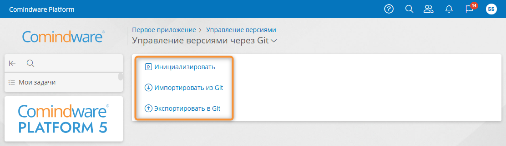
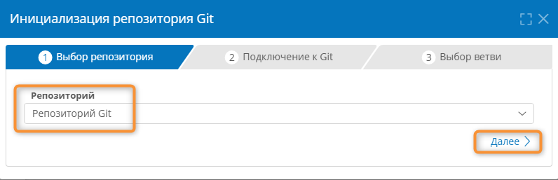
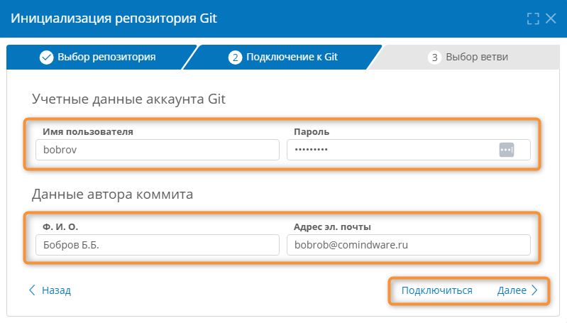
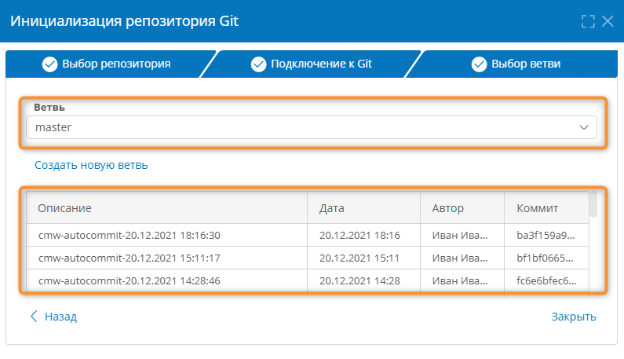
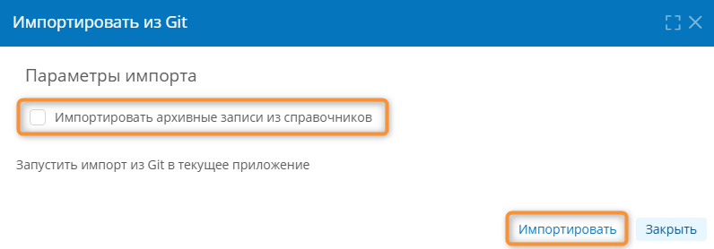

# Экспорт и импорт версий приложения с помощью {{ gitVariants }} {: #version_control_git }



## Введение {: #version_control_git_intro }

В **{{ productName }}** предусмотрены экспорт и импорт версий приложений посредством системы контроля версий Git (например, {{ gitVariants }}).

Для работы этой функции требуется настроить подключение к репозиторию. См. статью *«[Управление версиями с помомщью {{ gitVariants }}. Настройка подключения][git_connection]»*.

!!! note "Примечание"

      По умолчанию в репозиторий экспортируется только конфигурация приложения, записи сохраняются только для шаблонов, у которых установлен флажок «**Переносить данные при трансфере**» на вкладке [«**Свойства**»][record_template_properties].

!!! question "Определения"

    - **Ветка** — отдельная линия версий приложения в репозитории Git. Ветви позволяют упорядочить версии приложения. Например, можно создать две ветки: одну для тестовых версий приложения, а другую — для рабочих.
    - **Коммит** — версия приложения, хранящаяся в ветке репозитория Git.
    - Процесс управления версиями приложения также называется трансфером.

## Переход к странице управления версиями через Git {: #version_control_git_navigate .pageBreakBefore }

1. На странице **«[Администрирование][apps]»** приложения выберите пункт «**Управление версиями**» <i class="fa-light fa-code-branch"></i>.
2. Если отображается страница ручного управления версиями, нажмите заголовок «**Ручное управление версиями**» и в раскрывающемся меню выберите пункт «**Управление версиями через Git**».

      __

3. Отобразится страница «**Управление версиями через Git**».
4. Выполните необходимые операции:

    - **Инициализация** — [выбор репозитория](#version_control_git_initialization), [настройка аккаунта](#настройка-аккаунта-git) для создания коммитов и [выбор или создание ветки](#использование-ветвей-в-репозитории-git) в репозитории для управления версиями приложения.
    - **Импортировать из Git** — [импорт](#импорт-приложения-из-репозитория-git) последней версии приложения из ветки, выбранной при [инициализации](#version_control_git_initialization) репозитория Git.
    - **Экспортировать в Git** — [экспорт](#экспорт-приложения-в-репозиторий-git) текущей версии приложения ветка, выбранную при   [инициализации](#version_control_git_initialization)   репозитория Git.

    __

## Инициализация репозитория {: #version_control_git_initialization .pageBreakBefore }

Чтобы использовать функцию управления версиями через Git, сначала инициализируйте репозиторий.

Параметры, настроенные при инициализации репозитория, будут использоваться по умолчанию при [экспорте](#экспорт-приложения-в-репозиторий-git) и [импорте](#импорт-приложения-из-репозитория-git) версий приложения.

Перед этим необходимо [настроить подключение к репозиторию][git_connection].

1. Нажмите кнопку «**Инициализация**» на странице «**Управление версиями через Git**».
2. В окне «**Инициализация репозитория**» выберите репозиторий Git — одно из настроенных [подключений к Git][git_connection].
3. Перейдите к шагу «**Подключение к Git**», нажав кнопку «**Далее**».

    __

5. В окне «**Настройка аккаунта Git**» заполните перечисленные ниже поля:

    - **Имя пользователя** — укажите логин для подключения к репозиторию.
    - **Пароль** — укажите пароль для подключения к репозиторию.
    - **Ф. И. О** — укажите имя, которое будет отображаться в репозитории в качестве имени автора коммитов.
    - **Адрес эл.&nbsp;почты** — укажите адрес электронной почты, который храниться в репозитории в качестве адреса автора коммитов.

    !!! question "Автор коммитов"

        От имени настроенного пользователя будут создаваться коммиты (версии приложения) в репозитории.

6. Проверьте подключение к репозиторию, нажав кнопку «**Подключиться**».

    __

7. Должно отобразиться сообщение «**Соединение установлено**».

    __

8. Перейдите к шагу «**Выбор ветви**», нажав кнопку «**Далее**».
9. Выберите ветку репозитория в раскрывающемся списке «**Ветка**». Выбранная ветка будет использоваться для импорта и экспорта версий приложения
10. Отобразится список коммитов (версий приложения) в выбранной ветке со следующими сведениями:

    - **Описание** — наглядное описание версии приложения, хранящейся в репозитории.
    - **Дата** — дата сохранения версии приложения в репозитории.
    - **Автор** — пользователь, под именем которого была сохранена версия приложения.
    - **Коммит** — уникальный идентификатор версии приложения в репозитории.

    __

11. При необходимости нажмите кнопку «**Создать новую ветвь**».
    
    В окне «**Новая ветвь в репозитории Git**»

    - введите **название новой ветви** — оно может содержать латинские буквы (`A–Z`, `a–z`),  цифры (`0–9`) дефисы и символы подчёркивания (`-`, `_`);
    - нажмите кнопку «**Сохранить**».  

    __

    Созданную ветку можно будет выбрать для импорта и экспорта приложений.

12. Нажмите кнопку «**Назад**», если требуется вернуться к предыдущему шагу инициализации репозитория.

## Экспорт приложения в репозиторий Git {: #version_control_git_export .pageBreakBefore }

При экспорте в репозиторий Git в репозитории будет создан коммит с текущей версией приложения из **{{ productName }}** в [ветке, заданной при инициализации репозитория](#version_control_git_initialization).

!!! warning "Внимание!"

    Перед экспортом приложения подготовьте его, как указано в параграфе *«[Подготовка приложения к экспорту][version_control_app_prepare]».*

1. Перейдите на страницу «[**Управление версиями через Git**](#version_control_git_navigate)».
2. Отобразится окно «**Экспортировать в Git**».
3. Нажмите кнопку «**Экспортировать**».

    __

4. Будет экспортирована **текущая версия приложения** в [ветку, заданную при инициализации репозитория](#version_control_git_initialization).
5. После успешного экспорта версии приложения в репозиторий должно отобразиться сообщение «**Экспорт в Git выполнен**».

    __

6. Если экспорт не удаётся выполнить:

    - отобразится список найденных ошибок;
    - устраните обнаруженные проблемы в приложении;
    - экспортируйте приложение заново.

    __

## Импорт приложения из репозитория Git {: #version_control_git_import .pageBreakBefore }

При импорте из репозитория Git будет импортирован последний коммит с версией приложения из [ветки, заданной при инициализации репозитория](#version_control_git_initialization).



1. Перейдите на страницу «[**Управление версиями через Git**](#version_control_git_navigate)».
2. Отобразится окно «**Импортировать из Git**».
3. При необходимости устанофите флажок «**Импортировать архивные записи из справочников**».
4. Нажмите кнопку «**Выполнить**».

    __

5. После импорта версии приложения в репозиторий должно отобразиться сообщение «**Импорт выполнен**».

    __

6. Если импорт версии приложения не удаётся выполнить:

    - отобразится список найденных ошибок;
    - устраните обнаруженные проблемы и конфликты в исходном и целевом приложениях;
    - экспортируйте исходное приложение заново;
    - повторите импорт.

    __

--8<-- "related_topics_heading.md"

- _[Управление версиями приложения][version_control]_
- _[Экспорт и импорт версий приложения вручную][version_control_manual]_
- _[Экспорт и импорт версий приложения с помощью Excel][version_control_excel]_


