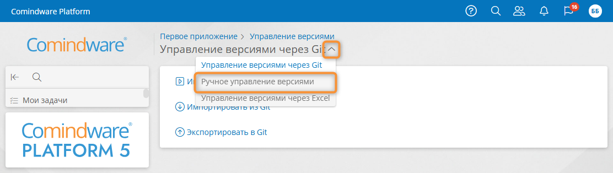
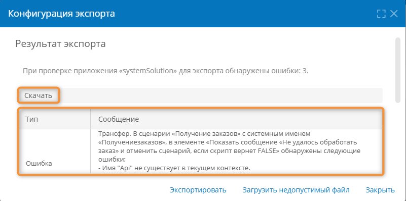
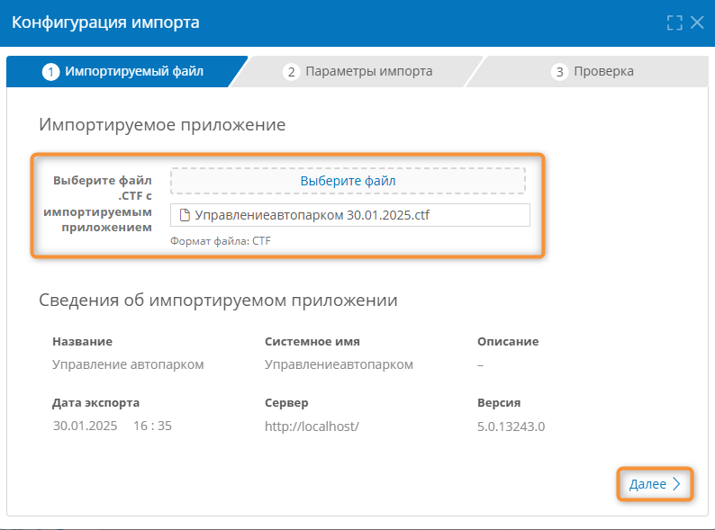
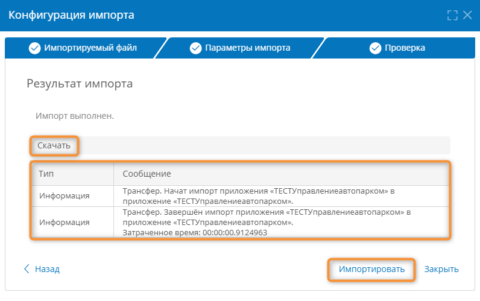

# Экспорт и импорт версий приложения вручную {: #version_control_manual }



## Введение {: #version_control_manual_intro }

В **{{ productName }}** предусмотрены импорт и экспорт версий приложения посредством файлов с расширением `CTF`.

!!! Note "Примечание"
      В файле `CTF` по умолчанию сохраняется только конфигурация приложения, записи сохраняются только для шаблонов, у которых установлен флажок «**Переносить данные при трансфере**» на вкладке [«**Свойства**»][record_template_properties].

## Переход к ручному управлению версиями {: #version_control_manual_navigate }

1. В разделе **«[Администрирование][apps]»** приложения выберите пункт «**Управление версиями**».
2. Нажмите заголовок страницы «**Управление версиями через Git**» и в раскрывающемся меню выберите пункт «**Ручное управление версиями**».

    __

3. Отобразится раздел «**Ручное управление версиями**» с двумя вкладками:

    - **[Экспорт](#version_control_manual_export)** — настройка аккаунта для подключения к Git и выбор или создание ветви в репозитории для хранения версий приложения.
    - **[Импорт](#version_control_manual_import)** — импорт версии приложения из репозитория Git.

    __

## Экспорт версии приложения {: #version_control_manual_export .pageBreakBefore }

!!! warning "Внимание!"

    Перед экспортом приложения подготовьте его, как указано в параграфе *«[Подготовка приложения к экспорту][version_control_app_prepare]».*

1. На вкладке «**Экспорт**» нажмите кнопку «**Экспортировать**».
2. Если при экспорте не будет выявлено ошибок, браузер скачает файл с системным именем приложения и расширением `.CTF` вида: `ApplicationSystemName.ctf`.

    - Импортируйте этот файл в целевое приложение.

3. Если будут обнаружены ошибки:

    - отобразится список найденных ошибок;
    - скачайте и изучите журнал экспорта (`transfer_export_YYYY-MM-DD.log`), нажав кнопку «**Скачать**»;
    - при необходимости скачайте повреждённый файл экспорта, нажав кнопку «**Загрузить недопустимый файл**»;
    - устраните ошибки в экспортируемом приложении;
    - повторите экспорт.

__

## Импорт версии приложения {: #version_control_manual_import }



1. На вкладке «**Импорт**» нажмите кнопку «**Импортировать**»
2. Отобразится окно «**Конфигурация импорта**».
3. На шаге «**Импортируемый файл**» загрузите файл `CTF` в поле «**Выберите файл .CTF с импортируемым приложением**».
4. Отобразятся **сведения об импортируемом приложении** и параметры импорта:

    - **Название** — наименование приложения.
    - **Системное имя** — уникальное имя приложения.
    - **Описание** — комментарий относительно назначения приложения.
    - **Дата экспорта** — дата, когда приложение было экспортировано в файл CTF.
    - **Сервер** — адрес сервера, с которого было экспортировано приложение.
    - **Версия** — номер экспортированной версии приложения.

    __

5. Перейдите к шаку «**Параметры импорта**», нажав кнопку «**Далее**».
6. Настройте параметры импорта:

    - **Импортировать архивные записи из справочников** — установите этот флажок, чтобы добавить в шаблоны (для которых установлен флажок «**Является справочником**») записи, которые были помещены в архив в исходном приложении.
    - **Опубликовать диаграммы процессов после импорта** — установите этот флажок, чтобы импортированные диаграммы процессов были опубликованы после импорта.
    - **Состояния компонентов приложения после импорта** — выберите состояние, в которое следует привести компоненты приложения после импорта:
        - **Импортировать состояния** — будут активированы и приостановлены компоненты приложения, которые были соответственно активны и приостановлены в импортируемой версии;
        - **Оставить текущие состояния** — останутся активны те компоненты, которые были активны в текущей версии приложения перед импортом;
        - **Активировать все компоненты** — будут активированы все компоненты целевого приложения независимо от их статуса в целевом и импортируемом приложениях;
        - **Приостановить все компоненты** — будут приостановлены все компоненты целевого приложения.

    !!! question "Определение"

        Компоненты приложения — это **задачи** и **элементы процессов**, **интеграции**, **подключения** и **прочие сервисы** приложения. Список и статус компонентов представлены в разделе «**Активность компонентов**» на странице администрирования приложения.

    __

7. Перейдите к шагу «**Проверка**», нажав кнопку «**Далее**».
8. Нажмите кнопку «**Импортировать**».
9. Отобразится результат импорта:

    __

10. Если импорт не удаётся выполнить:

    - скачайте и изучите журнал импорта (`transfer_import_YYYY-MM-DD.log`), нажав кнопку «**Скачать**»;
    - устраните обнаруженные проблемы и конфликты в исходном и целевом приложениях;
    - экспортируйте исходное приложение заново
    - выберите исправленный файл CTF на шаге «**Импортируемый файл**»;
    - повторите импорт.

--8<-- "related_topics_heading.md"

- _[Управление версиями приложения][version_control]_
- _[Экспорт и импорт версий приложения с помощью Git][version_control_git]_
- _[Экспорт и импорт версий приложения с помощью Excel][version_control_excel]_


