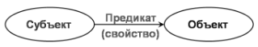

# Учебник по N3 {: #n3_tutorial_original }

## О курсе

Основная цель курса — научить пользователя ориентироваться в написанных выражениях и самостоятельно писать запросы средней сложности на языке **N3**. В уроках освещены базовые принципы работы триплетов, интерпретатора, приведены реальные примеры использования. В конце каждого урока представлены задания для самостоятельной работы.

!!! warning "Внимание!"

    Так как это вводный курс, некоторые понятия в нём упрощены, чтобы облегчить понимание работы RDF и Notation 3, без ущерба для точности представленной информации.

**Предусловие:** хорошее понимание принципов работы и настройки **{{ productName }}**.

## Типы синтаксиса запросов в {{ productName }}

В **{{ productName }}** предусмотрено два типа синтаксиса запросов:

1. **Формулы** — фирменный язык выражений **{{ companyName }}**, похожий на формулы Excel. Является простым для восприятия и представляет собой надстройку над **N3**. Для базовой настройки системы его зачастую достаточно. Типовые примеры использования формул:

    - выборка данных из связанных шаблонов записей;
    - подсчёт количества объектов;
    - простые математические операции типа умножения и деления;
    - конкатенация и преобразования строк.

    Полный перечень функций, используемых в **формулах**, представлен в [справочнике функций][formula_guide].

2. **Notation 3** (**N3**, **триплеты**) — более сложный в прочтении и написании, но более функциональный и основополагающий язык. Стандарт этого языка определён международным консорциумом W3C.

    Здесь мы рассмотрим базовые принципы использования языка **N3**.

## Хранение данных

**{{ productName }}** использует графовую базу данных, основанную на модели RDF.

Общая идея графовой модели заключается в том, что любой объект материального и нематериального мира имеет свойства, а эти свойства содержат определённые значения. Следовательно, любую сущность можно описать с помощью простых выражений, которые называют свойствами и их значениями.

Описание сущностей с помощью графовой модели строится по определённым правилам.

Основным синтаксическим элементом языка N3 является **триплет**.

**Триплет** состоит из трёх связанных сущностей: **Субъект — предикат — объект**.

Эти термины необходимо запомнить, так как они часто используются в курсе.

### Пример триплета

Триплет можно соотнести с простым предложением вида: _Подлежащее — Сказуемое — Дополнение_.

Например, утверждение _"Книга написана Пушкиным"_ в RDF-терминологии можно представить следующим образом:

- **субъект** — Книга
- **предикат** — написана
- **объект** — Пушкин

Теперь построим сам граф. Субъект и объект представлены как узлы. В нашем примере это книга и Пушкин. Свойство, указывающее, кем написана книга, представлено соединительной линией со стрелкой от субъекта к объекту.



### Структура данных в {{ productName }}

По такому же принципу можно описать структуру данных в шаблоне записи:

- **Субъект** — запись в шаблоне записи.
- **Предикат** — атрибут записи.
- **Объект** — значение атрибута.

Например, имеется шаблон записи «Книги». В шаблоне имеются атрибуты _«Название»_ и _«Автор»_. В шаблоне имеются две записи.

Данные этих записей хранятся в триплетах. В упрощённом виде эти триплеты можно представить следующим образом:

``` turtle
    "id_8036" "Название "Война и мир".
    "id_8036" "Автор" "Толстой Л.Н.".
    "id_8037" "Название" "Медный всадник".
    "id_8037" "Автор" "Пушкин А.С.".
```

Пример записей в шаблоне _«Книги»_:

| ID   | Название       | Автор        |
| ---- | -------------- | ------------ |
| 8036 | Война и мир    | Толстой Л.Н. |
| 8037 | Медный всадник | Пушкин А.С.  |

Аналогичным образом хранится вся метаинформация (описания шаблонов записи, форм, объектов, типов и т. д.), а также атрибуты окружения (текущий пользователь, текущее время, текущий контекст и т. д.).

Такая структура обеспечивает единообразие и простоту доступа к данным через запросы к базе.

Ключевые преимущества использования триплетов для описания и хранения данных:

1. **Простота понимания модели данных.** Создание шаблонов записи и связей между ними быстро усваивается даже неподготовленным пользователем.
2. **Мгновенное добавление новых шаблонов записи и атрибутов,** которые сразу доступны к работе.
3. **Неограниченная ширина и глубина связей между сущностями.** В **{{ productName }}** нет ограничений по количеству атрибутов и связей между ними.
4. **Простота и неограниченность навигации по связям.** Переход из одного справочника в другой через ссылочное поле осуществляется единообразно.

Для лучшего понимания принципов описания и хранения данных без использования жёсткой структуры (такой, как таблицы в SQL), ознакомьтесь со статьёй _[«Онтология»][n3_guide_ontology]_.

!!! question "Внутренняя логика обработки N3 в {{ productName }}"

    К примеру, при создании вычисляемого атрибута используется формула.

    Что происходит под «капотом» после написания формулы?
    
    Компилятор переводит её в запрос N3, который уже однозначно понятен системе.

    Можно сделать вывод: если есть желание облегчить работу компилятора, пишите запрос сразу на N3.

## Цели использования языка N3

- **Продвинутое использование {{ productName }}.**
- **Доступ ко всем созданным и системным атрибутам.** В интерфейсе **{{ productName }}** представлены не все системные атрибуты, а только те, которые используются чаще всего в типовых сценариях. N3 предоставляет доступ ко большему количеству атрибутов и сущностей, чем формулы.
- **Расширенные возможности работы с данными.** Дополнительные математические функции, функции для работы со списками, приведения данных к одному типу, расчётов времени и т.д. См. _[руководство по написанию выражений на N3][n3_guide_cat]_.

## Урок 1

### Чему научимся

- Триплеты, синтаксис, переменные, параметры `?item` и `?value`.

### Триплеты

Тело запроса состоит из триплетов вида `субъект – предикат – объект`, которые мы рассмотрели во введении.

**Пример запроса:**

``` turtle
{
    ?item ?company ?customer.
    ?customer ?resolutionTimeAttribute ?resolutionTime.
    ?resolutionTime ?requestTypeAttribute ?value.
}
```

С помощью такого запроса мы указываем, какая строка из БД необходима, чтобы получить требуемые данные из графа.

Например, в контексте записи заявки:

- Первым триплетом находим ссылку на клиента.
- Вторым триплетом определяем время ответа на заявку.
- Третьим триплетом указываем тип времени ответа.

В синтаксисе языка N3 существуют определённые правила, без соблюдения которых запрос не будет сохранён и выполнен корректно.

Вот основные основные правила:

1. Каждый триплет начинается с новой строки.
2. Объявление переменных производится с префиксом `?` (например, `?variable`).
3. Весь запрос помещается в фигурные скобки (`{}`).
4. В конце каждого триплета ставится точка (`.`).
5. Интерпретатор учитывает регистр символов, то есть `?variable` и `?Variable` — это две разных переменных.

### Переменные

При формировании запроса используются переменные.

Переменная — это именованное хранилище данных, обозначаемое в N3 символом `?`.

В приведённом примере используются переменные `?customer` и `?resolutionTime`, которые содержат ссылки на шаблоны записи.

Имена переменных следует задавать так, чтобы они отражалиь суть хранимых данных.

!!! note "Примечание"

    В приведённом выше примере переменными являются все объекты из триплета после символа «?». Это сделано для наглядности.

    В следующих уроках мы научимся определять предикат через переменную.

### Входные и выходные параметры `?item` и `?value`

Наш пример начинается и заканчивается использованием двух переменных: `?item` и `?value`. Это особые зарезервированные системные переменные:

- `?item` — входной параметр запроса. Его значение определяется контекстом, в котором выполняется запрос. Например, при вычислении значения атрибута `?item` содержит ID текущей записи. Подробные сведения см. в [Справочнике по языку N3][n3_guide]/
- `?value` — выходной параметр. В него помещается результат запроса. Обратите внимание: тип данных, помещённых в `?value`, должен совпадать с типом данных атрибута, в который записывается результат, например, логическим или числовым.

**Итого:** мы разобрались с телом запроса, основными правилами синтаксиса,

### Задачи

Модель данных: у нас имеется шаблоны записи _«Договоры»_, _«Контрагенты»_ и _«Статусы контрагента»_. У договора есть ссылка на контрагента, а у контрагента есть ссылочное поле на статус.

Мы находимся в контексте договоров. Нам нужно вывести статус контрагента.

Предикаты:

`?agentAttribute` - предикат контрагента

`?statusAttribute` - предикат ссылки на статус у контрагента

Требуется написать запрос и получить значение статуса контрагента.

Разберём общую модель написания запроса на N3.

В общем виде запрос состоит из следующих компонентов:

- Подключаемые библиотеки пространств имен — префиксы
- Объявление переменных
- Триплеты

### Итог

В итоге, мы научились использовать библиотеку `object` и входящую в неё функцию записи URI предиката в переменную.

Познакомились со структурой триплетов.

Разобрали входные и выходные параметры запроса (`item` и `value`)

Познакомились с основными правилами синтаксиса запроса.

### Задачи

Создаём модель данных:

Три шаблона записи. Первый шаблон имеет числовой атрибут _«Calculation»_ и атрибут ссылку на второй шаблон. Второй ШЗ имеет ссылку на третий. В третьем ШЗ создаем атрибут _«Number»_. У шаблонов создаём по одной записи и устанавливаем ссылочные поля. В атрибут _«Number»_ пишем число.

Задача: присвоить атрибуту _Calculation_ значение атрибута _Number_.

# Урок 2

## Чему научимся

Библиотеки пространств имен, присвоение переменных, применение системных атрибутов, built-in предикаты, конструкция from.

Итак, начнем разбор первого полноценного запроса.  Для  ее анализа нужно знать модель данных, в которой мы его пишем.

Пример:

Напишем запрос, который пройдет по ссылке в IssueType, возьмет значение текстового атрибута Title и выведет его.

**Модель данных:**

Два шаблона записи – _Issue_ и _Type_.

В ШЗ Issue имеется ссылка на ШЗ _Type_. Имя: `IssueType`.

В ШЗ Issue есть текстовый атрибут `TitleCalc`. В нем пишем текущий запрос.

В ШЗ Type создан текстовой атрибут `Title`.

``` turtle
@prefix object: <http://comindware.com/ontology/object#>
{
    ("Issue" "IssueTYpe") object:findProperty ?issueTypeAttribute.
    ("Type" "Title") object:findProperty ?titleAttribute.

    ?item issueTypeAttribute. ?issueTypeValue.
    ?issueTypeValue ?titleAttribute ?value
}
```

Соответствующая формула выглядела бы так:

``` sql
$IssueTypeRef->Title
```

Пример формулы приведён лишь для наглядности. В дальнейшем не следует пытаться представлять выражения N3 в виде формул, так как это может сбить с верного понимания.

Начнем разбор построчно:

Первая строка — это библиотека пространства имен — префикс.

``` turtle
@prefix object: <http://comindware.com/ontology/object#>.
```

### Библиотеки пространств имён

**Библиотеки (префиксы)** — это подключаемые модули (области), где лежат знания об объектах, функциях и разных правилах. С их помощью мы можем обращаться с системным и прикладным атрибутам и брать их значения. Также, при объявлении библиотек может появляться доступ к различным функциям по работе с датами, списками, числами и т.д. См. [справочник по языку N3][n3_guide].

С помощью этой библиотеки у нас появляется доступ к функции `object:findProperty` из строки 3 и 4 нашего примера. Данная функция позволяет брать URI атрибутов, записывать в переменные и использовать их внутри запроса.

Так как модель описания данных — RDF, для неё определены некоторые стандарты. Так, один из стандартов — хранение в виде URI.

URI — последовательность символов, идентифицирующая абстрактный или физический ресурс. URI выглядит следующим образом:

``` html
https://www.w3.org/1999/02/22-rdf-syntax-ns#type
```

По сути каждая сущность из триплета является либо URI, либо литералом. При использовании полной нотации RDF выражений, происходит появление в записи длинных строк вида:

_[RDF-триплет](img/n3_tutorial_rdf_triple.png)_

Префикс `http://comindware.com/ontology/object#` и функция `object:findProperty` являются базовыми и в дальнейшем будет часто использоваться в написании запросов. Она содержит в себе функцию поиска id атрибута по его системному имени.

Перейдём к строкам 3 и 4.

В предыдущем уроке мы не касались темы предикатов в триплете. Они были даны изначально. Но по сути каждая часть триплета находится в переменных, в том числе и искомые атрибуты. Чтобы их определить и записать в переменную пишем выражение вида:

``` turtle
("TemplateSystemName" "AttributeSystemName") object:findProperty ?variable.
```

Эта функция подходит только для определения прикладных атрибутов (созданных вручную). Системные атрибуты лежат в других библиотеках.

Теперь, вместо длинных URI предикатов, мы можем использовать переменные.

Берем атрибуты нужных предикатов для запроса и присваиваем их в переменные `IssueTypeAttribute` и `titleAttribute`.

Где, имя переменной определяем сами.

### Триплет

С первыми тремя строчками разобрались. Начинаем писать сам триплет.

``` turtle
  1             2             3
?item ?IssueTypeAttribute ?IssueType.
```

1. Каждый запрос имеет входной параметр `?item`. Он вычисляется по умолчанию и служит для определения текущей записи, к которой относится атрибут.
2. Указываем предикат. Мы его уже определили выше.
3. Создаем переменную, в которую будет помещено значение. Имя этой переменной придумываем сами. Интерпретатор видит, какой части не хватает для триплета и автоматически присваивает в него некое значение.

Данной строкой мы добились того, что смогли определить ссылку, чье значение требуется для дальнейшего нахождения поля `title`.

Важное правило работы интерпретатора:

Если результат триплета будет `false` — а именно он не найдет такого предиката, либо вместо объекта мы впишем уже определенное значение и интерпретатор не найдет такую строку в базе, тогда он останавливается и вниз дальше не идет.

Разбираем строку 7.

``` turtle
?IssueType ?TitleAttribute ?value.
```

Берем переменную, которую определили выше. Так как, мы переместились по ссылке и находимся в контексте ШЗ `IssueType`, у него имеется предикат `TitleAttribute`. Указываем его.

И третьим аргументом идет обязательная переменная `value`. `value` - является выходным параметром запроса. То что мы поместим в нее, то и будет отображаться в вычисляемом атрибуте. Тип данных, помещенный в `value` должно быть согласован с типом атрибута. Например: если вычисления в атрибуте логического типа, в `value` нужно получить логическое значение. И такое же правило существует для остальных типов данных.

## Присвоение переменных

В предыдущем примере мы использовали ситуацию, где в триплетах субъект и предикат были определены. Неизвестным являлся объект.

Интерпретатор понимает какая сущность из триплета неизвестна и тут же присваивает в нее недостающее значение.

Но это не единственный возможный случай присваивания. Всего существует три основных варианта присвоения значений в переменные с помощью работы триплета.

1. Первый способ, используемый в примере 1 урока.  Субъект и предикат определен, значит искомое значение - это объект.

    __

2. Триплет позволяет идти и от обратного, если известен объект и предикат, то мы находим субъект

    __

3. Это так называемое точное совпадение. В случае, где известны все три части, происходит проверка на полное совпадение. Здесь получаем уточненное значение субъекта.

   __

Рассмотрим еще один пример с новым типом присвоения значения переменным:

Задача: в некоторых случаях администратор приложения хочет быстро и наглядно увидеть есть ли среди заявок те, у которых в запущенном процессе имеется ошибка.

Суть вычисления - если у текущей записи имеется процесс с ошибкой, вывести true в логический атрибут.

Модель данных:

У нас имеется процесс и связанный шаблон записи. В связанном шаблоне записи создаем логический вычисляемый атрибут. В вычислениях пишем:

``` turtle
@prefix process: <http://comindware.com/ontology/process#>.
{
    ?proc process:businessObject ?item.
    ?proc process:hasTokenError ?value.
}
```

Начнем разбор построчно:

1 строка - подключаем библиотеку пространств имен процесса. После данного подключения становятся доступны системные предикаты процесса.

## Системные атрибуты

В платформе предусмотрено два вида атрибутов: системные и прикладные. К прикладным мы относим, те сущности, которые были вручную созданы для нашей онтологии.

Но также, у каждого объекта в платформе (Процессы, шаблоны записи, группы, глобальные настройки и т.д.) есть ряд системных атрибутов, которые не всегда видны в интерфейсе программы, но они существуют и как правило логика наполнения данными таких атрибутов уже предопределена и автоматически заполняется системой.

3 строка - тут мы имеем ситуацию с переменными, когда неизвестен один субъект (2 случай).  Мы знаем что у процесса есть предикат `businessObject`, который связывает запись с процессом. +Этот атрибут является системным.  Поэтому, первым пишем переменную, затем ее предикат и объект. По итогу в переменной «proc» у нас появился текущий, связанный с записью, процесс.

4 строка - здесь имеем уже первый вид присваивания. Предикат в этой строке тоже системный. Он является логическим типом и его значение становиться true, если запущенный процесс имеет ошибку. Соответственно его значение мы и передаем в выходной параметр value.

Так мы выведем в атрибут екгу, если есть ошибка в процессе.

## Встроенные предикаты

Помимо, обычных предикатов, которые описывают свойства сущностей в платформе мы имеем также Встроенные предикаты. Это сложные предикаты, которые носят в себе какие-либо функции по работе со строками, датами и т.д. Список таких предикатов описан в документе основы N3.

Рассмотрим пример:

Задача: У нас есть ШЗ TemplateOne. У ШЗ есть коллекция.  У коллекции имеется числовой атрибут. Требуется вывести сумму записей коллекции этого числового поля в вычисляемый числовой атрибут ШЗ.

Пример:

``` turtle
@prefix object: <http://comindware.com/ontology/object#>.
@prefix cmwmath: <http://comindware.com/logics/math#>.
{
    ("TemplateOne" "Collection") object:findProperty ?collectionAttribute.
    ("TemplateTwo" "Number") object:findProperty ?numberAttribute.

    from {
        ?item ?collectionAttribute ?coll.
        ?coll ?numberAttribute ?collNumbers.
    } select ?collNumbers -> ?numbersList.
    ?numbersList cmwmath:sum ?value.
}
```

2 строка - добавляем библиотеку, содержащую в себе ряд математических функций.

## Конструкция `from {}`

7 строка - добавляем конструкцию `from {}`. Так как мы используем математическую функцию суммирования, ей требуется получить на вход такой тип данных, как «list». Если бы мы просто нашли переменную collnumbers и попытались бы ее применить к функции без преобразования в list, тогда бы ничего не вышло. В collnumbers хранятся uri к значениям записей, а данная функция не работает с uri. Ей нужен понятный для нее тип данных. Какой тип данных требуется на вход разным функциям описано в документе N3.

Структура конструкции: `from {триплеты} select ?переменная -> ?лист.`

11 строка - пишем наш built-in предикат «cmwmath:sum». В переменную value запишется получившаяся сумма из списка чисел numbersList.

### Итог

Теперь мы умеем применять разные типы присвоения значений в переменные, используем системные атрибуты в наших запросах, производим вычисления с помощью встроенных предикатов.

Задачи:

## Урок 3

### Чему научимся

Итератор,  `assert`, `if`, `or`, контейнеры.

В данном уроке мы будем знакомиться с работой итератора, от которого зависит быстродействие выполнения запроса. Также, познакомимся с отдельными частоиспользуемыми функциями.

### Итератор

Еще одна важная особенность при работе с с запросами —  это итератор.

Итератор — это перечислитель, который поддерживает простой перебор по группе ссылок. К группе ссылок относятся коллекции и ссылки со множественными значениями в них.

Под перебором мы имеем в виду,  что итератор в порядке случайной очереди берет первый объект из коллекции и проверяет его на верность выполнения условий по всем нижестоящим триплетам.  Пример:

``` turtle
?item ?collectionAttribute ?coll.
?coll ?numberAttribute 15.
?coll ?textfield ?text.
```

В переменную `coll` мы получили коллекцию.  Итератор взял первую запись из коллекции и пошел на 10 строчку. В этой строке мы выполняем проверку на точное совпадение (3 тип присваивания). Мы проверяем что у этой записи в атрибуте Number значение `15`.

Если у этой записи значение не 15, тогда результат триплета равен `false`, и эта запись выбрасывается из результата и мы возвращаемся обратно на строку 1 и берем следующую запись коллекции.

Если результат следующей записи `true`, тогда запись двинулась дальше на строку 3 и так до конца тела запроса. Таким образом, он повторяет свои действия пока не закончатся уникальные записи.

Важное примечание: итератор работает всегда. Он пытается вернуться и к верхней строчке и проверить есть ли значения, который он не проверял. Возвращается наверх, сверяет значение с записанным хэшем. Если это значение уже было, он останавливается.

Из этого следует правило, что вверху запроса следует указывать

В случае, если мы точно знаем, что итератор должен пройти один раз по телу запроса (нету ссылок со множественным значением или коллекций), тогда внутри тела, триплеты можно обернуть в конструкцию once {}. Она сделает запрос быстрее.

## Логическое И

Распространены ситуации, где нужно объединить два условия выборки «логическим и». В N3 нам не нужны специальные функции, так как между строками триплетов по умолчанию используется конъюнкция.

Предположим, что мы пишем какое то условие применения в правила на форме. Мы должны получить значение truе, если атрибуты PlannedStartDate и PlannedEndDate пустые.

__

6 строка — проверяем чтобы атрибут PlannedStartDate был пуст.

Проверка на пустоту происходит подобным синтаксисом:

``` turtle
not {?субъект ?предикат ?.}.
```

Знак-точка вместо объекта означает, что в нем есть данные. Соответственно, мы добавляем not и у нас получается проверка на пустоту.

Предположим, что 6 строка выдала true(атрибут пустой) , тогда интерпретатор перешел 7 строке.

Если в 7 строке интерпертатор выдаст false, то он заканчивает работу и не запишет в value значение true.

Таким образом, ему требуется, чтобы в 6 и 7 выполнились условия.

## Логическое ИЛИ

Если же мы хотим изменить наше условие, и хотим выводить true, если хоть один атрибутов пуст, тогда условие будет следующее:

__

Такое правило уже является «логическим или». Синтаксис условия or:

or {триплеты}

or{триплеты}.

Прим — в конце перечислений or обязательно должна стоять точка.

or-ов может быть несколько.

## Условный оператор IF

If -- условный оператор позволяет проверить некоторое условие и в зависимости от результатов проверки выполнить то или иное действие.

Пример:

__

Синтаксис: if {условие}

then {выполняется, если условие - true}

else {выполняется, если условие - false}

## Assert:union

Еще одна часто используемая функция для работы с запросами — это вызов assert: union true.

Данная функция требуется, когда в запросе нужно объединить несколько результатов выполнения в одну переменную.

Пример:

Предположим, в заявке имеется поле с выбором Руководителя (User1) и заместителя руководителя (User2). Нам требуется объединить эти два значения в вычисляемом атрибуте:

__

В строке 8 и 9 мы использовали одноименную переменную для того, чтобы и в нее записалось объединенное значение.

Синтаксис функции:

``` turtle
(

{триплет}

{триплет}

) assert:union true.

```

### Итого

Мы разобрались в работе Итератора. Умеем применять логические условия для фильтров и так же объединять результаты запросов в одну переменную.

Данные функции являются самыми часто используемыми в запросах.


