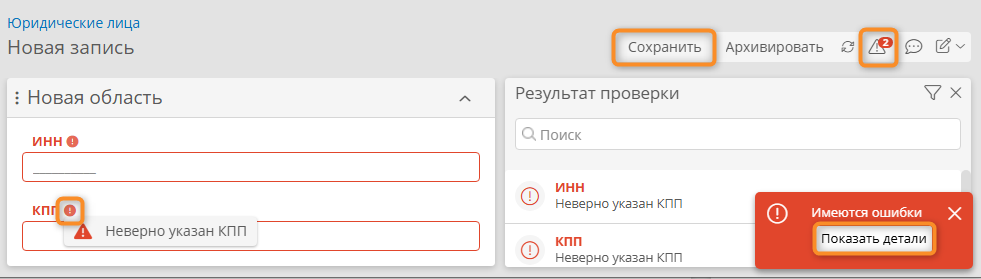

# Атрибут типа «Текст». Контроль и форматирование значений с помощью масок {: #attribute_text_masks }

## Введение {: #attribute_text_masks_introduction }

Атрибут типа «**Текст**» может содержать неограниченное количество любых символов.

**{{ productName }}** позволяет контролировать допустимые набор, последовательность и количество символов для текстового атрибута следующими способами:

- при вводе с помощью **маски**;
- при сохранении записи с помощью **проверки значения**.

Здесь представлен пример настройки текстовых атрибутов для контроля, форматирования и проверки значений с использованием регулярных выражений.

!!! question "Форматирование значения атрибута с помощью маски ввода"

    Для контроля и форматирования значения текстового атрибута при вводе в качестве его **формата отображения** можно задать готовую или особую **маску**.

    Маска ввода представляет собой строку символов (регулярное выражение), задающую допустимый формат значения текстового атрибута. 
    
    Когда пользователь вводит текст в поле атрибута с заданной маской, система автоматически форматирует текст так, чтобы он соответствовал маске.

    Предусмотрены следующие готовые маски:

    --8<-- "attribute_text_property_masks.md"

    Также можно задать **особую маску** с помощью регулярного выражения.

!!! tip "Синтаксис регулярного выражения маски"

    Регулярное выражение представляет собой набор символов, с которым сравнивается строковое значение.

    Вот несколько базовых примеров и элементов регулярных выражений:
    
    - `[а-яА-ЯёЁ]` — все буквы русского алфавита.
    - `[0-9]+` или `\d+` — набор из одной или более цифр. Диапазон `[0-9]` и выражение `\d` обозначают любую цифру от 0 до 9, а плюс + обозначает, что таких цифр может быть одна или более.
    - `{5}` — последовательность из 5 символов определённого типа.
    - `[А-ЯЁ]{3}` — последовательность из 3 заглавных букв русского алфавита.
    - `^` — символ начала строки.
    - `$` — символ конца строки.
    
    Ознакомиться с полным синтаксисом регулярных выражений, поэкспериментировать и отладить их можно на следующем сайте: <https://regex101.com/>

    !!! example "Пример"

        - Дано регулярное выражение:

            ``` sql
            "^\d{5}$"
            ```

        - Строка `12345` — **соответствует** регулярному выражению.
        - Строки ` 12345 ` и `1абв2` — **не соответствуют** регулярному выражению.

!!! question "Проверка значения атрибута при сохранении записи"

    Для контроля значения текстового атрибута при сохранении записи в его свойствах можно задать выражение с помощью **формулы**, выражения на **N3** или другого **атрибута**.

    Это выражение должно возвращать `True` для допустимых значений атрибута и `False` — для недопустимых.

    Также следует задать **сообщение при отрицательном результате проверки**.

    Если атрибут имеет недопустимое значение, при попытке сохранения записи отобразится заданное сообщение и запись не будет сохранена. Для сохранения записи пользователь должен будет изменить значение атрибута на допустимое.

## Прикладная задача {: #attribute_text_masks_use_case }

Требуется настроить текстовые атрибуты _«ИНН»_ и _«КПП»_ для юридического лица и контролировать их заполнение.

При вводе недопустимых значений необходимо выводить наглядные сообщения об ошибках.

## Исходные данные {: #attribute_text_masks_initial_data }

Имеется шаблон «**Юридические лица**», в котором хранятся реквизиты контрагентов.

## Настройка масок и проверок значений атрибутов типа «Текст» {: #attribute_text_masks_mask_configuration }

1. Создайте **и сохраните** атрибут _«ИНН»_ со следующими свойствами:

    - **Тип данных: текст**
    - **Системное имя:** _ИНН_
    - **Формат отображения: ИНН юрлица**
    - **Регулярное выражение маски:** `([0-9]{10})` (заполняется автоматически)

2. Откройте созданный атрибут _«ИНН»_.
3. В окне настройки атрибута на вкладке «**Проверка значения**» настройте проверку:

    - **Проверка значения по выражению: формула**

        ``` python
        # Возвращаем True, если значение атрибута "ИНН"
        # соответствует готовой маске "ИНН юрлица"
        MATCHES($ИНН, "^[0-9]{10}$")
        ```

        !!! question "Синтаксис формулы"

            `[0-9]{10}` — последовательность из 10 цифр от 0-9. Это **регулярное выражение маски**, скопированное со вкладки «**Свойства**».
            - `^` — символ начала строки.
            - `$` — символ конца строки.

    - **Сообщение при отрицательном результате проверки: формула**

        ``` python
        "Неверно указан ИНН"
        ```

4. Создайте **и сохраните** атрибут _«КПП»_ со следующими свойствами:

    - **Тип данных: текст**
    - **Системное имя:** _КПП_
    - **Формат отображения: особая маска**
    - **Регулярное выражение маски:** `^\d{9}$`

5. Откройте созданный атрибут _«КПП»_.
6. В окне настройки атрибута на вкладке «**Проверка значения**» и настройте проверку:

    - **Проверка значения по выражению: формула**

        ``` python
        # Возвращаем True, если значение атрибута "КПП"
        # соответствует заданной особой маске
        MATCHES($КПП, "^\d{9}$")
        ```

        !!! question "Синтаксис формулы"

            `\d{9}` — последовательность из 9 цифр. Это **регулярное выражение маски**, скопированное со вкладки «**Свойства**».
            - `^` — символ начала строки.
            - `$` — символ конца строки.

    - **Сообщение при отрицательном результате проверки: формула**

        ``` python
        "Неверно указан КПП"
        ```

7. Поместите атрибуты _«ИНН»_ и _«КПП»_ на форму шаблона _«Юридические лица»_.
8. Сохраните форму.

## Тестирование {: #attribute_text_masks_testing }

1. Создайте новую запись в шаблоне _«Юридические лица»_.
2. Не заполняйте поля _«ИНН»_ и _«КПП»_.
3. Нажмите кнопку «**Сохранить**».
4. Должно отобразиться сообщение «**Имеются ошибки**».
5. Нажмите кнопку «**Показать детали**» в сообщении об ошибке, кнопку <i class="fa-light  fa-exclamation-triangle"></i> над формой или значок <i class="fa-light fa-exclamation-circle"></i> у подписи поля с ошибкой.
6. Отобразится список ошибок, возникших при заполнении полей.
7. Введите корректные значения _ИНН_ и _КПП_.
8. Нажмите кнопку «**Сохранить**».
9. Запись должна быть сохранена без ошибок.

__

<div class="relatedTopics" markdown="block">

--8<-- "related_topics_heading.md"

- [Атрибут типа «Текст»][attribute_text]
- [Общие свойства атрибутов ][attribute_common_properties]
- [Список функций языка формул Comindware][formula_function_list]
- [Regex101 — сайт для отладки регулярных выражений](https://regex101.com/)

</div>


