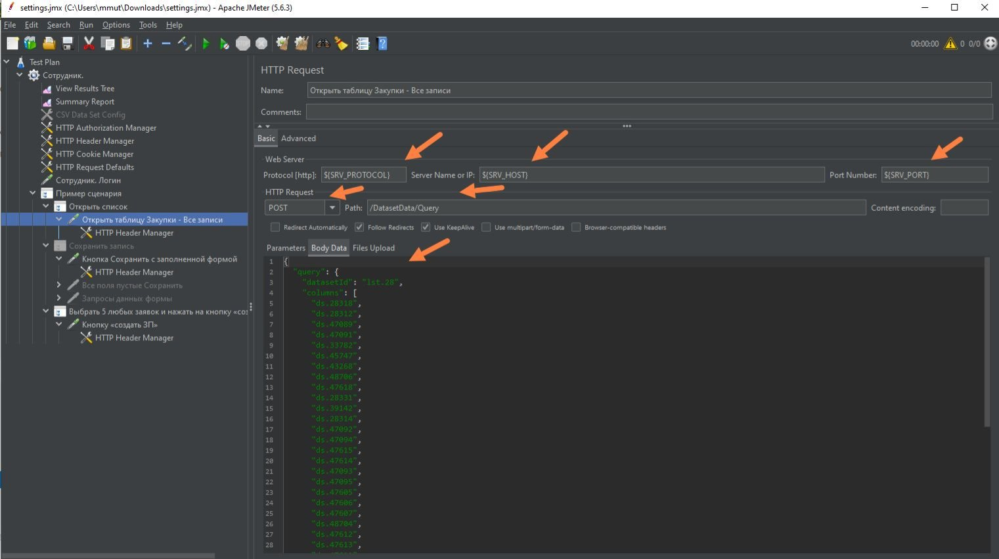
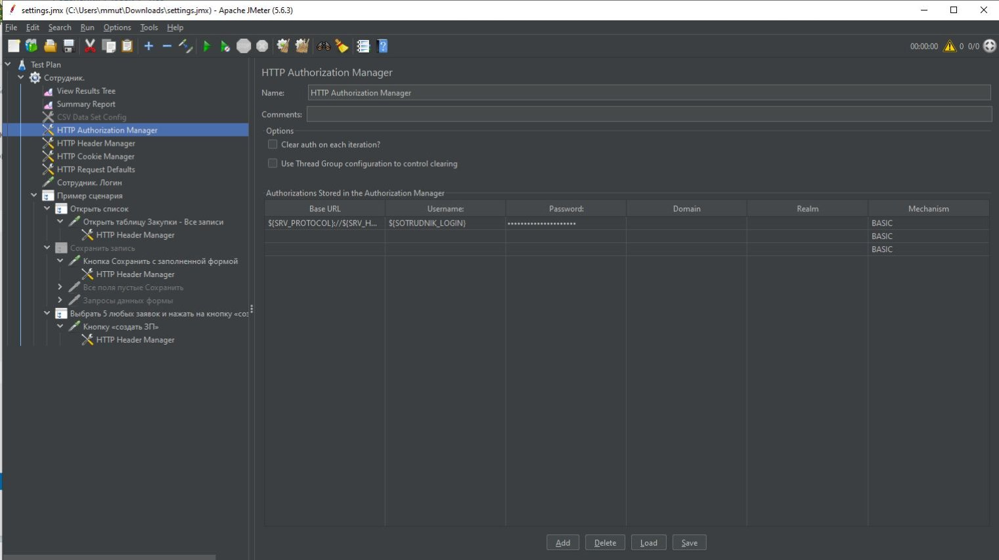
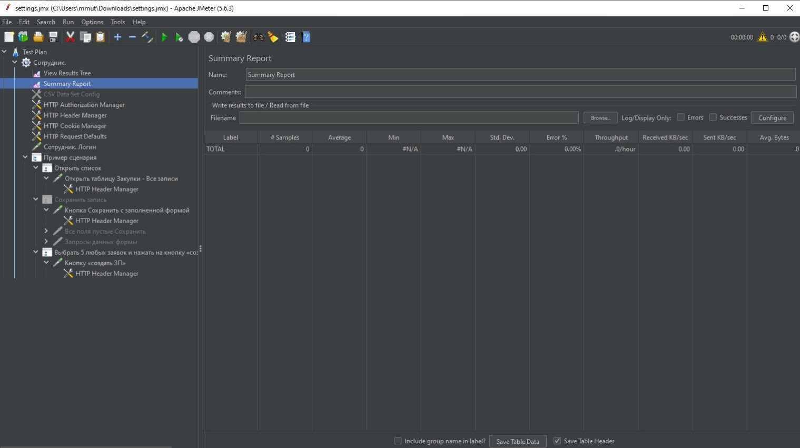

# Инструкция по нагрузочному тестированию {: #load_testing }

## Развертывание {{ productName }} {: #load_testing_deployment }

Необходимо развернуть **{{ productName }}**. Конфигурация системы должна быть такой же или близка к продуктовой, согласно рассчитанному сайзингу, для получения более точных результатов и проведения дальнейшей аналитики журналов. Инструкция по развертыванию продукта, а так же вспомогательного ПО (OpenSearch) для Windows и Linux представлена в Базе знаний ([ссылка][deploy_comindware]).

## Установка и настройка Apache JMeter {: #load_testing_jmeter_setup }

### Установка {: #load_testing_jmeter_install }

Необходимо скачать и распаковать в любую папку архив Apache JMeter с официального сайта ([ссылка][jmeter_download]), предварительно установив Java 8+ версии.

### Настройка {: #load_testing_jmeter_config }

Необходимо скачать файл с предварительными настройками Apache JMeter. Запустить программу и открыть данный файл «File»->«Open»->Выбрать файл с предварительными настройками.

Во вкладке «Test plan» указать свои реквизиты:

- `SRV_HOST` — адрес стенда
- `SOTRUDNIK_LOGIN` — Логин пользователя
- `SOTRUDNIK_PASSWORD` — Пароль пользователя
- `AccountsCount` и `ReadAcc` — Количество пользователей которые будут запущены
- `ramp_up` — Промежуток времени в миллисекундах между запуском аккаунтов
- `iterations` — Количество итераций прогона теста

В файле предварительной настройки представлены примеры следующий сценариев:

- Открыть таблицу
- Сохранить форму с заполненными данными
- Нажатие пользовательской кнопки по выбранным записям из таблицы

Для создания своего сценария добавьте новый Transaction Controller и HTTP Request, выбрав соответствующие существующие вкладки и нажав правой кнопкой мыши -> «Duplicate», затем переместив в нужный блок, или правой кнопкой по вкладке в которую хотите добавить->«Add»->«Logic Controller»->«Transaction Controller» и «Add»->«Sampler»->«HTTP Request».

Для настройки HTTP запроса необходимо указать протокол, адрес стенда, порт, метод(POST) – по аналогии с примерами. Так же необходимо указать путь и тело запроса.

Для получения путей и тела запроса необходимо:

1. Открыть нужную страницу стенда, включить меню разработки, перейти во вкладку Network. Для получения данных необходимо нажать на кнопку/перезагрузить страницу с формой или списком, выбрать значение в выпадающем списке на форме/заполнить поле.
2. В таблице «Name» необходимо найти соответствующую запись: Query(список), QueryForm(форма), Execute(кнопка), QueryData(заполнение поля).
3. Путь будет указан во вкладке «Headers» в строке «Request URL» после адреса стенда.

4. Тело запроса будет указано во вкладке «Payload». Для быстрого копирование выберите первую строку после «Request Payload» и нажмите на «Copy».

5. Реквизит «objId» в теле запроса отвечает за ID записи, к которой это будет применено. Его можно менять для проведения операций с разными записями. Если сценарий создания новой записи -> ничего не нужно редактировать в скопированном теле. Так же сценарий создания новой записи – это кнопка «Сохранить» на форме создания.

Если требуется запуск сценариев одновременно под пользователями с разными ролями, необходимо добавить новую группу пользователей «Thread Group»(сделайте дубликат существующей). В «Test Plan» добавьте новые переменные с данными для авторизации пользователя под конкретной ролью. В «HTTP Authorization Manager» в «Username» и «Password» укажите соответствующие переменные по аналогии с примером.

Для выключения какого-то элемента без удаления выберите его->нажмите правой кнопкой мыши->«Disable». Для включения: «Enable». Выключенные элементы подсвечиваются серым и пропускаются при выполнении теста.

## Проведение нагрузочного тестирования {: #load_testing_execution }

1. Перед началом тестирования необходимо изменить конфигурацию системы: в любое место файла `/usr/share/comindware/configs/instance/cmwdata.yml`, обычно после версии платформы добавить: `isTestEnvironment: true`.
2. Перезагрузить систему.
3. Для запуска теста нажмите на «Start».

4. После окончания тестирования, отчеты будут отображены в «View Result Tree» и «Summary Report».

5. Далее необходимо выгрузить логи со стенда и загрузить их для анализа.
6. После проведения всех работ удалить добавленную строчку в конфигурации системы и перезагрузить ее.


