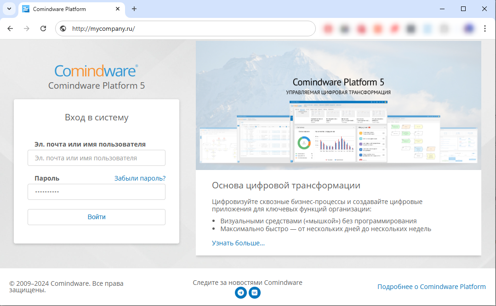
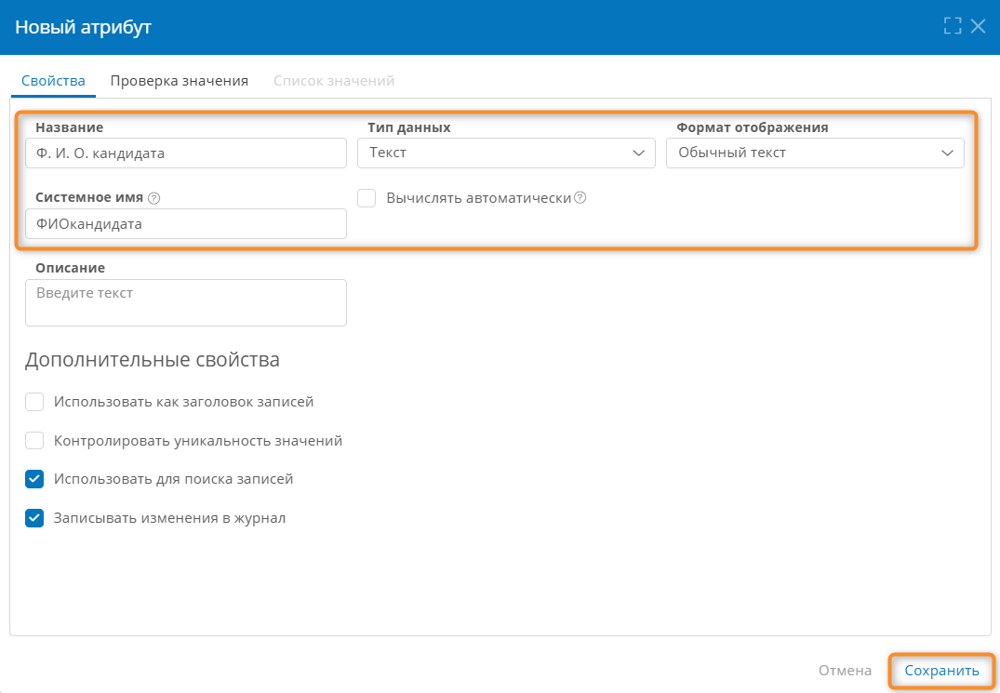

# Урок 2. Создание реестра данных

## Введение

В рамках обучения мы разработаем корпоративное приложение для управления персоналом.

В ходе этого урока вы научитесь входить в **{{ productName }}** и познакомитесь с основными элементами системы. В ходе этого урока вы создадите **приложение**, **шаблон записи** (реестр кандидатов), настроите **атрибуты** для хранения данных кандидатов, их отображение в виде **таблицы** и **формы**, а затем оформите несколько кандидатов на вакансию.

!!! warning "Бизнес-логика"

    Мы реализуем следующий процесс обработки кандидата на вакансию:

    1. _HR-менеджер_ фиксирует результаты тестирования .
    2. Если кандидат прошёл тестирование:

        - _Нанимающий менеджер_ назначает проводит собеседование.
        - _Сотрудник службы безопасности_ проводит проверку кандидата.

    3. Если кандидат прошёл собеседование и проверку службы безопасности, _HR-менеджер_ формирует предложение и согласует его с кандидатом.

    Подробные сведения о приложениях в **{{ productName }}** см. в разделе «[Разработка приложений][apps_kb]».

**Расчётная продолжительность:** 90 мин.



## Определения {: .admonition-title #definitions}

- **Приложение** — настроенная в **{{ productName }}** совокупность  бизнес-процессов, диаграмм, моделей данных, экранных форм, механизмов обработки данных и ролевой модели для решения определённых задач.
- **Шаблон записи** — модель бизнес-сущности (в виде атрибутов) и хранилище (реестр) данных в **{{ productName }}** (аналог таблицы реляционной базы данных или листа Excel). Записи из шаблона могут быть представлены в виде таблиц, карточек и форм. Подробные сведения о шаблонах представлены в статье _«[Шаблоны. Определения и настройка][record_templates]»_.
- **Запись** — набор данных (значений атрибутов) в шаблоне, описывающий экземпляр бизнес-сущности (элемент справочника, транзакцию и т.&nbsp;п.).
- **Атрибут** — простейший элемент данных, описывающий бизнес-сущность (аналог поля в реляционной БД или столбца в Excel), например: место подачи (строка), количество пассажиров (число), время подачи автомобиля (дата/время), автомобиль (ссылка) и т.&nbsp;п.
- **Форма** — страница с полями для отображения и ввода данных.
- **Таблица** — список, содержащий записи в строках со значениями атрибутов в столбцах. В таблице можно настроить фильтры для для отображения определённых записей.

## Вход в {{ productName }}

1. Запустите браузер и введите в адресную строку адрес веб-сайта с **{{ productName }}**, развёрнутого в вашей компании или в облаке **{{ companyName }}** (если используется демо-доступ).
2. Должна отобразиться страница входа.
3. Введите имя пользователя и пароль, полученные от администратора или от службы поддержки **{{ companyName }}**.
4. Нажмите кнопку «**Войти**».
5. Отобразится начальная страница **{{ productName }}**.

    __

## Настройка аккаунта

В разделе «**Мой аккаунт**» вы можете просмотреть персональную информацию и сменить пароль.

!!! note "Примечание"

    Некоторые или все действия в разделе «**Мой аккаунт**» для вас могут быть недоступны в зависимости от разрешений, выданных системным администратором.

1. Нажмите значок с вашими инициалами в правом верхнем углу страницы.
2. Выберите пункт «**Мой аккаунт**».
3. Должен отобразиться раздел «**Мой аккаунт**».

    __

4. Чтобы сменить пароль, нажмите кнопку «**Сменить пароль**».
5. Чтобы изменения вступили в силу, нажмите кнопку «**Сохранить**».

    __

## Создание приложения

Создадим приложение для автоматизации управления персоналом.

!!! tip "Совет"

    Во всех последующих инструкциях и уроках, необходимость изменения любых параметров при настройке приложения указана явно. Если не указано изменение какого-либо параметра, это означает, что его состояние при настройке следует оставлять неизменным (исходным по умолчанию).

    То есть при прохождении уроков во время настройки приложения и других элементов изменяйте только те поля, значения и флажки, которые указаны в инструкциях. Не изменяйте остальные параметры.

    Соблюдение этой рекомендации поможет достичь ожидаемого поведения результирующего приложения.

    При этом вы можете экспериментировать со значениями полей при заполнении форм во время тестирования приложения в роли конечного пользователя.

1. На панели навигации слева выберите пункт «**Настройки**» — «**Приложения**».
2. Нажмите кнопку «**Создать**».

    __

3. Введите наглядное название приложения, например _«Управление автопарком»_. После заполнения имени поле «**Системное имя**» заполнится автоматически, при желании вы можете ввести собственное системное имя.

    !!! question "Системное имя и отображаемое название"

        - У сущностей в **{{ productName }}** предусмотрены **системное имя** и **название**.
        - **Системное имя** — это идентификатор сущности (атрибута, шаблона, поля и т.&nbsp;п.), используемый в сценариях, скриптах, правилах, формулах и выражениях.
            --8<-- "system_name_requirements.md"
        - **Название** и **отображаемое название** — это наглядная подпись сущности (атрибута, шаблона, формы, поля, кнопки, таблицы и т.&nbsp;п.). Название может содержать любые символы и по возможности должно быть кратким и понятным.

4. Нажмите кнопку «**Сохранить**».

    __

5. Дважды нажмите строку созданного приложения в списке.
6. Отобразится страница «**Администрирование**» приложения.

    __

## Создание шаблона записи «Кандидаты»

Определим данные кандидатов на вакансию, которые необходимо хранить в **шаблоне записи**.

Создадим шаблон записи для данных кандидата.

1. На странице «**Администрирование**» приложения _«Управление персоналом»_ выберите пункт «**Шаблоны**» <i class="fa-light fa-briefcase "></i>.

    __

2. Отобразится список всех шаблонов приложения.
3. Выберите вкладку «**Шаблоны записей**».
4. Нажмите кнопку «**Создать**».

    __

5. Отобразится окно «**Новый шаблон**».
6. В поле «**Название**» введите наглядное наименование шаблона — _«Кандидаты»_.
7. **Системное имя** будет заполнено автоматически.
8. В поле «**Тип шаблона**» должно быть автоматически выбрано значение «**Шаблон записи**».
9. Остальные поля оставьте без изменений.
10. Нажмите кнопку «**Создать**».

    __

## Создание атрибутов шаблона записи «Кандидаты»

Добавим атрибуты записи данных кандидата.

Мы создадим минимальный набор атрибутов, необходимый для обработки кандидата при найме персонала.

!!! note "Примечание"

    Следуя гибкой методологии, на начальном этапе мы не зададим все атрибуты, а ограничимся минимально необходимыми.
   
    Наша цель — как можно быстрее сделать работоспособное приложение и показать первым пользователям.
   
    Затем, получив от обратную связь от пользователей, мы будем добавлять в нашу таблицу новые атрибуты и вносить другие доработки по их пожеланиям.

!!! question "Типы атрибутов"

    В **{{ productName }}** предусмотрены атрибуты различных типов для хранения бизнес-данных.

    - **Текст** — строковое значение. Можно выбрать **формат отображения** значения атрибута:
        - **Обычный текст** — без форматирования;
        - **Размеченный текст** — базовое форматирование (жирный, курсив, списки).
        - **HTML-текст** — расширенное форматирование с помощью тегов HTML.
        - **Телефон (РФ)**, **Адрес эл.&nbsp;почты**, **Паспорт (РФ)**, **Индекс (РФ)**, **ИНН юрлица**, **ИНН физлица**, **ОГРН (РФ)**, **Регистрационный номер ТС (РФ)**, **Особая маска** — значение атрибута форматируется с использованием маски в виде регулярного выражения.
    - **Число** — числовое значение. Можно выбрать **количество знаков после запятой**:
        - **Не преобразовывать** — значение отображается в том же формате, что его ввёл пользователь;
        - **0** — значение отображается в виде целого числа;
        - **1–6** — значение отображается в виде десятичной дроби с указанным количеством знаков после запятой;
    - **Дата и время** — значение даты и времени. Доступно несколько **форматов отображения**, позволяющих выводить либо только дату, либо дату и время.
    - **Документ** — к атрибуту можно прикрепить любые файлы, например в формате Word, PDF или ZIP.
    - **Изображение** — к атрибуту можно прикрепить изображения, например сканы документов или фотографии.

    Кроме того, **{{ productName }}** поддерживает атрибуты следующих типов: **Аккаунт**, **Гиперссылка**, **Длительность**, **Запись**, **Логический**, **Организационная единица**, **Роль**, **Список значений**. С некоторыми из них мы познакомимся позже.

    Подробные сведения об атрибутах см. в статье _«[Атрибуты. Определения и настройка][attributes]»_

1. Выберите вкладку «**Атрибуты**».
2. Нажмите кнопку «**Создать**».

    __

3. Отобразится окно «**Новый атрибут**».
4. Выберите **тип данных** «**Текст**».
5. Введите **название** _«Ф. И. О. кандидата»_.
6. **Системное имя** будет заполнено автоматически.
7. Остальные поля оставьте без изменений.
8. Нажмите кнопку «**Сохранить**».

    __ <!-- нет скрина -->

9. Аналогично создайте следующие атрибуты:

    | Тип данных       | Название       |
    | ---------------- | -------------- |
    | **Дата и время** | _Дата и время проведения собеседования_ |
    | **Логический**        | _Результат тестирования_      |
    | **Число**        | _Оценка за прохождение собеседования_    |

## Создание формы для просмотра и ввода данных

Теперь настроим экранную форму для просмотра и ввода данных кандидата.

1. На странице шаблона записи _«Кандидаты»_ выберите вкладку «**Формы**».

    !!! note "Основная форма шаблона"

        При создании шаблона записи автоматически создаётся пустая **основная форма**, в которой по умолчанию открываются записи шаблона.
       
        Для шаблона записи _«Кандидаты»_ была создана форма _«Кандидаты — Основная форма»_.

2. В списке форм дважды нажмите пункт _«Кандидаты — Основная форма»_.

    __ <!-- нет скрина -->

3. Отобразится **конструктор формы**:

    __ <!-- нет скрина -->

    !!! question "Конструктор формы"

        **Конструктор формы** разбит на четыре области:

        **(1)** **Панель элементов** — палитра элементов, которые можно перетащить на форму: атрибуты и вспомогательные визуальные элементы (**Область**, **Вкладки**, **Группа кнопок**, **Разделитель кнопок**, **Колонки**, **Статичный текст**).

        **(2)** **Макет формы** — эскиз экранной формы.

        **(3)** **Панель свойств** — позволяет просмотреть и изменить свойства выбранного элемента.

        **(4)** **Кнопки** — **Сохранить**, **Очистить**, **Клонировать**, **Настроить шаблон** <i class="fa-light  fa-pen-square"></i>, **Связи** <i class="fa-light  fa-link-horizontal"></i>.

        В **конструкторе форм** предусмотрен богатый набор элементов и функций, но в данном уроке мы рассмотрим только основные из них. Вы можете самостоятельно поэкспериментировать с элементами и настройками формы.
       
        Подробные сведения о настройке форм см. в статье _«[Формы. Определения и настройка][forms]»_.

4. Перетащите на макет формы элемент «**Область**» с панели элементов.
5. Перетащите на макет формы атрибут _«Ф. И. О. кандидата»_ с панели элементов.

    __ <!-- нет скрина -->

6. Аналогичным образом перетащите на макет формы атрибуты _«Дата и время проведения собеседования», «Оценка за прохождение собеседования»_.

## Создание и настройка шаблона записи «Вакансии»

Внутри одного приложения мы можем создавать несколько шаблонов записи и связывать их между собой.

1. На странице «**Администрирование**» приложения _«Управление персоналом»_ выберите пункт «**Шаблоны**» <i class="fa-light fa-briefcase "></i>.
2. Отобразится список всех шаблонов приложения.
3. Выберите вкладку «**Шаблоны записей**».
4. Нажмите кнопку «**Создать**».
5. Отобразится окно «**Новый шаблон**».
6. В поле «**Название**» введите _«Вакансии»_.
7. В поле «**Тип шаблона**» должно быть автоматически выбрано значение «**Шаблон записи**».
8. Нажмите кнопку «**Создать**».
9. Выберите вкладку «**Атрибуты**».
10. Нажмите кнопку «**Создать**».
11. Отобразится окно «**Новый атрибут**».
12. Выберите **тип данных** «**Текст**».
13. Введите **название** _«Вакансии»_.
14. Установите флажок «**Использовать как заголовок записей**».
15. Нажмите кнопку «**Сохранить**».
16. Выберите вкладку «**Формы**».
17. В списке форм дважды нажмите пункт _«Вакансии — Основная форма»_.
18. Отобразится **конструктор формы**.
19. Перетащите на макет формы элемент «**Область**» с панели элементов.
20. Перетащите на макет формы атрибут _«Название»_ с панели элементов.
21. Нажмите кнопку «**Сохранить**».

