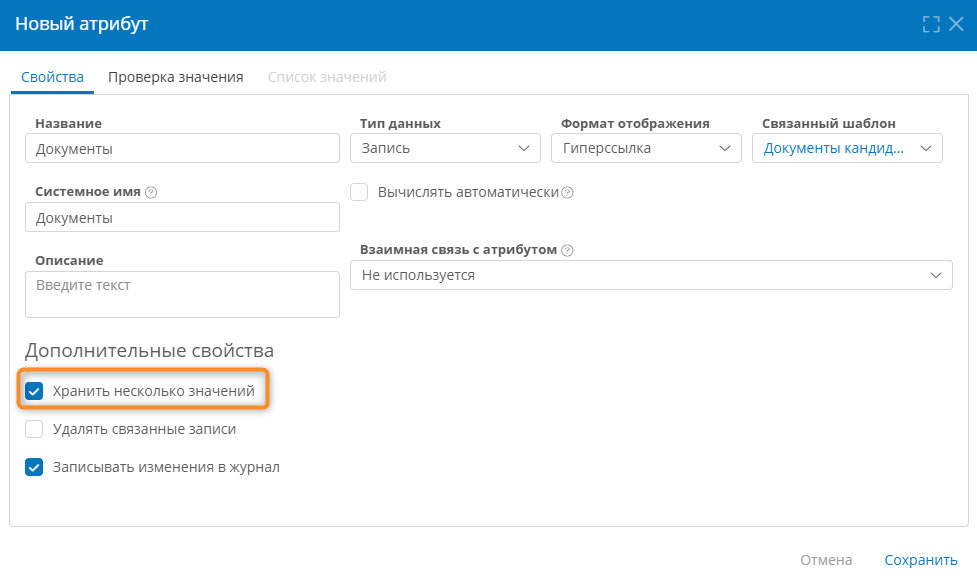
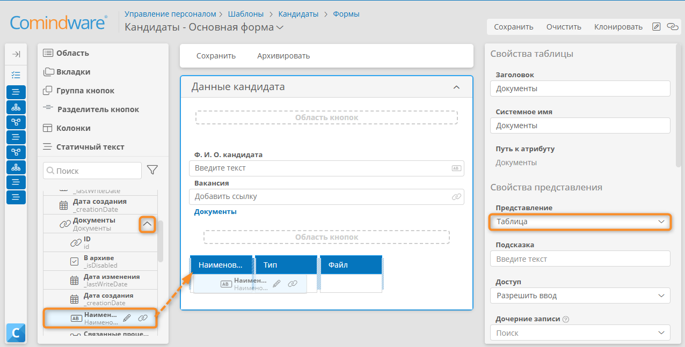
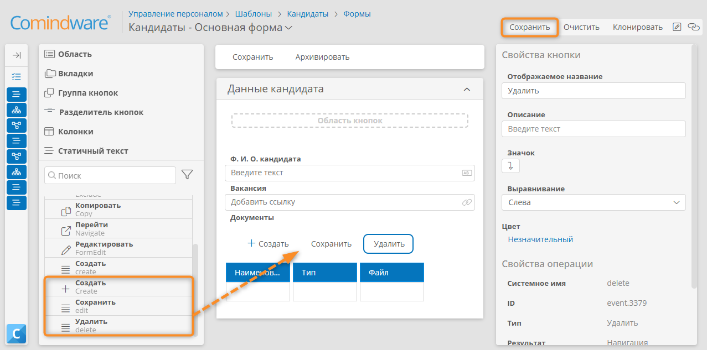
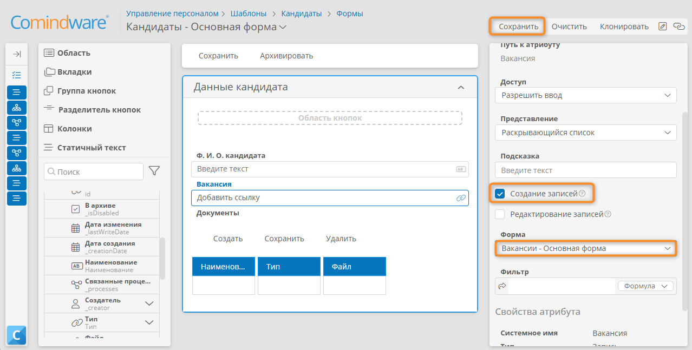

# Урок 4. Связи и коллекции записей, документооборот {: #tutorial_hr_lesson_4 }

## Введение {: #tutorial_hr_lesson_4_intro }

В ходе этого урока вы научитесь расширять модель данных для процесса найма персонала: создавать связь «один ко многим» между шаблонами, использовать атрибут типа «**Документ**», настраивать представление таблицы для связанных записей и добавлять записи «на лету».

**Предусловия:** пройден _[урок 3 «Мой первый бизнес-процесс»][tutorial_hr_lesson_3]_.

**Расчётная продолжительность:** 55 мин.

!!! warning "Бизнес-логика"

    В рамках процесса найма персонала для каждого кандидата необходимо хранить и обрабатывать связанные документы (например, резюме, паспорт, тестовое задание).
    
    Для этого расширим модель данных с использованием связей между шаблонами записей: кандидат может предоставить несколько документов, и каждый документ имеет определённый тип.

    _HR-менеджер_ должен иметь возможность:
    
    - добавлять и просматривать документы, связанные с кандидатом;
    - указывать тип документа из справочника;
    - создавать новые типы документов и вакансии в текущей форме, то есть не покидая карточку кандидата.

    Такая организация данных обеспечит прозрачность документооборота, ускорит работу с кандидатами и позволит гибко настраивать бизнес-процесс под реальные потребности компании.



## Темы, навыки и задания урока {: #tutorial_hr_lesson_4_taxonomy }

**Темы**

- Связи «один ко многим»
- Взаимная связь
<!-- Действительно используем взаимную связь? Сложная механика? -->
- Обработка файлов
- Атрибут типа «**Документ**»
- Создание записей «на лету»

**Навыки**

- Устанавливать связи между шаблонами
- Настраивать обработку файлов
- Создавать и использовать атрибут типа «**Документ**»
- Добавлять записи в связанные шаблоны «на лету»

**Задания**

- Организовать хранение и обработку документов кандидатов в рамках процесса найма.
- Настроить связи между данными для обеспечения прозрачности документооборота.
- Реализовать возможность добавления и просмотра связанных документов непосредственно из карточки кандидата.
- Обеспечить гибкость бизнес-процесса за счёт создания новых типов документов и вакансий «на лету».
- Настроить формы и представления для эффективной работы HR-менеджера с документами и кандидатами.

## Определения {: #tutorial_hr_lesson_4_definitions }

- **Шаблон записи** — модель бизнес-сущности и хранилище данных (например, Кандидаты, Документы кандидатов).
- **Атрибут типа «Документ»** — поле для хранения файлов (резюме, результаты тестирования и др.).
- **Атрибут типа «Запись»** — поле для связи с другим шаблоном записи (например, Документы кандидата).
- **Связь «один ко многим»** — один объект (кандидат) связан с несколькими объектами (документами).
- **Взаимная связь** — двусторонняя связь между шаблонами записей.
- **Создание записей «на лету»** — добавление новых связанных записей прямо из формы.

## Создание шаблона записи «Типы документов»

!!! warning "Бизнес-логика"

    В записи кандидата должны храниться документы, связанные с ним.

    Чтобы _HR-менеджер_ мог указать тип документов в записи кандидата, добавим справочник типов документов.

    Для этого создадим **шаблон записи** _«Типы документов»_, настроим форму типа документа, список типов документов и заполним справочник данными.

1. Перейдите в раздел **Шаблоны** приложения _«Управление персоналом»_.
2. Создайте **шаблон записи** _«Типы документов»_.
3. Откройте шаблон и перейдите на вкладку **Атрибуты**.
4. Создайте текстовый атрибут _«Тип документа»_.
5. В свойствах атрибута установите флажок «**Использовать как заголовок записей**».
6. Добавьте созданный атрибут на форму _«Типы документов — Основная форма»_.
7. Сохраните форму.

__

## Заполнение справочника «Типы документов»

1. Откройте список экземпляров записи шаблона _«Типы документов»_.
2. В списке записей _«Типы документов»_ нажмите кнопку «**Создать**».
3. Отобразится форма нового типа документа.
4. В поле _«Тип документа»_ укажите значение _«Резюме»_.
5. Сохраните запись.
6. Нажмите ссылку _«Типы документов»_ над формой, чтобы вернуться к списку записей.
7. Аналогичным образом создайте ещё два типа документов — _«Паспорт»_ и _«Тестовое задание»_.

## Создание шаблона записи «Документы кандидатов» {: #tutorial_hr_lesson_4_create_documents_template }

!!! "Бизнес-логика"

    Для хранения документов кандидатов создадим отдельный реестр и свяжем с со справочником _«Типы документов»_.

1. Перейдите в раздел **Шаблоны** приложения _«Управление персоналом»_.
2. Создайте **шаблон записи** _«Документы кандидатов»_.
3. Откройте шаблон и перейдите на вкладку **Атрибуты**.
4. Создайте атрибут типа «**Документ**» с названием _«Файл»_.
5. Создайте **текстовый** атрибут со следущими свойствами:

    - **Название:** _«Наименование»_
    - **Использовать как заголовок записей:** флажок установлен

6. Создайте атрибут типа «**Запись**» со следующими свойствами:

    - **Название:** _Тип_
    - **Связанный шаблон:** _Типы документов_

## Создание атрибута, связывающего два шаблона записей {: #tutorial_hr_lesson_4_add_1m_link }

!!! "Бизнес-логика"

    Чтобы _HR-менеджер_ мог добавлять документы и сразу привязывать их к определённому кандидату, свяжем шаблоны между собой.

!!! question "Атрибут типа «Запись»"

    - Атрибут типа «**Запись**» используется для создания связи между шаблонами вида «один ко многим» (1:M), «один к одному» (1:1) или «многие ко многим» (N:M).
    - При установлении связи «один ко многим» несколько записей одного шаблона могут ссылаться на одну запись другого шаблона.
    - Такой шаблон называется **связанным**.
    - **Связанный шаблон** всегда указывается при создании атрибута типа «**Запись**».

1. Откройте шаблон записи _«Кандидаты»_.
2. Перейдите на вкладку **Атрибуты**.
3. Создайте атрибут типа «**Запись**» со следующими свойствами:

    - **Название:** _«Документы»_
    - **Связанный шаблон:** _«Документы кандидатов»_
    - **Хранить несколько значений:** флажок установлен

    __

## Настройка таблицы на форме «Документы» для отображения связанных документов

!!! question "Таблица на форме"

    На форме атрибут типа «**Запись**» с несколькими значениями может отображаться в виде таблицы, в столбцах которой отображаются атрибуты **связанного шаблона**. 
    
    Для таблицы на форме можно настроить набор столбцов, режим доступа, отображение дочерних записей, фильтр записей и кнопки.

1. Перейдите на вкладку «**Формы**» шаблона записи _«Кандидаты»_.
2. Откройте форму _«Кандидаты — Основная форма»_.
3. Перетащите атрибут _«Документы»_ на основную форму кандидата.
4. Для поля _«Документы»_ выберите **представление** «**Таблица**» с помощью панели свойств.
5. Раскройте атрибут _«Документы»_ на панели элементов.
6. Перетащите в таблицу на форме атрибуты _«Наименование»_, _«Тип»_ и _«Файл»_.

    __

7. Выберите область кнопок таблицы.
8. В панели элементов отобразятся кнопки, доступные для таблицы.
9. Перетащите на область кнопок таблицы кнопки «**Создать**», «**Сохранить**» и «**Удалить**». Эти кнопки позволят добавлять и удалять документы, связанные с кандидатом.
10. Сохраните форму.

__

## Доработка формы шаблона записи «Кандидаты»

Добавим возможность создания новых вакансий «на лету».

1. Перейдите на вкладку «**Формы**» шаблона записи _«Кандидаты»_.
2. Откройте форму _«Кандидаты — Основная форма»_.
3. Нажмите поле атрибута _«Вакансия»_.
4. Установите флажок «**Создание записей**».

    !!! note "Примечание"

    Установив флажок «**Создание записей**» в свойствах раскрывающегося списка, мы даём пользователю возможность создавать записи с помощью формы связанного шаблона.

5. В свойстве «**Форма**» выберите _«Вакансии — Основная форма»_.
6. Сохраните форму.

__

## Тестирование

1. Откройте шаблон записи _«Кандидаты»_.
2. Нажмите кнопку «**Перейти к экземплярам**».
3. Откройте запись или создайте новую.
4. Нажмите кнопку «**Создать**» в области рядом с таблицей _«Документы»_.
5. Введите наглядное название документа в ячейку _«Наименование»_.
6. Выберите тип документа.
7. Прикрепите файл в ячейке _«Файл»_.
8. Нажмите кнопку «**Сохранить**».
9. Разверните список поля _«Вакансия»_.
10. Нажмите кнопку «**Создать**».
11. Введите название вакансии и нажмите кнопку «**ОК**».
12. Сохраните запись.

## Итоги урока {: #tutorial_hr_lesson_4_summary }

В ходе этого урока вы научились создавать связанные шаблоны записей с типом связи «один ко многим», использовать атрибут типа «Документ», настраивать табличное представление для связанных записей, добавлять записи «на лету» и настраивать формы задач для бизнес-процесса найма персонала.

В [следующем уроке][tutorial_hr_lesson_5] вы познакомитесь с вычисляемыми атрибутами и автоматизацией расчётов в системе.


