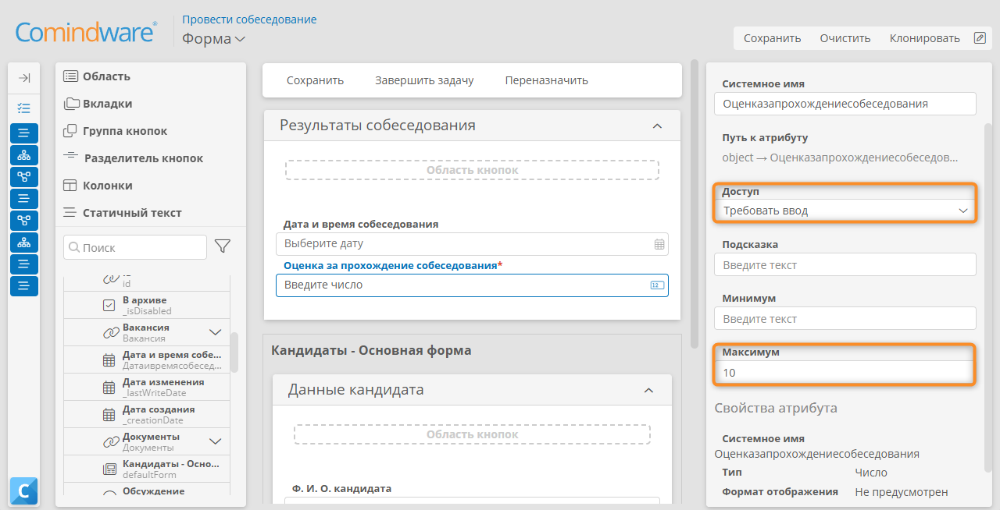
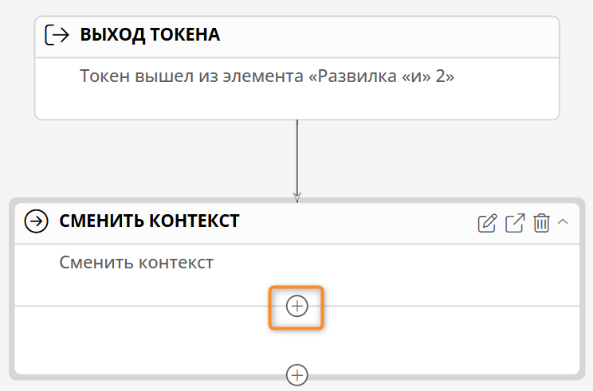

# Урок 5. Автоматизация: сценарии, вычисления, условия и проверки {: #tutorial_hr_lesson_5 }

## Введение {: #tutorial_hr_lesson_5_intro }

В ходе этого урока вы научитесь автоматизировать бизнес-процесс найма персонала с помощью сценариев, вычисляемых атрибутов и формул. Мы рассмотрим, как реализовать автоматические проверки и условия перехода между этапами процесса, используя инструменты ПО **{{ productName }}**.

**Предусловия:** пройден [урок 2 «Первый реестр данных»][tutorial_hr_lesson_2].

**Расчётная продолжительность:** 60 мин.



!!! warning "Бизнес-логика"

    В рамках процесса найма персонала кандидат считается успешно прошедшим собеседование, если его Оценка за собеседование составляет 8 баллов и выше, а также он прошёл проверку службы безопасности.

    Для этого реализуем следующий порядок действий:

    1. _HR-менеджер_ и _Нанимающий менеджер_ проводят собеседование с кандидатом и фиксируют оценку.
    2. _Сотрудник службы безопасности_ проводит проверку кандидата и фиксирует результат.
    3. Если оба условия выполнены (оценка ≥ 8 и проверка пройдена), система автоматически отмечает кандидата как успешно прошедшего этап и инициирует формирование предложения о работе.
    4. В противном случае кандидат считается не прошедшим этап, и процесс завершается соответствующим статусом.

    Для автоматизации этой процедуры используем сценарий с вычислением на языке формул **{{ companyName }}**.

## Темы, навыки и задания урока {: #tutorial_hr_lesson_5_taxonomy }

**Темы**

- Сценарии
- Вычисляемые атрибуты
- Язык формул

**Навыки**

- Добавлять и настраивать сценарии для процесса
- Использовать вложенные формы и настраивать доступ к ним
- Пользоваться редактором выражений
- Использовать формулы

**Задания**

- На форму задачи _«Провести собеседование»_ поместить вложенную форму с данными кандидата и поля с данными собеседования кандидата.
- Реализовать отслеживание статуса проверки кандидата службой безопасности и оценки за собеседование: логический атрибут и развилки с условным выбором потока на диаграмме процесса.
- Добавить развилки и завершающие события на диаграмму процесса для выполнения усовершенствованной бизнес-логики.
- Проверить, опубликовать и протестировать обновлённый процесс

## Определения {: #tutorial_hr_lesson_5_definitions }

- **Сценарий** — последовательность действий, выполняемых системой автоматически при наступлении определённого события.
- **Вычисляемый атрибут** — атрибут, значение которого формируется автоматически с использованием формулы.
- **Язык формул {{ companyName}}** — специальный язык для написания выражений, позволяющих вычислять значения атрибутов и управлять логикой процесса.

### Доработка формы задачи «Зафиксировать результаты тестирования» {: #tutorial_hr_lesson_5_task_form }

Усовершенствуем форму задачи _«Зафиксировать результаты тестирования»_:

- сделаем переключатель результата тестирования наглядным _«Тестирование пройдено / не пройдено»_, вместо неинформативных вариантов _«Да/Нет»_;
- сделаем указание результата тестирования обязательным.

1. Откройте диаграмму процесса _«Найм персонала»_ для редактирования.
2. Перейдите к задаче _«Зафиксировать результаты тестирования»_.
3. Нажмите поле атрибута _«Результат тестирования»_.
4. Измените **доступ** к полю на «**Требовать ввод**».
5. В свойстве поля «**Отображать как**» выберете «**Переключатель**».
6. Установите флажок «**Изменить названия вариантов**».
7. Укажите следующие названия вариантов:

    - **Истина:** _Тестирование пройдено_
    - **Ложь:** _Тестирование не пройдено_

8. Сохраните форму задачи.

__

## Доработка формы задачи «Провести собеседование» {: #tutorial_hr_lesson_5_interview_form }

Добавим на форму задачи _«Провести собеседование»_ полезные поля, зададим ограничение для ввода оценки и настроим наглядный переключатель для фиксации результата собеседования.

1. Откройте диаграмму процесса _«Найм персонала»_ для редактирования.
2. Откройте пользовательскую задачу _«Провести собеседование»_.
3. В область _«Результаты собеседования»_ добавьте атрибут _«Дата и время собеседования»_.
4. Выберите поле _«Оценка за собеседование»_ на макете формы.
5. С помощью панели свойств поля измените **доступ** на «**Требовать ввод**».
6. В свойстве поля «**Максимум**» укажите число _10_. Так мы зададим максимально допустимое значение для ввода в поле.
7. Удалите с формы поле _«Результат собеседования»_. Мы настроим автоматическое вычисление атрибута _«Результат собеседования»_ и соответствующие переходы на диаграмме процесса. См. _«[Настройка переходов и сценариев на диаграмме процесса](#tutorial_hr_lesson_5_diagram_scenarios)»_.
8. Сохраните форму.

__

## Доработка формы задачи «Провести проверку кандидата» {: #tutorial_hr_lesson_5_security_check }

Усовершенствуем форму задачи для службы безопасности:

- сделаем переключатель результата  наглядным _«Проверка пройдена / не пройдена»_, вместо неинформативных вариантов _«Да/Нет»_;
- сделаем указание результата проверки обязательным.

1. Откройте диаграмму шаблон процесса _«Найм персонала»_ для редактирования.
2. Откройте пользовательскую задачу _«Провести проверку кандидата»_.
3. Нажмите поле атрибута _«Проверка службы безопасности»_.
4. Измените **доступ** к полю на «**Требовать ввод**».
5. В свойстве поля «**Отображать как**» выберете «**Переключатель**».
6. Установите флажок «**Изменить названия вариантов**».
7. Укажите следующие названия вариантов:

    - **Истина:** _Прошёл проверку_
    - **Ложь:** _Не прошёл_

8. Сохраните форму.

__

## Настройка переходов и сценариев на диаграмме процесса {: #tutorial_hr_lesson_5_diagram_scenarios }

Настроим сценарий и условия переходов на диаграмме процесса, чтобы реализовать бизнес-логику автоматического определения результата собеседования и дальнейших действий.

!!! warning "Бизнес-логика"

    Кандидат считается успешно прошедшим собеседование, если его оценка будет больше или равна 8 баллам и он пройдёт проверку _Службы безопасности_.

    Для этого настроим изменение значения логического атрибута _«Результат собеседования»_ при помощи сценария.

1. Откройте диаграмму шаблон процесса _«Найм персонала»_ для редактирования.
2. Выберите «**Развилку «и» 2»**.
<!-- ПРОВЕРИТЬ НЕЙМИНГ РАЗВИЛКИ -->
3. Нажмите кнопку «**Сценарий на выходе**» <i class="fa-light fa-arrow-right-from-bracket"></i>.
4. Откроется конструктор сценария, который будет выполняться после выхода токена из развилки.
5. Внутри действия «**Сменить контекст**» нажмите кнопку «**Добавить действие**» <i class="fa-light fa-circle-plus"></i> и выберите пункт «**Изменить значения атрибутов**».

    __

6. Внутри действия «**Сменить контекст**» будет создано действие «**Изменить значения атрибутов**».
7. В заголовке действия «**Изменить значения атрибутов**» нажмите кнопку «**Изменить**» <i class="fa-light fa-pen-to-square"></i>.

    __

8. Отобразится окно «**Действие: Изменить значения атрибутов**» для настройки действия.
9.  Нажмите кнопку «**Создать**», чтобы добавить операцию с атрибутом.
10. В столбце «**Атрибут**» выберите атрибут _«Результат собеседования»_.
11. В столбце «**Операция со значениями**» выберите пункт «**Заменить**».
12. В столбце «**Значение**» выберите пункт «**Формула**».
13. Нажмите поле в столбце «**Значение**». Отобразится компактный редактор выражения.
14. Введите **формулу**:

    ``` cs
    AND($Проверкаслужбыбезопасности,GREATEREQ($Оценказапрохождениесобеседования,8))
    ```

    !!! question "Синтаксис формулы для вычисления результата собеседования"

        - `AND()` — эта функция принимает в качестве аргументов два выражения, возвращающих логическое значение, и возвращает логическое значение `true`, если оба аргумента вернули `true`.
        - `GREATEREQ()` — эта функция сравнивает значения двух аргументов и возвращает логическое значение `true`, если значение первого аргумента больше или равно значению второго.
        - `$Проверкаслужбыбезопасности`, `$Оценказапрохождениесобеседования` — обращение к атрибутам атрибуту _«Проверка службы безопасности»_ и _«Оценка за собеседование»_ по их системным именам.

15. Нажмите кнопку «**Сохранить**».

__

## Проверка и публикация диаграммы процесса {: #tutorial_hr_lesson_5_publish }

Поверим и опубликуем обновлённую диаграмму процесса.

1. Проверьте корректность настроек сценариев, условий и форм.
2. Нажмите кнопку «**Проверить**» в конструкторе диаграммы и устраните любые ошибки.
3. Опубликуйте обновлённую диаграмму процесса.

## Тестирование обновлённого процесса {: #tutorial_hr_lesson_5_test }

<!-- ПРОВЕРИТЬ -->

Протестируем обновлённый процесс, чтобы убедиться, что автоматизация и бизнес-логика работают корректно.

1. Создайте запись кандидата.
2. Пройдите этапы процесса, включая задачу _«Зафиксировать результаты тестирования»_.
3. Убедитесь, что поле результата тестирования отображается как переключатель с вариантами _«Тестирование пройдено / не пройдено»_, и что выбор обязателен.
4. Перейдите к задаче _«Провести собеседование»_. Заполните дату, время и оценку за собеседование. Проверьте, что поле оценки ограничено значением 10 и отображается как переключатель.
5. Перейдите к задаче _«Провести проверку кандидата»_. Убедитесь, что результат проверки фиксируется с помощью переключателя _«Проверка пройдена / не пройдена»_ и что выбор обязателен.
6. Проверьте, что при выполнении условий (Оценка за собеседование `≥ 8` и проверка пройдена) процесс автоматически переходит на этап формирования предложения кандидату.
7. Проверьте альтернативный сценарий: если хотя бы одно из условий не выполнено, процесс завершается с соответствующим статусом.
8. Проверьте, что значения вычисляемых атрибутов корректно отображаются на формах.
9. При необходимости повторите тестирование с разными вариантами значений для проверки всех веток бизнес-логики.
10. Зафиксируйте результаты тестирования и при необходимости внесите корректировки в настройки процесса.

!!! example "Факультативное задание"

    Попробуйте изменить условие автоматического перехода на этап предложения: например, требуйте не только прохождение проверки и высокую оценку, но и чтобы дата собеседования была не ранее определённой даты. Настройте формулу, проверьте работу процесса и проанализируйте, как изменится логика процесса.

## Итоги урока {: #tutorial_hr_lesson_5_summary }

Вы научились использовать автоматические вычисления, настраивать доступ к полям на форме, сценарии и условные переходы в процессе.

В [следующем уроке][tutorial_hr_lesson_6] вы научитесь настраивать систему управления доступом для участников процесса найма персонала.


