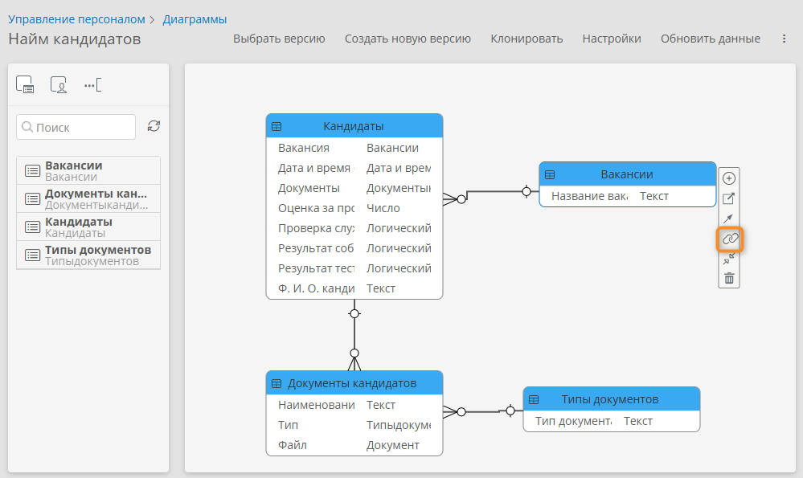
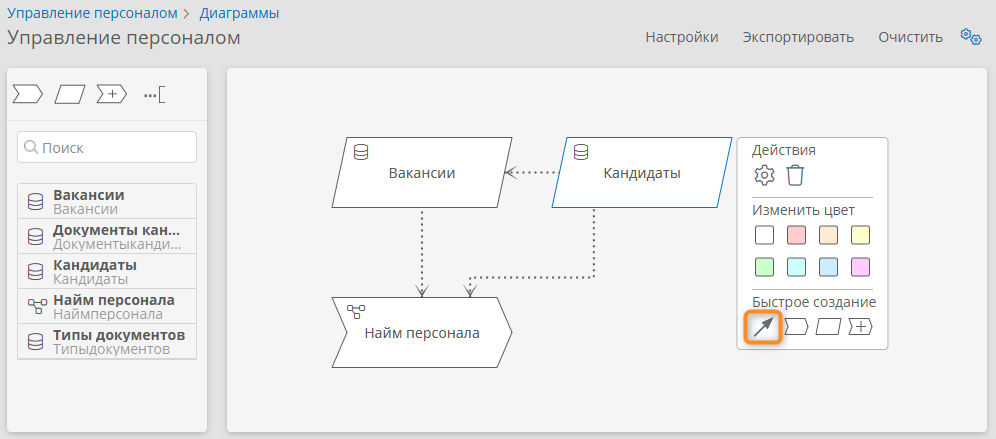

# Урок 6. Мониторинг и аналитика {: #tutorial_hr_lesson_6 }

## Введение

В этом уроке вы научитесь строить диаграммы моделей данных и бизнес-способностей, создавать дашборды, настраивать таблицы и фильтры, а также использовать диаграмму процесса для мониторинга статусов кандидатов. Все действия выполняются на примере процесса найма персонала.

**Расчётная продолжительность:** 60 мин.

## Определения

- **Диаграмма модели данных (ER-диаграмма)** — визуальное представление структуры данных приложения, связей между шаблонами записей и их атрибутами.
- **Диаграмма бизнес-способностей** — схема, отражающая ключевые функции и объекты бизнес-процесса.
- **Дашборд** — страница с визуальными отчётами, диаграммами и показателями.
- **Таблица** — представление записей с возможностью фильтрации и сортировки.
- **Фильтр** — инструмент для отбора записей по заданным критериям.
- **Диаграмма процесса** — графическое отображение текущего состояния экземпляра бизнес-процесса.
- **Токен** — маркер, указывающий на текущий этап выполнения процесса.

## Пошаговая инструкция

### Диаграмма модели данных (ER-диаграмма)

1. Перейдите в раздел **Диаграммы** приложения _«Управление персоналом»_.
2. Нажмите кнопку **Создать** и выберите тип диаграммы — _«Модель данных»_.
3. Введите название диаграммы, например _«Найм кандидатов»_.
4. В настройках выберите опцию _«Показать связанные элементы»_.
5. Добавьте на диаграмму шаблоны _«Кандидаты»_, _«Вакансии»_, _«Документы кандидатов»_, _«Типы документов»_, _«Штатные единицы»_.
6. Проверьте, что все связи между шаблонами отображаются корректно.
7. Сохраните диаграмму.

__

### Диаграмма бизнес-способностей

1. В разделе **Диаграммы** нажмите **Создать** и выберите тип _«Бизнес-способности»_.
2. Введите название, например _«Управление персоналом»_.
3. Добавьте объекты: _«Найм персонала»_, _«Вакансии»_, _«Кандидаты»_.
4. Свяжите объекты: _«Вакансии»_ и _«Кандидаты»_ к _«Найм персонала»_.
5. Сохраните диаграмму.

__

### Создание дашборда и раздела навигации

1. Перейдите в раздел **Навигация** приложения.
2. Нажмите **Создать раздел** и введите название _«HR-менеджер»_.
3. Добавьте в раздел ссылки на шаблоны _«Кандидаты»_, _«Вакансии»_, _«Документы кандидатов»_, а также на дашборды и диаграммы.
4. Сохраните раздел.

### Создание дашборда для мониторинга

1. Перейдите в раздел **Страницы** или **Дашборды**.
2. Нажмите **Создать страницу** и введите название, например _«HR»_.
3. Добавьте на страницу виджет _«Диаграмма»_.
4. В настройках диаграммы выберите тип _«Кольцевая»_.
5. В поле _«Шаблон»_ выберите _«Кандидаты»_.
6. В поле _«Категории»_ выберите _«Оценка за прохождение собеседования»_.
7. В поле _«Вычислять»_ выберите _«Значения»_.
8. В поле _«Итоги по атрибуту»_ выберите _«Оценка за прохождение собеседования»_.
9. В поле _«Периоды»_ выберите _«Месяц»_, _«Квартал»_, _«Год»_.
10. Сохраните страницу.

__

### Мониторинг процесса и токенов

1. Создайте несколько экземпляров шаблона процесса _«Найм персонала»_, задавая разные значения атрибутов для разных сценариев (например, успешное и неуспешное прохождение этапов).
2. Перейдите в раздел **Экземпляры процессов** и выберите нужный экземпляр.
3. Откройте **Диаграмму процесса** — вы увидите, на каком этапе находится каждый кандидат (токен).
4. Используйте панель **Токены** для перехода между задачами.

__

### Настройка таблицы и фильтров

1. Перейдите в шаблон записи _«Кандидаты»_.
2. Откройте вкладку **Таблицы** и выберите таблицу _«Все записи»_.
3. В настройках таблицы добавьте колонки: _ФИО_, _Результат тестирования_, _Оценка за прохождение собеседования_, _Результаты собеседования_.
4. Для колонки _«Результаты собеседования»_ настройте фильтр: выберите тип фильтрации (например, по значению или диапазону).
5. Сохраните таблицу.

__

## Итоги урока

Теперь вы умеете:
- Строить ER-диаграммы и диаграммы бизнес-способностей для HR-процессов
- Создавать дашборды и страницы для мониторинга показателей найма
- Настраивать таблицы и фильтры для анализа данных о кандидатах
- Использовать диаграмму процесса и токены для отслеживания статусов кандидатов
- Организовывать навигацию для разных ролей

---

_В следующем уроке вы научитесь настраивать систему управления доступом для участников процесса найма персонала._


