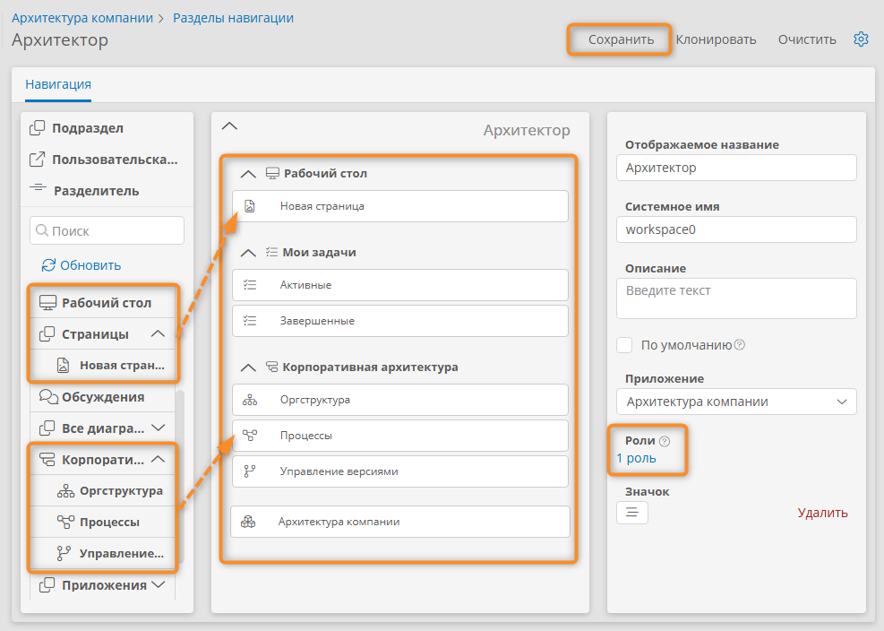

# Урок 2. Вход в систему, рабочий стол, навигация, роли, оргструктура {: #tutorial_architect_lesson_2 }

## Введение {: #tutorial_architect_lesson_2_intro }

В ходе этого урока вы познакомитесь с основными элементами интерфейса модуля «**{{ productNameArchitect }}**», научитесь настраивать рабочий стол и навигацию для решения повседневных задач.

Затем вы создадите свою первую оргструктуру, которая понадобится для прохождения последующих уроков, а также настроите роли и права доступа для эффективного разграничения обязанностей.

**Предусловия:**

- Имеется доступ к веб-сайту с **{{ productNameEnterprise }}**.
- Пройден _[урок 1 «Обзор возможностей {{ productNameEnterprise }} и понятий BPMS»][tutorial_architect_lesson_1]_
- **Рекомендуется** ознакомиться со следующими материалами, чтобы получить базовые навыки работы с **{{ productNameEnterprise }}**:
    - _[Спаравочник по модулю «{{ productNameArchitect }}»][architect_description]_
    - _Курс «[Аналитик. Ознакомительный][tutorial_hr]»_

**Расчётная продолжительность:** 45 мин.

!!! warning "Бизнес-логика"

    Удобная навигация по интерфейсу системы и разграничение ролей пользователей — ключ к эффективной работе с корпоративной архитектурой.
    
    Освоив настройку навигации в системе, вы сможете минимизировать ошибки, быстро реагировать на изменения и уверенно выполнять задачи как архитектор.

    Для построения полноценной архитектуры предприятия необходимо определить зоны ответственности и разграничить полномочия между подразделениями и сотрудниками. Это позволит создать основу для автоматизации процессов, контроля доступа и формирования отчётности.

    Ваша задача — смоделировать оргструктуру компании, чтобы получить инструмент для роста, цифровой трансформации и повышения управляемости.



## Темы, навыки и задания урока {: #tutorial_architect_lesson_2_taxonomy }

### Темы {: #tutorial_architect_lesson_2_topics }

- Вход в систему и смена пароля
- Приложение
- Рабочий стол
- Навигация
- Роли пользователей
- Оргструктура
- Атрибуты оргединиц
- Вычисления

### Навыки {: #tutorial_architect_lesson_2_skills }

- Создавать приложение
- Настраивать рабочий стол и навигацию
- Настраивать роли согласно полномочиям пользователей
- Настраивать простые вычисления
- Входить в систему под требуемыми ролями
- Формировать организационно-функциональную структуру
- Настраивать атрибуты и формы оргединиц
- Настраивать вычисления атрибутов

### Задания {: #tutorial_architect_lesson_2_tasks }

- Получить доступ к системе и научиться настраивать свой аккаунт (например, сменить пароль)
- Создать приложение для моделирования корпоративной архитектуры
- Настроить рабочий стол
- Создать роль Архитектора
- Настроить навигацию для Архитектора
- Войти под разными ролями
- Создать простейшую оргструктуру
- Настроить атрибут и форму оргединицы
- Настроить вычисления

<div class="admonition question" markdown="block">

## Определения {: #tutorial_architect_lesson_2_definitions }

- **Рабочий стол** — сводная страница, содержащая информационные и аналитические данные.
- **Архитектор** — пользователь, моделирующий процессы, настраивающий оргструктуру, согласующий и публикующий изменения.
- **Раздел навигации** — набор пунктов, позволяющих переходить к различным страницам.
- **Организационная структура, оргструктура** — иерархическое представление подразделений, должностей и сотрудников предприятия, отражающее их функции, структуру управления и распределение ролей.

</div>

## Вход в {{ productNameEnterprise }} {: #tutorial_hr_lesson_2_login }



__

## Настройка аккаунта {: #tutorial_hr_lesson_2_account }

На странице «**Мой аккаунт**» вы можете просмотреть персональную информацию и сменить пароль.

!!! note "Примечание"

    Некоторые или все действия на странице «**Мой аккаунт**» для вас могут быть недоступны в зависимости от разрешений, выданных системным администратором.

1. Нажмите значок с вашими инициалами в правом верхнем углу страницы.
2. Выберите пункт «**Мой аккаунт**» <i class="fa-light fa-address-card"></i>.
3. Отобразится страница «**Мой аккаунт**».

    __

4. Чтобы сменить пароль, нажмите кнопку «**Сменить пароль**».
5. Чтобы изменения вступили в силу, нажмите кнопку «**Сохранить**».

    __

## Создание приложения {: #tutorial_architect_lesson_2_application_create }

Создадим приложение для моделирования корпоративной архитектуры.

!!! question "Приложения в {{ productNameEnterprise }}"

    **Приложения** в **{{ productNameEnterprise }}** содержат все сущности, необходимые для моделирования архитектуры: реестры данных, навигацию, формы, роли и т. п.

    Приложения позволяют изолировать архитектурные модели и логику для различных бизнес-направлений.

1. Нажмите значок с вашими инициалами в правом верхнем углу страницы.
2. Выберите пункт «**Администрирование**» <i class="fa-light fa-cog"></i>.

    __

3. На странице «**Администрирование**» выберите пункт «**Архитектура**» — «**Приложения**» <i class="fa-light fa-cubes"></i>.
4. Отобразится список приложений.
5. Создайте приложение _«Архитектура компании»_.

    __

## Настройка роли «Архитектор» {: #tutorial_architect_lesson_2_role_configure }

Настроим роль _«Архитектор»_ для пользователя, который будет моделировать корпоративную архитектуру предприятия.

!!! warning "Бизнес-логика"

    Так как Архитектору требуется работать со всеми сущностями приложения _«Архитектура компании»_, предоставим ему полный доступ ко всем его ресурсам с помощью роли _«Архитектор»_.

!!! question "Роли в {{ productNameEnterprise }}"

    **Роли** в приложениях **{{ productNameEnterprise }}** служат для настройки доступа пользователей к ресурсам приложения согласно их полномочиям.

1. Откройте приложение _«Архитектура компании»_.

    __

2. На странице администрирования приложения выберите пункт «**Роли**» <i class="fa-light fa-user-shield"></i>.
3. Создайте роль _«Архитектор»_.
4. На вкладке «**Свойства роли**» добавьте свой аккаунт в список «**Выбранные аккаунты и группы**». Для этого дважды нажмите его в списке «**Доступные аккаунты и группы**» . Это необходимо для доступа к разделу навигации _«Архитектор»_.

    __

10. На вкладке «**Разрешения**» перетащите из панели ресурсов слева приложение _«Архитектура компании»_ на панель разрешений.

    !!! tip "Совет"

        В панели ресурсов можно использовать поле поиска, чтобы найти приложение по его названию.

11. Предоставьте к приложению _«Архитектура компании»_ **полный доступ**, установив соответствующий флажок.
12. Сохраните роль.

    __

## Настройка панели навигации и рабочего стола {: #tutorial_architect_lesson_2_desktop }

Настроим панель навигации и рабочий стол для удобства работы Архитектора.

!!! question "Рабочий стол {{ productNameEnterprise }}"

    На стандартном рабочем столе модуля «**{{ productNameArchitect }}**» предусмотрены полезные виджеты, например:

    - **С чего начать?** — поможет новичкам быстро приступить к работе.
    - **Быстрые действия** — позволяют быстро выполнять типовые операции.

    Для каждого приложения в **{{ productNameEnterprise  }}** настраивается отдельный рабочий стол.

    См. _«[Рабочий стол «{{ productNameArchitect }}»][architect_desktop_operations]»_.

1. Откройте приложение _«Архитектура компании»_.
2. На странице администрирования приложения выберите пункт «**Разделы навигации**» <i class="fa-light fa-list-dropdown"></i>.
3. Создайте раздел навигации _«Архитектор»_.
4. Отобразится конструктор раздела навигации.
5. Перетащите с расположенной слева панели элементов пункт «**Корпоративная архитектура**» на макет раздела навигации.

    !!! tip "Совет"

        В панели элементов можно использовать поле поиска, чтобы найти необходимые элементы по их названию.

6. Перетащите приложение _«Архитектура компании»_ на макет.
7. Перетащите «**Рабочий стол**» на макет.
8. Перетащите «**Мои задачи**» на макет.
9. Раскройте в панели слева пункт «**Страницы**».
10. Перетащите **новую страницу** внутрь **рабочего стола** на макете.
11. Назначьте раздел навигации роли _«Архитектор»_:

    - В панели свойств раздела навигации нажмите ссылку «**0 ролей**».
    - Отобразится окно выбора ролей.
    - В левом списке ролей дважды нажмите роль _«Архитектор»_, чтобы переместить её в правый список.
    - Нажмите кнопку «**Применить**».

    __

12. Сохраните раздел навигации.
13. Обновите страницу в браузере, чтобы изменения вступили в силу.

    __

## Тестирование навигации {: #tutorial_architect_lesson_2_navigation_testing }

1. Выберите в панели навигации пункт «**Рабочий стол**» <i class="fa-light fa-desktop"></i>.
2. Отобразится рабочий стол с разделами «**Добро пожаловать**» и «**С чего начать?**».
3. На вкладке «**Создайте архитектуру**» нажмите кнопку «**Реестр процессов**».

    __

4. Отобразится **реестр процессов** приложения _«Архитектура компании»_.
5. В панели навигации нажмите кнопку «**Оргструктура**».
6. Отобразится реестр оргединиц приложения _«Архитектура компании»_.
7. Нажмите кнопку «**Управление версиями**».
8. Откроется страница «**Управление версиями**».

 __

## Создание оргструктуры {: #tutorial_architect_lesson_2_orgstructure }

1. В панели навигации выберите пункт «**Оргструктура**».
2. Отобразится реестр оргединиц приложения _«Архитектура компании»_.
3. Нажмите кнопку «**Создать**» <i class="fa-light fa-plus"></i>.
4. В раскрывающемся меню выберите пункт «**Должность**» <i class="fa-light  fa-user"></i>.

    __
5. В таблице появится запись «**Новая должность**».
6. Дважды нажмите строку «**Новая должность**».
7. Откроется конструктор оргструктуры.
8. Нажмите кнопку «**Редактировать**» <i class="fa-light fa-pen-nib"></i>.

    __

9. Дважды нажмите надпись «**Новая должность**».
10. Введите новое название _«Генеральный директор»_.
11. Нажмите любое место за пределами элемента.
12. Нажмите элемент _«Генеральный директор»_.
13. В меню элемента выберите пункт «**Новое подразделение**» <i class="fa-light fa-sitemap "></i>.

    __

14. Переименуйте созданное подразделение в _«HR-отдел»_.
15. От подразделения _«HR-отдел»_ добавьте должность _«Руководитель HR-отдела»_.
16. От должности _«Руководитель HR-отдела»_ добавьте должность _«Рекрутёр»_.
17. От должности _«Генеральный директор»_ добавьте новое подразделение _«Отдел продаж»_.
18. От подразделения _«Отдел продаж»_ добавьте должность _«Руководитель отдела продаж»_.
19. От должности _«Руководитель отдела продаж»_ добавьте должности _«Менеджер отдела продаж»_ и _«HR-менеджер»_.

    !!! tip "Перетаскивание элементов"

        Конструктор оргструктуры позволяет легко редактировать элементы и перемещать их внутри структуры, что и будет рассмотрено на следующем шаге.

20. Перетащите должность _«HR-менеджер»_ на должность _«Руководитель HR-отдела»_.

    __

!!! example "Факультативное задание"

    Добавьте в оргструктуру другие подразделения и должности, например _Службу безопасности_.

__

## Добавление атрибута оргединицы {: #tutorial_architect_lesson_2_unit_template }

!!! warning "Бизнес-логика"

    Для эффективного управления оргструктурой и прозрачного распределения обязанностей создадим атрибут _«Отдел»_.
    
    Этот атрибут позволит:

    - Быстро определять, к какому подразделению относится каждая должность.
    - Упростить поиск и фильтрацию сотрудников по отделам.
    - Автоматизировать процессы согласования, делегирования задач и контроля доступа на основе принадлежности к подразделению.
    - Повысить прозрачность структуры компании для новых сотрудников и руководителей.
    - Обеспечить корректное построение отчётов и аналитики по оргструктуре.

1. Откройте конструктор оргструктуры.
2. Нажмите кнопку «**Редактировать**» <i class="fa-light fa-pen-nib"></i>.
3. Нажмите кнопку «**Свойства**» <i class="fa-light fa-sidebar-flip"></i>.
4. Отобразится панель свойств должности.
5. Нажмите кнопку «**Изменить**» <i class="fa-light fa-arrow-up-right-from-square"></i>.

    __

6. Отобразится **форма** шаблона организационной единицы.
7. Чтобы создать новый атрибут, нажмите кнопку «**Добавить атрибут**» <i class="fa-light fa-plus"></i> в панели слева.

    __

8. Создайте атрибут _«Тип служебный»_ со следующими свойствами:

    - **Тип данных: текст**
    - **Вычислять автоматически:** флажок установлен
    - **Вычисляемое выражение: формула**

        ``` sql
        FORMAT("{0}",LIST($unitType)) 
        ```

9. Создайте атрибут _«Отдел»_ со следующими свойствами:

    - **Тип данных: текст**
    - **Вычислять автоматически:** флажок установлен
    - **Вычисляемое выражение: N3**

        ``` turtle
        @prefix object: <http://comindware.com/ontology/object#>. 
        { 
            # Получаем идентификаторы атрибутов по их системным именам:
            ("Архитектуракомпании_OrganizationalStructure" "Типслужебный") object:findProperty ?foundProperty. 
            ("Архитектуракомпании_OrganizationalStructure" "superiorUnit") object:findProperty ?superiorUnitProp. 
            ("Архитектуракомпании_OrganizationalStructure" "Отдел") object:findProperty ?Otdel. 
            ("Архитектуракомпании_OrganizationalStructure" "unitName") object:findProperty ?name. 

            # Если у текущей оргединицы "Типслужебный" равен "Department",
            # то в ?value помещаем её название (?unitName)
            if { ?item ?foundProperty "Department". } 
            then { ?item ?name ?value. } 
            else { 
                # Иначе ищем вышестоящее подразделение (?superiorUnit) и
                # помещаем значение его атрибута "Отдел" в ?value
                ?item ?superiorUnitProp ?superiorUnit. 
                ?superiorUnit ?Otdel ?value. 
            }. 
        }
        ```

10. Поместите атрибут _«Отдел»_ на **форму** шаблона оргединицы.

    __

11. В правилах для формы добавьте действие для элемента _«Отдел»_ со следующими свойствами:

    - **Действие: изменить доступ**
    - **Новое значение: скрыть**
    - **Условие выполнения: формула**
        
        ``` sql
        $Отдел == $unitName
        ```

    __

12. Сохраните правила для формы и форму.
13. Вернитесь к конструктору оргструктуры.
14. Нажмите должность _«HR-менеджер»_.
15. В свойствах должности отобразится отдел, к которому она относится.

__

## Итоги урока {: #tutorial_architect_lesson_2_summary }

Вы создали приложение _«Архитектура компании»_, настроили роль _«Архитектор»_ с необходимыми правами, настроили рабочий стол и организовали навигацию по основным разделам модуля «**{{ productNameArchitect }}**».

Кроме того, вы научились создавать и редактировать оргструктуру, а также настраивать атрибуты и формы оргединиц.

Теперь у вас есть основа для дальнейшего моделирования архитектуры компании.

В ходе [следующего урока][tutorial_architect_lesson_3] вы освоите моделирование процессной архитектуры, построение диаграмм бизнес-способностей и BPMN-диаграмм, импорт диаграмм и экспорт регламентов процессов.

<div class="relatedTopics" markdown="block">

--8<-- "related_topics_heading.md"

Подробные сведения о настройке **{{ productNameEnterprise }}** представлены в руководстве пользователя:

- [Использование интерфейса {{ productNameEnterprise }}][interface_use]
- [Приложения. Настройка][apps]
- [Панель навигации. Настройка][navigation_sections_setup]
- [Рабочий стол. Настройка][desktop_setup]
- [Роли. Настройка][roles]
- [Построение организационной структуры][architect_organizational_structure_design]
- [Просмотр и редактирование организационно-функциональной диаграммы][architect_organizational_structure_diagram_edit]
- [Атрибуты. Настройка][attributes]
- [Формы. Настройка][forms]
- [Правила для форм. Настройка][form_rules]
- [Язык формул. Использование][formula_guide]
- [Язык N3. Использование][n3_guide]

</div>


