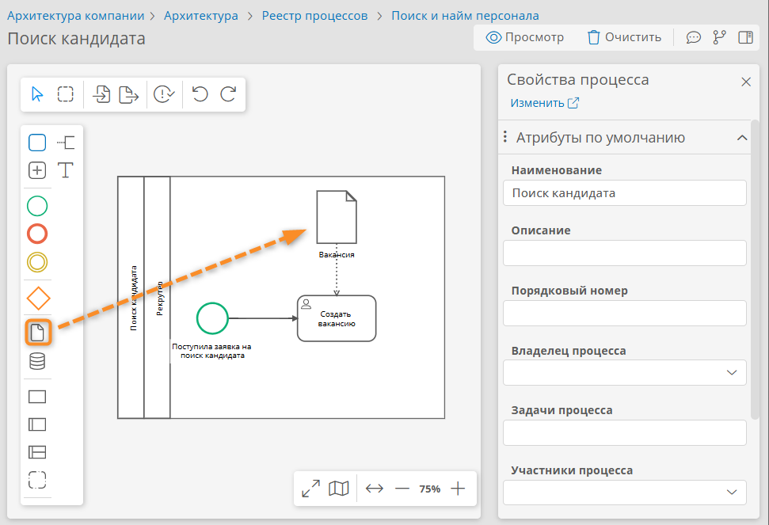
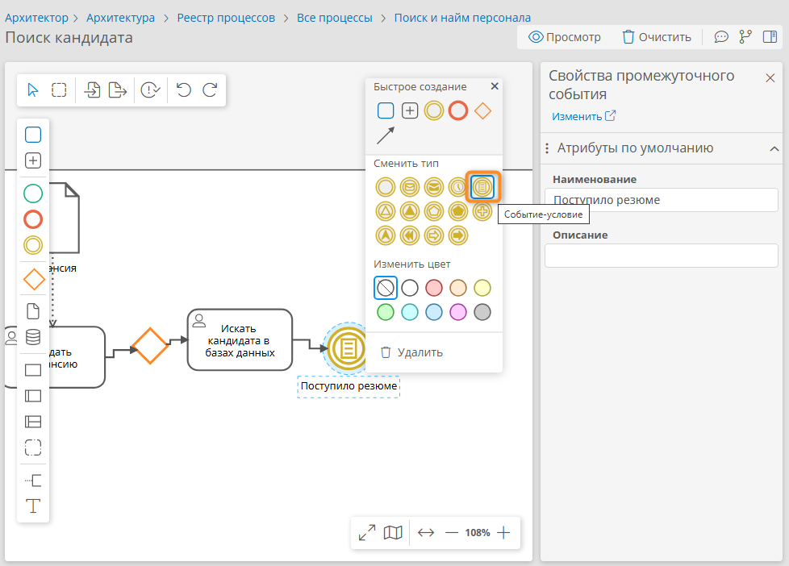

# Урок 3. Моделирование процессной архитектуры, импорт диаграмм, экспорт регламентов {: #tutorial_architect_lesson_3 }

## Введение {: #tutorial_architect_lesson_3_intro }

В ходе этого урока вы научитесь строить, интегрировать и публиковать процессную архитектуру предприятия с помощью инструментов **{{ productNameEnterprise }}**.

Вы освоите моделирование групп процессов, создание импорт диаграмм бизнес-способностей и BPMN-диаграмм, а также узнаете, как интегрировать процессы с оргструктурой.

**Предусловия:** пройден _«[Урок 2. Рабочий стол, навигация, роли, оргструктура][tutorial_architect_lesson_2]»_.

**Расчётная продолжительность:** 75 мин.

!!! warning "Бизнес-логика"

    Моделирование процессной архитектуры позволяет формализовать ключевые бизнес-процессы предприятия, связать их с организационно-функциональной структурой и повысить прозрачность бизнес-операций.

    Диаграммы бизнес-способностей позволяют выстроить взаимосвязи между ключевыми направлениями деятельности, выявить дублирование функций и точки роста. 
    
    Интеграция процессов с оргструктурой обеспечивает прозрачность ответственности, а публикация моделей — вовлечённость сотрудников и соблюдение стандартов.

    BPMN-диаграммы позволяют формализовать бизнес-процессы. Можно импортировать существующие BPMN-диаграммы, чтобы ускорить внедрение и обеспечить преемственность архитектуры.



## Темы и задания урока {: #tutorial_architect_lesson_3_taxonomy }

### Темы {: #tutorial_architect_lesson_3_topics }

- Построение процессной архитектуры с применением общепринятых нотаций: BPMN&nbsp;2.0 и бизнес-способности
- Использование элементов BPMN: событий, задач, развилок, потоков, объектов данных
- Связывание процессов через потоки сообщений
- Связывание элементов через потоки данных
- Интеграция процессов с оргструктурой
- Настройка участников и владельцев процессов
- Импорт диаграмм процессов
- Экспорт регламентов процессов

### Задания {: #tutorial_architect_lesson_3_tasks }

- Построить диаграмму бизнес-способностей
- Смоделировать бизнес-процесс
- Импортировать BPMN-диаграмму
- Привязать процессную модель к оргструктуре
- Настроить участников процесса
- Сформировать печатный регламент процесса

## Определения {: #tutorial_architect_lesson_3_definitions }

- **Процессная архитектура** — иерархия процессов, отражающая ключевые цепочки создания ценности в компании.
- **Диаграмма бизнес-способностей** — визуальное представление групп бизнес-процессов и их взаимосвязей, используемое для анализа и проектирования архитектуры предприятия.
- **BPMN-диаграмма** — модель бизнес-процесса в нотации BPMN&nbsp;2.0.
- **Конструктор диаграмм** — визуальный инструмент для построения BPMN-диаграмм и диаграмм бизнес-способностей.
- **Бизнес-процесс** — последовательность связанных задач, направленных на достижение конкретной бизнес-цели.
- **Палитра элементов** — процессы, события, задачи, развилки, потоки, объекты данных, группы и другие элементы, которые можно использовать в диаграммах.
- **Импорт** — получение моделей из внешних систем.
- **Шаблон экспорта** — структура для формирования печатных документов.
- **Базовые элементы BPMN** — в этом курсе используются следующие элементы:
    - **Пул** — представление участника процесса (обычно крупной единицы: организации, подразделения), служит контейнером всех элементов процесса.
    - **Скрытый пул** — используется для связывания процессов, представляя внешний или связанный процесс.
    - **Дорожка** — элемент пула, представляющий исполнителя (обычно мельче, чем на пуле: отдел, роль, сотрудник), который отвечает за выполнение элементов, расположенных на дорожке.
    - **Начальное событие** — точка старта процесса.
    - **Конечное событие** — точка завершения процесса.
    - **Пользовательская задача** — задача, выполняемая человеком.
    - **Развилка «или/или»** — точка, в которой выбирается один из нескольких путей дальнейшего хода процесса.
    - **Объект данных** — информационный ресурс, используемый или создаваемые в процессе.
    - **Поток управления** — соединение элементов процесса, обеспечивающее переход от предыдущего элемента к следующему.
    - **Поток сообщений** — соединение для обмена информацией между такими элементами, как пулы.
    - **Поток данных** — соединение объекта данных с задачей или событием, показывающее использование данных в процессе.

## Построение процессной архитектуры: группы процессов и диаграмма бизнес-способностей {: #tutorial_architect_lesson_3_groups }

В **{{ productNameEnterprise }}** процессная архитектура строится иерархически: группы процессов отражают ключевые направления деятельности, а диаграммы бизнес-способностей — взаимосвязи между ними.

!!! tip "Совет"

    Начинайте с выделения основных групп процессов согласно организационно-функциональной структуре и направлениям деятельности предприятия (например, _«Продажи», «HR», «Производство»_), чтобы структурировать архитектуру компании.

1. Выберите пункт «**Процессы**» в панели навигации.
2. Отобразится реестр процессов.
3. Нажмите кнопку «**Создать**» <i class="fa-light fa-plus"></i>.
4. В раскрывающемся меню выберите пункт «**Группа процессов**» <i class=" fal  fa-list-tree " aria-hidden="true"></i>.

    __

5. В реестре процессов появится **новая группа**.
6. Дважды нажмите **новую группу**.
7. Откроется **конструктор** группы процессов.
8. Нажмите кнопку «**Свойства**» <i class="fa-light fa-sidebar-flip"></i>.
9. Отобразится панель свойств группы процессов.
10. Нажмите кнопку «**Редактировать**» <i class="fa-light fa-pen-nib"></i>.
11. Введите **наименование** группы процессов _«Поиск и найм персонала»_.
12. Из палитры элементов перетащите на диаграмму новый **процесс**.
13. Переименуйте процесс в _«Поиск кандидата»_, дважды нажав его название.

    __

14. Добавьте на диаграмму новый процесс и переименуйте его в _«Найм кандидата»_.
15. Добавьте на диаграмму новый **ресурс** и переименуйте его в _«Кандидаты»_.

    __

16. Выберите на диаграмме процесс _«Поиск кандидата»_.
17. В меню элемента выберите «**Поток данных**».

    __

18. Соедините поток данных с ресурсом _«Кандидаты»_.
19. Соедините **потоком данных** ресурс _«Кандидаты»_ с процессом _«Найм кандидата»_.

__

## Моделирование процесса «Поиск кандидата» {: #tutorial_architect_lesson_3_bpmn }

Построим с нуля BPMN-диаграмму процесса _«Поиск кандидата»_.

### Формирование пула и дорожек {: #tutorial_architect_lesson_3_pools_lanes }

1. Откройте реестр процессов.
2. Дважды нажмите строку процесса _«Поиск кандидата»_.
3. Откроется диаграмма процесса.
4. Нажмите кнопку «**Редактировать**» <i class="fa-light fa-pen-nib"></i>.
5. Откроется конструктор процесса.
6. Поместите на диаграмму «**Основной пул**» и переименуйте его в _«Поиск кандидата»_.
7. Поместите в пул дорожку и переименуйте её в _«Рекрутёр»_.

### Настройка начального события-получения сообщения {: #tutorial_architect_lesson_3_start_event }

1. Поместите на дорожку **начальное событие** и переименуйте его в _«Поступила заявка на поиск кандидата»_.
2. Выберите событие _«Поступила заявка на поиск кандидата»_.
3. Измените тип события на «**Событие-получение сообщения**».

    __

### Настройка пользовательских задач, промежуточного события и развилок {: #tutorial_architect_lesson_3_user_tasks }

1. Выберите событие _«Поступила заявка на поиск кандидата»_.
2. В меню элемента выберите пункт «**Задача**».
3. На дорожке будет создана **абстрактная задача**, соединённая потоком управления с начальным событием.
4. Переименуйте задачу в _«Создать вакансию»_.
5. Нажмите задачу _«Создать вакансию»_ и измените его тип на **пользовательскую**.

    __

7. В свойствах задачи _«Создать вакансию»_ назначьте **исполнителем** _HR-менеджера_.
8. Поместите на дорожку **объект данных** и переименуйте его в _«Вакансия»_.
    __

9. Выберите объект _«Вакансия»_.
10. В меню элемента выберите пункт «**Поток данных**».

    __

11. Соедините **потоком данных** объект _«Вакансия»_ с задачей _«Создать вакансию»_.
13. Выберите задачу _«Создать вакансию»_.
14. В меню элемента выберите пункт «**Развилка «или/или**».
15. Будет создана развилка, соединённая с задачей **потоком управления**.

    __

16. От развилки **развилку «или/или»** добавьте **пользовательскую задачу** _«Искать кандидата в базах данных»_: создайте абстрактную задачу и преобразуйте её в пользовательскую.
17. От задачи _«Искать кандидата в базах данных»_ добавьте **промежуточное событие** _«Поступило резюме»_.
18. Выберите событие _«Поступило резюме»_ и измените его тип на «**Событие-условие**».

    __

19. От события _«Поступило резюме»_ добавьте пользовательскую задачу _«Договориться с кандидатом о собеседовании»_.
20. От задачи _«Договориться с кандидатом о собеседовании»_ добавьте **развилку «или/или»** и переименуйте её в _«Кандидат согласен пройти собеседование?»_.
21. От развилки _«Кандидат согласен пройти собеседование?»_ добавьте **поток управления** _«Нет»_ и соедините его с **развилкой «или/или»** перед задачей  _«Искать кандидата в базах данных»_.
22. От развилки _«Кандидат согласен пройти собеседование?»_ добавьте **поток управления** _«Да»_ и соедините его с простым **конечным событием**.

### Настройка пользовательских задач, промежуточного события и развилок {: #tutorial_architect_lesson_3_black_box_pool }

!!! warning "Логика работы скрытого пула"

    С помощью **скрытого пула** мы покажем на диаграмме процесса следующий связанный процесс _«Найм кандидата»_, не демонстрируя его внутреннее устройство.

    Скрытый пул связывается с другим процессом из диаграммы бизнес-способностей.
    
    Это позволяет показать переход от одного процессу к другому.

1. Поместите на диаграмму **скрытый пул** вне основного пула.

    __

2. В окне свойств скрытого пула выберите **связываемый процесс** _«Найм кандидата»_.

    __

3. Соедините **конечное событие** **потоком сообщений** со скрытым пулом _«Найм кандидата»_.

__

## Импорт процесса «Найм кандидата» {: #tutorial_architect_lesson_3_import }

Импортируем готовую BPMN-диаграмму процесса _«Найм кандидата»_ для ускорения моделирования и свяжем её с элементами оргструктуры.

!!! warning "Готовая диаграмма BPMN"

    Для взаимодействия с внешними системами или командами, использующими другие инструменты моделирования **{{ productNameEnterprise }}** позволяет импортировать и экспортировать диаграммы в формате `.BPMN`.
    
    Мы импортируем файл `Найм_кандидата.bpmn`, содержит готовую диаграмму процесса _«Найм кандидата»_ и свяжем её через скрытый пул с диаграммой  _«Поиск кандидата»_.

1. Скачайте на свой компьютер файл `Найм_кандидата.bpmn` [по этой ссылке](https://kb.comindware.ru/platform/v5.0/tutorial_architect/assets/Найм_кандидата.bpmn).
2. Откройте реестр процессов.
3. Дважды нажмите строку процесса _«Найм кандидата»_.
4. Откроется диаграмма процесса.
5. Нажмите кнопку «**Редактировать**» <i class="fa-light fa-pen-nib"></i>.
6. Откроется конструктор процесса.
7. Нажмите кнопку «**Импорт**» <i class="fa-light fa-file-import"></i>.

    __

8. Откроется окно импорта.
9. Выберите файл `Найм_кандидата.bpmn`.
10. Нажмите кнопку «**Продолжить**».

    __

11. Отобразится список процессов для импорта.
12. Установите флажок для процесса _«Найм кандидата»_.
13. Нажмите кнопку «**Импортировать**».

    __

14. Диаграмма процесса _«Найм кандидата»_ будет импортирована.
15. Проверьте и при необходимости отредактируйте диаграмму.
16. Нажмите скрытый пул _«Поиск кандидата»_ и выберите связываемый процесс _«Поиск кандидата»_.

__

!!! example "Факультативное задание"

    Усовершенствуйте архитектуру процессов и оргструктуры, чтобы она соответствовала следующему сценарию: Вакансия -> От вакансии до прохождения испытательного срока -> Сотрудник -> Группа процессов работы с сотрудником (перемещение, увольнение, начисление зарплаты, премирование, оформление отпуска и т.&nbpsp;д.).

    Смоделируйте отдельный процесс для обработки поступившего резюме, в котором поступление резюме – стартовое событие, а не промежуточное.

    Добавьте дополнительные группы процессов согласно организационной структуре своего предприятия.

## Настройка владельца, участников и формирование регламента процесса {: #tutorial_architect_lesson_3_versioning }

Зададим владельца и участников процесса, чтобы включить их в регламент.

Затем прикрепим к процессу _«Поиск кандидата»_ его печатный регламент в формате Word.

Регламенты процессов формируются с помощью **шаблонов экспорта**. В этом уроке мы рассмотрим использование встроенного в **{{ productNameEnterprise }}** шаблона экспорта. В [уроке 5][tutorial_architect_lesson_5] даны инструкции по настройке собственного шаблона экспорта.

1. Откройте процесс _«Поиск кандидата»_ для редактирования.
2. Откройте панель «**Свойства процесса**» <i class="fa-light fa-sidebar-flip"></i>.
3. Укажите свой аккаунт в качестве **владельца процесса**.
4. Укажите _Рекрутёра_ как **участника процесса**.
5. Нажмите кнопку «**Экспорт**» <i class="fa-light fa-file-export"></i> в верхнем левом углу диаграммы.
6. В раскрывающемся меню выберите пункт «**Экспорт регламента**» <i class="fa-light fa-file-export"></i>.
7. Скачайте регламент процесса в формате Word.
8. С помощью панели «**Свойства процесса**» добавьте скачанный файл  _«Поиск кандидата.docx»_ в поле «**Регламент в Word**».

__

!!! example "Факультативное задание"

    Сформируйте регламент процесса _«Найм кандидата»_ аналогичным образом.

<!-- __ -->

## Итоги урока {: #tutorial_architect_lesson_3_summary }

В ходе этого урока вы познакомились с построением процессной архитектуры: научились создавать группы процессов, строить диаграммы бизнес-способностей и BPMN-диаграммы, работать с элементами BPMN, связывать процессы через потоки сообщений и данных, настраивать участников и владельцев процессов, использовать инструменты импорта диаграмм и экспорта регламентов.

В ходе [следующего урока][tutorial_architect_lesson_4] вы научитесь создавать автоматизированные процессы для работы с архитектурными моделями, настраивать атрибуты и формы архитектурных моделей и выполнять процессы согласования изменений.

--8<-- "related_topics_heading.md"

Подробные сведения о настройке **{{ productNameEnterprise }}** представлены в руководстве пользователя:

- [Рекомендации по построению диаграмм бизнес-процессов][process_diagram_build_advice]
- [Построение процессной архитектуры][architect_process_architecture_design]
- [Просмотр и редактирование диаграмм процессов и бизнес-способностей][architect_process_architecture_diagram_edit]
- [Импорт и экспорт диаграмм и регламентов][architect_import_export]


