# Урок 4. Автоматизированные процессы, согласование и контроль изменений архитектурных моделей {: #tutorial_architect_lesson_4 }

## Введение и бизнес-логика {: #tutorial_architect_lesson_4_intro }

В ходе этого урока вы научитесь настраивать и использовать автоматизированные процессы и интегрировать их с архитектурными моделями с помощью **{{ productNameEnterprise }}**:

- создавать автоматизированные процессы и интегрировать их с архитектурными моделями;
- настраивать шаблоны архитектурных моделей, их атрибуты и формы;
- настраивать кнопки и сценарии для автоматизации операций;
- реализовывать процессы согласования архитектурных моделей.

Освоив этот урок, вы сможете обеспечить качественный контроль изменений корпоративной архитектуры через формализованные и автоматизированные процессы согласования, что снижает риски ошибок, обеспечивает вовлечённость всех заинтересованных сторон и контроль внедрения новых архитектурных моделей.

**Предусловия:** пройден [урок 3 «Моделирование процессной архитектуры»][tutorial_architect_lesson_3].

**Расчётная продолжительность:** 70 мин.

!!! warning "Бизнес-логика"

    Компания внедряет новые процессы и совершенствует корпоративную архитектуру согласно требованиям бизнеса и регуляторов.
    
    Для обеспечения качества и прозрачности новых решений требуется не только моделировать процессы, но и управлять их изменениями: согласовывать процессы силами лиц, принимающих решения относительно корпоративной архитектуры.
    
    Это позволит быстро адаптироваться к изменениям бизнеса и законодательства.



<div class="admonition question" markdown="block">

## Определения {: #tutorial_architect_lesson_4_definitions }

- **Согласование** — процесс утверждения объекта корпоративной архитектуры с фиксацией решений и комментариев.
- **Модель** — формализованное представление объекта (например, процесса, элемента BPMN, бизнес-способности и т.&nbsp;п.), включающее его структуру, атрибуты, взаимосвязи и поведение. Модели используются для описания, анализа и автоматизации архитектурных решений.
- **Архитектурная модель** — формализованное представление элемента корпоративной архитектуры предприятия, например процесса, бизнес-способности или оргединицы.
- **Шаблон модели** — структура для настройки и хранения архитектурных моделей, содержит атрибуты, формы и другие данные модели. Используется аналогично шаблону записи. Шаблон модели можно связать с автоматизированным процессом.
- **Автоматизированный процесс** — процесс, моделируемый с помощью диаграммы процесса (BPMN 2.0), который может быть запущен и выполнен автоматизированной системой. Такой процесс управляет последовательностью задач, действий, назначением исполнителей, выполнением сценариев, отправкой сообщений и позволяет автоматизировать бизнес-логику и контроль изменений.
- **Шаблон процесса** — структура для настройки и хранения автоматизированных процессов, содержит атрибуты, формы и другие данные автоматизированного процесса.

</div>

## Темы и задания урока {: #tutorial_architect_lesson_4_taxonomy }

### Темы {: #tutorial_architect_lesson_4_topics }

- Настройка выполнение автоматизированных процессов согласования корпоративной архитектуры
- Интегрировать автоматизированные процессы с архитектурными моделями предприятия
- Настройка шаблонов, атрибутов и форм архитектурных моделей
- Настройка автоматизированных пользовательских задач
- Настройка исполнителей задач через атрибуты и оргструктуру
- Настройка кнопок и сценариев для автоматизации операций

### Задания {: #tutorial_architect_lesson_4_tasks }

- Создать автоматизированный процесс согласования архитектурной модели
- Настроить форму пользовательской задачи процесса
- Настроить атрибуты и форму шаблона архитектурной модели
- Настроить кнопку для запуска автоматизированного процесса
- Настроить сценарий для изменения данных архитектурной модели
- Выполнить процесс согласования архитектурной модели

## Настройка согласования архитектурных моделей процессов

!!! warning "Бизнес-логика"

    **{{ productNameEnterprise }}** позволяет моделировать и интегрировать автоматизированные процессы и архитектурные модели для автоматизации управления корпоративной архитектурой.
    
    Настроим автоматизированный процесс согласования архитектурных моделей процессов.

### Настройка автоматизированного процесса «Согласование процесса» {: #tutorial_architect_lesson_4_automated_process }

Настроим автоматизированный процесс, который позволит согласовывать архитектурные модели процессов предприятия.

#### Создание шаблона процесса {: #tutorial_architect_lesson_4_automated_process_template }

1. Перейдите к приложению _«Архитектура компании»_.
2. Откройте страницу «**Шаблоны**».
3. Откройте вкладку «**Шаблоны процессов**».
4. Создайте шаблон процесса со следующими свойствами:

    - **Название:** _Согласование процесса_
    - **Связь с шаблоном записи: связать с существующим шаблоном**
    - **Связанный шаблон: Процессы**

    _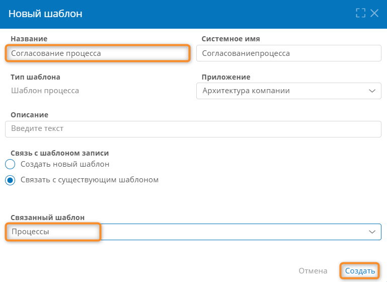_

5. Будет создан шаблон _«Согласование процесса»_.
6. Отобразится страница настройки шаблона _«Согласование процесса»_.
7. Теперь можно настроить диаграмму автоматизированного процесса _«Согласование процесса»_.

#### Настройка диаграммы процесса {: #tutorial_architect_lesson_4_automated_process_template }

1. Перейдите на вкладку «**Диаграмма**» шаблона _«Согласование процесса»_.
2. Откроется диаграмма автоматизированного процесса для редактирования.
3. Переименуйте **начальное событие** в _«Нажата кнопка «Согласовать»_.
4. После начального события добавьте **пользовательскую задачу**.
5. Выберите задачу на диаграмме и с помощью меню элемента настройте **свойства** задачи:

    - На вкладке «**Основные**» задайте **название** _«Согласовать процесс»_.
    - На вкладке «**Дополнительные**»:
        - В поле «**Исполнители**» укажите **атрибут** «**Владелец процесса**».
        - Задайте **заголовок задачи** _«Согласовать процесс»_.

    _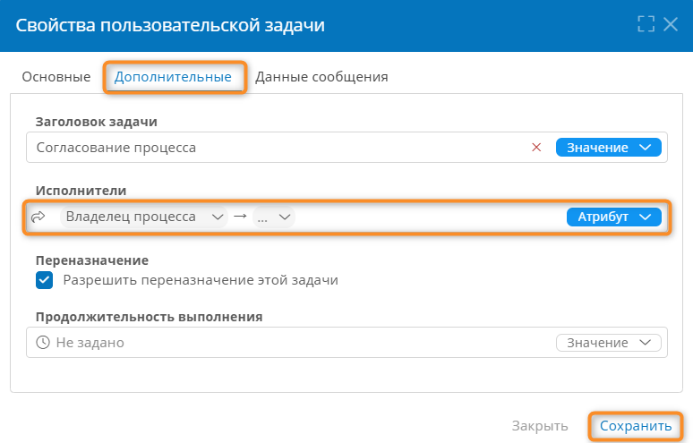_

6. Откройте форму задачи.
7. Поместите область на макет и переименуйте её в _«Решение по согласованию процесса»_.
8. В панели слева нажмите кнопку «**Добавить атрибут**» <i class="fa-light fa-plus"></i> у атрибута «**Процессы**».

    _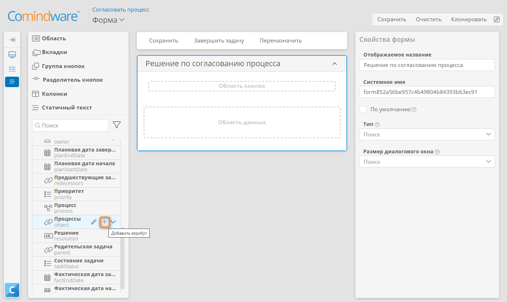_

9.  Создайте **логический** атрибут _«Согласован»_.
10. Раскройте атрибут «**Процессы**» в панели слева.

    _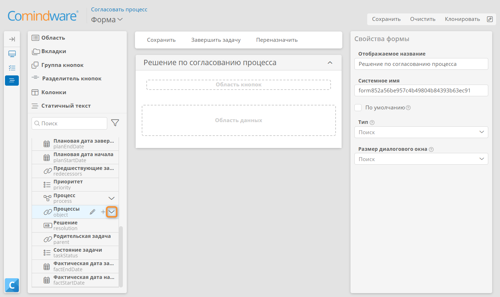_

11. Поместите атрибут _«Согласован»_ на область _«Решение по согласованию процесса»_.
12. В свойствах поля _«Согласован»_ установите параметр «**Отображать как: переключатель**».
13. Поместите на макет **форму «Процессы»**.
14. Сохраните форму.

    _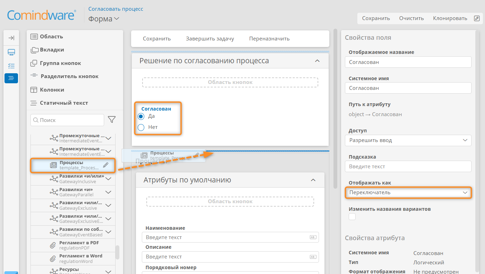_

15. Вернитесь к редактированию диаграммы процесса.
16. После пользовательской задачи _«Согласовать процесс»_ добавьте **развилку «или/или»** и переименуйте её в _«Процесс согласован?»_.
17. Соедините развилку _«Процесс согласован?»_ с простыми конечными событиями _«Процесс согласован»_ и _«Процесс не согласован»_.
18. Откройте свойства развилки _«Процесс согласован?»_.
19. На вкладке «**Дополнительные**» установите следующие значения:

    | Поток «иначе»     | Конечная точка          | Условие                    |
    | ----------------- | ----------------------- | -------------------------- |
    |                   | _Процесс согласован_    | **Формула:** `$Согласован` |
    | Флажок установлен | _Процесс не согласован_ |                            |

    !!! warning "Развилка по значению логического атрибута"

        Формула `$Согласован` возвращает значение `True`, если на форме задачи _«Согласовать процесс»_ в поле _«Согласован»_ выбран пункт _«Да»_.

        Таким образом на развилке выбирается ход процесса к конечному событию, соответствующему значению атрибута _«Согласован»_.

    _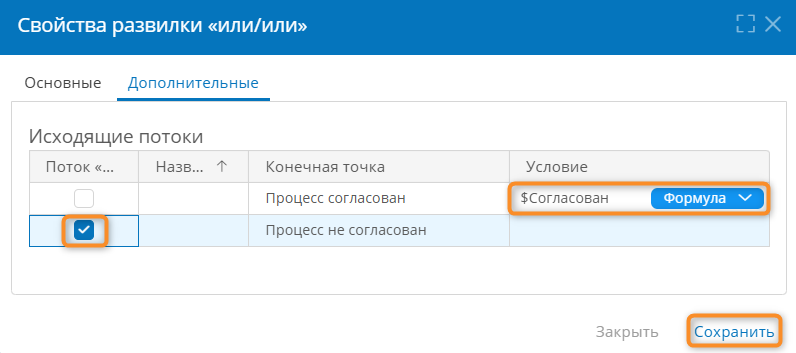_

20. Нажмите кнопку «**Проверить**».

    - Если будут выявлены проблемы, под диаграммой отобразится список ошибок и предупреждений, относящихся к элементам диаграммы.
    - Нажимайте на ошибки и предупреждения в списке, чтобы перейти к соответствующим элементам на диаграмме.
    - Устраните все ошибки и по возможности предупреждения.
    - Снова проверьте диаграмму и устраните оставшиеся ошибки — опубликовать диаграмму с ошибками невозможно.

21. Опубликуйте диаграмму, нажав кнопку «**Опубликовать**».
22. Должна получиться показанная ниже диаграмма:

    _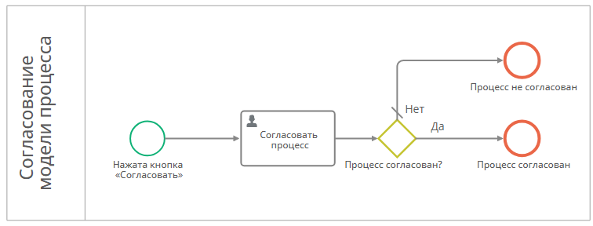_

23. Теперь настройте **шаблон модели «Процессы»**, чтобы запускать для архитектурной модели процесса автоматизированный процесс _«Согласование процесса»_.

### Настройка шаблона модели «Процессы» {: #tutorial_architect_lesson_4_model_template }

!!! warning "Бизнес-логика"

    В процессе согласования модели процесса необходимо указывать, хранить и отслеживать статус согласования.

    Для этого дополним шаблон архитектурной модели логическим атрибутом. 
    Данный атрибут поместим на форму модели процесса в виде переключателя.

!!! question "Определения"

    **Шаблон модели «Процессы»** содержит данные всех моделей процессов, настроенных в корпоративной архитектуре.

   **Форма шаблона модели** отображается на панели свойств в редакторе диаграмм **{{ productNameEnterprise }}**.

1. Откройте процесс _«Поиск кандидата»_.
2. Откройте «**Свойства**» <i class="fa-light fa-sidebar-flip"></i>.
3. Нажмите кнопку «**Изменить**» <i class="fa-light fa-arrow-up-right-from-square"></i>.
4. Перейдите к шаблону модели «**Процессы**».
5. Перейдите на вкладку «**Кнопки**».
6. Создайте кнопку со следующими свойствами:

    - **Отображаемое название:** _Согласовать_
    - **Контекст операции: модель**
    - **Операция: запустить процесс**
    - **Результат выполнения: обновить данные**
    - **Шаблон:** _Согласование процесса_

7. Сохраните кнопку.

    _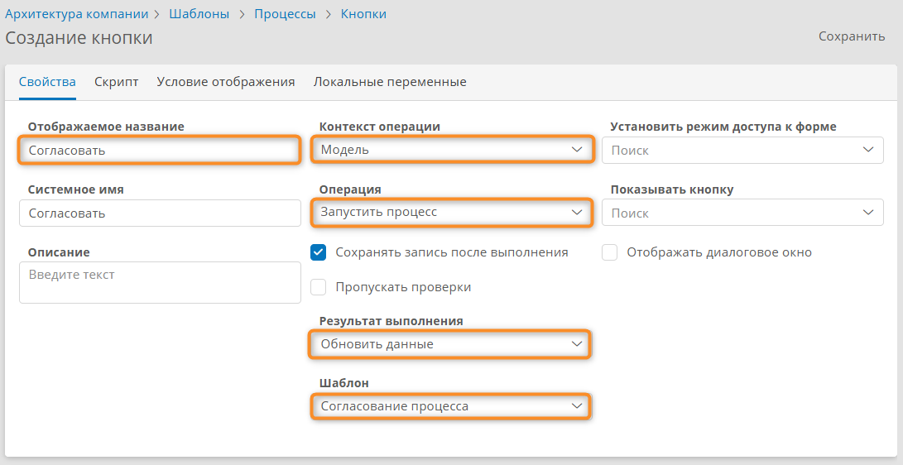_

8. Перейдите на вкладку «**Формы**».
9. Откройте форму «**Процессы**».
10. Добавьте на область «**Атрибуты по умолчанию**» атрибут _«Согласован»_.
11. Добавьте в область кнопок области «**Атрибуты по умолчанию**» кнопку _«Согласовать»_.

    _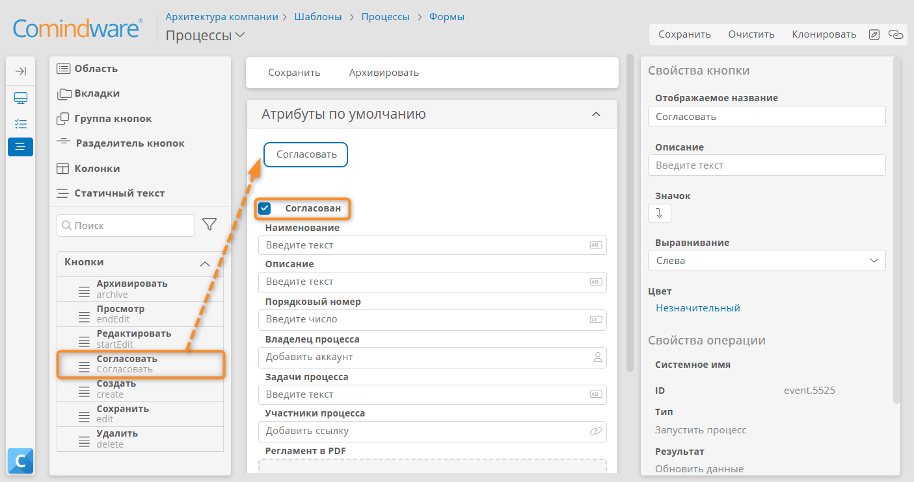_

12. Сохраните форму.

### Настройка сценария для отслеживания изменений моделей процессов {: #tutorial_architect_lesson_4_process_diagram_change_tracking }

!!! warning "Бизнес-логика"

    При изменении модели процесса в рамках корпоративной архитектуры её статус согласования должен сбрасываться. После чего потребуется согласовать модель процесса заново.

    Для этого настроим сценарий, который будет срабатывать при внесении любых изменений в модели процессов, включая изменения диаграммы и свойств процесса.

1. Откройте приложение _«Архитектура компании»_.
2. Перейдите на страницу «**Сценарии**».
3. Создайте сценарий _«Редактирование процесса»_.
4. Задайте для **начального события** следующие свойства:

    - **Тип: изменение записи**
    - **Контекстный шаблон: Процессы**

    _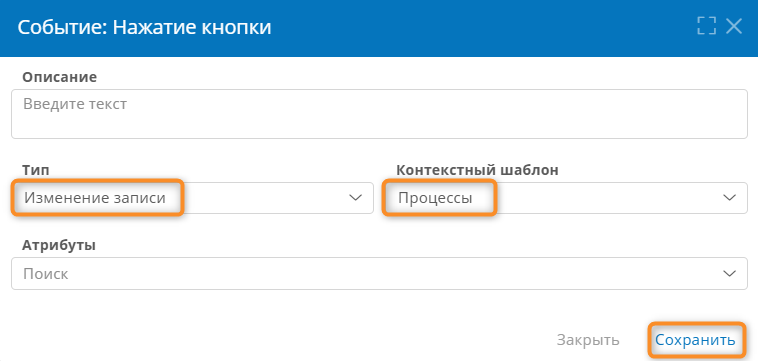_

5. После начального события добавьте действие «**Изменить значение атрибутов**» со следующими свойствами:

    - **Атрибут:** _Согласован_
    - **Операция со значениями: заменить**
    - **Значение: формула**

        ``` sql
        False
        ```

    !!! warning "Изменение статуса согласования с помощью формулы"

        Данное действие будет изменять значение атрибута _«Согласован»_ на `False` при срабатывании сценария, то есть при любом изменении модели процесса в корпоративной архитектуре.

    _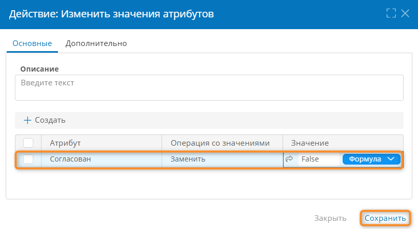_

6. Сохраните действие.
7. Должен получиться показанный ниже сценарий:

    _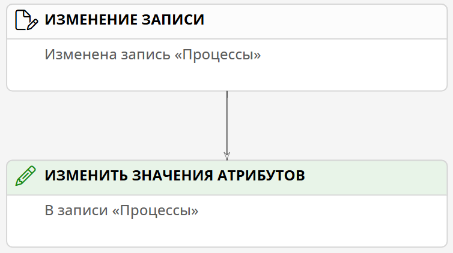_

8. Теперь можно проверить работоспособность автоматизированного процесса и сценария.

## Тестирование процесса согласования архитектурной модели {: #tutorial_architect_lesson_4_approval }

!!! warning "Бизнес-логика"

    При внесении изменений в архитектурную диаграмму процесса всегда запускается автоматизированный процесс согласования: это снижает риски ошибок и обеспечивает вовлечённость участников процесса.

1. Выберите пункт **«Архитектура»** — **«Процессы»** в панели навигации.
2. Откройте процесс _«Поиск кандидата»_ для редактирования.
3. Внесите в диаграмму или свойства процесса любые изменения.
4. Нажмите кнопку «**Свойства**» <i class="fa-light fa-sidebar-flip"></i>.
5. Отобразится панель свойств процесса.
6. Нажмите кнопку _«Согласовать»_.
7. При необходимости войдите в аккаунт владельца процесса.
8. Откройте «**Мои задачи**».
9. Перейдите к задаче согласования процесса.
10. Установите значение «**Да**» для атрибута _«Согласован»_.
11. Завершите задачу.
12. Вернитесь к диаграмме процесса _«Поиск кандидата»_.
13. Откройте свойства диаграммы.
14. Флажок _«Согласован»_ должен быть автоматически установлен.
15. Снова внесите изменения в диаграмму процесса. В результате флажок _«Согласован»_ должен быть автоматически снят.

## Итоги урока {: #tutorial_architect_lesson_4_summary }

В ходе этого урока вы научились создавать автоматизированные процессы, настраивать шаблоны моделей с атрибутами и формами, интегрировать автоматизированные процессы с архитектурными моделями, настраивать кнопки и сценарии для автоматизации операций, а также выполнять процессы согласования архитектурных моделей.

В ходе [следующего урока][tutorial_architect_lesson_5] вы научитесь формировать собственные шаблоны экспорта регламентов корпоративной архитектуры, управлять версиями корпоративной архитектуры, а также экспортировать диаграммы в различных форматах для интеграции с внешними системами.

<div class="relatedTopics" markdown="block">

--8<-- "related_topics_heading.md"

Подробные сведения о настройке **{{ productNameEnterprise }}** представлены в руководстве пользователя:

- [Шаблоны моделей][model_templates]
- [Атрибут типа «Модель»][attribute_model]
- [Шаблон автоматизированного процесса][process_templates]
- [Диаграмма автоматизированного процесса. Настройка][process_diagram]
- [Элементы диаграммы автоматизированного процесса][process_diagram_elements]
- [Стартовая форма и форма пользовательской задачи автоматизированного процесса. ][process_diagram_forms]
- [Кнопки. Настройка][buttons]
- [Сценарии. Настройка][scenarios]

</div>


