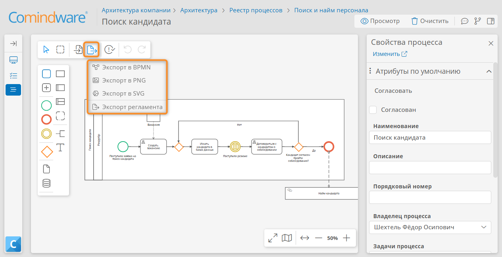
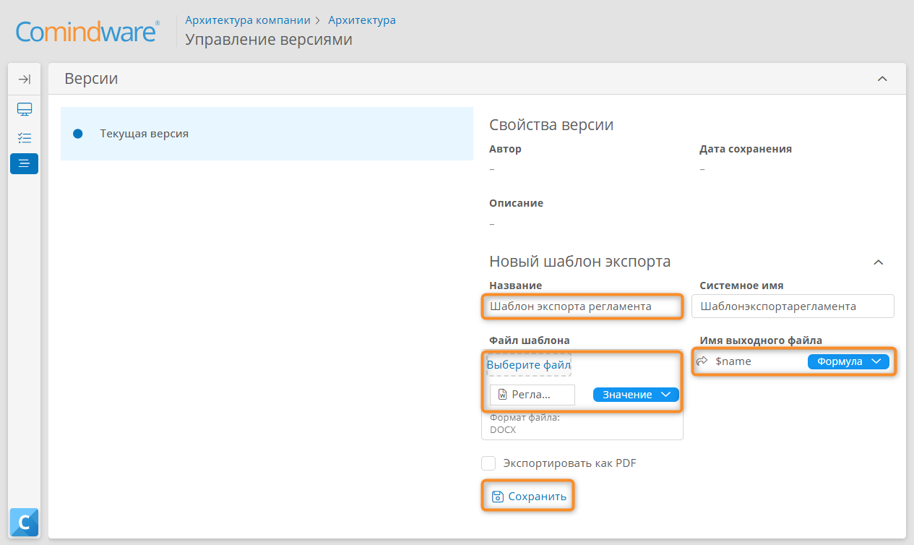
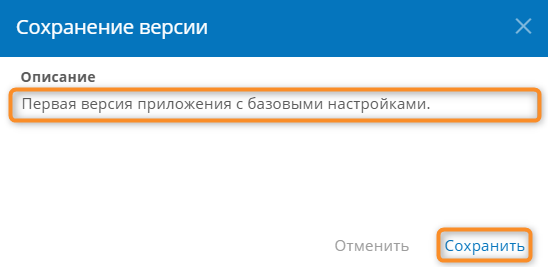
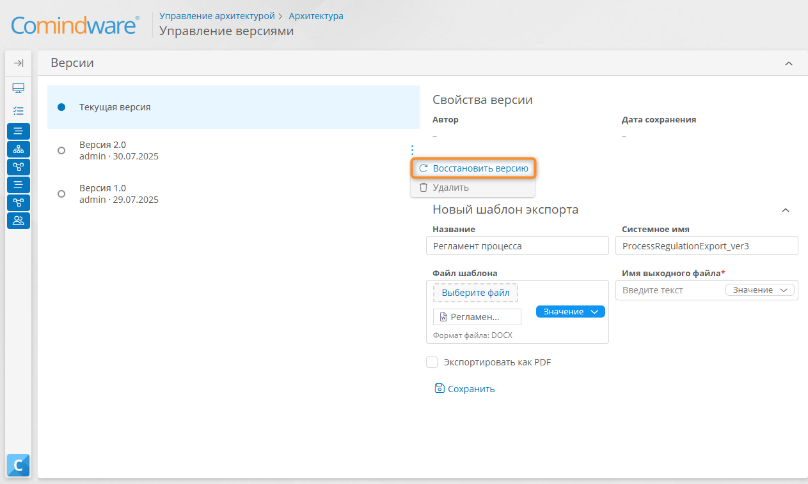
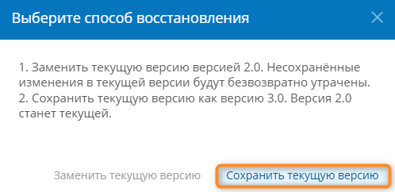
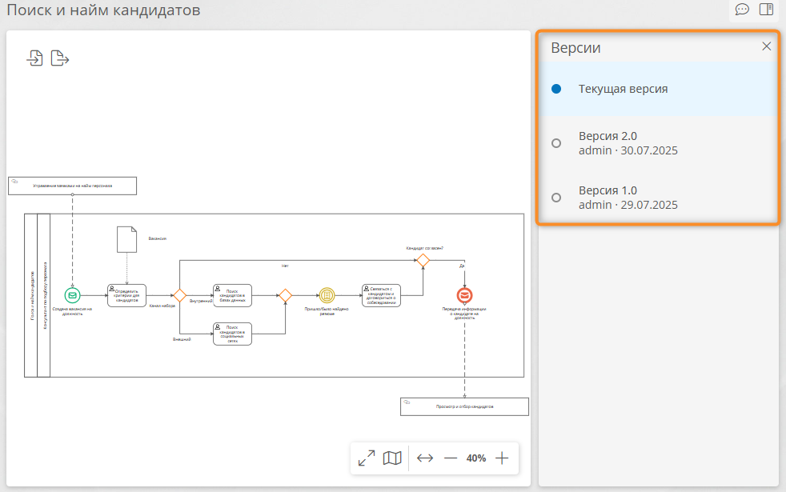

# Урок 5. Экспорт диаграмм, настройка экспорта регламентов, управление версиями архитектуры  {: #tutorial_architect_lesson_5 }

## Введение {: #tutorial_architect_lesson_5_intro }

В ходе этого урока вы научитесь настраивать и использовать собственные шаблоны экспорта для автоматического формирования регламентов по корпоративной архитектуре.

Кроме того, вы научитесь управлять версиями корпоративной архитектуры и экспортировать диаграммы для использования во внешних системах.
  
**Предусловия:** пройден [урок 4 «Согласование, аудит, публикация, контроль изменений»][tutorial_architect_lesson_4].

**Расчётная продолжительность:** 60 мин.

!!! warning "Бизнес-логика"

    Организации требуется автоматизировать генерацию регламентов и управление версиями архитектуры для обеспечения соответствия нормативным требованиям и стандартам качества при масштабировании бизнес-процессов. Также необходимо экспортировать архитектурные диаграммы для использования в сторонних ИТ-системах и внешних командах.

    Экспорт диаграмм обеспечивает интеграцию архитектурных моделей с внешними системами и облегчает совместную работу команд, использующих различные инструменты.

    Экспорт печатных регламентов позволяет снизить риск ошибок и обеспечить соблюдение корпоративных стандартов.

    Управление версиями корпоративной архитектуры позволяет отслеживать изменения, сохранять историю, возвращаться к стабильным версиям и обеспечивать актуальность процессов, оргструктуры, регламентов и моделей.



## Темы и задания урока {: #tutorial_architect_lesson_5_taxonomy }

### Темы {: #tutorial_architect_lesson_5_topics }

- Экспорт диаграмм в в форматах BPMN, PNG, SVG
- Настройка особых шаблонов экспорта архитектурных регламентов
- Управление версиями корпоративной архитектуры и диаграмм

### Задания {: #tutorial_architect_lesson_5_tasks }

- Экспортировать архитектурную диаграмму для внешних систем
- Настроить собственный шаблон экспорта регламента процессов
- Экспортировать регламент с использованием настроенного шаблона
- Создать и использовать новую версию корпоративной архитектуры

<div class="admonition question" markdown="block">

## Определения {: #tutorial_architect_lesson_5_definitions }

- **Шаблон экспорта** — файл, содержащий отформатированный статичный текст и заполнители для подстановки бизнес-данных из **{{ productNameEnterprise }}**.
- **Регламент** — документ, автоматически формируемый по шаблону для архитектурной модели.
- **Версионирование** — управление изменениями корпоративной архитектуры, включая шаблоны экспорта.

</div>

!!! warning "Бизнес-логика"

    Компаниям и командам внутри организации необходимо обмениваться архитектурными моделями с внешними системами и партнёрами для интеграции и совместной работы.
    
    Экспорт диаграмм в стандартных форматах обеспечивает совместимость с различными инструментами и упрощает передачу архитектурных решений между командами и системами.

    **{{ productNameEnterprise }}** поддерживает экспорт диаграмм в следующих форматах:
    
    - **BPMN** (для процессов) — для интеграции с внешними BPM-системами и обмена диаграммами между платформами.
    - **PNG** (растровое изображение) — для вставки диаграмм в документы, презентации и веб-страницы.
    - **SVG** (векторная графика) — для масштабируемых изображений высокого качества, подходящих для печати и веб-публикаций.

    Рассмотрим, как экспортировать диаграммы в различных форматах для использования во внешних системах.

## Экспорт диаграмм {: #tutorial_architect_lesson_5_export }

1. В реестре процессов откройте любой процесс или группу процессов.
2. Нажмите кнопку «**Экспорт**» <i class="fa-light fa-file-export"></i>.
3. Выберите формат для экспорта диаграммы:

    - **BPMN**
    - **PNG**
    - **SVG**

    __

4. Браузер предложит выбрать место для сохранения файла и скачает его.
5. После скачивания ознакомьтесь с выходным файлом.

!!! example "Факультативное задание"

    Экспортируйте диаграмму в формате BPMN и отредактируйте её во внешней системе.

    Затем импортируйте её обратно в **{{ productNameEnterprise }}**.

## Усовершенствование шаблона экспорта регламента процессов {: #tutorial_architect_lesson_5_process_regulations_export }

Модуль «**{{ productNameArchitect }}**» позволяет сформировать на основе реестра процессов печатный документ со спецификацией процессной архитектуры — регламент процессов.

Регламент процессов формируется на основе шаблона экспорта.

!!! question "Структура шаблона экспорта"

    Шаблон экспорта регламента представляет собой файл в формате `DOCX`, который можно настроить в соответствии с вашими потребностями.
    
    Шаблон экспорта может содержать любые данные, текст и иллюстрации с произвольным форматированием, которое поддерживают документы Word.

    Помимо статичных данных в шаблон экспорта необходимо включить специальные поля-заполнители, содержащие системные имена **атрибутов шаблонов моделей** в фигурных скобках вида `{СистемноеИмяАтрибута}`.

    При экспорте регламента значения атрибутов архитектурных моделей подставляются в заполнители в шаблоне экспорта.

    В результате в регламенте наглядно объединяются текстовые данные и бизнес-данные из **{{ productNameEnterprise }}**.

!!! warning "Бизнес-логика"

    Встроенный в **{{ productNameEnterprise}}** типовой шаблон экспорта выводит только значения системных атрибутов архитектурных моделей.

    Для вывода релевантных бизнес-данных требуется настроить собственный шаблон экспорта на основе типового.

    Настроим особый шаблон экспорта, чтобы включить в него статус согласования процесса, который мы настроили в ходе _[урока 4][tutorial_architect_lesson_4]_.

1. Скачайте файл `Шаблон_экспорта_регламента_процессов.docx` [по этой ссылке](https://kb.comindware.ru/platform/v5.0/tutorial_architect/assets/Шаблон_экспорта_регламента_процессов.docx).
2. Откройте файл.
3. Перейдите к последней странице шаблона.
4. Добавьте следующую строку:

    ``` sql
    Статус согласования: {Согласован}
    ```

    !!! warning "Логика экспорта атрибута"

        Чтобы экспортировать значение атрибута _«Согласован»_ в регламент процессов, мы указали в шаблоне экспорта его системное имя в фигурных скобках: `{Согласован}`.

        При формировании регламента процессов **{{ productNameEnterprise }}** подставит в регламент значение атрибута _«Согласован»_ из **шаблона модели «Процессы»**.

5. Сохраните файл.

    __

6. На панели навигации выберите пункт «**Управление версиями**».
7. На странице «**Управление версиями**» настройте экспорт регламента процессов в разделе «**Новый шаблон экспорта**»:

    - **Название:** введите наглядное наименование шаблона экспорта.
    - **Системное имя:** введите уникальное имя из английских букв и цифр.
    - **Файл шаблона:** загрузите файл `Шаблон экспорта регламента процессов.docx`.
    - **Имя выходного файла:** введите желаемое имя экспортируемого регламента.
    - **Экспортировать как PDF:** установите этот флажок, чтобы экспортировать регламент в формате PDF.

8. Нажмите кнопку «**Сохранить**» в разделе «**Новый шаблон экспорта**».

    __

9. В панели навигации выберите пункт «**Процессы**».
10. Откройте один из процессов.
11. Выполните его процесс согласования, настроенный в _[уроке 4][tutorial_architect_lesson_4]_.
12. Нажмите кнопку «**Экспорт**» <i class="fa-light fa-file-export"></i>.
13. В отобразившемся меню выберите пункт «**Экспорт регламента**».
14. Браузер предложит выбрать место сохранения файла и скачает его.
15. Откройте скачанный файл регламента. В нём должен быть указан статус согласования процесса.

!!! example "Факультативное задание"

    Текущий шаблон экспорта выводит значение логического атрибута _«Согласован»_ в виде булевых значений `Истина` и `Ложь`.

    Чтобы сделать вывод более наглядным: 
    
    - Создайте в **шаблоне модели «Процессы»** **вычисляемый текстовый** атрибут _«Статус согласования»_ со следующей **формулой** для вычисления значения:

        ``` sql
        IF($Согласован, "Согласован", "Отклонён")
        ```

    - Выведите этот атрибут в шаблон экспорта вместо атрибута _«Согласован»_.

## Управление версиями корпоративной архитектуры {: #tutorial_architect_lesson_5_version_control }

**{{ productNameEnterprise }}** позволяет сохранять версии корпоративной архитектуры, включающей в себя процессную архитектуру и организационную структуру.

!!! tip "Бизнес-логика"

    При внедрении новых бизнес-процессов и реорганизации предприятия возникает необходимость отслеживать изменения процессной архитектуры и иметь возможность вернуться к предыдущим версиям при возникновении проблем.

    Управление версиями позволяет сохранять контрольные точки корпоративной архитектуры, сравнивать версии и восстанавливать предыдущие состояния, что обеспечивает безопасность изменений и упрощает аудит архитектурных решений.

    Рассмотрим, как сохранять, восстанавливать и редактировать версии корпоративной архитектуры в **{{ productNameEnterprise }}**
    
### Создание новой версии корпоративной архитектуры

1. На панели навигации выберите пункт «**Управление версиями**».
2. На странице «**Управление версиями**» нажмите кнопку с вертикальным троеточием <i class="fa-light fa-ellipsis-vertical"></i> у пункта «**Текущая версия**».
3. В раскрывающемся меню выберите пункт «**Сохранить версию**».

    __

4. В окне «**Сохранение версии**» введите описание версии, например _«Версия 1»_ и нажмите кнопку «**Сохранить**».

    __

5. Будет сохранена версия корпоративной архитектуры, охватывающая все процессы и оргструктуру.
6. Последующие изменения будут вноситься в **текущую версию**, а не в сохранённую версию.

### Смена версии корпоративной архитектуры

!!! warning "Внимание!"

    Сохранённые версии корпоративной архитектуры изменять нельзя, но их можно восстановить в качестве **текущей версии**.

    При смене версии корпоративной архитектуры происходит полная замена текущей версии, то есть реестра процессной архитектуры и реестра оргединиц, включая все диаграммы процессов и организационно-функциональные диаграммы.

    После смены версии изменения вносятся в текущую версию корпоративной архитектуры.

    При смене версии корпоративной архитектуры рекомендуем сохранять текущую версию, чтобы можно было при необходимости к ней вернуться.

1. На панели навигации выберите пункт «**Управление версиями**».
2. На странице «**Управление версиями**» нажмите кнопку с вертикальным троеточием <i class="fa-light fa-ellipsis-vertical"></i> у версии, подлежащей восстановлению.
3. В раскрывающемся меню выберите пункт «**Восстановить версию**».

    __

4. В окне «**Выберите способ восстановления**» нажмите кнопку «**Сохранить текущую версию**». Это позволит при необходимости вернуться к текущей версии архитектуры.
5. Введите описание новой версии и нажмите кнопку «**Сохранить**».

     __

6. Текущая версия версия корпоративной архитектуры будет сохранена как новая версия.
7. Текущая версия будет заменена выбранной для восстановления версией. Последующие изменения будут вноситься в **текущую версию**, а не в сохранённую версию.

### Просмотр версий диаграммы {: .pageBreakBefore }

1. Откройте диаграмму процесса или группы процессов (бизнес-способностей).
2. Нажмите кнопку «**Версия**» <i class="fa-light fa-code-branch"></i> в правом верхнем углу.
3. Выберите требуемую версию диаграммы в панели «**Версии**».
4. Отобразится выбранная версия диаграммы.
5. Для внесения изменений в различные версии диаграмм рекомендуем сначала сохранить текущую версию архитектуры, а затем восстановить и редактировать требуемую версию.

    __

## Итоги урока {: #tutorial_architect_lesson_5_summary }

В ходе этого урока вы научились экспортировать диаграммы для внешних систем, настраивать собственные шаблоны экспорта регламентов процессов с включением дополнительных атрибутов, а также сохранять и восстанавливать версии корпоративной архитектуры.

Теперь ознакомьтесь с [заключением][tutorial_architect_outro]: подведите итоги курса, проверьте свои знания, рассмотрите возможности дальнейшего развития, ресурсы и рекомендации для самостоятельной работы.

<div class="relatedTopics" markdown="block">

--8<-- "related_topics_heading.md"

Подробные сведения о настройке **{{ productNameEnterprise }}** представлены в руководстве пользователя:

- [Импорт и экспорт диаграмм и регламентов][architect_import_export]
- [Управление версиями корпоративной архитектуры][architect_version_control]

</div>


