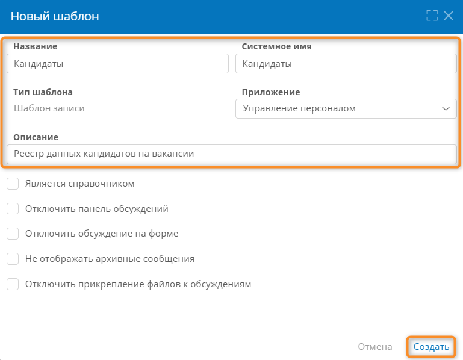
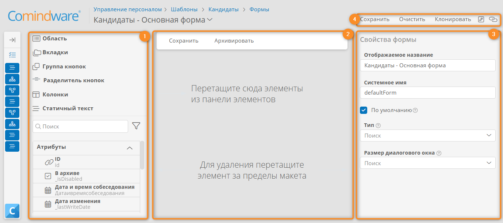
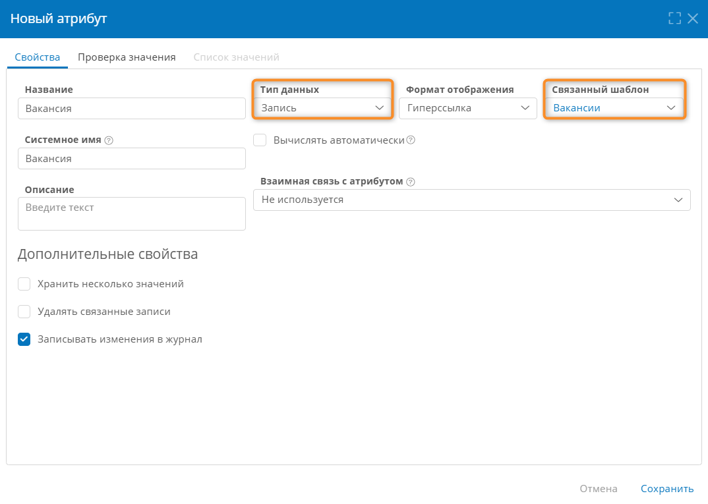
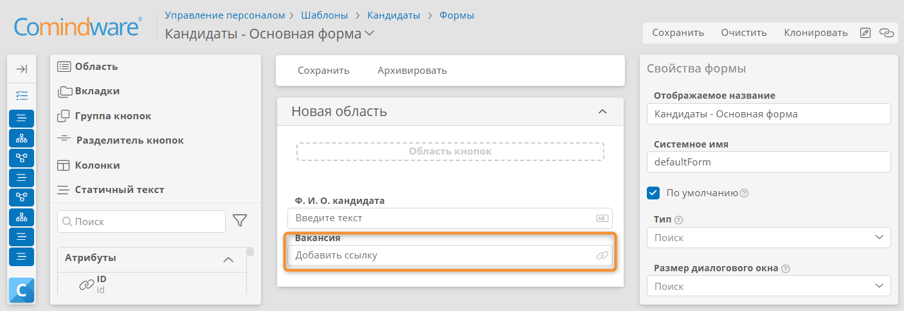
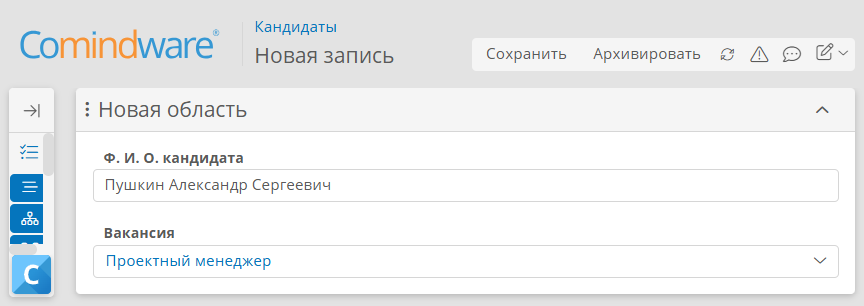

# Урок 2. Создание реестра данных {: #tutorial_hr_lesson_2 }

## Введение {: #tutorial_hr_lesson_2_intro }

В рамках обучения мы разработаем корпоративное приложение для управления персоналом.

В ходе этого урока вы научитесь входить в **{{ productName }}** и ознакомитесь с основными элементами системы.

Вы создадите **приложение**, **шаблон записи** (реестр кандидатов), настроите **атрибуты** для хранения данных кандидатов, их отображение в виде **таблицы** и **формы**, а затем оформите несколько кандидатов на вакансию.

**Предусловия:** пройден [урок 1 «Обзор возможностей {{ productName }} и понятий BPMS»][tutorial_hr_lesson_2].

**Расчётная продолжительность:** 90 мин.

!!! warning "Бизнес-логика"

    Мы реализуем следующий процесс обработки кандидата на вакансию:

    1. _HR-менеджер_ фиксирует результаты тестирования.
    2. Если кандидат прошёл тестирование:

        - _Нанимающий менеджер_ назначает проводит собеседование.
        - _Сотрудник службы безопасности_ проводит проверку кандидата.

    3. Если кандидат прошёл собеседование и проверку службы безопасности, _HR-менеджер_ формирует предложение и согласует его с кандидатом.

    Подробные сведения о приложениях в **{{ productName }}** см. в разделе «[Разработка приложений][apps_kb]».



## Определения {: #tutorial_hr_lesson_2_definitions }



## Темы, навыки и задания урока {: #tutorial_hr_lesson_2_taxonomy }

**Темы**

- Вход в систему и смена пароля
- Приложение
- Шаблон записи
- Запись
- Атрибут
- Типы атрибутов
- Форма

**Навыки**

- Создавать приложение, шаблон записи, атрибуты, формы
- Различать типы атрибутов
- Создавать связанные шаблоны
- Создавать и редактировать записи

**Задания**

- Получить доступ к системе и научиться настраивать свой аккаунт (например, сменить пароль).
- Инициировать создание приложения для поддержки процесса управления персоналом.
- Спроектировать модель данных для ключевых бизнес-сущностей:
    - определить шаблон записи «Кандидаты»;
    - выделить основные атрибуты, отражающие бизнес-требования;
    - создать атрибуты: Ф.&nbsp;И.&nbsp;О, результат тестирования, дата собеседования, оценка и др.
- Настроить графический интерфейс для обработки данных: организовать формы и таблицы для удобного ввода и просмотра информации о кандидатах.
- Смоделировать связанные бизнес-сущности и их взаимосвязи:
    - создать шаблон записи _«Вакансии»_;
    - определить ключевые атрибуты (например, наименование вакансии);
    - установить связь между кандидатами и вакансиями.
- Определить связи между объектами: обеспечить возможность назначения кандидатов на открытые вакансии, чтобы поддерживать бизнес-сценарии подбора персонала.

## Вход в {{ productName }} {: #tutorial_hr_lesson_2_login }



__

## Настройка аккаунта {: #tutorial_hr_lesson_2_account }

В разделе «**Мой аккаунт**» вы можете просмотреть персональную информацию и сменить пароль.

!!! note "Примечание"

    Некоторые или все действия в разделе «**Мой аккаунт**» для вас могут быть недоступны в зависимости от разрешений, выданных системным администратором.

1. Нажмите значок с вашими инициалами в правом верхнем углу страницы.
2. Выберите пункт «**Мой аккаунт**».
3. Должен отобразиться раздел «**Мой аккаунт**».

    __

4. Чтобы сменить пароль, нажмите кнопку «**Сменить пароль**».
5. Чтобы изменения вступили в силу, нажмите кнопку «**Сохранить**».

    __

## Создание приложения {: #tutorial_hr_lesson_2_app }

Создадим приложение для автоматизации управления персоналом.

--8<-- ".snippets/lesson_param_change_tip.md"

1. На панели навигации слева выберите пункт «**Настройки**» — «**Приложения**».
2. Нажмите кнопку «**Создать**».

    __

3. Введите наглядное название приложения, например _«Управление персоналом»_. После заполнения имени поле «**Системное имя**» заполнится автоматически, при желании вы можете ввести собственное системное имя.

    

4. Нажмите кнопку «**Сохранить**».
5. Будет создано приложение _«Управление персоналом»_.

    __

6. Дважды нажмите строку созданного приложения в списке.
7. Отобразится страница «**Администрирование**» приложения.

    __

8. Теперь можно приступать к моделированию данных: созданию реестров (шаблонов записей) и атрибутов, описывающих бизнес-сущности.

## Настройка шаблона записи «Кандидаты» и его атрибутов {: #tutorial_hr_lesson_2_candidates_template }

Настроим реестр для хранения данных кандидатов на вакансию — создадим **шаблон записи**.

1. На странице «**Администрирование**» приложения _«Управление персоналом»_ выберите пункт «**Шаблоны**» <i class="fa-light fa-briefcase "></i>.

    __

2. Отобразится список всех шаблонов приложения.
3. Перейдите на вкладку «**Шаблоны записей**».
4. Нажмите кнопку «**Создать**».

    __

5. Отобразится окно «**Новый шаблон**».
6. В поле «**Название**» введите наглядное наименование шаблона — _«Кандидаты»_.
7. **Системное имя** будет заполнено автоматически.
8. В поле «**Тип шаблона**» должно быть автоматически выбрано значение «**Шаблон записи**».
9. Остальные поля оставьте без изменений.
10. Нажмите кнопку «**Создать**».
11. Будет создан шаблон записи _«Кандидаты»_, и отобразится страница его настройки.

    __

12. Теперь можно создавать атрибуты, описывающие свойства бизнес-сущности _«Кандидат»_.

### Создание атрибутов шаблона записи «Кандидаты» {: #tutorial_hr_lesson_2_candidates_attributes }

Определим данные кандидатов на вакансию, которые необходимо хранить в **шаблоне записи** — создадим атрибуты, описывающие и хранящие сведения о кандидате. Эти атрибуты потребуются для обработки кандидата в процессе найма.





1. Перейдите на вкладку «**Атрибуты**».
2. Нажмите кнопку «**Создать**».

    __

3. Отобразится окно «**Новый атрибут**».
4. Введите **название** _«Ф.&nbsp;И.&nbsp;О. кандидата»_.
5. **Системное имя** будет заполнено автоматически.
6. Выберите **тип данных** «**Текст**».
7. Остальные поля оставьте без изменений.
8. Нажмите кнопку «**Сохранить**».
9. Будет создан атрибут _«Ф.&nbsp;И.&nbsp;О. кандидата»_.

    __

10. Аналогичным образом создайте следующие атрибуты:

    | Тип данных       | Название                              |
    | ---------------- | ------------------------------------- |
    | **Дата и время** | _Дата и время собеседования_          |
    | **Логический**   | _Результат тестирования_              |
    | **Число**        | _Оценка за собеседование_ |

11. Теперь можно приступать к настройке формы, с помощью которой пользователи будут вводить и просматривать данные.

### Создание формы для ввода и просмотра данных {: #tutorial_hr_lesson_2_candidates_form }

Настроим экранную форму для заполнения и просмотра данных кандидата.

1. На странице шаблона записи _«Кандидаты»_ выберите вкладку «**Формы**».

    !!! note "Основная форма шаблона"

        При создании шаблона записи автоматически создаётся пустая **основная форма**, в которой по умолчанию открываются записи шаблона (как для ввода, так и для просмотра данных).
       
        Для шаблона записи _«Кандидаты»_ была создана форма _«Кандидаты — Основная форма»_.

2. В списке форм дважды нажмите пункт _«Кандидаты — Основная форма»_.

    __

3. Отобразится **конструктор формы**:

    __

    

4. Перетащите на макет формы элемент «**Область**» с панели элементов.

    

5. В свойствах области введите название _«Данные кандидата»_.
6. Перетащите на макет формы атрибут _«Ф.&nbsp;И.&nbsp;О. кандидата»_ с панели элементов.
7. Нажмите кнопку «**Сохранить**», чтобы сохранить изменения формы.

    __

8. Теперь можно переходить к настройке реестра _«Вакансии»_ и его атрибутов.

## Настройка шаблона записи «Вакансии» и его атрибутов {: #tutorial_hr_lesson_2_vacancies_template }

Внутри одного приложения можно создать несколько шаблонов записи для раздельного хранения данных в соответствии с их типами.

1. На странице «**Администрирование**» приложения _«Управление персоналом»_ выберите пункт «**Шаблоны**» <i class="fa-light fa-briefcase "></i>.
2. Отобразится список всех шаблонов приложения.
3. Перейдите на вкладку «**Шаблоны записей**».
4. Нажмите кнопку «**Создать**».
5. Отобразится окно «**Новый шаблон**».
6. В поле «**Название**» введите _«Вакансии»_.
7. В поле «**Тип шаблона**» должно быть автоматически выбрано значение «**Шаблон записи**».
8. Нажмите кнопку «**Создать**».
9. Будет создан шаблон записи _«Вакансии»_, и отобразится страница его настройки.
10. Перейдите на вкладку «**Атрибуты**».
11. Нажмите кнопку «**Создать**».
12. Отобразится окно «**Новый атрибут**».
13. Введите **название** _«Название вакансии»_.
14. Выберите **тип данных** «**Текст**».
15. Установите флажок «**Использовать как заголовок записей**».

    __

    

16. Нажмите кнопку «**Сохранить**».
17. Будет создан атрибут _«Название вакансии»_.
18. Перейдите на вкладку «**Формы**».
19. В списке форм дважды нажмите пункт _«Вакансии — Основная форма»_.
20. Отобразится **конструктор формы**.
21. Перетащите на макет формы элемент «**Область**» с панели элементов.
22. Перетащите на макет формы атрибут _«Название вакансии»_ с панели элементов.
23. Нажмите кнопку «**Сохранить**».

    __

24. Теперь можно проверить работу шаблона и формы.

### Тестирование: создание вакансий {: #tutorial_hr_lesson_2_test_vacancies}

Мы создали форму для заполнения данных вакансий.

Теперь протестируем её, создав несколько вакансий и отредактировав одну из них.

1. На странице шаблона записи _«Вакансии»_ нажмите кнопку «**Перейти к экземплярам**».

    __

2. Откроется список всех записей.
3. Нажмите кнопку «**Создать**».

    __

4. В поле _«Название»_ введите _«Проектный менеджер»_.
5. Нажмите кнопку «**Сохранить**».

    __

6. Нажмите ссылку _«Вакансии»_ над формой, чтобы вернуться к списку вакансий.

    __

7. Аналогичным образом создайте ещё две вакансии:

    - _Менеджер по продажам_
    - _Операционный менеджер_

## Установление связи между шаблонами «Кандидаты» и «Вакансии» {: #tutorial_hr_lesson_2_candidates_link }

Свяжем созданные шаблоны, чтобы для каждого кандидата можно было указать, на какую вакансию он претендует. Для этого используем атрибут типа «**Запись**».

1. Откройте шаблон записи _«Кандидаты»_.
2. Перейдите на вкладку **«Атрибуты»**.
3. Нажмите кнопку **«Создать»**.
4. Отобразится окно «**Новый атрибут**».
5. В поле **«Название»** введите _«Вакансия»_.
6. Выберите **тип данных** _«Запись»_.
7. В поле **«Связанный шаблон»** выберите шаблон _«Вакансии»_.
8. Нажмите кнопку **«Сохранить»**.

    __

9. Перейдите на вкладку **«Формы»** шаблона _«Кандидаты»_.
10. Дважды нажмите на строку _«Кандидаты — Основная форма»_.
11. Откроется **конструктор формы**.
12. Поместите атрибут _«Вакансия»_ на макет формы.
13. Нажмите кнопку **«Сохранить»**.

    __

### Тестирование: создание записей о кандидатах для конкретных вакансий {: #tutorial_hr_lesson_2_test_candidates}

Теперь, когда шаблон связаны, протестируем создание записей о кандидатах и выбор вакансии для каждого из них.

1. Откройте шаблон записи _«Кандидаты»_.
2. Нажмите кнопку **«Перейти к экземплярам»**.
3. Откроется список всех кандидатов.
4. Нажмите кнопку **«Создать»**.
5. Откроется форма записи.
6. Заполните поля на форме.
7. Нажмите кнопку **«Сохранить»**.

    __

8. Нажмите ссылку _«Кандидаты»_ над формой, чтобы вернуться к списку заявок.
9. Аналогичным образом создайте ещё несколько кандидатов, выбирая для них разные вакансии.
10. После сохранения каждой записи они отобразятся в списке.
11. Чтобы отредактировать данные кандидата, откройте запись и внесите в неё изменения.

## Результаты {: #tutorial_hr_lesson_2_results}

Вы создали свой первый шаблон записи (реестр данных), настроили форму и научились её заполнять.

В [следующем уроке][tutorial_hr_lesson_3] вы узнаете, как спроектировать и запустить бизнес-процесс.


