# Урок 3. Создание бизнес-процесса {: #tutorial_hr_lesson_3 }

## Введение {: #tutorial_hr_lesson_3_intro }

В ходе этого урока вы усовершенствуете **приложение**, созданное на [предыдущем уроке][tutorial_hr_lesson_2], настроив следующий автоматизированный **процесс** отбора кандидата.

На примере процесса _«Отбор кандидата на открытую вакансию»_ вы научитесь моделировать этапы, роли и задачи, используя BPMN-диаграмму, и связывать бизнес-процесс с данными о кандидатах.

**Предусловия:** пройден [урок 2 «Первый реестр данных»][tutorial_hr_lesson_2].

**Расчётная продолжительность:** 90 мин.

!!! warning "Бизнес-логика"

    - _HR-менеджер_ получает результаты тестирования кандидата и заносит их в систему.
    - Если кандидат не прошёл тестирование, процесс завершается.
    - Если кандидат успешно прошёл тестирование, его дело одновременно поступает _Нанимающему менеджеру_ для проведения собеседования и в _Службу безопасности_ для проведения проверки.



## Темы, навыки и задания урока {: #tutorial_hr_lesson_3_taxonomy }

**Темы**

- Процесс
- Шаблон процесса
- Элементы диаграммы
- Простое начальное событие
- Простое конечное событие
- Пользовательская задача
- Развилка или/или
- Развилка и
- Пул и дорожка

**Навыки**

- Создавать процесс
- Публиковать процесс
- Различать виды элементов диаграммы
- Создавать экземпляр процесса

**Задания**

- Понимать связи между процессом, записью и задачами
- Создать процесс
- Отредактировать диаграмму процесса

## Определения {: .admonition-title #tutorial_hr_lesson_3_definitions}

- **Исполняемый бизнес-процесс**

    

- **Шаблон процесса**
    - Настройка исполняемого бизнес-процесса в **{{ productName }}** выполняется с помощью шаблона процесса.
    - Шаблон процесса состоит из [диаграммы процесса][process_diagram] в нотации BPMN 2.0, хранит экземпляры процесса и свойства, определяющие, как должны выполняться все экземпляра процесса.
    - Каждый шаблон процесса связан с шаблоном записи, который хранит записи для экземпляров процесса.
- **Диаграмма процесса**
    - **Пул и дорожка** — элементы BPMN-диаграммы, отражающие участников процесса.
    - **Пользовательская задача** — действие, выполняемое человеком в рамках процесса.
    - **Развилка** — элемент BPMN для ветвления сценариев.
- **Экземпляр процесса** — конкретное выполнение процесса для одного кандидата.

## Создание шаблона процесса {: #tutorial_hr_lesson_3_create_process_template }

Настроим шаблон процесса отбора кандидата.

1. На панели навигации слева выберите пункты «**Настройки**» — «**Шаблоны**».
2. Перейдите на вкладку «**Шаблоны процессов**».
3. Нажмите кнопку «**Создать**».
4. Введите название шаблона _«Найм персонала»_.
5. Укажите приложение _«Управление персоналом»._
6. В поле «**Связанный шаблон**» выберите шаблон _«Кандидаты»_.
7. Нажмите кнопку «**Создать**».

__

## Построение диаграммы бизнес-процесса {: #tutorial_hr_lesson_3_bpmn_setup }

!!! note "Примечание"

    В **{{ productName }}** для построения **диаграмм бизнес-процесса** используется **нотация BPMN 2.0**.

    Нотация BPMN проста в понимании и часто применяется в бизнесе. Однозначная интерпретация диаграмм BPMN обеспечивает одинаковое понимание процесса бизнесом, аналитиками и ИТ-специалистами.

1. Перейдите на вкладку «**Диаграмма**».
2. Отобразится конструктор диаграммы процесса.

    __

    

3. Дважды нажмите надпись «**Пул**».
4. Переименуйте **пул** в _«Обработка кандидата на открытую вакансию»_.

    _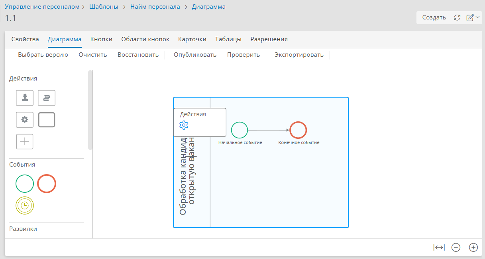_

5. Добавим на диаграмму дорожки.

    _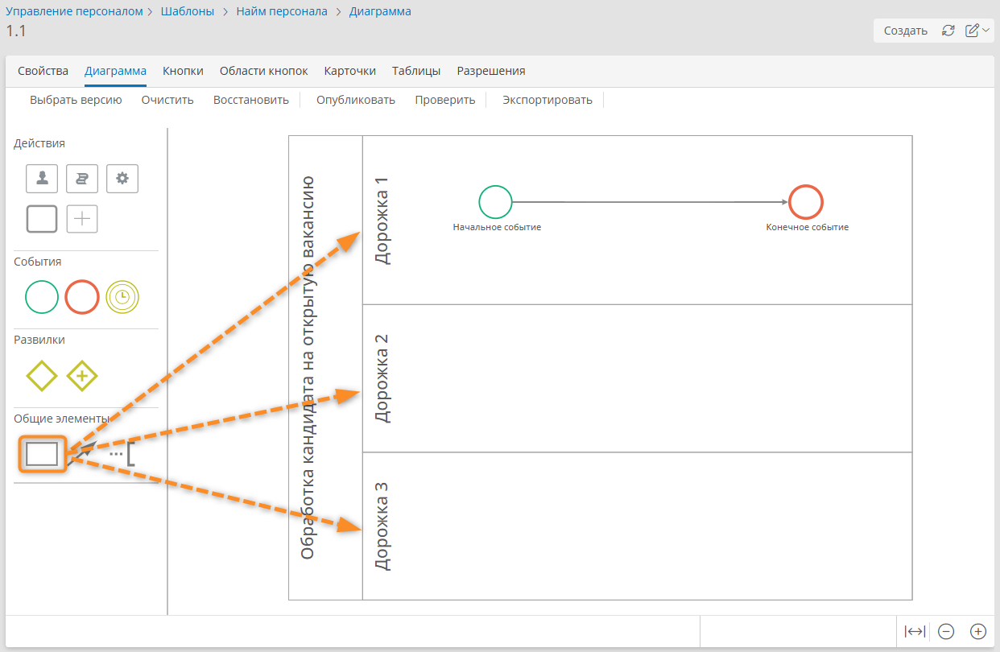_

    !!! question "Дорожка"

        
       
        Обычно дорожки представляют клиента, отдел, должность, роль или команду. Например, в нашем процессе _Нанимающий менеджер_ — это роль (_Нанимающий менеджер_ может быть из любого отдела), _Служба безопасности_ — отдел, а _HR-менеджер_ — должность.

6. Перетащите с панели элементов три дорожки на диаграмму процесса. Элемент «**Дорожка**» расположен в группе «**Общие элементы**».
7. Присвойте дорожкам названия: _HR-менеджер, Нанимающий менеджер, Служба безопасности._
8. Чтобы переименовать дорожку, выберите её и в раскрывающемся меню элемента нажмите кнопку «**Свойства**» <i class="fa-light fa-gear"></i>.

    __

9. В отобразившемся окне «**Свойства дорожки**» введите новое название и нажмите кнопку «**Сохранить**».
10. Удалите конечное событие. Для этого выберите его и в меню элемента нажмите кнопку «**Удалить**» <i class="fa-light fa-trash-can"></i>.

    _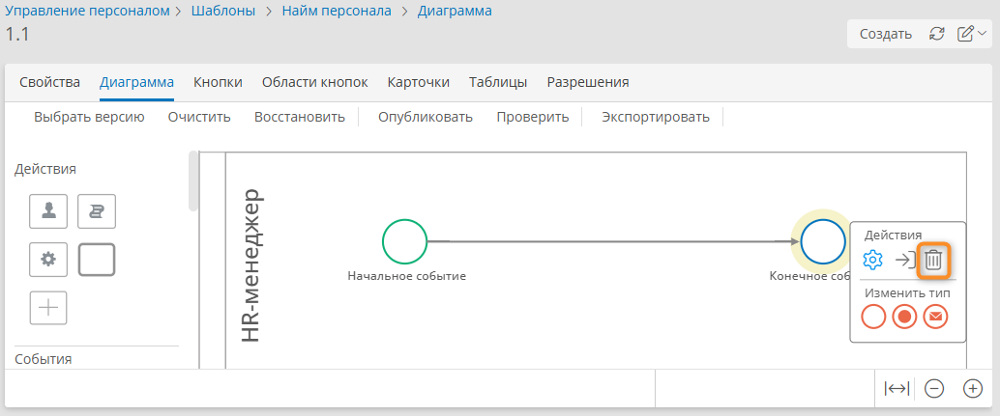_

11. Чтобы переименовать стартовое событие, выберите его и в раскрывающемся меню элемента нажмите кнопку «**Свойства**» <i class="fa-light fa-gear"></i>.
12. В отобразившемся окне «**Свойства начального события**» введите новое название _«Проведено тестирование кандидата»_ и нажмите кнопку «**Сохранить**».
13. Перетащите элемент «**Пользовательская задача**» из раздела «**Действия**» с левой панели на дорожку _«HR-менеджер»_.

    

14. Присвойте задаче название _«Зафиксировать результаты тестирования»_. Для этого дважды нажмите название задачи.
15. Присоедините **поток управления** от начального события к пользовательской задаче _«Зафиксировать результаты тестирования»._
16. Перетащите элемент «**Развилка** «**или/или**» на диаграмму и соедините его с задачей _«Зафиксировать результаты тестирования»_.

    

17. Присоедините к развилке два потока управления.
18. Присвойте развилке название _«Кандидат прошёл тестирование?»_. Для этого дважды нажмите развилку и введите её название или нажмите кнопку «**Свойства**» <i class="fa-light fa-gear"></i> в меню элемента.

    _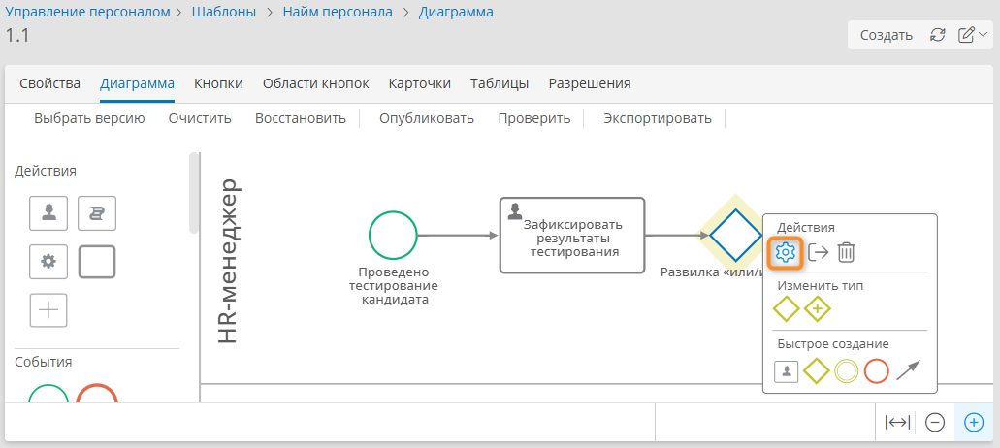_

    !!! warning "Бизнес-логика"

        _HR-менеджер_ заполняет данные о прохождении тестирования кандидатом.

        Если кандидат не прошёл тестирование, то процесс завершается.
       
        Если кандидат прошёл тестирование, то далее его обрабатывают _Нанимающий менеджер_ и _Служба безопасности_.
       
        Реализуем на диаграмме эту бизнес-логику.

19. К развилке _«Кандидат прошёл тестирование?»_ присоедините потоками управления два новых элемента:

    - **Конечное событие** _«Кандидат не прошёл тестирование»_
    - **Развилка «и»**

    

20. Выберите развилку и в меню элемента нажмите кнопку «**Свойства**» <i class="fa-light fa-gear"></i>.
21. Отобразится окно «**Свойства развилки «или/или**».
22. На вкладке «**Дополнительные**» укажите названия исходящих потоков — _«Да»_ и _«Нет»_. Для этого дважды нажмите соответствующие поля.
23. Сохраните настроенные свойства развилки.

    _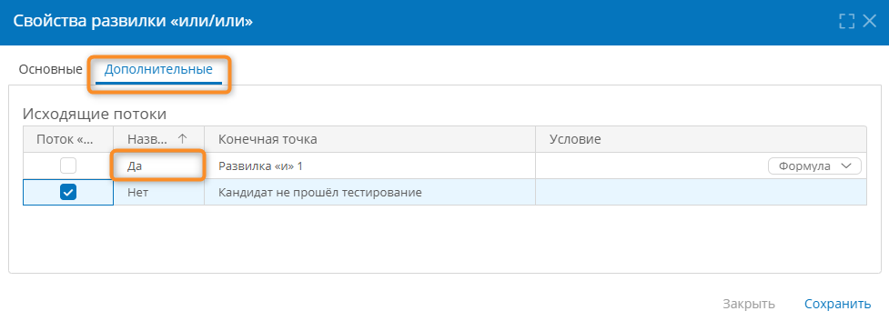_

24. От **развилки «и»** добавьте две пользовательских задачи:

    - _«Провести собеседование»_ для _Нанимающего менеджера_;
    - _«Провести проверку кандидата»_ для сотрудника _Службы безопасности_.

    !!! question "Развилка «и»"

        **Развилка «и»** (параллельная) используется для разделения процесса на несколько потоков, которые будут выполняться одновременно.

25. Добавьте ещё одну **развилку «и»** и соедините с ней задачи _«Провести собеседование»_ и _«Провести проверку кандидата»_.

    __

26. От второй **развилки «и»** добавьте элемент «**Развилка** «**или/или**».
27. Присоедините к развилке два потока управления.
28. Присвойте развилке название _«Кандидат прошёл проверку?»_. Для этого дважды нажмите развилку и введите её название или нажмите кнопку «**Свойства**» <i class="fa-light fa-gear"></i> в меню элемента.
29. К развилке _«Кандидат прошёл проверку?»_ присоедините потоками управления два новых элемента:

    - **Конечное событие** _«Кандидат не прошёл проверку»_
    - **Пользовательская задача** _«Сформировать и согласовать предложение с кандидатом»_

30. В свойствах развилки _«Кандидат прошёл проверку?»_ укажите названия исходящих потоков — _«Да»_ и _«Нет»_.
31. К задаче _«Сформировать и согласовать предложение с кандидатом»_ присоедините потоком управления **конечное событие** _«Кандидат принят на работу»_.
32. В итоге должна получиться следующая диаграмма:

    _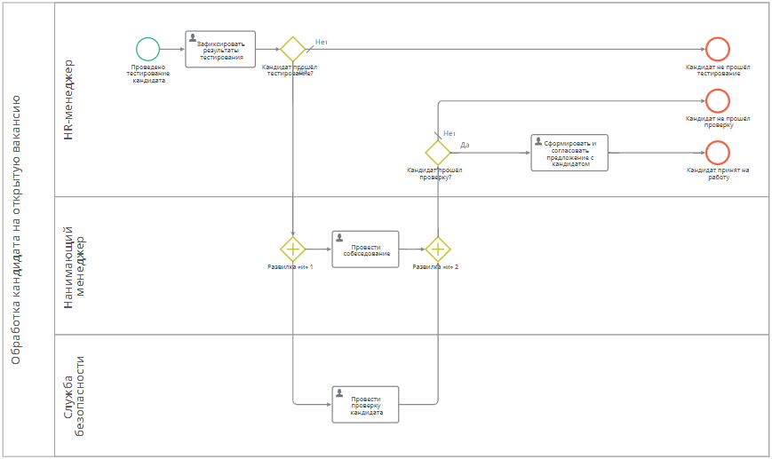_

## Настройка форм пользовательских задач {: #tutorial_hr_lesson_3_task_forms }

### Форма задачи «Зафиксировать результаты тестирования» {: #tutorial_hr_lesson_3_task_form_results }

Настроим форму для задачи _«Зафиксировать результаты тестирования»_. На этой форме _HR-менеджер_ будет заполнять данные кандидата и указывать результаты тестирования.

1. Выберите задачу _«Зафиксировать результаты тестирования»_ и в меню элемента нажмите кнопку «**Форма**» <i class="fa-light fa-newspaper"></i>.

    _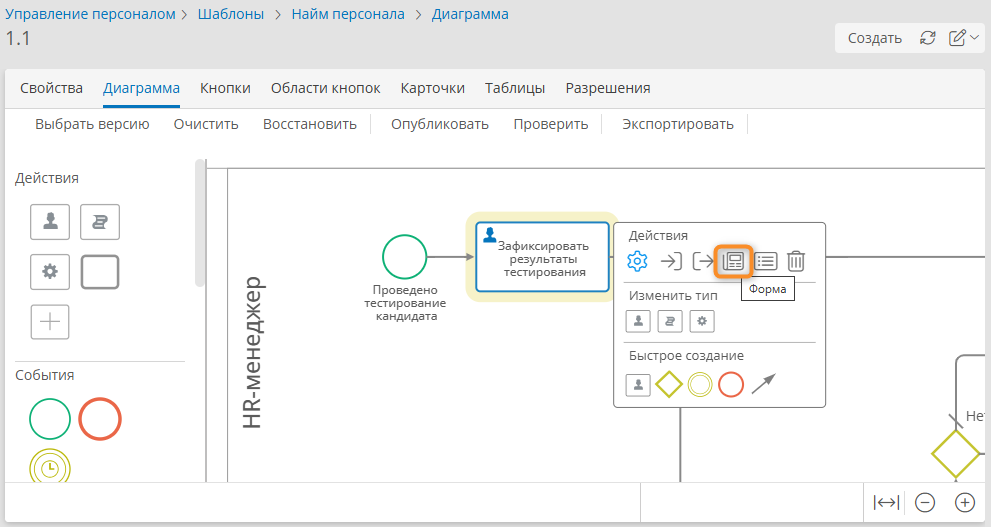_

2. Отобразится конструктор формы задачи.
3. Разверните элемент _«Кандидаты»_ на панели элементов слева.
4. Перетащите форму _«Кандидаты — Основная форма»_ на макет формы.
5. Перетащите на макет формы под вложенную форму элемент «**Область**» и присвойте ей название _«Результаты тестирования»_.
6. Перетащите в эту область атрибут _«Результат тестирования»_.
7. Сохраните форму.
8. Вернитесь к диаграмме процесса, нажав кнопку «**Назад**» в браузере.

__

### Форма задачи «Провести собеседование» {: #tutorial_hr_lesson_3_task_form_interview }

Настроим форму для задачи _«Провести собеседование»_.

1. Выберите задачу _«Провести собеседование»_ и в меню элемента нажмите кнопку «**Форма**» <i class="fa-light fa-newspaper"></i>.
2. Создайте **логический** атрибут _«Результат собеседования»_, нажав кнопку «**Добавить атрибут**» <i class="fa-light fa-plus"></i> у элемента _«Кандидаты»_.

    _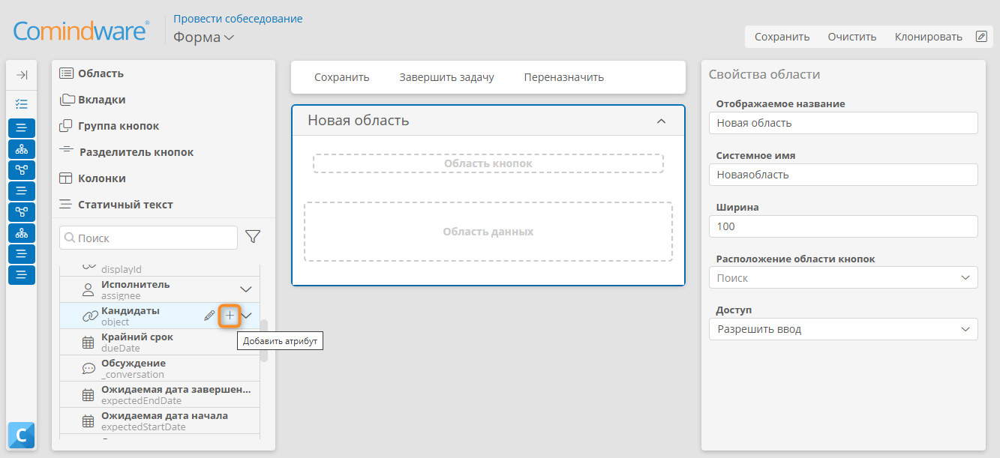_

3. Перетащите форму _«Кандидаты — Основная форма»_ на макет.
4. Перетащите на макет формы элемент «**Область**» и назовите её _«Результаты собеседования»_.
5. Перетащите в эту область атрибут _«Результат собеседования»_ и _«Оценка за собеседование»_.
6. Сохраните форму.
7. Вернитесь к диаграмме процесса, нажав кнопку «**Назад**» в браузере.

__

### Форма задачи «Провести проверку кандидата» {: #tutorial_hr_lesson_3_task_form_security_check }

Для задачи _«Провести проверку кандидата»_ настройте форму аналогично, создав атрибуты, необходимые для фиксации результатов проверки службой безопасности.

1. Откройте форму задачи _«Провести проверку кандидата»_.
2. Создайте **логический** атрибут _«Проверка службы безопасности»_, нажав кнопку «**Добавить атрибут**» <i class="fa-light fa-plus"></i> у элемента _«Кандидаты»_.
3. Перетащите на макет формы элемент «**Область**» и назовите её _«Результаты проверки»_.
4. Перетащите в эту область атрибут _«Проверка службы безопасности»_.
5. Добавьте форму _«Кандидаты — Основная форма»_ на макет.
6. Сохраните форму.
7. Вернитесь к диаграмме процесса, нажав кнопку «**Назад**» в браузере.

_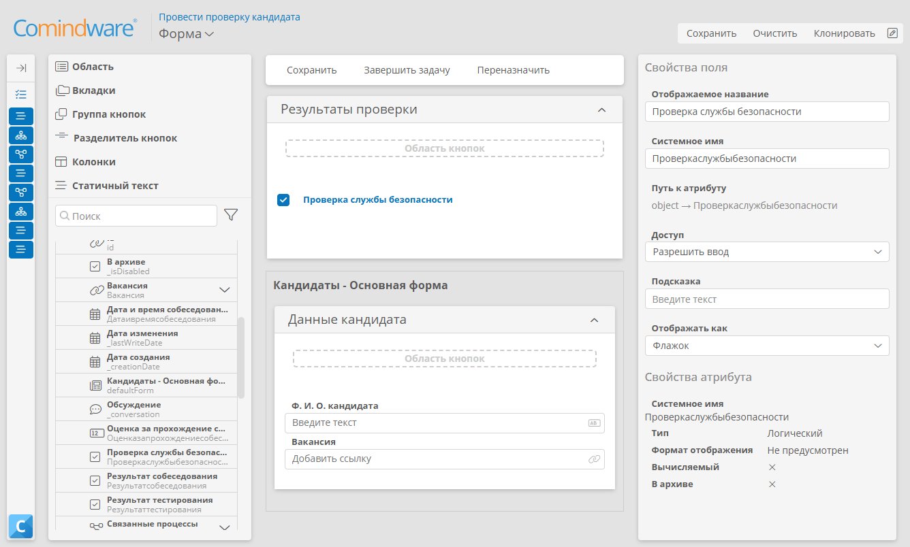_

### Форма задачи «Сформировать и согласовать предложение с кандидатом» {: #tutorial_hr_lesson_3_task_form_offer }

1. Выберите задачу _«Сформировать и согласовать предложение с кандидатом»_ и в меню элемента нажмите кнопку «**Форма**» <i class="fa-light fa-newspaper"></i>.
2. Перетащите форму _«Кандидаты — Основная форма»_ на макет формы.
3. Сохраните форму.
4. Вернитесь к диаграмме процесса, нажав кнопку «**Назад**» в браузере.

_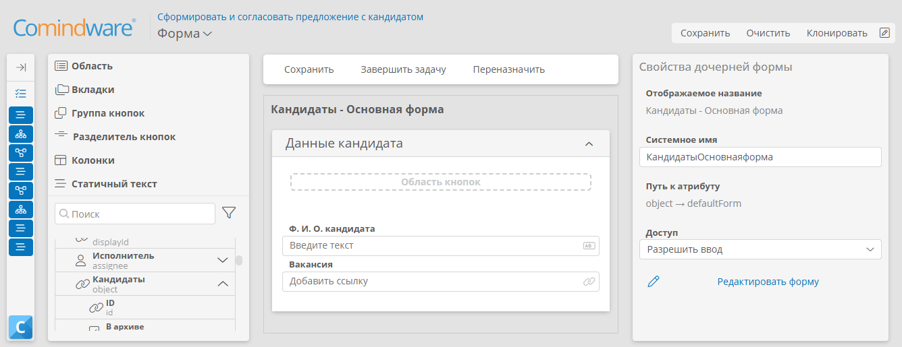_

## Настройка развилок {: #tutorial_hr_lesson_3_gateway_setup }

Настроим логику ветвления процесса с помощью развилок.

### Развилка «Кандидат прошёл тестирование?»

!!! warning "Бизнес-логика"

    Поток, по которому процесс пойдёт после развилки _«Кандидат прошёл тестирование?»_, задаёт логический атрибут _«Результат тестирования»_, значение которого устанавливает _HR-менеджер_ при рассмотрении кандидата.

    Для управления ходом процесса определим условие для потока к **развилке «и»** на основе значения атрибута _«Результат тестирования»_.

1. Выберите развилку _«Кандидат прошёл тестирование?»_ и в меню элемента нажмите кнопку «**Свойства**» <i class="fa-light fa-gear"></i>.
2. Перейдите на вкладку «**Дополнительные**».
3. Для потока _«Нет»_, ведущего к конечному событию _«Кандидат не прошёл тестирование»_, установите флажок «**Поток** «**иначе**».

    

4. Для потока _«Да»_ в ячейке «**Условие**» введите формулу `$Результаттестирования`.

    !!! question "Ссылки на атрибуты в формулах"

        
       
        То есть формула `$Результаттестирования` возвращает значение атрибута _«Результат тестирования»_ — `true` или `false` (ложь или истина).

5. Нажмите кнопку <i class="fa-light fa-check"></i>.
6. Сохраните поток управления.

    __

### Развилка «Кандидат прошёл проверку?»

Эта развилка проверяет, что кандидат успешно прошёл собеседование.

1. Выберите развилку _«Кандидат прошёл проверку?»с_ и в меню элемента нажмите кнопку «**Свойства**» <i class="fa-light fa-gear"></i>.
2. Перейдите на вкладку «**Дополнительные**».
3. Для потока _«Нет»_, ведущего к конечному событию _«Кандидат не прошёл собеседование»_, установите флажок «**Поток** «**иначе**».
4. Для потока _«Да»_ в ячейке «**Условие**» введите формулу `$Результатсобеседования`.
5. Сохраните поток управления.

__

## Проверка и публикация процесса {: #tutorial_hr_lesson_3_publish }



_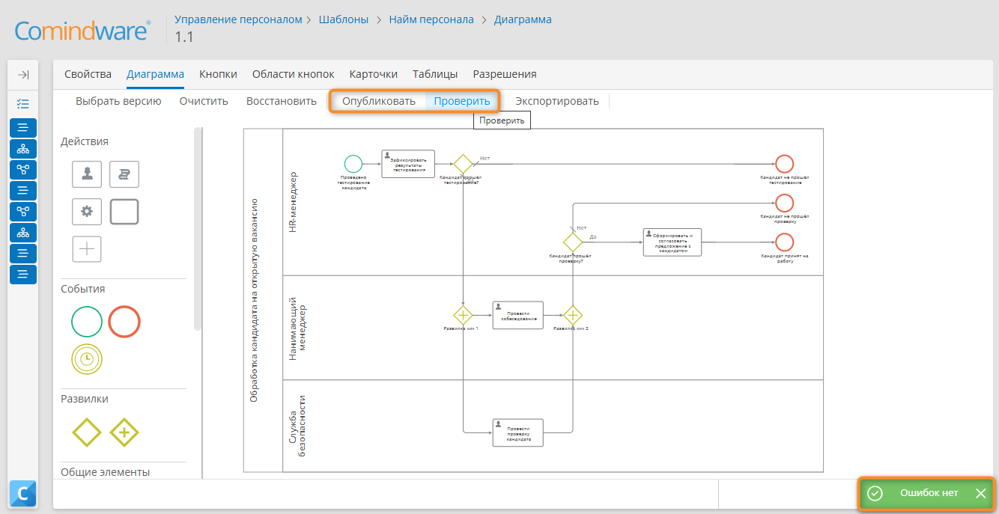_

## Тестирование: запуск процесса и «Мои задачи» {: #tutorial_hr_lesson_3_testing }

Вы настроили и опубликовали бизнес-процесс, теперь протестируйте его в роли пользователя.

1. Перейдите к экземплярам процесса _«Найм персонала»_ и нажмите «**Создать**».
2. Перейдите на страницу «**Мои задачи**» с помощью панели навигации слева.
3. Откройте задачу _«Зафиксировать результаты тестирования»_.
4. Установите флажок _«Результат тестирования»_.
5. Нажмите кнопку «**Завершить задачу**».
6. Убедитесь, что на странице «**Мои задачи**» появились две новые задачи _«Провести собеседование»_ и _«Провести проверку кандидата»_.
7. Завершите обе задачи, установив флажок _«Результат собеседования»_.
8. Убедитесь, что появилась задача _«Сформировать и согласовать предложение с кандидатом»_.
9. Завершите задачу _«Сформировать и согласовать предложение с кандидатом»_.

## Результаты {: #tutorial_hr_lesson_3_summary }

Вы создали полноценный бизнес-процесс по найму персонала, настроили для него дорожки, задачи, параллельное выполнение и сложную логику ветвления с помощью нескольких развилок. Вы научились создавать атрибуты «на лету» и настраивать формы для разных этапов процесса.

В [следующем уроке][tutorial_hr_lesson_4] вы узнаете, как усовершенствовать шаблон записи для работы с документами кандидатов.


