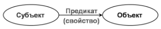

# Урок 1. Введение в графовую СУБД и язык N3 {: #tutorial_n3_lesson_1 }

## Введение {: #tutorial_n3_lesson_1_intro }

В ходе этого урока вы ознакомитесь с RDF, графами знаний и принципами внутреннего представления и хранения данных в **{{ productName }}**.

Кроме того, вы узнаете, что такое триплет вида `субъект–предикат-объект` и как составлять выражения в нотации N3 для манипуляций с данными в **{{ productName }}**, а также разберётесь с базовым синтаксисом языка N3, пятью типами запросов и контекстом исполнения выражений.

**Предусловия:**

- Имеется доступ к веб-сайту с **{{ productName }}**.
- **Рекомендуется** пройти _курс «[Аналитик. Ознакомительный][tutorial_hr]»_, чтобы получить базовые навыки работы с **{{ productName }}**.

**Расчётная продолжительность:** 1 час 30 минут.

!!! warning "Бизнес-логика"

    В этом курсе используется контекст HR‑процесса подбора кандидатов с соответствующими сущностями.
    
    В примерах этого урока используется следующая модель данных:
    
    - Связи между сущностями:
        - Сотрудник → Отдел
        - Сотрудник → Компания
    - Атрибуты:
        - Шаблон _«Сотрудники»_
            - _ID_ — **запись**, **связанный шаблон** _«Сотрудники»_
            - _Фамилия_, _Имя_, _Отчество_, _Ф.И.О._ — **текст**
            - _Отдел_ — **запись**, **связанный шаблон** _«Отделы»_
        - Шаблон _«Отделы»_
            - _Название_ — **текст**
        - Шаблон _«Компании»_
            - _Название_ — **текст**



## Темы, навыки и задания урока {: #tutorial_n3_lesson_1_taxonomy }

### Темы {: #tutorial_n3_lesson_1_topics }

- Языки запросов в **{{ productName }}**
- RDF и графы знаний
- Хранение данных в графовой СУБД **{{ productNameElasticData }}**
- Триплеты — атомарные элементы N3
- Базовый синтаксис N3
- Области применения формул и N3
- Входные и выходные данные выражений на N3
- Редактор выражений N3

### Навыки {: #tutorial_n3_lesson_1_skills }

- Понимание назначения и преимуществ использования языка N3 в **{{ productName }}**
- Понимание принципов представления и хранения данных в виде триплетов в графовой СУБД
- Чтение и составление элементарных выражений на языке N3
- Понимание входных и выходных данных выражений на N3
- Выбор формул или языка N3 в соответствии с типом задачи

### Задания {: #tutorial_n3_lesson_1_tasks }

- Освоить базовые принципы представления данных в виде триплетов
- Разобрать простейшие выражения в нотациях RDF и N3
- Составить выражение для вычисления значения атрибута с помощью N3

<div class="admonition question" markdown="block">

## Определения {: .admonition-title #tutorial_n3_lesson_1_definitions }

- **RDF (Resource Description Framework)** — модель представления знаний в виде триплетов.
- **Граф знаний** — сеть сущностей (узлов) и связей (рёбер), описывающих предметную область.
- **Триплет (тройка)** — утверждение вида: `субъект — предикат — объект`.
- **N3** — текстовая нотация для записи триплетов и графов.
- **URI** — идентификатор ресурса вида `https://www.w3.org/1999/02/22-rdf-syntax-ns#type`.
- **{{ productNameElasticData }}** — фирменная СУБД в основе **{{ productName }}**, построенная на графовой модели RDF.
- **Литерал** — неименованная константа, то есть фиксированное значение, не изменяющееся во время вычисления, например строка `"Бобров Б.Б."`.

</div>

## Языки запросов в {{ productName }} и их назначение {: #tutorial_n3_lesson_1_languages }

В **{{ productName }}** предусмотрено два языка запросов:

1. **Формулы** — фирменный язык выражений **{{ companyName }}**, похожий на формулы Excel. Является простым для восприятия и представляет собой надстройку над языком **N3**. Для базовой настройки системы его зачастую достаточно.

    Области применения формул:

    - выборка данных из связанных шаблонов записей;
    - подсчёт количества объектов;
    - простые математические операции типа умножения и деления;
    - конкатенация и преобразования строк.

2. **N3** (**Notation 3**, **триплеты**) — более продвинутый язык, позволяющий составлять сложные запросы и получать доступ к данным, которые затруднительно получить с помощью формул. Язык N3 представляет собой сокращённую запись RDF. Синтаксис N3 определён международным консорциумом W3C.

    Области применения языка N3:

    - продвинутое использование **{{ productName }}** — составление сложных запросов;
    - доступ ко всем сущностям — в формулах доступны не все системные атрибуты, а только те, которые используются чаще всего в типовых сценариях. N3 предоставляет доступ к большему количеству атрибутов и сущностей, чем формулы, например к системным атрибутам, атрибутам и экземплярам процессов и задач.
    - расширенные возможности обработки данных — дополнительные математические функции, функции для работы со списками, приведения данных к одному типу, расчётов времени и т.&nbsp;д.;
    - повышение скорости обработки данных — в случае обработки больших наборов данных запросы на языке N3 работают быстрее, чем формулы.

В рамках этого курса мы рассмотрим базовые принципы использования языка **N3**.

## Преимущества использования графов и триплетов для описания, хранения и извлечения данных  {: #tutorial_n3_lesson_1_graph_benefits }

**{{ productName }}** хранит данные в графовой СУБД **{{ productNameElasticData }}**.

Графовая модель данных позволяет отказаться от использования жёсткой структуры для представления, хранения и запросов данных (такой, как таблицы в SQL), что даёт ряд преимуществ:

- **Единое представление для хранения и запросов данных** — для извлечения данных используются такие же триплеты на языке **N3**, как и для сохранения, благодаря чему достигается удобство обработки данных.
- **Простота построения модели данных** — даже неподготовленный пользователь может быстро научиться создавать шаблоны записей и строить связи между ними.
- **Мгновенное добавление новых шаблонов записей и атрибутов** — новые сущности сразу доступны для обработки без дополнительной настройки.
- **Неограниченная ширина и глубина связей между сущностями** — нет ограничений по количеству атрибутов и связей между ними.
- **Простота и неограниченность навигации по связям** — переход от одного справочника к другому через ссылочный атрибут описывается наглядными выражениями.

Для более глубокого понимания принципов описания и хранения данных в графовой СУБД ознакомьтесь со следующими статьями:

<div class="relatedTopics" markdown="block">

- [Онтология][n3_guide_ontology]
- [Технология {{ productNameElasticData }}][elasticdata_description]
- [Графы][n3_guide_graphs]
- [Графы знаний][n3_guide_knowledge_graphs]
- [Моделирование на N3][n3_guide_modelling]

</div>

## СУБД {{ productNameElasticData }} и графовая модель данных RDF {: #tutorial_n3_lesson_1_rdf_graphs }

Фирменная СУБД **{{ productNameElasticData}}** построена на модели данных **RDF**.

**RDF** — это модель, которая описывает данные (знания) как граф, состоящий из **утверждений**.

**Утверждение** представляет собой так называемый **триплет** вида `субъект — предикат — объект`, где:

- `субъект` — это описываемый ресурс;
- `предикат` — это свойство или связь субъекта с объектом;
- `объект` — это значение свойства или другой ресурс.

__

!!! tip "Триплеты и естественный язык"

    Для лучшего понимания триплетов в RDF можно провести параллель с русским языком.
    
    Триплет можно представить как **подлежащее, сказуемое и дополнение**, например: `сотрудник — работает в — компании`. То есть объект и субъект представлены существительными, а предикат — глаголом.

Представление в виде графа знаний естественным образом соответствует любым предметным областям, где сущности и их отношения образуют семантическую сеть.

Например, с помощью графа можно описать HR-процессы, участвующие в них сущности (ресурсы), их связи и взаимодействие — организационные единицы, сотрудников, документы и т.&nbsp;п.

Пример триплета для утверждения `сотрудник Бобров работает в компании ООО «Деревообработка»`, составленного из URI ресурсов:

``` turtle
<http://example.com/hr/employee/бобров> <http://example.com/hr/relation/worksIn> <http://example.com/hr/company/деревообработка>.
              субъект                                   предикат                                    объект
          сотрудник Бобров                             работает в                       компании ООО «Деревообработка»
```

Добавим в граф утверждение `сотрудник Бобров работает в отделе «Техдокументация»`:

``` turtle
<http://example.com/hr/employee/бобров> <http://example.com/hr/relation/worksIn> <http://example.com/hr/company/деревообработка>.
              субъект                                   предикат                                    объект
          сотрудник Бобров                             работает в                         отделе «Техдокументация»
```

Таким образом, RDF позволяет легко добавлять новые свойства и связи между ресурсами и сформировать гибкую и расширяемую модель данных.

Это облегчает поиск и организацию информации в базе данных.

Так как нотация RDF стандартизирована и наглядна, данные легко интерпретировать как человеку, так и программному обеспечению.

!!! question "Что такое факт"

    Триплет в **{{ productName }}** также называется **фактом**, то есть утверждением, фиксирующим некое знание, например: `Бобров работает в ООО «Деревообработка»`.

## Структура хранения данных в {{ productName }}  {: #tutorial_n3_lesson_1_data_storage }

В **{{ productName }}** все объекты имеют следующее внутренне представление:

- шаблоны, идентификаторы, атрибуты, значения атрибутов и любые другие сущности — это узлы (вершины) графа, то есть субъекты и объекты;
- связи между сущностями — это рёбра графа, то есть предикаты.

Например, структуру графа, описывающего запись в шаблоне, можно упрощённо представить следующим образом:

- **Субъект** — ID записи в шаблоне.
- **Предикат** — атрибут записи.
- **Объект** — значение атрибута.

Например, имеется шаблон записи _«Сотрудники»_ с атрибутами _«ID»_, _«Фамилия»_ и _«Отдел»_.

Данные записей в шаблоне хранятся в триплетах, которые в упрощённом виде можно представить следующим образом:

``` turtle
"id_1234" Фамилия "Бобров".
"id_1234" Отдел "Техдокументация".
"id_1235" Фамилия "Филимонова".
"id_1235" Отдел "Бухгалтерия".
```

Табличное представление этих записей в шаблоне _«Сотрудники»_:

| ID   | Фамилия    | Отдел           |
| ---- | ---------- | --------------- |
| 1234 | Бобров     | Техдокументация |
| 1235 | Филимонова | Бухгалтерия     |

Аналогичным образом хранится вся метаинформация (описания шаблонов, форм, объектов, типов и т.&nbsp;д.), а также атрибуты окружения (текущий пользователь, текущее время, текущий контекст и т.&nbsp;д.).

!!! question "Направленный граф"

    При работе с данными следует учитывать, что в **{{ productName }}** графы являются направленными.
    
    Поэтому утверждения `сотрудник → работает в → компании` и `сотрудника ← наняла ← компания` являются **двумя разными фактами**, описывающими ресурсы `сотрудник` и `компания`. Хотя семантически эти факты схожи, они хранятся в СУБД как **две отдельных записи**.

## Язык N3 для обработки данных {: #tutorial_n3_lesson_1_n3_basic_syntax }

Для обработки данных в **{{ productName }}** используется язык **N3**, который представляет собой сокращенное человекочитаемое написание RDF.

Та как данные в **{{ productName }}** хранятся в виде триплетов RDF, язык N3 позволяет описывать факты в базе данных и обращаться к ним наиболее естественным (нативным) образом.

Например, запишем на языке N3 два факта:

- `Сотрудник Бобров работает в отделе «Техдокументация»`
- `Сотрудник Филимонова работает в отделе «Бухгалтерия»`

!!! question "Базовый синтаксис N3"

    - Каждый триплет должен завершаться **точкой** `.` — точка означает конец утверждения, как и в естественном языке.
    - Каждый триплет должен находиться **на одной строке** и не может содержать переносов строк.
    - `@prefix` — директива, объявляющая сокращённое имя (псевдоним) ресурса по его URI. Такие имена позволяют сделать выражения на N3 более удобочитаемыми и наглядными.
            - Директива `@prefix` аналогична объявлению пространства имён позволяет импортировать в выражение на N3 предикаты из соответствующего ресурса.
            - Директивы `@prefix` должны располагаться в начале выражения. 
    - После директив `@prefix` должно следовать тело выражения, заключённое в фигурные скобки `{}`.
    - Регистр символов имеет значение — `entity` и `Entity` — это две разные сущности.
    - `#` — символ комментария. Каждая строка комментария должна начинаться с `#` и может содержать произвольный текст.
    
    ``` turtle title="Базовая структура выражения на N3"
    @prefix object: <http://comindware.com/ontology/object#>.
    {
        # Тело выражения на N3
    }
    ```

``` turtle
# Для удобочитаемости объявляем сокращённые имена ресурсов
# с помощью директивы @prefix
# Сущность «Сотрудник»: employee
@prefix employee: <http://example.com/hr/employee#>.
# Тип отношения сущностей: relation
@prefix relation: <http://example.com/hr/relation#>.
# Сущность «Отдел»: department
@prefix department: <http://example.com/hr/department#>.

{
    # Записываем два факта о сотрудниках в виде триплетов
    # с короткими именами ресурсов
    employee:Бобров relation:worksIn department:Техдокументация.
    employee:Филимонова relation:worksIn department:Бухгалтерия.
}
```

При сравнении записи одинаковых фактов в нотациях RDF и N3 очевидно, что запись N3 гораздо компактней:

``` turtle title="Факты в нотации RDF"
<http://example.com/hr/employee/Бобров> <http://example.com/hr/relation/worksIn> <http://example.com/hr/department/Техдокументация>.
<http://example.com/hr/employee/Филимонова> <http://example.com/hr/relation/worksIn> <http://example.com/hr/department/Бухгалтерия>.
```

``` turtle title="Факты в нотации N3"
employee:Бобров relation:worksIn department:Техдокументация.
employee:Филимонова relation:worksIn department:Бухгалтерия.
```

Таким образом, язык N3 позволяет повысить удобочитаемость триплетов за счёт использования коротких псевдонимов ресурсов RDF.

!!! example "Факультативное задание"

    Запишите в нотации RDF и на языке N3 следующие факты (утверждения):

    - `В ООО «Деревообработка» имеется отдел «Техподдержка»`
    - `В отделе «Техподдержка» имеется вакантная должность «Специалист службы поддержки»`
    - `Отдел кадров рассмотрел резюме кандидата Иванова`
    - `Отдел кадров рассмотрел резюме кандидата Боброва`
    - `Иванов принят на работу в отдел «Техподдержка»`
    - `Бобров получил отказ`

## Входные и выходные данные в N3 {: #tutorial_n3_lesson_1_io_context }

Чтобы выполнять полезные запросы и вычисления, выражения на N3 должны получать данные на вход и выводить результаты.

Для этого в **{{ productName }}** предусмотрены две системные переменные:

- `?item` — объект, содержащий входные данные. Обычно это текущая сущность контекста (например, запись в шаблоне).
- `?value` — объект, в который помещаются выходные данные. Обычно это итоговое значение (или список значений).

!!! question "Синтаксис переменных"

    В языке N3 переменные обозначаются вопросительным знаком, например:

    - `?item` — обращение к системной переменной;
    - `?myVariable` — объявление локальной переменной.
    - Регистр имён переменных имеет значение — `?variable` и `?Variable` — это две разные переменные.
    ```

Типы и семантика переменных `?item` и `?value` зависят от контекста обработки выражения на N3 (вычисляемый атрибут, фильтр таблицы или раскрывающегося списка, правило на форме, сценарий и т.&nbsp;п.).

В этом курсе мы примем следующие упрощения (если не указано иное):

- `?item` — входные данные;
- `?value` — выходные данные.

Полная матрица содержимого `?item` и `?value` в зависимости от контекста представлена в _[Справочнике по языку N3][n3_guide_reference]_.

## Практическое задание. Вычисление значения атрибута с помощью N3 {: #tutorial_n3_lesson_1_calculate_attribute }

Теперь, когда вы ознакомились с базовым синтаксисом языка N3 и принципами работы с графовыми данными, научимся вычислять значение атрибута шаблона записи с помощью N3 и встроенных в **{{ productName }}** предикатов (функций).

!!! warning "Бизнес-логика"

    Рассмотрим вычисление в N3 на следующем примере:

    В шаблоне записи _«Сотрудники»_ требуется автоматически заполнять атрибут _«Ф.И.О.»_ составной строкой из имени, фамилии и отчества сотрудника.

!!! question "Расширенный синтаксис N3"

    В этом примере мы применим следующие элементы N3:

    - Предикаты для обработки данных — это встроенные в **{{ productName }}** функции, которые можно импортировать в выражение посредством директивы `@prefix` с URI соответствующего ресурса. 

        Например, ресурс <http://comindware.com/ontology/object#> содержит предикаты для работы с записями и другими объектами.

    - Списки — элементы списка перечисляются через пробел и заключаются в круглые скобки: `(element1 element2 element3)`.
    - Строковые литералы — строка объявляется в кавычках: `"произвольный текст"`.
    - Присвоение значений выполняется с помощью оператора `->`:
        - `?исходная_переменная -> ?целевая_переменная`;
        - `"строковый литерал" -> ?переменная`.

 !!! tip "Предикаты `object:findProperty` и `cmwstring:format`"

    Следующие два предиката пригодятся для решения многих практических бизнес-задач с помощью N3:

    - `object:findProperty` — принимает системное имя шаблона и системное имя атрибута, возвращает идентификатор атрибута. Затем по идентификатору атрибута можно получить его значение. Этот предикат используется в большинстве выражений на N3.
    - `cmwstring:format` — принимает произвольную строку (с заполнителями вида `{0}, {1} … {N}`, в которые требуется подставить значения) и список значений, подставляет значения из списка в заполнители и возвращает результирующую строку. Это полезный предикат для преобразования любых данных в строки, например, дат, чисел, списков значений любых типов.
    
1. Откройте для редактирования атрибут _«Ф.И.О.»_
2. Установите флажок «**Вычислять автоматически**».
3. В поле «**Вычисляемое значение**» введите следующее выражение на **N3**:

    ``` turtle
    # Объявляем префиксы для использования 
    # встроенных в {{ productName }} предикатов,
    # представляющих собой функции для обработки данных.
    # Ресурс http://comindware.com/ontology/object#
    # содержит предикаты для работы с записями.
    @prefix object: <http://comindware.com/ontology/object#>.
    # Ресурс http://comindware.com/logics/string#
    # содержит предикаты для обработки строк.
    @prefix cmwstring: <http://comindware.com/logics/string#>.

    {
        # С помощью предиката object:findProperty получаем атрибуты
        # "Имя", "Фамилия", "Отчество".
        # Полученные атрибуты помещаем в переменные 
        # ?firstNameAttribute, ?lastNameAttribute, ?patronymicAttribute
        # для дальнейшей обработки.
        ("Сотрудники" "Имя") object:findProperty ?firstNameAttribute.
        ("Сотрудники" "Фамилия") object:findProperty ?lastNameAttribute.
        ("Сотрудники" "Отчество") object:findProperty ?patronymicAttribute.

        # Получаем значения атрибутов "Имя", "Фамилия", "Отчество"
        # из текущей записи ?item.
        # Полученные значения атрибутов помещаем в переменные
        # ?firstNameValue, ?lastNameValue, ?patronymicValue
        # для дальнейшей обработки.
        ?item ?firstNameAttribute ?firstNameValue.
        ?item ?lastNameAttribute ?lastNameValue.
        ?item ?patronymicAttribute ?patronymicValue.

        # С помощью предиката cmwstring:format соединяем
        # фамилию, имя и отчество в единую строку
        # и помещаем её в переменную ?fullName.
        ("{0} {1} {2}" ?lastNameValue ?firstNameValue ?patronymicValue) cmwstring:format ?fullName.

        # Возвращаем результирующую строку с Ф.И.О
        # системную переменную value.
        ?fullName -> ?value.
    }
    ```

    !!! example "Сравнение формулы и выражения на N3"

        Чтобы лучше понять логику **N3**, запишем тоже самое выражение в виде **формулы**:

        ``` sql
        FORMAT(("{0} {1} {2}"), LIST($Фамилия, $Имя, $Отчество))
        ```

        Видно, что для простых вычислений более уместно использовать формулы, а язык N3 следует применять для действительно сложных запросов, которые нецелесообразно составлять в виде формул.
        
        См. параграф _«[Языки запросов в {{ productName }} и их назначение](tutorial_n3_lesson_1_languages)»_ выше.

4. Сохраните атрибут _«Ф.И.О.»_ с настроенным вычислением.
5. Поместите атрибуты _«Имя»_, _«Фамилия»_, _«Отчество»_ и _«Ф.И.О.»_ на форму.
6. Создайте запись в шаблоне _«Сотрудники»_ и введите любые имя, фамилию и отчество.
7. Удостоверьтесь, что поле _«Ф.И.О.»_ заполняется автоматически ожидаемым образом.

## Редактор N3 и справочник функций {: #tutorial_n3_lesson_1_editor }

В **{{ productName }}** предусмотрен удобный редактор выражений на N3 с подсветкой синтаксиса, проверкой корректности выражений и встроенным справочником функций.

Подробные сведения об использовании редактора N3 см. в статьях:

 _[Редактор выражений. Использование][expression_editor]_
 _[Предиктивный ввод в выражениях на языке N3][n3_editor_autocomplete]_

## Типичные ошибки в выражениях на N3 {: #tutorial_n3_lesson_1_typical_errors }

При составлении выражений на N3 чаще всего встречаются следующие ошибки:

- Отсутствует точка в конце триплета.
- Отсутствуют фигурные скобки вокруг тела выражения.
- Имя переменной указано без вопросительного знака.

Такие ошибки помогает выявить проверка в редакторе выражений.

## Итоги урока {: #tutorial_n3_lesson_1_summary }

Вы разобрались с назначением языка N3 в **{{ productName }}**, устройством модели данных RDF, принципами хранения и представлением данных в СУБД **{{ productNameElasticData }}**. Вы научились составлять простые триплеты для описания бизнес-сущностей и их связей и освоили базовый синтаксис N3. На основе полученных знаний вы составили простейшее выражение на языке N3 для вычисления значения атрибута с помощью предикатов, встроенных в **{{ productName }}**.

В ходе [следующего урока][tutorial_n3_lesson_2] вы закрепите знания синтаксиса N3 и научитесь составлять более сложные выражения.

<div class="relatedTopics" markdown="block">

--8<-- "related_topics_heading.md"

- [Технология {{ productNameElasticData}}][elasticdata_description]
- [Справочник по N3][n3_guide_reference]
- [Онтология][n3_guide_ontology]
- [Графы][n3_guide_graphs]
- [Графы знаний][n3_guide_knowledge_graphs]
- [Нотация N3][n3_guide_notation]
- [Моделирование на N3][n3_guide_modelling]
- [Редактор выражений. Использование][expression_editor]
- [Предиктивный ввод в выражениях на языке N3][n3_editor_autocomplete]
- [Аналитик. Ознакомительный][tutorial_hr]

</div>


