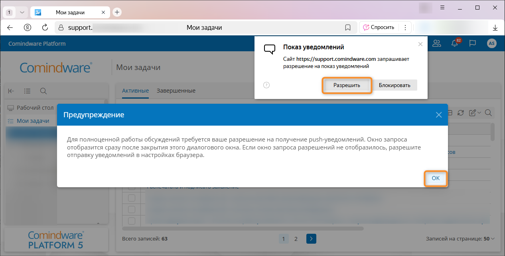
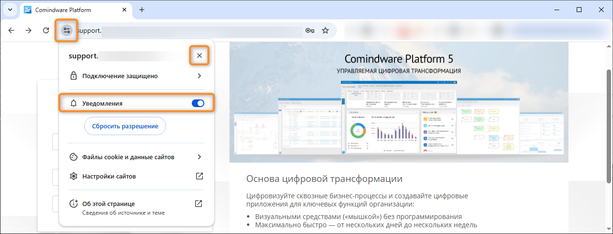
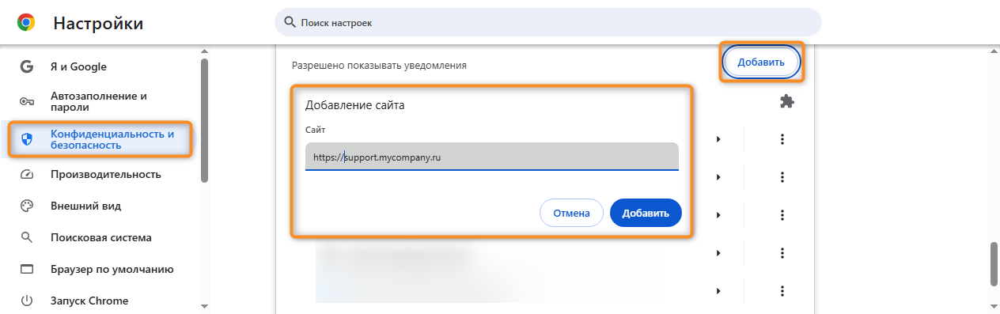
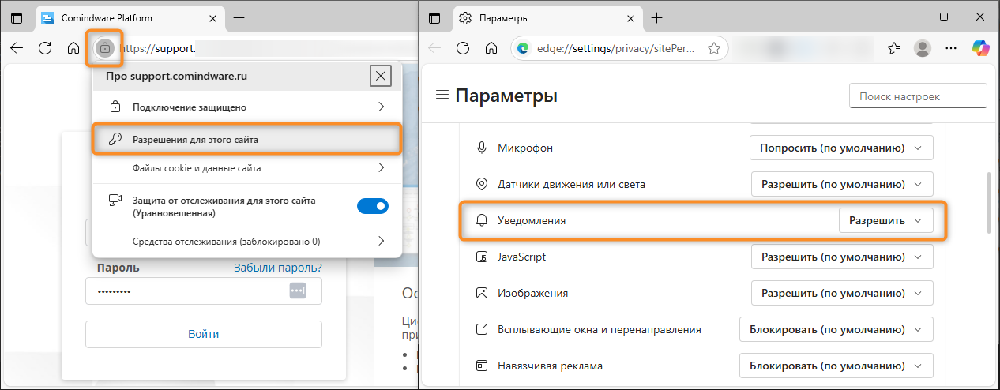
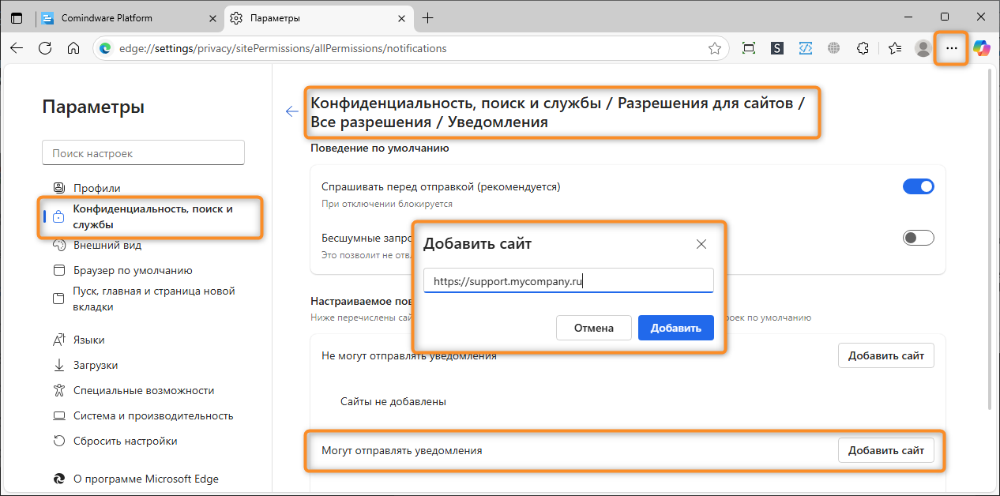
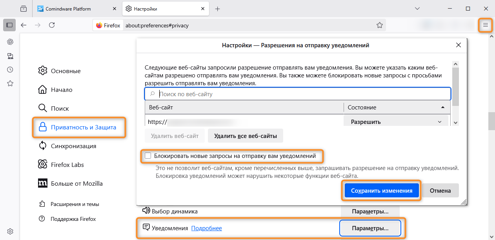
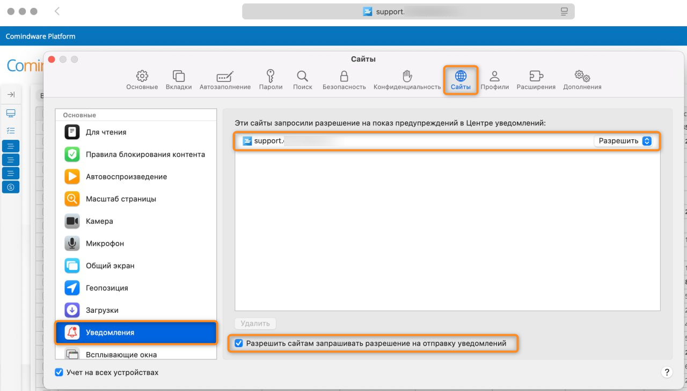

# Push-уведомления в браузере. Включение {: #browser_push_permissions }

## Введение {: #browser_push_permissions_intro }

Здесь представлены краткие инструкции по включению push-уведомлений от **{{ productName }}** в популярных **браузерах для компьютеров**.

Push‑уведомления позволяют **{{ productName }}** оперативно информировать вас о задачах и событиях, даже когда вкладка с сайтом **{{ productName }}** не активна.

По умолчанию большинство браузеров работает следующим образом:

- при первом посещении сайта браузер запрашивает разрешение на отправку уведомлений;
- если вы **разрешите** уведомления, сайт сможет отправлять уведомления, пока вы не отзовёте разрешение в настройках браузера;
- если вы **запретите** уведомления, сайт не сможет отправлять уведомления, пока вы вручную не разрешите их в настройках браузера;
- запросы на отправку уведомлений могут быть отключены по умолчанию и не отображаться при первом посещении сайта;
- некоторые браузеры могут автоматически подавлять навязчивые запросы на уведомления (например, в Chrome может действовать «тихий» режим запросов).

!!! note "Системные настройки уведомлений в браузерах"

    - **Windows/macOS**: вывод уведомлений зависит от Центра уведомлений. Если в операционной системе для браузера отключены уведомления или включён режим «Не беспокоить», сообщения не отображаются, даже если они разрешены на сайте.
    - **Android**: системные настройки имеют приоритет: если уведомления отключены в Android, они не будут отображаться, даже если разрешены в браузере.
    - **iOS**: для сайтов нет отдельных разрешений. В настройках устройства можно только разрешить/запретить уведомления браузеру и веб‑сайтам в целом.

!!! warning "Внимание!"

    Представленные здесь инструкции относятся к **push-уведомлениям в веб-браузерах для компьютеров**.
    
    Данные инструкции не подходят для браузеров в Android и iOS, а также для мобильного приложения **{{ productNameMobile }}**.

    Инструкции по настройке уведомлений на мобильных устройствах см. в документации для браузера, операционной системы и устройства, которые вы используете.

    Например, с инструкциями для популярных **мобильных браузеров** можно ознакомиться по следующим ссылкам: _[Яндекс Браузер.][browser_push_permissions_yandex_official_mobile], [Справка Chrome.][browser_push_permissions_chrome_official_mobile], [Firefox][browser_push_permissions_firefox_official_mobile], [Opera.][browser_push_permissions_opera_official_mobile]_.

## Включение уведомлений в Яндекс Браузере (Windows/macOS) {: #browser_push_permissions_yandex }

См. также справку Яндекса: _[Показ уведомлений от сайтов и приложений][browser_push_permissions_yandex_official]_

### Способ 1. С помощью запроса на показ уведомлений {: #browser_push_permissions_yandex_request }

1. Выполните вход в **{{ productName }}**.
2. Должно отобразиться предупреждение о настройке push-уведомлений.
3. В предупреждении нажмите кнопку «**OK**».
4. Браузер должен вывести запрос разрешения на отправку уведомлений.
5. Нажмите кнопку «**Разрешить**».

__

### Способ 2. С помощью меню настроек {: #browser_push_permissions_yandex_preferences }

1. Нажмите кнопку «**Настройки Яндекс Браузера**».
2. Выберите пункты «**Настройки**» — «**Сайты**».
3. В разделе «**Уведомления**» нажмите кнопку «**От прочих сайтов**».
4. На странице «**Отправка уведомлений**» выберите вкладку «**Разрешена**».
5. Нажмите кнопку «**Добавить**».
6. В окне «**Добавить сайт**» введите адрес сайта **{{ productName }}** и нажмите кнопку  «**Добавить**».

__

## Включение уведомлений в Google Chrome (Windows/macOS/Linux) {: #browser_push_permissions_chrome }

См. также справку Chrome: _[Как пользоваться уведомлениями][browser_push_permissions_chrome_official]_

### Способ 1. С помощью адресной строки {: #browser_push_permissions_chrome_address_bar }

1. Перейдите на сайт с **{{ productName }}**.
2. Нажмите значок <i class="fa-light fa-sliders-simple"></i> слева от адреса сайта.
3. Включите «**Уведомления**» <i class="fa-light fa-bell"></i> с помощью всплывающего меню.
4. Чтобы сохранить изменения, снова нажмите кнопку «**Закрыть**» <i class="fa-light fa-xmark"></i> во всплывающем меню.
5. Если браузер предложит перезагрузить страницу, нажмите кнопку «**Перезагрузить**».

__

### Способ 2. С помощью меню настроек {: #browser_push_permissions_chrome_preferences }

1. В правом верхнем углу окна нажмите значок с тремя точками <i class="fa-light fa-ellipsis-vertical"></i>.
2. Выберите пункты «**Настройки**» <i class="fa-light fa-gear"></i> — «**Конфиденциальность и безопасность**» — «**Настройки сайтов**» — «**Уведомления**».
3. В разделе «**Разрешено показывать уведомления**» нажмите кнопку «**Добавить**».
4. В окне «**Добавление сайта**» введите адрес сайта **{{ productName }}** и нажмите кнопку  «**Добавить**».
5. Если браузер предложит перезагрузить страницу, нажмите кнопку «**Перезагрузить**».

__

## Включение уведомлений в Microsoft Edge (Windows/macOS) {: #browser_push_permissions_edge }

См. также справку Edge: _[Управление уведомлениями сайтов в Microsoft Edge][browser_push_permissions_edge_official]_

### Способ 1. С помощью адресной строки {: #browser_push_permissions_edge_address_bar }

1. Откройте сайт с **{{ productName }}**.
2. Нажмите значок «**Просмотреть сведения о сайте**» <i class="fa-light fa-lock-keyhole"></i> слева от адреса сайта.
3. В раскрывающемся меню выберите пункт «**Разрешения для этого сайта**».
4. В разделе «**Уведомления**» выберите пункт «**Разрешить**».
5. Если браузер предложит обновить страницу, нажмите кнопку «**Обновить**».

__

### Способ 2. С помощью меню настроек {: #browser_push_permissions_edge_preferences }

1. Выберите меню «**Параметры и прочее**» <i class="fa-light fa-ellipsis"></i> в правом верхнем углу окна браузера.
2. Выберите пункты «**Параметры**» <i class="fa-light fa-gear"></i> — «**Конфиденциальность, поиск и службы**» — «**Разрешения для сайтов**» — «**Все разрешения**» — «**Уведомления**».
3. В разделе  «**Настраиваемое поведение**» — «**Могут отправлять уведомления**» нажмите кнопку «**Добавить сайт**».
4. В окне «**Добавить сайт**» введите адрес сайта **{{ productName }}** и нажмите кнопку  «**Добавить**».
5. Если браузер предложит обновить страницу, нажмите кнопку «**Обновить**».

__

## Mozilla Firefox (Windows/macOS/Linux) {: #browser_push_permissions_firefox }

См. также справку Firefox: _[Веб-push-уведомления в Firefox][browser_push_permissions_firefox_official]_

### Способ 1. С помощью адресной строки {: #browser_push_permissions_firefox_address_bar }

1. Перейдите на сайт с **{{ productName }}**.
2. Нажмите значок «**Просмотреть сведения о сайте**» <i class="fa-light fa-lock-keyhole"></i>
3. Во всплывающем меню «**Информация о сайте**» выберите пункты «**Защищённое соединение**» — «**Подробнее**».
4. В окне «**Информация о странице**» выберите вкладку «**Разрешения**».
5. В разделе «**Отправлять уведомления**» снимите флажок «**По умолчанию**» и выберите пункт «**Разрешить**».

__

### Способ 2. С помощью меню настроек {: #browser_push_permissions_preferences }

1. Нажмите кнопку «**Открыть меню приложения**».
2. Выберите пункты «**Настройки**» — «**Приватность и защита**».
3. В разделе «**Разрешения**» — «**Уведомления**» нажмите кнопку «**Параметры…**».
4. Отобразится всплывающее окно «**Настройки — Разрешения на отправку уведомлений**».
5. Снимите флажок «**Блокировать новые запросы на отправку вам уведомлений**».
6. Нажмите кнопку «**Сохранить изменения**».
7. Выполните вход в **{{ productName }}**.
8. Должно отобразиться предупреждение о настройке push-уведомлений.
9. В предупреждении нажмите кнопку «**OK**».
10. Браузер должен вывести запрос разрешения на отправку уведомлений.
11. Нажмите кнопку «**Разрешить**».

__

__

## Включение уведомлений в Safari (macOS) {: #browser_push_permissions_safari }

См. также справку Safari: _[Настройка уведомлений от веб-сайтов в Safari на компьютере Mac][browser_push_permissions_safari_official]_

### Способ 1. С помощью меню настроек {: #browser_push_permissions_safari_preferences }

1. В меню **Safari** выберите пункт «**Настройки**»
2. На вкладке «**Веб‑сайты**» выберите пункт «**Уведомления**».
3. Установите флажок «**Разрешить сайтам запрашивать разрешение на отправку уведомлений**».
4. В списке сайтов найдите адрес сайта с **{{ productName }}** выберите пункт «**Разрешить**».
5. Чтобы изменения вступили в силу, обновите веб-страницу **{{ productName }}**.

__

## Проверка работы уведомлений в {{ productName }} {: #browser_push_permissions_testing }

1. Разрешите уведомления для сайта с **{{ productName }}** в браузере по инструкциям выше.
2. Выполните вход в **{{ productName }}**
3. Выполните действие, которое отправляет уведомление, например, создайте новую задачу
4. Дождитесь push‑сообщения.

## Возможные проблемы и решения {: #browser_push_permissions_troubleshooting }

- **Вы запретили уведомления**, когда браузер запросил разрешение на их отправку.
    - **Решение:** в настройках браузера разрешите уведомления для вашего сайта с **{{ productName }}** и перезагрузите страницу.
- **Уведомления разрешены, но не отображаются**.
    - **Решение:** перепроверьте системные настройки уведомлений в браузере и Центре уведомлений, отключите режим «**Не беспокоить**».
- **Safari не запрашивает разрешение на отправку уведомлений**.
    - **Решение:** снимите и заново установите флажок «**Разрешить сайтам запрашивать разрешение на отправку уведомлений**», выйдите из **{{ productName }}** и снова выполните вход.

--8<-- "related_topics_heading.md"

- [Типы уведомлений][notification_types]
- [Общие уведомления. Настройка][common_notifications]
- [Уведомления о задачах. Настройка текста и отправки эл.&nbsp;почтой][task_notifications]
- [Справка Яндекса. Показ уведомлений от сайтов и приложений][browser_push_permissions_yandex_official]
- [Справка Chrome. Как пользоваться уведомлениями][browser_push_permissions_chrome_official]
- [Справка Edge. Управление уведомлениями сайтов в Microsoft Edge][browser_push_permissions_edge_official]
- [Справка Firefox. Веб-push-уведомления в Firefox][browser_push_permissions_firefox_official]
- [Справка Safari. Настройка уведомлений от веб-сайтов в Safari на компьютере Mac][browser_push_permissions_safari_official]
- [Справка Яндекса. Уведомления в мобильном браузере][browser_push_permissions_yandex_official_mobile]
- [Справка Chrome.Уведомления в мобильном браузере][browser_push_permissions_chrome_official_mobile]
- [Справка Firefox. Уведомления в мобильном браузере][browser_push_permissions_firefox_official_mobile]
- [Справка Opera. Уведомления в мобильном браузере][browser_push_permissions_opera_official_mobile]


